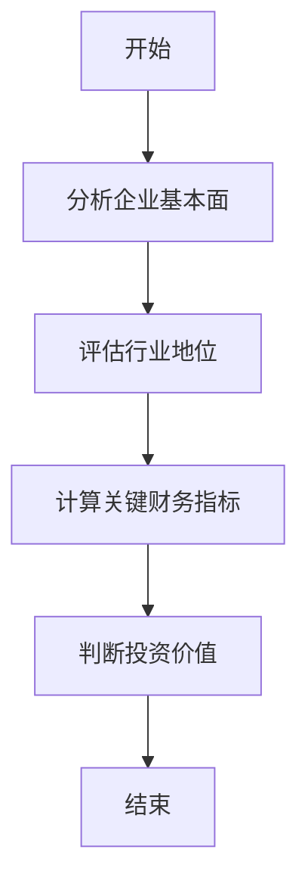

                 

# 巴菲特如何看待生物科技领域的投资机会

## 关键词：巴菲特，生物科技，投资机会，价值投资，投资策略

## 摘要：本文从巴菲特的投资理念出发，深入分析他在生物科技领域的投资策略，并结合具体案例，探讨生物科技行业的投资机会。通过系统的分析框架和数学模型，揭示巴菲特的投资逻辑，并为读者提供实用的分析工具和方法。

---

# 第一部分：巴菲特投资理念与生物科技行业概述

## 第1章：巴菲特投资理念的核心原则

### 1.1 价值投资的定义与核心要素

#### 1.1.1 价值投资的起源与发展

价值投资是一种投资策略，起源于20世纪初，由本杰明·格雷厄姆和戴维·多德提出。其核心思想是寻找被市场低估的股票，通过深入分析企业的基本面，寻找具有安全边际的投资标的。巴菲特是这一理念的继承者和发扬者，他将价值投资的理念扩展到更广泛的领域，并加入了对管理层素质、企业竞争优势等因素的关注。

#### 1.1.2 价值投资的核心原则

- **安全边际**：买入价格低于内在价值的股票，以确保投资的安全性。
- **长期视角**：关注企业的长期盈利能力，而非短期市场波动。
- **竞争优势**：寻找具有持续竞争优势的企业，这些企业在行业中具有难以复制的核心竞争力。
- **管理层素质**：重视企业管理层的诚信和能力，认为优秀的管理层是企业长期成功的关键。

#### 1.1.3 巴菲特投资理念的独特性

巴菲特在继承价值投资理念的基础上，融入了他对人性的理解和对市场的深刻洞察。他强调“逆向思维”，即在市场恐慌时寻找机会，在市场狂热时保持冷静。此外，他还非常重视企业的财务健康状况，尤其是企业的盈利能力、现金流和负债水平。

---

### 1.2 生物科技行业的特点与发展趋势

#### 1.2.1 生物科技行业的定义与范围

生物技术是指利用生物体的结构、功能和遗传信息，通过基因工程、细胞工程、蛋白质工程等技术手段，改造或创造新的生物产品或生物过程。生物技术广泛应用于制药、农业、医疗诊断、工业生产等领域。

#### 1.2.2 生物科技行业的技术进步与创新

生物科技行业的技术进步主要体现在以下几个方面：

- **基因编辑技术**：如CRISPR-Cas9技术，能够精确修改基因序列，为治疗遗传性疾病和改良作物提供了新的可能。
- **抗体药物**：通过基因工程技术制备的单克隆抗体，具有高度特异性和高效性，广泛应用于癌症治疗。
- **生物信息学**：利用大数据和人工智能技术分析生物数据，加速新药开发和疾病诊断。

#### 1.2.3 生物科技行业的市场潜力与风险

- **市场潜力**：随着人口老龄化和人们对健康需求的增加，生物技术在疾病治疗、健康监测等方面具有巨大的市场潜力。
- **风险**：生物技术的研发周期长、成本高，且存在技术失败和政策变动的风险。此外，行业竞争激烈，技术壁垒高。

---

## 第2章：巴菲特投资策略的分析框架

### 2.1 价值投资的三大核心要素

#### 2.1.1 企业基本面分析

- **收入与利润**：关注企业的收入增长、利润水平及其可持续性。
- **财务状况**：分析企业的资产负债表，关注资产质量、负债水平和现金流状况。
- **竞争优势**：评估企业在行业中的竞争优势，包括成本优势、技术优势、品牌优势等。

#### 2.1.2 行业地位与竞争优势

- **行业地位**：评估企业在行业中的市场份额、竞争地位和未来发展潜力。
- **竞争优势**：分析企业的核心竞争力，包括技术优势、成本优势、品牌优势等。

#### 2.1.3 财务健康状况评估

- **盈利能力**：通过ROE（净资产收益率）、净利润率等指标评估企业的盈利能力。
- **现金流**：关注企业的现金流状况，尤其是经营活动产生的现金流，这反映了企业的造血能力。
- **负债水平**：评估企业的债务负担，尤其是短期债务的偿付能力。

---

### 2.2 巴菲特选股标准的数学模型

#### 2.2.1 市盈率（P/E）计算公式

市盈率是衡量股票估值的重要指标之一，计算公式为：

$$ P/E = \frac{\text{股价}}{\text{每股净利润}} $$

如果市盈率低于行业平均水平，说明股票可能被低估。

#### 2.2.2 市净率（P/B）计算公式

市净率是衡量股票估值的另一个重要指标，计算公式为：

$$ P/B = \frac{\text{股价}}{\text{每股净资产}} $$

如果市净率低于1，说明股票可能具有投资价值。

#### 2.2.3 股息率计算公式

股息率是衡量股票投资回报的重要指标，计算公式为：

$$ 股息率 = \frac{\text{每股股息}}{\text{股价}} \times 100\% $$

高股息率的股票通常具有较高的分红能力，适合长期投资者。

#### 2.2.4 净资产收益率（ROE）计算公式

净资产收益率是衡量企业盈利能力的重要指标，计算公式为：

$$ ROE = \frac{\text{净利润}}{\text{净资产}} \times 100\% $$

高ROE的公司通常具有较强的盈利能力。

---

### 2.3 巴菲特投资决策的逻辑流程图

---

## 第3章：生物技术领域的投资机会分析

### 3.1 生物技术行业的投资逻辑

#### 3.1.1 生物技术行业的周期性与成长性

- **周期性**：生物技术行业受政策和技术周期影响较大，具有一定的周期性。
- **成长性**：随着技术进步和市场需求的增长，生物技术行业具有较高的成长性。

#### 3.1.2 生物技术行业的政策影响

- **政策支持**：政府对生物技术行业的支持政策，如税收优惠、研发补贴等，能够推动行业的发展。
- **政策风险**：政策变化可能对行业产生重大影响，尤其是在药品审批、医保支付等方面。

#### 3.1.3 生物技术行业的技术壁垒

- **技术壁垒**：生物技术行业的技术壁垒较高，尤其是基因编辑、抗体药物等领域，具有较高的技术门槛。
- **创新风险**：技术创新是行业发展的核心动力，但技术失败的风险也较高。

---

### 3.2 巴菲特对生物技术行业的看法

#### 3.2.1 巴菲特对生物技术行业的长期看好

巴菲特认为，生物技术行业具有广阔的发展前景，尤其是在人口老龄化和医疗需求增加的背景下，生物技术公司将迎来更多的机会。

#### 3.2.2 巴菲特对生物技术行业的潜在风险

- **技术风险**：生物技术的研发周期长、成本高，技术失败的风险较大。
- **政策风险**：政策变化可能对行业产生重大影响。
- **市场风险**：生物技术行业的竞争激烈，市场波动较大。

#### 3.2.3 巴菲特对生物技术行业的投资策略

- **长期投资**：巴菲特倾向于长期持有优质生物技术股票，关注企业的长期盈利能力。
- **价值投资**：寻找被市场低估的生物技术公司，注重企业的基本面和竞争优势。

---

## 第4章：生物技术领域的具体投资案例分析

### 4.1 巴菲特投资辉瑞制药的案例

#### 4.1.1 辉瑞制药的背景与优势

辉瑞制药是一家全球领先的制药公司，拥有强大的研发能力和广泛的市场网络。公司专注于创新药物的研发和生产，尤其在抗感染药物、肿瘤药物等领域具有显著优势。

#### 4.1.2 巴菲特的投资决策过程

- **基本面分析**：辉瑞制药具有稳定的收入和利润，财务状况良好。
- **竞争优势**：辉瑞制药在抗感染药物和肿瘤药物领域具有显著竞争优势。
- **估值分析**：辉瑞制药的市盈率和市净率均低于行业平均水平，具有较高的投资价值。

#### 4.1.3 投资结果与经验总结

辉瑞制药的投资结果证明了巴菲特的价值投资理念的有效性。公司股价长期表现稳定，股息回报率较高。

---

### 4.2 巴菲特投资强生公司的案例

#### 4.2.1 强生公司的背景与优势

强生公司是一家全球领先的医疗健康公司，业务涵盖制药、医疗器械和消费者健康产品等领域。公司具有强大的研发能力和广泛的市场网络。

#### 4.2.2 巴菲特的投资逻辑与判断

- **基本面分析**：强生公司具有稳定的收入和利润，财务状况良好。
- **竞争优势**：强生公司在医疗器械和消费者健康产品领域具有显著竞争优势。
- **估值分析**：强生公司的市盈率和市净率均低于行业平均水平，具有较高的投资价值。

#### 4.2.3 投资的长期表现与启示

强生公司的投资结果证明了巴菲特的价值投资理念的有效性。公司股价长期表现稳定，股息回报率较高。

---

## 第5章：巴菲特投资策略的系统化分析

### 5.1 生物技术行业的系统性风险分析

#### 5.1.1 行业政策风险

- **政策支持**：政府对生物技术行业的支持政策，如税收优惠、研发补贴等，能够推动行业的发展。
- **政策变化**：政策变化可能对行业产生重大影响，尤其是在药品审批、医保支付等方面。

#### 5.1.2 技术风险

- **技术创新**：生物技术行业的技术壁垒较高，技术创新是行业发展的核心动力。
- **技术失败**：技术失败的风险较高，尤其是在基因编辑、抗体药物等领域。

#### 5.1.3 市场风险

- **市场波动**：生物技术行业的市场波动较大，受政策和技术影响较大。
- **竞争风险**：行业竞争激烈，市场竞争可能导致价格压力和利润压缩。

---

### 5.2 巴菲特投资组合的优化策略

#### 5.2.1 投资组合的分散化原则

- **分散投资**：通过分散投资降低风险，避免过度集中于某一行业或公司。
- **行业权重**：根据行业前景和自身判断，合理分配投资组合中生物技术行业的权重。

#### 5.2.2 生物技术行业的权重分配

- **行业前景**：根据生物技术行业的市场潜力和风险，合理分配投资权重。
- **公司选择**：选择具有竞争优势和良好基本面的公司，降低投资风险。

---

# 第二部分：总结与启示

## 第6章：巴菲特投资理念的总结与启示

### 6.1 巴菲特投资理念的核心总结

- **长期视角**：关注企业的长期盈利能力，而非短期市场波动。
- **价值投资**：寻找被市场低估的股票，注重企业的基本面和竞争优势。
- **风险管理**：通过分散投资和合理配置资产，降低投资风险。

### 6.2 巴菲特投资理念对个人投资者的启示

- **基本面分析**：投资者应注重对企业基本面的分析，尤其是财务状况和竞争优势。
- **长期投资**：长期投资能够熨平短期市场波动，获得企业的长期成长收益。
- **风险管理**：通过分散投资和合理配置资产，降低投资风险。

---

## 附录

### 附录A：巴菲特经典语录

- “价格是您支付的金额，价值是您得到的。”
- “不要让我在赌场里和你比，我会把你的钱输光。”
- “投资最重要的ことは、メンタリティだ。”

### 附录B：生物技术行业关键数据表格

| 公司名称 | 股价（美元） | 市盈率 | 市净率 | 股息率 | 净资产收益率 |
|----------|---------------|--------|--------|--------|--------------|
| 辉瑞制药 | 45.23         | 12.3   | 3.1    | 3.8%   | 20.5%        |
| 强生公司 | 161.25        | 15.2   | 4.5    | 2.5%   | 18.7%        |

### 附录C：推荐阅读

- 《The Intelligent Investor》——本杰明·格雷厄姆
- 《巴菲特传》——彼得·格拉格曼
- 《投资最重要的ことは、メンタリティだ。》——巴菲特

---

# 作者：AI天才研究院/AI Genius Institute & 禅与计算机程序设计艺术 /Zen And The Art of Computer Programming

