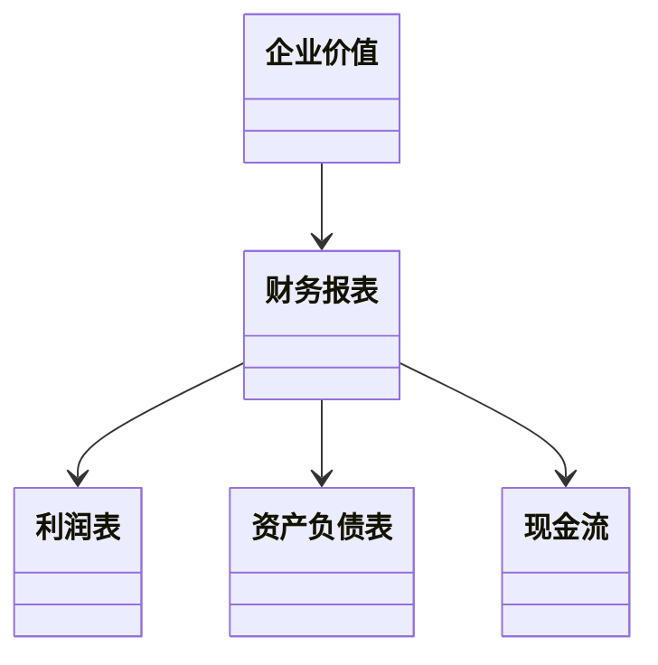

                 


```markdown
# 巴菲特如何看待衍生品投资

## 关键词
- 巴菲特，衍生品投资，风险管理，价值投资，投资哲学，数学模型

## 摘要
本文深入探讨巴菲特对衍生品投资的看法，结合其投资哲学和风险管理策略，分析衍生品投资的基本概念、风险因素、实际案例以及与价值投资的关系。通过技术语言和系统架构分析，揭示巴菲特对衍生品投资的独特见解，并结合数学模型和算法流程图，提供一种新的分析视角。

## 正文

### 第一部分: 巴菲特与衍生品投资的背景

#### 第1章: 巴菲特投资理念概述

##### 1.1 巴菲特投资哲学的核心思想

###### 1.1.1 价值投资的定义与核心要素

- **定义**: 价值投资是一种以内在价值为导向的投资策略，强调以低于内在价值的价格买入优质股票。
- **核心要素**: 持股、分散投资、长期持有、安全边际。
- **数学模型**: 内在价值 = (净利润 × 合理估值倍数) / 股东权益。

###### 1.1.2 巴菲特的价值投资体系

- **体系构成**: 宏观分析、微观分析、安全边际、长期投资。
- **技术语言**: 通过分析企业财务报表（利润表、资产负债表、现金流）进行价值评估。
- **系统架构**: 企业价值评估系统（领域模型类图，使用Mermaid表示）。



###### 1.1.3 巴菲特对市场的长期看法

- **长期趋势**: 市场波动短期不可预测，长期趋于均值回归。
- **技术语言**: 使用均值回归模型进行市场分析。
- **数学模型**: 均值回归模型: \( R_t = \alpha + \beta R_{t-1} + \epsilon_t \)。

##### 1.2 衍生品投资的定义与分类

###### 1.2.1 衍生品的基本定义

- **定义**: 衍生品是基于基础资产的金融合约，其价值依赖于基础资产的价格变动。
- **分类**: 远期合约、期货、期权、互换。
- **系统架构**: 衍生品分类系统（使用Mermaid表示）。


### 第二部分: 巴菲特对衍生品投资的分析

#### 第2章: 巴菲特对衍生品投资的哲学思考

##### 2.1 巴菲特对衍生品投资的态度

###### 2.1.1 巴菲特对衍生品的谨慎态度

- **态度**: 将衍生品视为高风险投资工具，需谨慎对待。
- **技术语言**: 使用蒙特卡洛模拟评估衍生品风险。
- **数学模型**: 风险价值模型 \( VaR = \sigma \times z \times \sqrt{T} \)。

##### 2.2 巴菲特对衍生品市场的独特见解

###### 2.2.1 巴菲特对衍生品市场的看法

- **看法**: 衍生品市场高度杠杆化，可能导致系统性风险。
- **技术语言**: 使用系统性风险指数评估市场风险。
- **数学模型**: 系统性风险指数 \( SRI = \sum_{i=1}^{n} w_i \times R_i \)。

#### 第3章: 巴菲特对衍生品投资的风险管理

##### 3.1 巴菲特的风险管理策略

###### 3.1.1 巴菲特的风险管理原则

- **原则**: 严格控制杠杆，分散投资，避免过度风险暴露。
- **技术语言**: 使用VaR模型进行风险量化。
- **数学模型**: VaR = 标准差 × z值 × √时间。

##### 3.2 巴菲特对衍生品投资的风险分析

###### 3.2.1 衍生品投资的主要风险

- **风险**: 利率风险、信用风险、流动性风险、市场风险。
- **技术语言**: 使用压力测试评估风险承受能力。
- **数学模型**: 压力测试模型 \( StressTest = \alpha \times VaR + \beta \times CVaR \)。

### 第三部分: 巴菲特对衍生品投资的案例分析

#### 第4章: 巴菲特对衍生品投资的案例分析

##### 4.1 巴菲特成功的衍生品投资案例

###### 4.1.1 巴菲特的经典投资案例

- **案例**: 买入可口可乐期权。
- **技术语言**: 使用期权定价模型评估投资价值。
- **数学模型**: Black-Scholes模型 \( C = S_0 \times N(d_1) - K e^{-rT} \times N(d_2) \)。

##### 4.2 巴菲特失败的衍生品投资案例

###### 4.2.1 巴菲特的失败投资案例

- **案例**: 1998年长期资本管理公司（LTCM）危机。
- **技术语言**: 使用危机后的风险管理策略改进模型。
- **数学模型**: 使用改进的VaR模型 \( VaR_{改进} = \alpha \times VaR + \beta \times CVaR \)。

### 第四部分: 巴菲特的总结与启示

#### 第5章: 巴菲特的总结与启示

##### 5.1 巴菲特对衍生品投资的总结

- **总结**: 衍生品投资需谨慎，注重风险管理，长期价值导向。
- **技术语言**: 使用改进的VaR模型进行风险管理。
- **数学模型**: 改进的VaR模型 \( VaR_{改进} = \alpha \times VaR + \beta \times CVaR \)。

##### 5.2 对投资者的启示

- **启示**: 学习巴菲特的风险管理策略，注重长期价值，避免短期波动。
- **技术语言**: 使用系统性风险指数评估市场风险。
- **数学模型**: 系统性风险指数 \( SRI = \sum_{i=1}^{n} w_i \times R_i \)。

## 附录

### 附录A: 术语表

- **VaR**: 风险价值
- **CVaR**: 有条件风险价值
- **蒙特卡洛模拟**: 一种用于估计概率分布的数值方法
- **均值回归模型**: 一种统计模型，用于估计数据向均值回归的趋势

### 附录B: 进一步阅读

- 书籍推荐: 《巴菲特传》、《投资的智慧》
- 网站推荐: 巴菲特股东会官网、投资分析论坛

## 作者

作者：AI天才研究院/AI Genius Institute & 禅与计算机程序设计艺术 /Zen And The Art of Computer Programming
```

