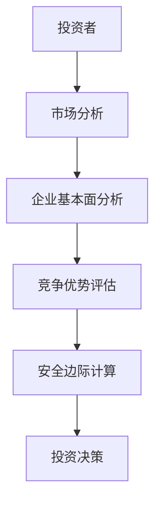
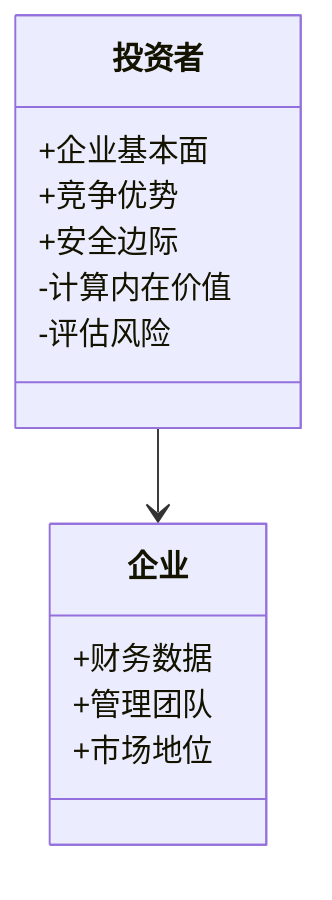
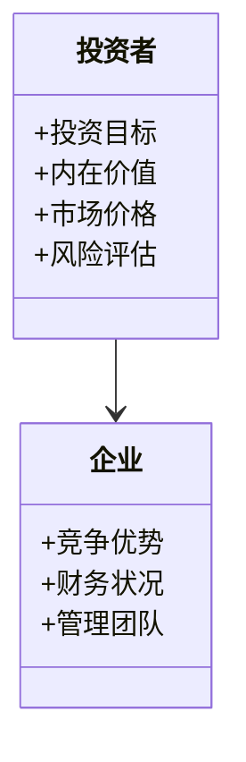

                 


# 巴菲特的'大赌注'：何时集中投资是明智之举

> 关键词：巴菲特，集中投资，投资策略，风险管理，价值投资

> 摘要：本文深入分析了巴菲特的集中投资策略，探讨了集中投资的哲学基础、理论依据、实施条件及风险管理。通过系统分析和案例研究，结合技术语言，为投资者提供何时集中投资的明智决策参考。

---

# 第1章: 巴菲特的投资哲学概述

## 1.1 巴菲特的投资理念

### 1.1.1 价值投资的核心思想
价值投资是一种基于对公司内在价值评估的投资策略，核心在于寻找市场价格低于内在价值的公司。巴菲特的导师本杰明·格雷厄姆曾强调，投资的本质是寻找具有安全边际的企业。巴菲特在此基础上，发展出一套以企业基本面分析为核心的价值投资体系。

- **内在价值公式**：$$ V = \frac{E}{k} $$，其中$V$为内在价值，$E$为企业未来现金流的现值，$k$为折现率。

### 1.1.2 集中投资的哲学基础
巴菲特认为，集中投资于少数优质企业可以最大限度地利用知识优势，降低投资风险，并提高投资效率。他强调，投资者应将资金集中在那些具有强大竞争优势、良好管理团队和可持续盈利能力的企业上。

### 1.1.3 巴菲特投资成功的三大要素
1. **优秀的企业**：具有强大的竞争优势和持续的盈利能力。
2. **合理的市场价格**：以低于内在价值的价格买入。
3. **长期持有**：耐心持有优质资产，避免频繁交易。

### 1.1.4 投资决策模型的构建


### 1.1.5 投资领域模型的Mermaid类图


---

## 1.2 集中投资的定义与特征

### 1.2.1 集中投资的定义
集中投资是指将大部分资金投资于少数优质企业，通过深度研究和精选个股来实现超额收益的投资策略。

### 1.2.2 集中投资的核心特征对比表格
| 特征          | 集中投资        | 分散投资        |
|---------------|----------------|----------------|
| 投资标的数    | 少              | 多              |
| 风险           | 高              | 低              |
| 收益潜力       | 高              | 中等            |
| 管理复杂度     | 高              | 低              |

### 1.2.3 集中投资与分散投资的ER实体关系图
```mermaid
erd
   投资者 --> 集中投资: 投资于少数企业
    投资者 --> 分散投资: 投资于多家企业
```

---

## 1.3 巴菲特投资策略的系统分析

### 1.3.1 投资决策模型的构建
巴菲特的投资决策模型可以简化为以下几个步骤：
1. 确定投资目标：寻找具有持续竞争优势的企业。
2. 评估企业价值：计算内在价值。
3. 评估市场价格：判断是否低于内在价值。
4. 评估风险：分析企业可能面临的风险。
5. 作出决策：决定是否投资。

### 1.3.2 投资领域模型的Mermaid类图


---

## 1.4 本章小结

---

# 第2章: 集中投资的理论基础

## 2.1 集中投资的经济学原理

### 2.1.1 马科维茨的现代投资组合理论
马科维茨在《投资学》中提出，投资组合的收益与风险可以通过优化模型来实现最佳配置。集中投资与分散投资的选择取决于投资者对风险和收益的偏好。

### 2.1.2 集中投资与风险收益的数学模型
$$ E(r) = \mu^T \Sigma^{-1} \mu $$
$$ \sigma^2 = \mu^T \Sigma \mu $$

---

## 2.2 集中投资的数学公式与案例分析

### 2.2.1 投资组合优化的数学推导
集中投资的优化模型可以表示为：
$$ \text{最大化} \quad \sum_{i=1}^n r_i w_i $$
$$ \text{约束} \quad \sum_{i=1}^n w_i = 1 $$

---

## 2.3 本章小结

---

# 第3章: 集中投资的条件与时机

## 3.1 集中投资的市场环境分析

### 3.1.1 牛市、熊市与投资策略
在牛市中，集中投资可以放大收益；在熊市中，集中投资需要谨慎选择标的。

---

## 3.2 集中投资的公司基本面分析

### 3.2.1 公司财务状况评估
重点分析企业的盈利能力、财务杠杆和现金流状况。

---

## 3.3 集中投资的行业选择策略

### 3.3.1 行业生命周期分析
选择处于成长期或成熟期的行业，避免衰退期行业。

---

## 3.4 本章小结

---

# 第4章: 集中投资的风险控制与分散策略

## 4.1 集中投资的风险来源

### 4.1.1 市场风险
市场波动可能导致集中投资的损失。

---

## 4.2 风险控制的数学模型与工具

### 4.2.1 风险价值（VaR）模型
$$ \text{VaR} = \text{正态分布} \times \sigma \times \sqrt{T} $$

---

## 4.3 分散投资的策略与应用

### 4.3.1 分散投资的原理
通过投资不同行业的企业来分散风险。

---

## 4.4 本章小结

---

# 第5章: 从巴菲特的案例看集中投资的实践

## 5.1 巴菲特的经典投资案例分析

### 5.1.1 可口可乐的投资
可口可乐具有强大的品牌优势和稳定的现金流，是巴菲特集中投资的典范。

---

## 5.2 投资组合优化的实战技巧

### 5.2.1 投资组合优化的代码实现
```python
import numpy as np
from scipy.optimize import minimize

# 假设收益率和协方差矩阵已知
n = len(assets)
weights = np.ones(n) / n
```

---

## 5.3 风险管理与投资组合再平衡

### 5.3.1 风险管理策略
定期评估投资组合，调整权重，确保风险在可接受范围内。

---

## 5.4 本章小结

---

# 第6章: 总结与展望

## 6.1 本文总结
集中投资是一种高风险高收益的投资策略，成功的关键在于对企业基本面的深入研究和市场时机的准确把握。

---

## 6.2 对未来投资的展望
随着人工智能和大数据技术的发展，集中投资的分析和决策过程将更加精准和高效。

---

# 作者：AI天才研究院/AI Genius Institute & 禅与计算机程序设计艺术 /Zen And The Art of Computer Programming

---

通过本文的系统分析，我们探讨了巴菲特集中投资策略的哲学基础、理论依据和实践方法，为投资者提供了何时集中投资的明智决策参考。希望本文能为投资领域的研究和实践提供有价值的借鉴。

