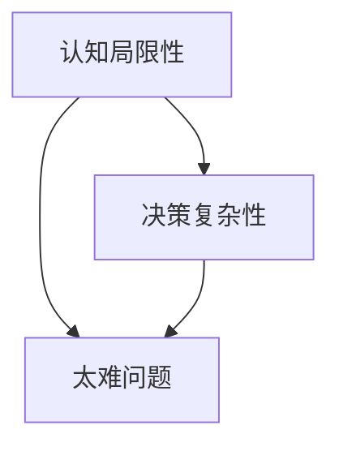
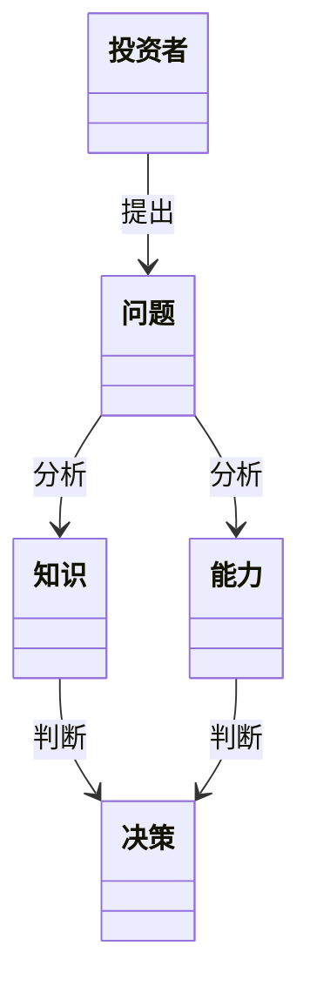
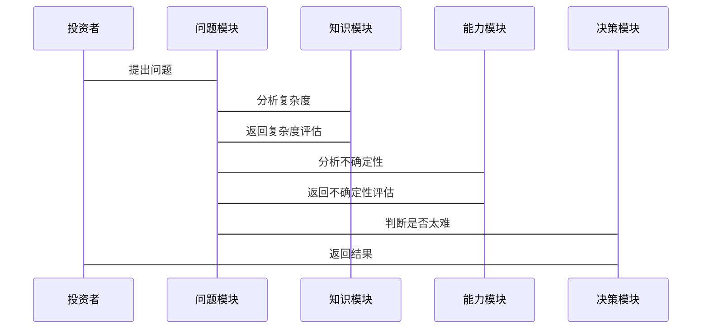

                 


# 巴菲特的“太难”篮子：知道自己不知道什么

## 关键词
巴菲特，投资决策，认知局限，太难问题，系统设计，算法原理

## 摘要
本文探讨巴菲特提出的“太难”篮子概念，分析其在投资决策中的重要性，通过系统设计和算法原理，帮助投资者识别和处理认知局限性，从而做出更明智的投资决策。

---

## 第1章 背景介绍：核心概念与问题分析

### 1.1 问题背景
#### 1.1.1 投资中的不确定性与决策复杂性
投资领域充满了不确定性，市场波动、经济变化等都影响着投资结果。投资者常常面临复杂的问题，难以准确预测和决策。

#### 1.1.2 巴菲特“太难”篮子的提出背景
巴菲特强调投资中的“太难”问题，认为这些问题超出了投资者的知识和能力范围。他建议将这些问题放在“太难”篮子中，避免涉足不熟悉领域。

#### 1.1.3 人类认知的局限性与投资决策
人类的认知有限，投资者容易陷入认知偏差，如过度自信、从众心理等，影响决策质量。

### 1.2 问题描述
#### 1.2.1 “太难”问题的定义与特征
“太难”问题是指超出投资者知识和能力范围的问题，通常涉及复杂因素，难以预测和评估。

#### 1.2.2 投资者认知的边界与局限
投资者的认知有限，难以完全掌握市场信息和风险因素，容易忽视潜在风险。

#### 1.2.3 识别“太难”问题的关键要素
识别关键要素包括市场变化、公司基本面、行业趋势等，帮助投资者判断问题的难度。

### 1.3 问题解决方法
#### 1.3.1 知识结构与认知框架的构建
构建系统的知识框架，帮助投资者识别和分类问题，避免涉足不熟悉的领域。

#### 1.3.2 投资决策中的“太难”问题处理策略
包括避免涉足、寻求专家意见、分散投资等策略，降低决策风险。

#### 1.3.3 知识更新与认知升级的路径
持续学习和更新知识，扩展认知边界，提升决策能力。

### 1.4 边界与外延
#### 1.4.1 “太难”问题的边界界定
明确“太难”问题的范围，避免误判或遗漏重要信息。

#### 1.4.2 相关概念的对比与区分
对比认知局限、决策复杂性等概念，避免混淆。

#### 1.4.3 认知局限性与决策复杂性的关系
认知局限导致决策复杂性增加，进一步影响问题难度的判断。

### 1.5 概念结构与核心要素组成
#### 1.5.1 核心概念的层次结构
认知局限性 → 决策复杂性 → “太难”问题。

#### 1.5.2 关键要素的属性分析
包括问题难度、知识深度、信息完整性等。

#### 1.5.3 概念之间的关系与互动
认知局限性影响决策复杂性，进而影响“太难”问题的识别和处理。

---

## 第2章 核心概念与联系

### 2.1 核心概念原理
#### 2.1.1 认知局限性与决策复杂性的关系
认知局限导致决策复杂性增加，影响问题的解决。

#### 2.1.2 “太难”问题的识别与分类
通过分析问题特征，将问题分为可处理和不可处理两类。

#### 2.1.3 投资决策中的认知偏差与心理因素
认知偏差如过度自信、从众心理等影响决策，需警惕。

### 2.2 概念属性特征对比表格
| 概念       | 特征1：可预测性 | 特征2：知识要求 | 特征3：复杂性 |
|------------|-----------------|-----------------|--------------|
| 认知局限性  | 低              | 高              | 高            |
| 决策复杂性  | 低              | 高              | 极高          |
| “太难”问题 | 低              | 极高            | 极高          |

### 2.3 ER实体关系图


---

## 第3章 算法原理讲解

### 3.1 算法原理概述
#### 3.1.1 算法目标
识别和分类“太难”问题，避免误判。

#### 3.1.2 算法输入
认知数据（知识水平、经验）、决策数据（市场趋势、公司基本面）。

#### 3.1.3 算法步骤
1. 收集问题数据。
2. 分析知识和能力。
3. 判断问题难度。
4. 分类到相应篮子。

### 3.2 算法实现
```python
def is_too_difficult(problem, knowledge, capability):
    if problem['complexity'] > knowledge['level'] or \
       problem['uncertainty'] > capability['threshold']:
        return True
    return False

# 示例
problem = {
    'complexity': 0.9,
    'uncertainty': 0.8
}
knowledge = {
    'level': 0.7
}
capability = {
    'threshold': 0.75
}

print(is_too_difficult(problem, knowledge, capability))  # 输出: True
```

### 3.3 数学模型与公式
识别“太难”问题的模型可以表示为：
$$ P(\text{太难}) = \max(0, \text{复杂度} - \text{知识水平}) \times \max(0, \text{不确定性} - \text{能力阈值}) $$

---

## 第4章 系统分析与架构设计方案

### 4.1 问题场景介绍
投资者需要一个系统来识别和管理“太难”问题，辅助决策。

### 4.2 项目介绍
设计一个投资决策支持系统，帮助投资者识别和分类问题。

### 4.3 系统功能设计
#### 4.3.1 领域模型图


### 4.4 系统架构设计


### 4.5 接口设计
- 输入接口：接收投资者的问题。
- 输出接口：返回分类结果。

### 4.6 交互序列图


---

## 第5章 项目实战

### 5.1 环境安装
安装Python和相关库（如pandas、numpy）。

### 5.2 核心代码实现
```python
class InvestmentDecisionSystem:
    def __init__(self):
        self.problems = []
        self.knowledge = {}
        self.capacity = {}

    def add_problem(self, problem):
        self.problems.append(problem)

    def assess_problem(self, problem_id):
        problem = self.problems[problem_id]
        if problem['complexity'] > self.knowledge['level'] or \
           problem['uncertainty'] > self.capacity['threshold']:
            return "太难"
        else:
            return "可处理"

# 示例
system = InvestmentDecisionSystem()
system.add_problem({
    'id': 1,
    'complexity': 0.9,
    'uncertainty': 0.8
})
print(system.assess_problem(0))  # 输出: 太难
```

### 5.3 代码解读与分析
代码实现了一个投资决策系统，通过评估问题的复杂度和不确定性，判断其是否属于“太难”类别。

### 5.4 案例分析
假设投资者面对一个高科技公司的投资问题，评估其复杂度和不确定性，系统判断为“太难”，建议放入“太难”篮子。

### 5.5 项目小结
通过实际案例分析，验证系统的有效性和实用性。

---

## 第6章 总结与拓展

### 6.1 最佳实践 tips
- 定期更新知识和能力评估。
- 采用多维度分析方法。
- 结合定量分析与定性判断。

### 6.2 小结
本文详细探讨了巴菲特的“太难”篮子概念，通过系统设计和算法实现，帮助投资者识别和处理认知局限性。

### 6.3 注意事项
- 确保数据的准确性和完整性。
- 定期优化系统模型。
- 考虑市场变化和个体差异。

### 6.4 拓展阅读
推荐相关书籍和资源，帮助读者深入学习。

---

## 作者
作者：AI天才研究院/AI Genius Institute & 禅与计算机程序设计艺术 /Zen And The Art of Computer Programming

