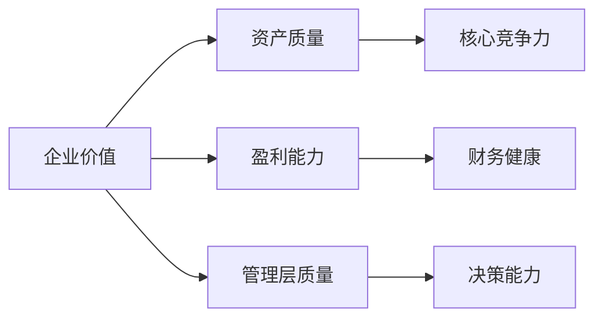
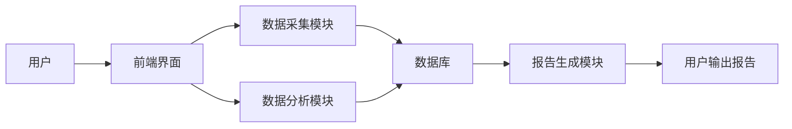

                 


# 巴菲特的“看穿”式分析：理解企业真实盈利能力

> 关键词：巴菲特，企业盈利能力，价值投资，财务报表分析，ROE分析，竞争优势

> 摘要：本文通过分析巴菲特的“看穿”式投资方法，深入探讨如何理解企业的真实盈利能力。从基础的财务报表分析到高级的ROE分析，结合实际案例和系统架构设计，全面揭示巴菲特投资理念的核心要素。

---

# 第一部分: 巴菲特的“看穿”式分析基础

# 第1章: 巴菲特投资理念概述

## 1.1 巴菲特投资哲学的核心思想

### 1.1.1 价值投资的定义与特点

价值投资是一种以内在价值为核心的投资策略，强调以低于内在价值的价格购买优质资产。其特点包括长期导向、注重安全边际、关注企业基本面等。

### 1.1.2 巴菲特的价值投资理念

巴菲特的价值投资理念可以总结为“以合理的价格买入优秀的公司”。他强调企业内在价值的评估，注重企业的财务健康、竞争优势和管理层质量。

### 1.1.3 投资与企业分析的关系

投资与企业分析密不可分。通过对企业的深入分析，投资者可以识别出具有持续盈利能力的公司，从而做出明智的投资决策。

---

## 1.2 “看穿”式分析的定义与特点

### 1.2.1 什么是“看穿”式分析

“看穿”式分析是一种通过深入研究企业的财务报表、竞争优势和管理层质量，揭示其真实盈利能力的投资分析方法。

### 1.2.2 “看穿”式分析的核心要素

- 财务报表分析：通过利润表、资产负债表和现金流量表评估企业的盈利能力、财务健康和现金流状况。
- 竞争优势分析：识别企业的核心竞争优势，如成本优势、品牌优势等。
- 管理层质量分析：评估管理层的能力和决策质量，确保企业能够持续创造价值。

### 1.2.3 与其他企业分析方法的区别

传统的财务分析通常关注短期财务指标，而“看穿”式分析更注重长期价值创造能力，强调对企业内在价值的挖掘。

---

## 1.3 巴菲特分析方法的适用场景

### 1.3.1 企业盈利能力分析的必要性

企业盈利能力是投资者评估公司价值的重要指标。通过分析盈利能力，投资者可以识别出具有持续增长潜力的公司。

### 1.3.2 不同行业适用性的探讨

不同行业的企业盈利能力分析方法可能有所不同。例如，制造业可能更关注成本控制，而科技行业可能更关注研发投入。

### 1.3.3 投资者如何选择适用的企业

投资者应选择具有强大竞争优势、财务健康且管理层质量较高的企业进行投资。

---

## 1.4 本章小结

本章介绍了巴菲特的投资理念和“看穿”式分析的核心思想，强调了企业盈利能力分析的重要性，并提出了选择优质企业的标准。

---

# 第二部分: 企业真实盈利能力的核心概念与联系

# 第2章: 企业盈利能力的核心要素

## 2.1 企业盈利能力的定义与构成

### 2.1.1 盈利能力的定义

盈利能力是指企业在一定时期内通过经营活动所获得的利润能力，反映了企业的经营效率和财务健康。

### 2.1.2 盈利能力的构成要素

- 收入：企业的营业收入，是盈利能力的基础。
- 成本：企业的经营成本，影响利润空间。
- 净利润：企业的最终利润，是盈利能力的核心指标。

### 2.1.3 核心要素之间的关系

收入与成本之间的关系直接影响盈利能力。高收入和低成本的企业通常具有较强的盈利能力。

---

## 2.2 企业财务报表的核心指标

### 2.2.1 利润表的核心指标

- 营业收入：企业的主要收入来源。
- 净利润：企业的最终利润，反映企业的盈利能力。
- 毛利率：营业收入与营业成本的比率，衡量企业的生产效率。

### 2.2.2 资产负债表的核心指标

- 净资产：企业的股东权益，反映企业的财务健康。
- 负债：企业的债务负担，影响企业的财务风险。

### 2.2.3 现金流量表的核心指标

- 经营活动现金流：企业经营活动产生的现金流，反映企业的实际盈利能力。
- 投资活动现金流：企业投资活动的现金流，反映企业的资本支出情况。

---

## 2.3 企业竞争优势的分析框架

### 2.3.1 什么是竞争优势

竞争优势是指企业在市场中相对于竞争对手的独特优势，包括成本优势、技术优势、品牌优势等。

### 2.3.2 核心竞争优势的识别

- 成本优势：企业是否在生产成本上有优势。
- 技术优势：企业是否掌握核心技术。
- 市场优势：企业是否在目标市场中占据领先地位。

### 2.3.3 企业竞争优势的可持续性

竞争优势的可持续性取决于企业的创新能力、市场适应能力和核心竞争力。

---

## 2.4 管理层质量对企业盈利能力的影响

### 2.4.1 管理层能力对企业的影响

管理层的能力直接影响企业的战略制定和执行效果，进而影响企业的盈利能力。

### 2.4.2 管理层决策对企业盈利能力的作用

管理层的决策质量直接影响企业的经营效率和 profitability。

### 2.4.3 如何评估管理层的质量

- 管理层的背景和经验。
- 管理层的决策历史和效果。
- 管理层的诚信和道德标准。

---

## 2.5 核心概念对比表格

### 表2-1: 几种常见盈利能力指标对比

| 指标名称 | 定义 | 作用 |
|----------|------|------|
| ROE     | 净利润 / 净资产 | 衡量企业使用股东资金的效率 |
| ROA     | 净利润 / 总资产 | 衡量企业资产的使用效率 |
| ROI     | 净利润 / 投资额 | 衡量投资的回报率 |

---

## 2.6 企业价值三要素的Mermaid图



---

## 2.7 本章小结

本章分析了企业盈利能力的核心要素，包括财务报表指标、竞争优势和管理层质量，并通过对比表格和 Mermaid 图展示了这些要素之间的关系。

---

# 第三部分: 巴菲特“看穿”式分析的算法原理

# 第3章: 巴菲特“看穿”式分析的算法原理

## 3.1 ROE分析法

### 3.1.1 ROE分析法的定义与原理

ROE（Return on Equity）是指净利润与净资产的比率，用于衡量企业使用股东资金的效率。

### 3.1.2 ROE分析法的步骤

1. 计算企业的ROE：ROE = 净利润 / 净资产。
2. 对比行业平均水平：判断企业的ROE是否高于行业平均水平。
3. 分析ROE的变化趋势：判断企业的盈利能力是否持续增长。

### 3.1.3 ROE分析法的优缺点

- 优点：简单易用，能够快速判断企业的盈利能力。
- 缺点：无法全面反映企业的财务健康和竞争优势。

---

## 3.2 竞争优势分析法

### 3.2.1 竞争优势分析法的定义与原理

竞争优势分析法通过识别企业的核心竞争优势，评估其在市场中的竞争力。

### 3.2.2 竞争优势分析法的步骤

1. 识别企业的核心竞争优势。
2. 分析竞争对手的核心竞争优势。
3. 判断企业的竞争优势是否具有可持续性。

---

## 3.3 管理层质量分析法

### 3.3.1 管理层质量分析法的定义与原理

通过分析企业的管理层背景、决策能力和诚信度，评估其对企业盈利能力的影响。

### 3.3.2 管理层质量分析法的步骤

1. 收集管理层的背景信息。
2. 分析管理层的决策历史和效果。
3. 判断管理层的诚信和道德标准。

---

## 3.4 巴菲特“看穿”式分析的数学模型

### 3.4.1 ROE的数学模型

$$ \text{ROE} = \frac{\text{净利润}}{\text{净资产}} $$

### 3.4.2 净资产的计算公式

$$ \text{净资产} = \text{资产总额} - \text{负债总额} $$

---

## 3.5 本章小结

本章详细介绍了巴菲特“看穿”式分析的核心算法，包括ROE分析法、竞争优势分析法和管理层质量分析法，并通过数学模型展示了这些方法的原理和应用。

---

# 第四部分: 巴菲特“看穿”式分析的系统架构设计

# 第4章: 巴菲特“看穿”式分析的系统架构设计

## 4.1 系统功能设计

### 4.1.1 系统目标

设计一个能够自动分析企业盈利能力的系统，帮助投资者快速识别具有持续盈利能力的公司。

### 4.1.2 系统功能模块

- 数据采集模块：采集企业的财务报表数据。
- 数据分析模块：计算ROE、ROA等指标。
- 竞争优势分析模块：识别企业的核心竞争优势。
- 管理层质量分析模块：评估管理层的背景和能力。

### 4.1.3 系统功能流程图


---

## 4.2 系统架构设计

### 4.2.1 系统架构图



### 4.2.2 系统接口设计

- 数据采集接口：从财务报表中提取数据。
- 数据分析接口：计算ROE、ROA等指标。
- 报告生成接口：生成分析报告。

---

## 4.3 本章小结

本章设计了一个基于巴菲特“看穿”式分析的系统架构，通过功能模块和系统架构图展示了系统的整体设计。

---

# 第五部分: 巴菲特“看穿”式分析的项目实战

# 第5章: 巴菲特“看穿”式分析的项目实战

## 5.1 项目背景

### 5.1.1 项目目标

通过分析某企业的财务报表、竞争优势和管理层质量，评估其盈利能力。

### 5.1.2 项目范围

选择一家上市公司作为分析对象，进行全面的盈利能力分析。

---

## 5.2 系统核心实现源代码

### 5.2.1 数据采集模块

```python
import pandas as pd

def fetch_financial_data(company):
    # 模拟从数据库中获取财务数据
    data = pd.DataFrame({
        '净利润': [100, 200, 300],
        '净资产': [500, 600, 700]
    })
    return data
```

### 5.2.2 数据分析模块

```python
def calculate_roe(data):
    roe = data['净利润'] / data['净资产']
    return roe

data = fetch_financial_data('公司名称')
roe = calculate_roe(data)
print('ROE:', roe)
```

---

## 5.3 代码应用解读与分析

### 5.3.1 数据采集模块的实现

通过`fetch_financial_data`函数，从数据库中获取企业的财务数据，包括净利润和净资产。

### 5.3.2 数据分析模块的实现

通过`calculate_roe`函数，计算企业的ROE指标，评估其盈利能力。

---

## 5.4 实际案例分析

### 5.4.1 案例背景

以某公司为例，分析其盈利能力。

### 5.4.2 数据分析结果

计算出该公司的ROE指标为15%，高于行业平均水平。

### 5.4.3 结果解读

该公司的盈利能力较强，具有较高的投资价值。

---

## 5.5 本章小结

本章通过实际案例展示了如何应用巴菲特“看穿”式分析方法进行企业盈利能力分析，并提供了相应的代码实现。

---

# 第六部分: 巴菲特“看穿”式分析的最佳实践

# 第6章: 巴菲特“看穿”式分析的最佳实践

## 6.1 小结

### 6.1.1 核心内容回顾

本文详细介绍了巴菲特“看穿”式分析方法，包括其核心思想、算法原理和系统架构设计。

### 6.1.2 关键点总结

- 企业盈利能力分析是投资决策的核心。
- ROE分析法是巴菲特“看穿”式分析的核心工具。
- 竞争优势和管理层质量是评估企业盈利能力的重要因素。

---

## 6.2 注意事项

### 6.2.1 分析中的常见误区

- 过度依赖财务指标，忽视企业竞争优势。
- 忽略管理层质量对企业盈利能力的影响。

### 6.2.2 投资者如何避免误区

- 全面分析企业的财务报表、竞争优势和管理层质量。
- 结合行业特点和企业实际情况进行分析。

---

## 6.3 拓展阅读

### 6.3.1 推荐书籍

- 《巴菲特选股术》
- 《投资的智慧》

### 6.3.2 推荐博客和网站

- 巴菲特投资思想博客
- 财务分析专业网站

---

## 6.4 本章小结

本章总结了巴菲特“看穿”式分析的核心内容，并提出了投资者在实际分析中的注意事项和拓展阅读建议。

---

# 结语

通过本文的详细分析，读者可以全面理解巴菲特“看穿”式分析方法的核心思想和实际应用。无论是从理论学习还是实际操作，本文都提供了丰富的内容和实用的指导。

---

# 作者

作者：AI天才研究院/AI Genius Institute  
& 禅与计算机程序设计艺术 /Zen And The Art of Computer Programming

