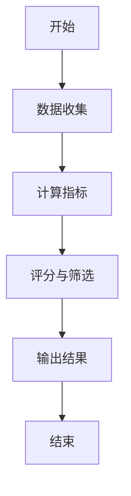
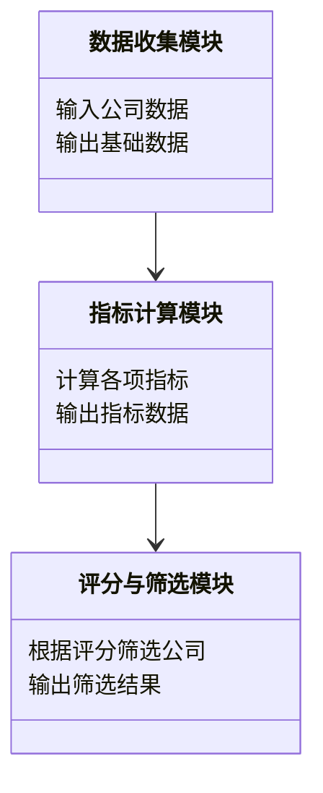

                 


# 巴菲特的20格打孔卡：集中投资的艺术

## 关键词：巴菲特，20格打孔卡，投资哲学，价值评估，集中投资

## 摘要：本文深入探讨了巴菲特的投资哲学及其著名的20格打孔卡工具，分析了该工具在集中投资中的应用价值，并结合实际案例，详细讲解了如何利用20格打孔卡进行股票筛选和投资决策。通过技术化的分析和系统设计，本文旨在为投资者提供一种科学、系统的投资方法。

---

# 第一部分: 巴菲特投资哲学与20格打孔卡背景

# 第1章: 巴菲特投资哲学概述

## 1.1 巴菲特的生平与投资理念

### 1.1.1 巴菲特的生平简介

沃伦·巴菲特（Warren Buffett），1934年8月30日出生于美国堪萨斯州，是全球著名投资家、企业家和慈善家。他以价值投资理念闻名，是伯克希尔·哈撒韦公司（Berkshire Hathaway）的董事长兼首席执行官。

### 1.1.2 巴菲特的投资哲学核心

巴菲特的投资哲学以“价值投资”为核心，强调寻找具有持续竞争优势、良好管理和合理估值的公司进行长期投资。他强调安全边际、集中投资和耐心持有。

### 1.1.3 巴菲特投资理念的演变

从早期的套利交易到后来的价值投资，巴菲特的投资理念经历了多个阶段的演变，最终形成了以基本面分析和长期持有的核心策略。

## 1.2 20格打孔卡的背景与目标

### 1.2.1 20格打孔卡的起源

20格打孔卡是巴菲特在20世纪80年代中期发明的一种投资筛选工具，用于帮助投资者快速识别具有长期投资价值的公司。

### 1.2.2 20格打孔卡的目标与意义

目标是通过简化复杂的分析过程，帮助投资者快速筛选出具有潜在投资价值的公司。意义在于其强调集中投资和长期持有的理念。

### 1.2.3 20格打孔卡的核心理念

强调通过对公司财务数据的分析，筛选出具有强大竞争优势、良好管理和合理估值的公司。

## 1.3 20格打孔卡的目标读者

### 1.3.1 初级投资者

帮助他们快速掌握价值投资的核心理念和方法。

### 1.3.2 机构投资者

提供一种系统化的投资工具，用于筛选和评估潜在投资标的。

### 1.3.3 投资教育者

提供一种教学工具，用于教授价值投资的核心理念和方法。

## 1.4 本章小结

通过本章，我们了解了巴菲特的投资哲学及其20格打孔卡的背景、目标和核心理念。接下来将详细探讨20格打孔卡的结构与使用方法。

---

# 第二部分: 20格打孔卡的核心概念与投资策略

# 第2章: 投资哲学与20格打孔卡的关系

## 2.1 投资哲学的核心要素

### 2.1.1 投资目标的确定

明确投资目标是成功投资的第一步，包括财富增值、风险控制等。

### 2.1.2 投资策略的选择

选择适合自己的投资策略，如价值投资、成长投资等。

### 2.1.3 投资心态的塑造

保持冷静和耐心，避免情绪化决策。

## 2.2 20格打孔卡与投资哲学的结合

### 2.2.1 20格打孔卡的哲学基础

基于价值投资的核心理念，强调对公司的基本面分析和长期持有。

### 2.2.2 投资哲学对20格打孔卡的指导作用

投资哲学为20格打孔卡提供了理论基础和实践指导。

### 2.2.3 20格打孔卡对投资哲学的实践意义

通过实践20格打孔卡，投资者可以更好地理解和应用价值投资的理念。

## 2.3 20格打孔卡的核心概念

### 2.3.1 集中投资的概念

集中投资是指将大部分资金投入到少数具有长期竞争优势的公司。

### 2.3.2 安全边际的定义

安全边际是指股票的内在价值与市场价格之间的差距，用于降低投资风险。

### 2.3.3 股票估值的核心要素

包括盈利能力、成长性、财务状况和竞争优势等方面。

## 2.4 本章小结

通过本章，我们探讨了20格打孔卡与投资哲学的关系，并详细分析了其核心概念。接下来将详细介绍20格打孔卡的结构与使用方法。

---

# 第三部分: 20格打孔卡的结构与使用方法

# 第3章: 20格打孔卡的结构设计

## 3.1 20格打孔卡的表格结构

### 3.1.1 表格的列与行设计

表格共有20行，每行代表一家公司，每列代表一个评估指标。

### 3.1.2 各列的含义与作用

包括盈利能力、财务状况、成长性、竞争优势等关键指标。

### 3.1.3 表格的填写规则

根据公司基本面数据，逐项评估并打分。

## 3.2 20格打孔卡的使用步骤

### 3.2.1 确定投资目标

明确投资目标和筛选标准。

### 3.2.2 收集公司信息

收集目标公司的财务数据和行业信息。

### 3.2.3 填写表格并分析结果

根据公司信息填写表格，并根据评分结果筛选出具有投资价值的公司。

## 3.3 20格打孔卡的关键指标

### 3.3.1 财务指标

包括净利润率、ROE（净资产收益率）、负债率等。

### 3.3.2 行业地位

包括行业龙头地位、竞争优势、市场占有率等。

## 3.4 本章小结

通过本章，我们详细介绍了20格打孔卡的结构与使用方法，并探讨了其关键指标。接下来将结合实际案例，进一步分析20格打孔卡的应用。

---

# 第四部分: 20格打孔卡的算法与系统设计

# 第4章: 20格打孔卡的算法原理

## 4.1 算法概述

### 4.1.1 算法的目标

通过量化分析，筛选出具有投资价值的公司。

### 4.1.2 算法的核心步骤

包括数据收集、指标计算、评分和筛选。

## 4.2 算法的具体实现

### 4.2.1 数据收集模块

从公开的财务报表和行业报告中获取数据。

### 4.2.2 指标计算模块

根据预设的公式计算各项指标得分。

### 4.2.3 评分与筛选模块

根据评分结果，筛选出得分最高的公司。

## 4.3 算法的数学模型

### 4.3.1 净利润计算公式

$$净利润 = 收入 - 成本 - 费用$$

### 4.3.2 ROE计算公式

$$ROE = \frac{净利润}{股东权益}$$

## 4.4 算法的流程图



## 4.5 本章小结

通过本章，我们详细介绍了20格打孔卡的算法原理，并通过流程图展示了其实现步骤。接下来将探讨其系统设计与架构。

---

# 第五部分: 20格打孔卡的系统分析与架构设计

# 第5章: 系统分析与架构设计

## 5.1 系统分析

### 5.1.1 系统目标

开发一个基于20格打孔卡的投资分析系统，帮助投资者快速筛选具有投资价值的公司。

### 5.1.2 系统功能需求

包括数据收集、指标计算、评分与筛选、结果输出等功能。

## 5.2 系统架构设计

### 5.2.1 模块划分

包括数据收集模块、指标计算模块、评分与筛选模块、结果输出模块。

### 5.2.2 模块交互流程

从数据收集开始，依次计算指标、评分、筛选，最后输出结果。

## 5.3 系统架构图



## 5.4 系统实现

### 5.4.1 环境安装

安装Python和相关库，如Pandas、NumPy。

### 5.4.2 核心代码实现

```python
import pandas as pd

def calculate_profitability(data):
    # 计算盈利能力指标
    data['net_profit_margin'] = data['净利润'] / data['收入']
    return data

def calculate_roe(data):
    # 计算ROE
    data['roe'] = data['净利润'] / data['股东权益']
    return data

def score_company(data):
    # 根据各项指标评分
    data['总得分'] = data['净_profit_margin'] * 0.4 + data['roe'] * 0.4 + data['市场占有率'] * 0.2
    return data

# 示例数据
data = {
    '公司': ['公司A', '公司B', '公司C'],
    '收入': [100, 200, 150],
    '净利润': [10, 20, 15],
    '股东权益': [50, 100, 75],
    '市场占有率': [20, 30, 25]
}

df = pd.DataFrame(data)
df = calculate_profitability(df)
df = calculate_roe(df)
df = score_company(df)
print(df)
```

## 5.5 本章小结

通过本章，我们探讨了20格打孔卡的系统设计与实现，并通过代码示例展示了其具体实现过程。接下来将结合实际案例，进一步分析20格打孔卡的应用。

---

# 第六部分: 20格打孔卡的项目实战

# 第6章: 项目实战

## 6.1 实战背景

### 6.1.1 项目目标

筛选具有投资价值的公司。

### 6.1.2 数据来源

使用公开的财务数据和行业报告。

## 6.2 数据收集与处理

### 6.2.1 数据收集

从公开的财务报表中获取公司数据。

### 6.2.2 数据清洗

处理缺失值和异常值。

## 6.3 算法实现

### 6.3.1 指标计算

计算各项指标并评分。

### 6.3.2 公司筛选

根据评分结果筛选出具有投资价值的公司。

## 6.4 案例分析

### 6.4.1 案例背景

以某行业为例，筛选具有投资价值的公司。

### 6.4.2 实战结果

展示筛选出的公司及其评分。

## 6.5 本章小结

通过本章，我们结合实际案例，详细展示了20格打孔卡的应用过程，并分析了其实际效果。接下来将总结投资经验，并提出注意事项。

---

# 第七部分: 20格打孔卡的最佳实践与总结

# 第7章: 最佳实践

## 7.1 投资经验总结

### 7.1.1 集中投资的重要性

集中投资可以降低风险并提高收益。

### 7.1.2 安全边际的计算

确保安全边际以降低投资风险。

## 7.2 注意事项

### 7.2.1 数据来源的可靠性

确保数据的准确性和可靠性。

### 7.2.2 模型的适用性

根据实际情况调整模型参数。

## 7.3 拓展阅读

### 7.3.1 推荐书籍

《巴菲特的选股之道》、《投资的艺术》。

### 7.3.2 工具推荐

使用Excel、Python等工具进行数据分析。

## 7.4 本章小结

通过本章，我们总结了20格打孔卡的最佳实践，并提出了注意事项和拓展阅读。希望读者能够通过本文更好地理解和应用20格打孔卡。

---

# 作者：AI天才研究院/AI Genius Institute & 禅与计算机程序设计艺术 /Zen And The Art of Computer Programming

