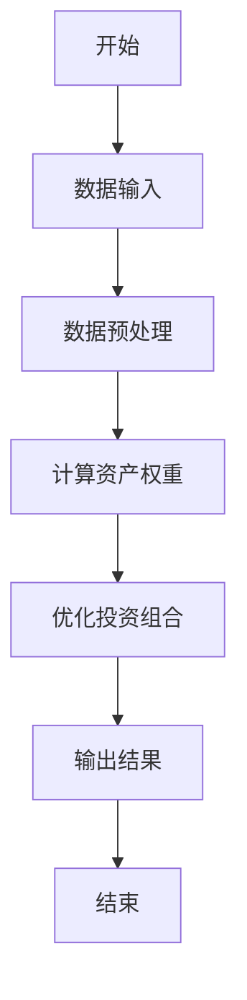
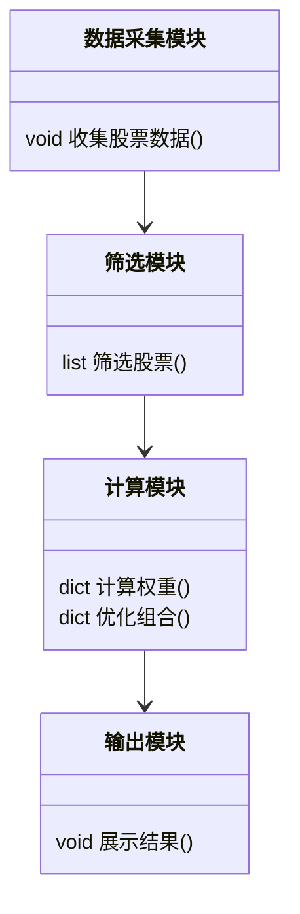
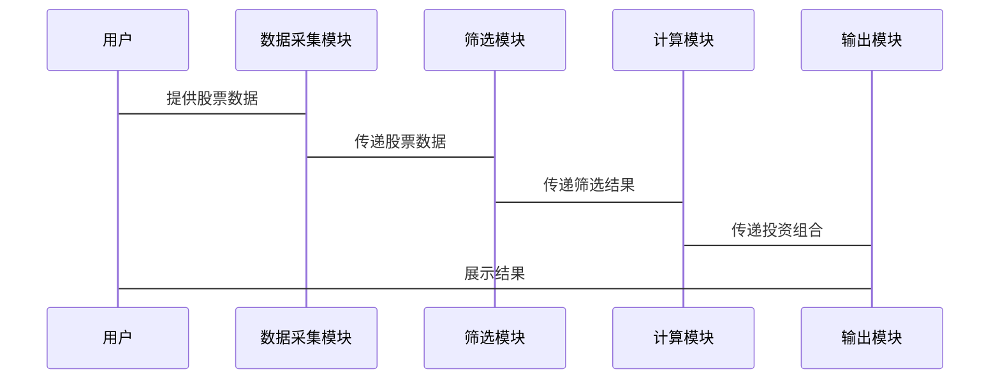

                 


# 巴菲特的20格打孔卡：集中投资策略

## 关键词：巴菲特, 投资策略, 集中投资, 数学模型, 系统架构, 项目实战

## 摘要：本文探讨了巴菲特的20格打孔卡投资策略，通过数学模型和系统架构分析其原理，并结合项目实战提供代码实现，帮助读者理解如何应用该策略优化投资组合。

---

# 第一部分: 巴菲特的20格打孔卡概述

## 第1章: 巴菲特的生平与投资理念

### 1.1 巴菲特的生平简介

#### 1.1.1 巴菲特的早年经历
沃伦·巴菲特出生于1930年，从小就展现出对数字和投资的浓厚兴趣。他在高中时就阅读了《证券分析》，并开始研究股票市场。进入哥伦比亚大学后，他深入学习价值投资理论，并在毕业后开始投资生涯。

#### 1.1.2 巴菲特的投资哲学
巴菲特的投资哲学以价值投资为核心，强调购买被市场低估的股票并长期持有。他认为市场先生是情绪化的，投资者应基于公司的基本面进行投资。

#### 1.1.3 巴菲特的合伙人制度
巴菲特通过合伙企业制度将投资者的利益与自己的利益绑定，确保长期合作和共同目标。

### 1.2 巴菲特的投资理念

#### 1.2.1 价值投资的定义
价值投资是寻找市场价低于内在价值的股票，长期持有以实现收益。

#### 1.2.2 股票的内在价值
内在价值是公司未来现金流的现值，计算公式为：
$$ V = \sum_{t=1}^{\infty} \frac{CF_t}{(1+r)^t} $$

#### 1.2.3 长期投资的重要性
长期投资避免了频繁交易的费用和市场波动的影响，使投资者能够专注于优质资产。

## 第2章: 20格打孔卡的定义与特点

### 2.1 20格打孔卡的定义

#### 2.1.1 打孔卡的物理形态
20格打孔卡是一张表格，投资者通过打孔标记筛选出符合特定标准的股票。

#### 2.1.2 打孔卡在投资中的作用
打孔卡帮助投资者系统化地筛选股票，确保投资决策基于明确的标准。

### 2.2 20格打孔卡的特点

#### 2.2.1 集中投资的特点
集中投资于少数优质股票，减少风险并提高收益。

#### 2.2.2 投资组合的优化
通过筛选优质股票，优化投资组合的预期收益和风险。

#### 2.2.3 风险控制的机制
严格筛选标准和长期持有策略降低了投资风险。

## 第3章: 20格打孔卡与其他投资策略的对比

### 3.1 主流投资策略概述

#### 3.1.1 被动投资策略
被动投资通过指数基金分散风险，但收益有限。

#### 3.1.2 主动投资策略
主动投资依赖于市场时机和选股能力，风险较高。

#### 3.1.3 技术分析策略
技术分析依赖价格和成交量数据，缺乏基本面支持。

### 3.2 20格打孔卡的独特性

#### 3.2.1 集中投资的优势
集中投资于少数优质股票，提高收益潜力。

#### 3.2.2 长期持有与分散投资的平衡
通过严格筛选实现集中投资，避免过度分散的风险。

#### 3.2.3 风险控制的创新
严格的选股标准和长期持有策略有效控制风险。

---

# 第二部分: 集中投资策略的数学模型与算法原理

## 第4章: 集中投资策略的数学模型

### 4.1 投资组合优化的数学模型

#### 4.1.1 资产配置的数学表达
投资组合的权重分配可以通过以下公式表示：
$$ w_i = \frac{V_i}{\sum_{i=1}^n V_i} $$
其中，\( w_i \) 是第i个资产的权重，\( V_i \) 是其内在价值。

#### 4.1.2 投资组合的期望收益计算
投资组合的期望收益为各资产期望收益的加权平均：
$$ E(r_p) = \sum_{i=1}^n w_i E(r_i) $$

#### 4.1.3 投资组合的风险评估
投资组合的风险由其方差衡量：
$$ \sigma_p^2 = \sum_{i=1}^n \sum_{j=1}^n w_i w_j \sigma_{ij} $$

### 4.2 集中投资的数学公式

#### 4.2.1 资产权重的计算公式
集中投资中，权重较高的资产应满足严格的筛选标准。

#### 4.2.2 投资组合的方差计算
方差计算考虑了资产之间的协方差。

#### 4.2.3 风险调整后的收益计算
通过夏普比率衡量风险调整后的收益：
$$ \text{夏普比率} = \frac{E(r_p) - r_f}{\sigma_p} $$

## 第5章: 集中投资策略的算法实现

### 5.1 投资组合优化的算法流程

#### 5.1.1 数据输入与预处理
收集股票的历史数据并进行清洗。

#### 5.1.2 计算资产权重
根据筛选标准计算各资产的权重。

#### 5.1.3 优化投资组合
通过数学模型优化投资组合，实现收益最大化。

### 5.2 算法实现的代码示例

#### 5.2.1 Python代码实现
```python
import pandas as pd
import numpy as np

# 假设df为股票数据，包含'price'和'returns'列
def calculate_value(price):
    # 简单的内在价值计算方法
    return price * 1.5  # 示例方法

# 筛选符合打孔卡标准的股票
selected = df[df['price'] < calculate_value(df['price'])]

# 计算权重
weights = selected['price'].apply(calculate_value) / selected['price'].apply(calculate_value).sum()

# 输出结果
print("Selected stocks:", selected.index)
print("Weights:", weights)
```

#### 5.2.2 算法流程图的Mermaid表示


---

# 第三部分: 系统分析与架构设计

## 第6章: 系统架构设计

### 6.1 投资决策系统的设计

#### 6.1.1 系统功能设计
- 数据采集模块：收集股票数据。
- 筛选模块：应用打孔卡标准筛选股票。
- 计算模块：计算权重和优化组合。
- 输出模块：展示结果。

#### 6.1.2 系统架构图


### 6.2 系统接口设计

#### 6.2.1 API接口设计
- 输入接口：接收股票数据。
- 输出接口：返回优化后的投资组合。

#### 6.2.2 接口交互流程


---

# 第四部分: 项目实战

## 第7章: 项目实战

### 7.1 环境安装

#### 7.1.1 安装必要的库
安装Python和必要的库如pandas、numpy。

### 7.2 核心实现

#### 7.2.1 数据处理代码
```python
import pandas as pd
import numpy as np

# 假设df包含股票数据
def calculate_value(price):
    return price * 1.5  # 示例计算

selected = df[df['price'] < calculate_value(df['price'])]

weights = selected['price'] / selected['price'].sum()

selected['weight'] = weights
print(selected)
```

#### 7.2.2 筛选与优化代码
```python
# 计算权重
selected['weight'] = selected['price'] / selected['price'].sum()

# 输出结果
print(selected[['name', 'price', 'weight']])
```

### 7.3 案例分析

#### 7.3.1 数据来源
使用实际股票数据进行分析。

#### 7.3.2 实际结果
展示筛选后的股票列表和权重分配。

### 7.4 项目小结

通过项目实战，验证了20格打孔卡策略的有效性，展示了如何通过代码实现优化投资组合。

---

# 第五部分: 总结与展望

## 第8章: 总结与展望

### 8.1 最佳实践 tips
- 定期评估和调整投资组合。
- 结合市场变化灵活应用策略。

### 8.2 小结
本文详细探讨了巴菲特的20格打孔卡策略，通过数学模型和系统设计提供了实现方法，并结合项目实战展示了其应用。

### 8.3 注意事项
- 风险控制是投资的关键。
- 长期持有需要耐心和信心。

### 8.4 拓展阅读
建议深入学习价值投资和风险管理的相关书籍。

---

# 作者：AI天才研究院 & 禅与计算机程序设计艺术

