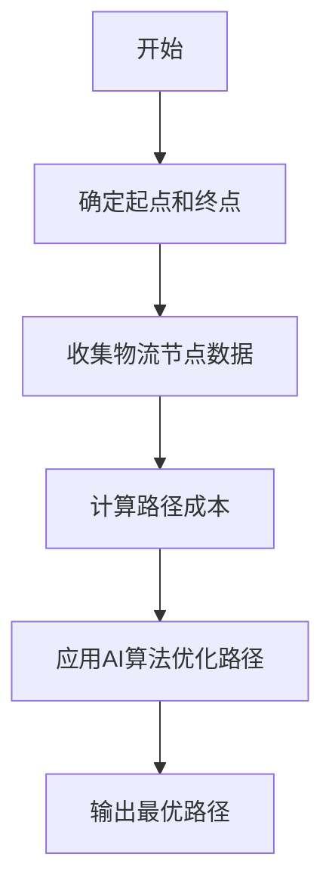
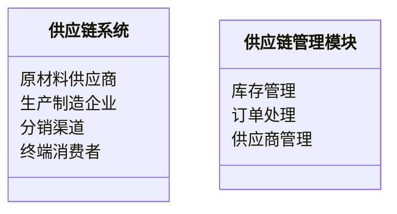
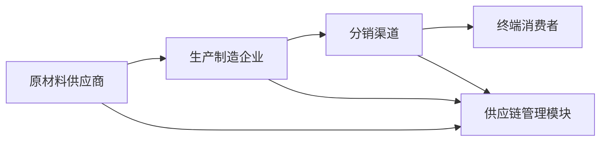

                 


# 巴菲特的产业链分析3.0：全球供应链重构下的投资机会

> 关键词：巴菲特，产业链分析，全球供应链重构，投资机会，系统架构，价值投资

> 摘要：本文将从全球供应链重构的背景出发，结合巴菲特的价值投资理念，深入分析产业链的关键要素和重构趋势。通过构建系统化的分析框架，识别全球供应链重构下的投资机会，并提供实际案例和系统设计的详细解读。

---

## 第一部分: 全球供应链重构的背景与动因

### 第1章: 全球供应链重构的背景与动因

#### 1.1 从全球化到本地化的演变

全球供应链在过去几十年中一直是全球化的重要支柱。随着技术的进步和全球化的深入，企业将生产环节分散到全球各地以降低成本。然而，近年来，疫情、地缘政治冲突以及贸易摩擦的加剧，使得全球供应链面临前所未有的挑战。企业开始重新评估其供应链的韧性，逐步将供应链从全球化转向本地化和区域化的布局。

**关键概念对比：**

| 全球化供应链 | 本地化供应链 |
|--------------|---------------|
| 跨国布局      | 区域化布局    |
| 成本最低化    | 风险可控化    |
| 交货周期长    | 交货周期短    |

#### 1.2 新兴技术对供应链的影响

新兴技术如人工智能、大数据和物联网等，正在重塑供应链的管理方式。通过智能化的库存管理和预测分析，企业能够更高效地应对供应链的变化。例如，利用AI算法优化供应链中的物流路径，降低运输成本。

**算法原理：**

以下是基于AI优化供应链路径的简单算法流程：



#### 1.3 美国与中国贸易摩擦的影响

中美贸易摩擦对全球供应链的影响深远。许多企业为了规避关税风险，选择将生产环节从中国转移至其他地区，如东南亚和印度。这种转移不仅影响了供应链的布局，也推动了区域供应链的重构。

---

### 第2章: 巴菲特的价值投资理念与产业链分析

#### 2.1 巴菲特的价值投资理念

巴菲特的价值投资理念强调长期持有优质资产，注重企业的基本面和竞争优势。他认为，投资的本质是寻找具有持续竞争优势的企业，并长期持有它们的股票。

**巴菲特投资哲学的核心要素：**

1. **安全边际**：买入价格低于内在价值的企业。
2. **竞争优势**：选择具有护城河的企业。
3. **长期视角**：关注企业的长期盈利能力。

#### 2.2 巴菲特的产业链分析方法

巴菲特的产业链分析方法注重对企业所在行业的上下游关系、成本结构和竞争环境的全面评估。他认为，一个企业的竞争优势往往体现在其产业链中的位置和资源整合能力。

**产业链分析的核心要素：**

- **上游供应商**：原材料和关键零部件的供应稳定性。
- **下游客户**：市场需求的增长潜力和客户粘性。
- **竞争对手**：行业内的竞争格局和企业的相对优势。

---

## 第二部分: 产业链分析框架与方法论

### 第3章: 产业链分析的核心概念与框架

#### 3.1 产业链分析的理论基础

产业链分析是通过对一个行业上下游关系的系统性研究，识别出关键环节和核心竞争力。这种分析方法能够帮助企业更好地理解行业动态和投资机会。

**产业链生命周期模型：**


#### 3.2 产业链分析的关键指标

在产业链分析中，关键指标包括企业的成本结构、市场占有率、供应链的稳定性和抗风险能力等。这些指标能够帮助企业识别产业链中的强弱环节。

**关键指标对比：**

| 指标       | 强环节特征   | 弱环节特征   |
|------------|--------------|--------------|
| 成本结构   | 成本优势     | 成本劣势     |
| 市场占有率 | 市场主导地位 | 市场弱势地位  |
| 供应链稳定性| 供应链可控   | 供应链不稳定 |

### 第4章: 产业链分析的系统性方法

#### 4.1 产业链分析的系统性框架

系统性方法强调对产业链的全貌进行分析，从宏观到微观，从整体到局部。这种方法能够帮助投资者全面理解产业链的运作机制和潜在风险。

**系统性分析步骤：**

1. **问题定义**：明确分析的目标和范围。
2. **数据收集**：收集相关的行业数据和企业信息。
3. **模型构建**：建立产业链的分析模型。
4. **风险评估**：识别潜在的风险和机会。
5. **优化建议**：提出优化供应链的建议。

#### 4.2 产业链分析的工具与方法

常用的工具包括SWOT分析、PEST分析和Porter五力模型等。这些工具能够帮助投资者全面评估企业的内外部环境和竞争优势。

**SWOT分析法：**

| 优势       | 劣势       | 机会       | �威脅       |
|------------|------------|------------|------------|
| 成本优势   | 供应链不稳定| 新市场开拓 | 汇率波动    |

---

## 第三部分: 全球供应链重构下的投资机会分析

### 第5章: 全球供应链重构下的投资机会

#### 5.1 新兴产业的投资机会

随着技术的进步和市场需求的变化，新兴产业如数字经济、新能源和医疗健康等领域呈现出巨大的投资潜力。

**新兴产业投资机会分析：**

- **数字经济**：云计算、大数据和人工智能等领域的投资机会。
- **新能源**：电动汽车、太阳能和风能等领域的投资机会。
- **医疗健康**：生物技术、医疗器械和医疗服务等领域的投资机会。

#### 5.2 区域供应链重构的投资机会

全球供应链重构带来了区域供应链的变化，投资者可以关注东南亚、北美和欧洲等地区的供应链重构带来的投资机会。

**区域供应链重构趋势：**

- **东南亚**：制造业转移带来的投资机会。
- **北美**：供应链本地化带来的投资机会。
- **欧洲**：绿色供应链带来的投资机会。

### 第6章: 巴菲特视角下的投资策略

#### 6.1 巴菲特产业链分析的实践案例

巴菲特通过其独特的产业链分析方法，成功投资了多个行业。例如，他对可口可乐的投资基于其强大的品牌和稳定的市场需求。

**案例分析：**

- **可口可乐**：强大的品牌和稳定的市场需求使其成为巴菲特的理想投资标的。
- **苹果公司**：强大的创新能力和高利润率使其成为巴菲特关注的目标。

#### 6.2 巴菲特的长期投资策略

巴菲特的长期投资策略强调对企业基本面的深入分析和对行业趋势的准确把握。他建议投资者关注企业的长期盈利能力，而不是短期市场波动。

---

## 第四部分: 系统分析与架构设计方案

### 第7章: 系统分析与架构设计方案

#### 7.1 问题场景介绍

全球供应链重构对企业的供应链管理提出了新的挑战。企业需要构建灵活、高效的供应链系统，以应对市场的变化和风险。

#### 7.2 系统功能设计

**领域模型类图：**



#### 7.3 系统架构设计

**系统架构图：**



---

## 第五部分: 项目实战

### 第8章: 项目实战

#### 8.1 环境安装

为了实现供应链系统的优化，企业需要安装相关的软件和工具，如ERP系统和供应链管理软件。

#### 8.2 核心代码实现

以下是供应链管理系统的核心代码实现：

```python
class SupplyChain:
    def __init__(self, suppliers, manufacturers, distributors):
        self.suppliers = suppliers
        self.manufacturers = manufacturers
        self.distributors = distributors

    def manage_supply_chain(self):
        # 处理供应商订单
        for supplier in self.suppliers:
            if supplier.stock_level < supplier.min_stock:
                supplier.place_order()

        # 处理生产订单
        for manufacturer in self.manufacturers:
            if manufacturer.raw_materials < manufacturer.required_materials:
                manufacturer.request_materials()

        # 处理分销订单
        for distributor in self.distributors:
            if distributor.stock_level < distributor.min_stock:
                distributor.place_order()

        return "供应链管理完成"
```

---

## 第六部分: 总结与展望

### 第9章: 总结与展望

#### 9.1 总结

本文从全球供应链重构的背景出发，结合巴菲特的价值投资理念，深入分析了产业链的关键要素和重构趋势。通过构建系统化的分析框架，识别了全球供应链重构下的投资机会，并提供了实际案例和系统设计的详细解读。

#### 9.2 展望

未来，随着技术的进步和市场的变化，全球供应链重构将继续影响投资机会。投资者需要持续关注新兴技术和区域供应链的变化，灵活调整投资策略。

---

## 作者信息

作者：AI天才研究院/AI Genius Institute & 禅与计算机程序设计艺术 /Zen And The Art of Computer Programming

---

这篇文章通过系统的分析和实际案例的解读，深入探讨了全球供应链重构下的投资机会，为投资者提供了有价值的参考和指导。

