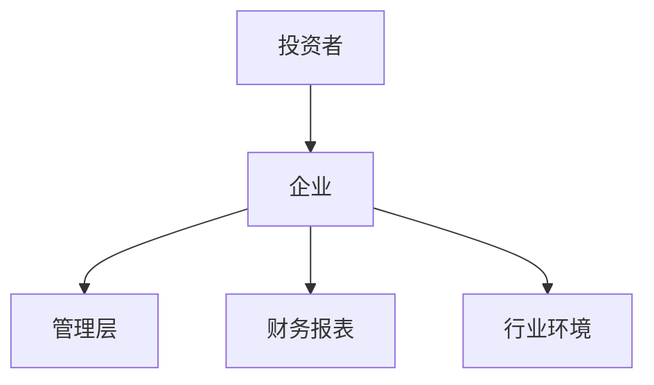
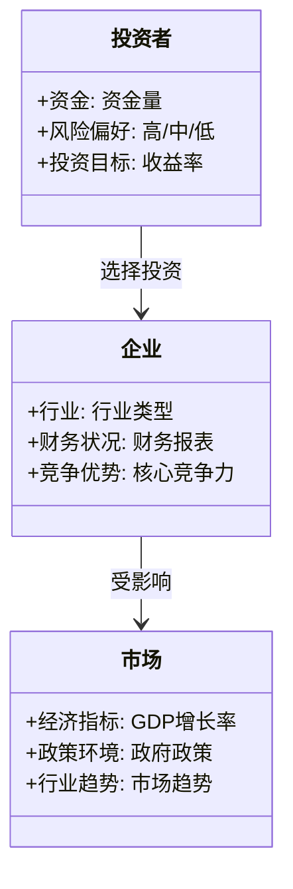
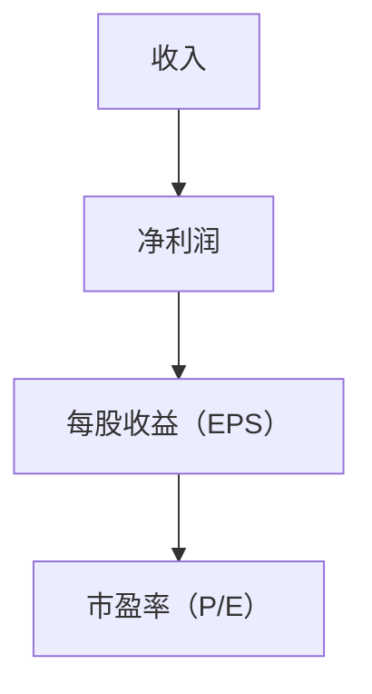
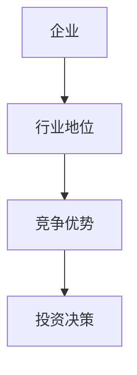

                 

# 巴菲特的价值投资在新兴市场的应用：机遇与挑战

> 关键词：价值投资，新兴市场，巴菲特，投资策略，风险管理

> 摘要：本文探讨了巴菲特价值投资理念在新兴市场的应用，分析了新兴市场的特点、投资机会、挑战以及应对策略，结合实际案例和理论分析，提供了在新兴市场中应用价值投资的具体方法和建议。

---

## 目录大纲

1. 引言
   1.1 巴菲特价值投资理念概述
   1.2 新兴市场的特点与重要性

2. 价值投资的核心理论与工具
   2.1 价值投资的核心理论
   2.2 价值投资的分析工具

3. 新兴市场的特点与投资机会
   3.1 新兴市场的定义与现状
   3.2 新兴市场的投资机会
   3.3 新兴市场的风险与挑战

4. 价值投资在新兴市场的应用策略
   4.1 寻找低估的企业
   4.2 分析企业的竞争优势
   4.3 评估管理层的能力
   4.4 构建投资组合

5. 挑战与对策
   5.1 新兴市场的复杂性
   5.2 风险管理策略
   5.3 投资组合的动态调整

6. 结论
   6.1 总结与展望

---

## 1. 引言

### 1.1 巴菲特价值投资理念概述

巴菲特的价值投资理念是基于基本面分析和长期持有的策略。他强调寻找具有持续竞争优势和良好管理的企业，并以合理的价格买入，长期持有，等待企业价值的实现。这种投资理念的核心在于对企业的深入分析和对市场波动的耐心。

#### 核心概念与联系

以下是价值投资的核心概念对比表格：

| **概念**       | **定义**                                                                 |
|----------------|--------------------------------------------------------------------------|
| 内在价值       | 企业未来现金流的现值，基于基本面分析得出。                              |
| 安全边际       | 股票价格与内在价值之间的差距，提供了一种保护投资者免受短期市场波动影响的缓冲。|
| 市盈率（P/E）   | 每股价格与每股收益的比率，用于评估企业估值是否合理。                  |
| 市净率（P/B）   | 每股价格与每股净资产的比率，用于评估企业资产质量。                    |

**ER实体关系图**（使用Mermaid）：

### 1.2 新兴市场的特点与重要性

新兴市场通常指那些经济增长迅速、市场潜力大的国家或地区，如亚洲、拉丁美洲和中东欧。这些市场的特点是：

- **高增长性**：新兴市场的GDP增长率通常高于发达市场。
- **多样性**：新兴市场涵盖多个行业，包括科技、消费和制造业。
- **政策影响**：政府政策对市场有较大影响，包括税收、监管和贸易政策。

#### 系统分析与架构设计

**领域模型（Mermaid类图）**：

---

## 2. 价值投资的核心理论与工具

### 2.1 价值投资的核心理论

#### 安全边际的计算

安全边际 = 内在价值 - 市场价格

安全边际越大，投资风险越小。例如，如果一只股票的内在价值为50元，市场价格为40元，安全边际为10元，意味着即使价格波动，投资者也能获得收益。

### 2.2 价值投资的分析工具

#### 财务指标分析

以下是一个简单的财务指标分析算法：

计算市盈率的公式：

$$ P/E = \frac{\text{股价}}{\text{每股收益}} $$

例如，某股票股价为30元，每股收益为5元，市盈率为6。

---

## 3. 新兴市场的特点与投资机会

### 3.1 新兴市场的定义与现状

新兴市场通常包括中国、印度、巴西等国家，这些市场具有高增长潜力，但也面临政策不确定性和市场波动性。

### 3.2 新兴市场的投资机会

#### 案例分析：中国科技企业

以中国的科技企业为例，投资者可以通过分析企业的财务状况、行业地位和管理层能力来识别投资机会。

#### 竞争优势分析

以下是一个竞争优势分析的流程图：

---

## 4. 价值投资在新兴市场的应用策略

### 4.1 寻找低估的企业

通过分析企业的市盈率、市净率等指标，寻找被市场低估的企业。

### 4.2 分析企业的竞争优势

竞争优势包括成本优势、技术优势和品牌优势。例如，某科技企业的竞争优势可以体现在其专利数量和技术领先地位。

### 4.3 评估管理层的能力

管理层的决策能力和战略眼光对企业的发展至关重要。投资者需要通过企业年报和管理层访谈来评估管理层的能力。

### 4.4 构建投资组合

投资组合应分散投资，降低风险。例如，将资金分配到不同的行业和企业，以平衡风险。

---

## 5. 挑战与对策

### 5.1 新兴市场的复杂性

新兴市场的复杂性主要体现在政策风险和市场波动性上。投资者需要加强研究，了解政策变化和市场趋势。

### 5.2 风险管理策略

#### 止损机制

设置止损点，避免重大损失。例如，当股价下跌10%，立即卖出。

#### 投资组合的动态调整

根据市场变化，定期调整投资组合，保持合理的资产配置。

### 5.3 投资组合的动态调整

动态调整需要根据市场变化和企业基本面变化进行。例如，当某企业财务状况恶化，及时调整投资比例。

---

## 6. 结论

### 6.1 总结与展望

巴菲特的价值投资理念在新兴市场中具有广泛的应用潜力。通过深入分析企业的基本面和市场环境，投资者可以在新兴市场中找到优质的投资机会。然而，新兴市场的复杂性和不确定性也要求投资者具备较高的分析能力和风险管理能力。

---

## 作者：AI天才研究院/AI Genius Institute & 禅与计算机程序设计艺术 /Zen And The Art of Computer Programming

---

**摘要：** 本文探讨了巴菲特的价值投资理念在新兴市场的应用，分析了新兴市场的特点、投资机会、挑战以及应对策略，并结合实际案例和理论分析，提供了在新兴市场中应用价值投资的具体方法和建议。

