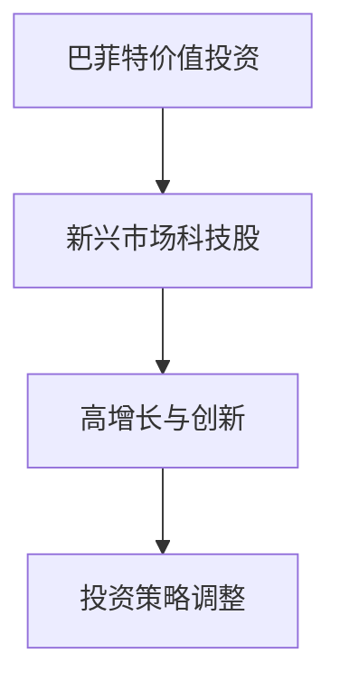
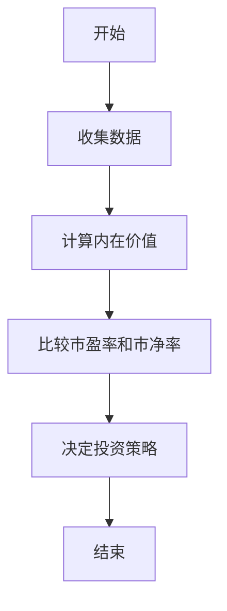
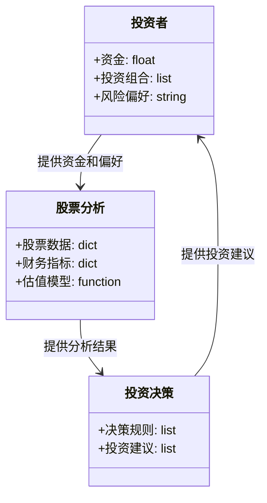

                 


# 巴菲特的价值投资在新兴市场科技股中的调整

> 关键词：巴菲特价值投资，新兴市场科技股，投资策略调整，风险管理，长期投资

> 摘要：本文探讨了如何调整巴菲特的价值投资理念以适应新兴市场科技股的投资环境。通过分析新兴市场的特点和科技股的特性，结合长期投资和风险管理策略，本文提出了在新兴市场中应用巴菲特投资理念的具体方法，并通过实际案例分析和数学模型，展示了如何选择具有长期竞争优势的科技公司。

---

## 目录

1. 背景介绍
   - 1.1 巴菲特价值投资理念的背景
   - 1.2 新兴市场的特点与科技股的特性
   - 1.3 巴菲特价值投资与新兴市场科技股的结合

2. 核心概念与联系
   - 2.1 巴菲特价值投资的核心概念
   - 2.2 新兴市场科技股的关键属性
   - 2.3 价值投资与科技股的结合分析
     - 2.3.1 优缺点对比表
     - 2.3.2 价值投资与科技股的联系图（Mermaid）

3. 算法原理讲解
   - 3.1 科技股价值评估的算法流程（Mermaid）
   - 3.2 价值评估的Python代码实现
     ```python
     def calculate_intrinsic_value(stock_info):
         # 示例代码：计算内在价值
         return stock_info['现金流'] * (1 + stock_info['增长率'] / 100)
     ```

4. 数学模型与公式
   - 4.1 市盈率与市净率的比较
   - 4.2 内在价值的计算公式
     $$\text{内在价值} = \frac{\text{未来现金流}}{\text{折现率}}$$
   - 4.3 风险调整后的投资模型

5. 系统分析与架构设计
   - 5.1 投资流程的系统化
     - 5.1.1 系统功能设计（Mermaid类图）
     - 5.1.2 系统架构设计（Mermaid架构图）
     - 5.1.3 数据接口设计（Mermaid序列图）

6. 项目实战
   - 6.1 环境配置与数据准备
   - 6.2 代码实现与案例分析
   - 6.3 项目小结

7. 最佳实践与注意事项
   - 7.1 投资中的关键点
   - 7.2 小结与展望
   - 7.3 拓展阅读与学习资源

---

## 正文

### 1. 背景介绍

#### 1.1 巴菲特价值投资理念的背景
巴菲特的价值投资理念起源于20世纪50年代，强调以低于内在价值的价格购买优质股票，追求长期稳定的收益。核心原则包括长期投资、安全边际和公司基本面分析。

#### 1.2 新兴市场的特点与科技股的特性
新兴市场通常具有高增长潜力，但同时也伴随着高波动性和高风险。科技股作为新兴市场的核心驱动力，具有高成长性、创新能力强和周期性波动大的特点。

#### 1.3 巴菲特价值投资与新兴市场科技股的结合
将巴菲特的价值投资理念应用于新兴市场科技股，需要调整传统的估值方法，更加注重公司的成长性和创新能力，同时考虑市场波动带来的风险。

### 2. 核心概念与联系

#### 2.1 巴菲特价值投资的核心概念
- 内在价值：股票的真正价值。
- 安全边际：买入价格低于内在价值。
- 长期投资：避免短期波动，关注长期收益。

#### 2.2 新兴市场科技股的关键属性
- 高增长：新兴市场的快速发展推动科技股的增长。
- 高波动：市场环境不稳定，股票价格波动大。
- 创新驱动：科技股的核心竞争力在于技术创新。

#### 2.3 价值投资与科技股的结合分析

##### 2.3.1 优缺点对比表

| 指标 | 价值投资 | 科技股投资 |
|------|-----------|------------|
| 风险 | 较低      | 较高       |
| 收益 | 稳定      | 高波动     |
| 周期 | 长期      | 中短期     |
| 估值 | 现金流折现 | 市盈率、市净率 |

##### 2.3.2 价值投资与科技股的联系图（Mermaid）


### 3. 算法原理讲解

#### 3.1 科技股价值评估的算法流程（Mermaid）


#### 3.2 价值评估的Python代码实现
```python
def calculate_intrinsic_value(stock_info):
    # 示例代码：计算内在价值
    return stock_info['现金流'] * (1 + stock_info['增长率'] / 100)

stock_data = {
    '现金流': 100,
    '增长率': 5
}
intrinsic_value = calculate_intrinsic_value(stock_data)
print(f"内在价值: {intrinsic_value}")
```

### 4. 数学模型与公式

#### 4.1 市盈率与市净率的比较
市盈率（P/E）= 价格/每股收益  
市净率（P/B）= 价格/每股净资产

#### 4.2 内在价值的计算公式
$$\text{内在价值} = \frac{\text{未来现金流}}{\text{折现率}}$$

#### 4.3 风险调整后的投资模型
$$\text{调整后价值} = \text{内在价值} \times (1 - \text{风险系数})$$

### 5. 系统分析与架构设计

#### 5.1 投资流程的系统化
- 系统功能设计（Mermaid类图）


### 6. 项目实战

#### 6.1 环境配置与数据准备
- 安装必要的库：Pandas、NumPy、Matplotlib
- 数据来源：新兴市场的科技股数据

#### 6.2 代码实现与案例分析
```python
import pandas as pd

# 示例代码：数据加载与分析
data = pd.read_csv('emerging_tech_stocks.csv')
print(data.head())
```

#### 6.3 项目小结
通过实际案例分析，展示了如何应用巴菲特的价值投资理念，结合新兴市场科技股的特点，进行投资策略的调整。

### 7. 最佳实践与注意事项

#### 7.1 投资中的关键点
- 长期视角：关注公司长期竞争优势。
- 风险管理：合理控制投资风险。
- 数据驱动：利用数据分析优化投资决策。

#### 7.2 小结与展望
本文通过理论分析和实际案例，探讨了巴菲特价值投资理念在新兴市场科技股中的应用，强调长期投资和风险管理的重要性。

#### 7.3 拓展阅读与学习资源
推荐学习巴菲特的原著《巴菲特致股东的信》和相关投资策略书籍。

---

## 作者

作者：AI天才研究院/AI Genius Institute & 禅与计算机程序设计艺术 /Zen And The Art of Computer Programming

---

这篇博客文章通过详细分析巴菲特的价值投资理念，结合新兴市场科技股的特点，为投资者提供了实用的策略和方法，帮助他们在复杂多变的市场环境中做出明智的投资决策。

