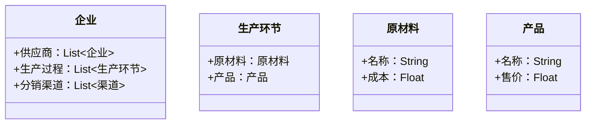
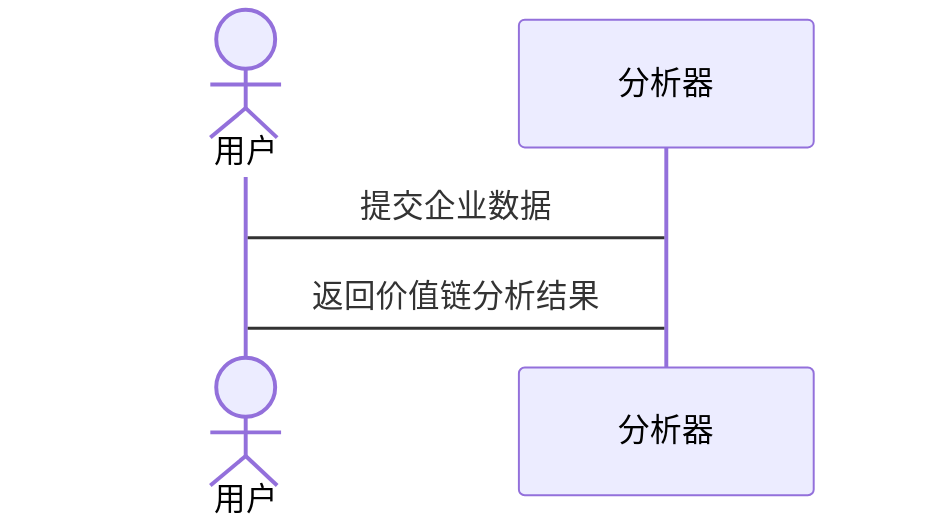

                 


# 巴菲特的价值链分析：理解公司在产业中的位置

**关键词：** 巴菲特，价值链分析，企业定位，竞争优势，投资策略

**摘要：**  
本文深入探讨了巴菲特的价值链分析方法，分析了企业在产业中的位置、竞争优势和价值创造过程。通过系统化的分析框架和实际案例，结合技术语言和逻辑推理，帮助读者理解如何从价值链的角度审视企业，识别其核心竞争力，并评估其在行业中的价值地位。

---

## 第一部分：巴菲特的价值链分析基础

### 第1章：巴菲特的价值链分析概述

#### 1.1 什么是价值链分析
价值链分析是一种系统化的工具，用于分解企业从原材料采购到最终产品交付的整个过程，识别每个环节的成本、效率和价值贡献。它不仅关注企业的内部流程，还分析外部环境的影响。

#### 1.2 巴菲特的价值链分析视角
巴菲特的价值链分析的独特之处在于，他不仅关注企业的财务表现，还关注其在行业中的位置、竞争优势和长期价值创造能力。他认为，企业只有在行业中具有独特的竞争优势，才能为股东创造长期价值。

#### 1.3 价值链分析的背景与应用
价值链分析的背景可以追溯到迈克尔·波特的行业价值链理论，但巴菲特将其应用于投资分析，重点关注企业的核心竞争力和长期盈利能力。

---

## 第二部分：价值链分析的核心概念与联系

### 第2章：价值链分析的核心要素

#### 2.1 价值链的构成要素
价值链的构成要素包括：
1. **供应商**：提供原材料和零部件的企业。
2. **生产过程**：产品的制造和组装环节。
3. **分销渠道**：将产品送达消费者的中间环节。
4. **消费者**：产品的最终用户。
5. **企业的核心竞争力**：企业在行业中的独特优势。

#### 2.2 价值链分析的属性特征对比
以下是价值链分析中常见属性特征的对比表格：

| 属性          | 行业特点 | 企业内部资源 | 外部环境 |
|---------------|----------|--------------|----------|
| 竞争程度      | 高       | 中           | 高       |
| 成本控制      | 高       | 高           | 中       |
| 创新能力      | 中       | 高           | 低       |
| 市场进入壁垒  | 高       | 中           | 高       |

#### 2.3 价值链的ER实体关系图
以下是价值链的ER实体关系图（使用Mermaid语法）：

```mermaid
erDiagram
    actor 顾客
    actor 供应商
    actor 分销商
    class 产品
    class 订单
    class 生产过程
    顾客 --> 订单 : 下订单
    供应商 --> 生产过程 : 提供原材料
    生产过程 --> 产品 : 生产
    产品 --> 分销商 : 分配
    分销商 --> 顾客 : 交付
```

### 第3章：价值链分析的算法原理

#### 3.1 价值链分析的基本流程
价值链分析的基本流程包括以下几个步骤：
1. **确定企业的核心业务流程**：从原材料采购到最终产品交付的完整流程。
2. **识别关键价值活动**：分析每个环节的成本、效率和价值贡献。
3. **分析各环节的成本与收益**：计算每个环节的投入和产出，评估其对整体价值的贡献。

#### 3.2 价值链分析的数学模型
以下是价值链分析的数学模型示例：

$$ \text{企业价值} = \sum_{i=1}^{n} (\text{环节i的价值贡献}) $$

其中，环节i的价值贡献可以表示为：
$$ \text{环节i的价值贡献} = (\text{环节i的收入} - \text{环节i的成本}) $$

#### 3.3 价值链分析的案例分析
以可口可乐公司为例，其价值链包括以下环节：
1. **原材料采购**：采购糖、水等原材料。
2. **生产过程**：生产碳酸饮料。
3. **分销渠道**：将产品配送到零售商。
4. **消费者**：最终消费者购买产品。

---

## 第三部分：系统分析与架构设计方案

### 第4章：价值链分析的系统架构

#### 4.1 系统功能设计
1. **领域模型**：以下是领域模型的Mermaid类图：



2. **系统架构设计**：以下是系统架构的Mermaid架构图：

```mermaid
archi
    title 价值链分析系统架构
    分析器
    企业数据
    竞争对手数据
    行业趋势数据
    边界
    分析器 --> 企业数据
    分析器 --> 竞争对手数据
    分析器 --> 行业趋势数据
```

3. **系统交互设计**：以下是系统交互的Mermaid序列图：



---

## 第四部分：项目实战

### 第5章：项目实战

#### 5.1 环境安装与工具准备
1. **安装必要的软件**：建议使用Visual Studio、PyCharm等工具进行开发。
2. **准备分析工具**：如Excel、Python的Pandas库等。

#### 5.2 核心实现源代码
以下是Python代码示例：

```python
def calculate_value_chain_value(enterprise):
    total_value = 0
    for process in enterprise.processes:
        value = process.revenue - process.cost
        total_value += value
    return total_value

# 示例企业数据
class Enterprise:
    def __init__(self, name, processes):
        self.name = name
        self.processes = processes

class Process:
    def __init__(self, name, revenue, cost):
        self.name = name
        self.revenue = revenue
        self.cost = cost

# 创建企业实例
enterprise = Enterprise("可口可乐", [
    Process("原材料采购", 100, 50),
    Process("生产过程", 200, 100),
    Process("分销渠道", 300, 150)
])

# 计算企业价值
total_value = calculate_value_chain_value(enterprise)
print(f"企业总价值：{total_value}")
```

#### 5.3 案例分析与解读
以喜诗糖果为例，分析其价值链优化过程：
1. **优化原材料采购**：通过与供应商合作，降低采购成本。
2. **改进生产流程**：引入自动化设备，提高生产效率。
3. **优化分销渠道**：建立自有分销网络，减少中间环节成本。

---

## 第五部分：最佳实践与拓展阅读

### 第6章：最佳实践与注意事项

#### 6.1 价值链分析的注意事项
1. **数据准确性**：确保数据来源可靠。
2. **分析结果的可操作性**：分析结果应能指导实际决策。
3. **持续优化**：定期重新评估价值链，适应市场变化。

### 第7章：拓展阅读与深入学习

#### 7.1 相关书籍推荐
1. 《竞争优势》——迈克尔·波特
2. 《巴菲特的股票投资策略》——彼得·林奇
3. 《价值投资入门》——查理·芒格

#### 7.2 在线资源与工具
1. 巴菲特投资策略的在线课程：Coursera、edX等平台。
2. 价值链分析的工具：Excel、Tableau等。

---

**作者：AI天才研究院/AI Genius Institute & 禅与计算机程序设计艺术 /Zen And The Art of Computer Programming**

---

通过以上结构，您可以逐步撰写完整的博客文章。如果需要进一步的扩展或详细内容，请随时告知！

