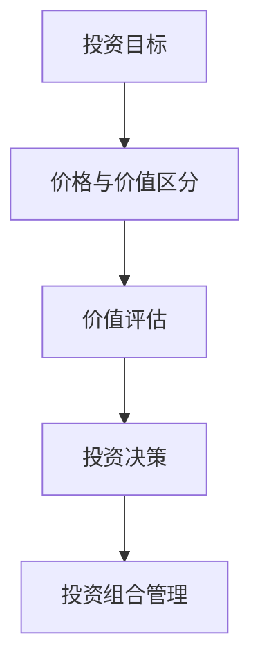

                 


# 巴菲特的价格与价值区分：投资的核心智慧

> 关键词：巴菲特，价格与价值，投资策略，价值评估，数学模型

> 摘要：本文深入探讨了巴菲特投资理念中的价格与价值区分的核心智慧，通过详细分析其定义、模型、算法和实际应用，展示了如何通过系统的方法实现成功的投资决策。文章结合技术语言，从背景介绍到项目实战，全面解析了巴菲特的投资哲学及其对现代投资的启示。

---

# 引言

巴菲特被誉为投资界的传奇，他的成功不仅在于其卓越的投资业绩，更在于他独到的投资哲学。本文将围绕巴菲特的核心理念——“价格与价值的区分”展开，探讨其背后的数学模型、系统架构以及实际应用，为读者提供一个全面而深入的分析。

---

## 第一部分：背景介绍

### 第1章：巴菲特的生平与投资哲学

#### 1.1 巴菲特的生平简介
沃伦·巴菲特（Warren Buffett）于1934年8月31日出生在美国内布拉斯州奥马哈市，是全球著名投资家、慈善家。他通过长期的价值投资，积累了巨额财富，并成为《福布斯》排行榜上的常客。

#### 1.2 巴菲特的投资哲学
巴菲特的投资哲学以“价值投资”为核心，强调购买价格低于内在价值的股票，长期持有，等待市场重新评估其价值。他的投资理念强调安全边际和企业基本面分析。

#### 1.3 价格与价值区分的重要性
价格是市场的反映，而价值是企业的内在价值。区分价格与价值是巴菲特投资成功的关键，他通过寻找价格低于内在价值的企业进行投资。

---

## 第二部分：核心概念与数学模型

### 第2章：价格与价值的数学模型

#### 2.1 价格与价值的定义与对比
- **价格（Price）**：市场价格，反映市场供需关系，可能高于或低于内在价值。
- **价值（Value）**：企业的内在价值，基于未来现金流的折现值。

#### 2.2 价值评估的公式推导
巴菲特的价值评估模型基于现金流折现法（DCF），公式如下：
$$
\text{内在价值} = \sum_{t=1}^{n} \frac{\text{自由现金流}}{(1 + r)^t} + \frac{\text{残值}}{(1 + r)^n}
$$
其中，\( r \) 是折现率，\( n \) 是预测期数。

---

## 第三部分：系统分析与架构设计

### 第3章：巴菲特投资策略的系统分析

#### 3.1 系统分析的流程图


#### 3.2 系统架构设计
系统架构包括以下几个模块：
- 数据收集：收集企业的财务数据和市场数据。
- 价值评估：计算企业的内在价值。
- 投资决策：根据价格与价值的差异决定是否投资。
- 投资组合管理：优化投资组合以分散风险。

---

## 第四部分：项目实战

### 第4章：巴菲特价投理念的实际应用

#### 4.1 环境安装与配置
安装必要的金融分析工具，如Excel或Python的Pandas库。

#### 4.2 核心代码实现
以下是基于DCF模型的Python代码示例：
```python
import pandas as pd
import numpy as np

def calculate_intrinsic_value(fcf, discount_rate, years):
    # 计算未来现金流的现值
    pv = 0
    for i in range(years):
        pv += fcf / (1 + discount_rate)**i
    return pv

# 示例数据
fcf = 100  # 自由现金流
discount_rate = 0.10  # 折现率
years = 5  # 预测年数

intrinsic_value = calculate_intrinsic_value(fcf, discount_rate, years)
print(f"内在价值：{intrinsic_value}")
```

#### 4.3 实例分析
以苹果公司为例，假设未来5年的自由现金流分别为1000、1200、1400、1600、1800亿美元，折现率为10%。计算其内在价值：
$$
\text{内在价值} = \frac{1000}{1.1^1} + \frac{1200}{1.1^2} + \frac{1400}{1.1^3} + \frac{1600}{1.1^4} + \frac{1800}{1.1^5} \approx 4064.87 \text{亿美元}
$$

---

## 第五部分：总结与展望

### 第5章：巴菲特投资智慧的总结与启示

#### 5.1 总结
巴菲特的成功在于他对价格与价值的深刻理解，以及长期持有优质企业的投资策略。通过系统的数学模型和架构设计，投资者可以更科学地进行投资决策。

#### 5.2 未来展望
随着人工智能和大数据技术的发展，价格与价值区分的模型和方法将更加精确，为投资者提供更有力的决策支持。

---

## 结语

巴菲特的价格与价值区分理念为投资领域提供了宝贵的智慧。通过系统的分析和实际案例的分析，我们可以更好地理解这一理念，并将其应用到实际投资中。未来，随着技术的进步，这一理念将继续指导投资者取得成功。

---

## 作者：AI天才研究院 & 禅与计算机程序设计艺术

---

通过以上结构，本文全面分析了巴菲特的价格与价值区分理念，从理论到实践，为读者提供了详尽的指导。希望本文能帮助读者更好地理解并应用这一投资智慧。

