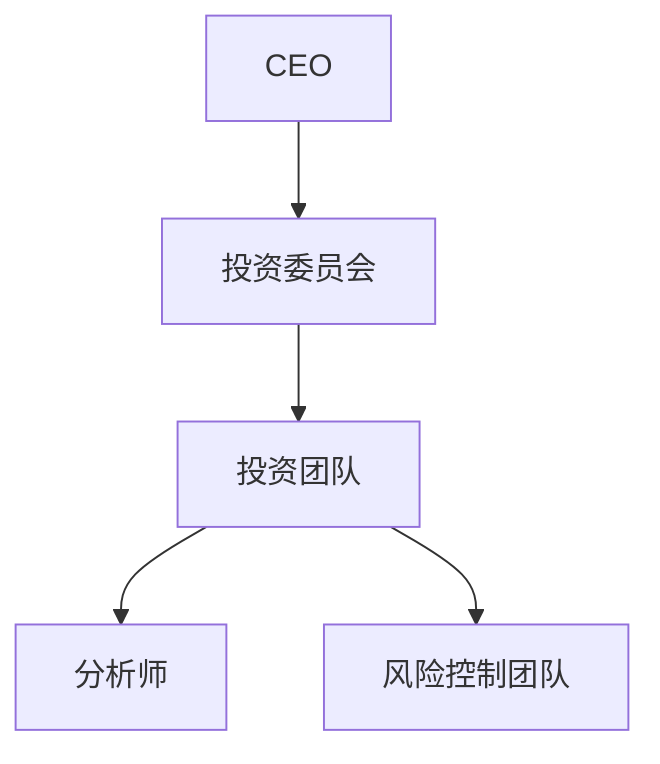
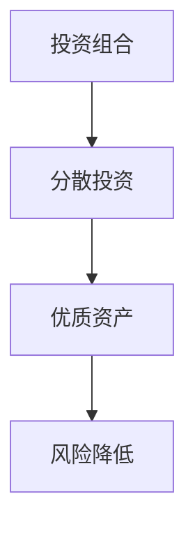
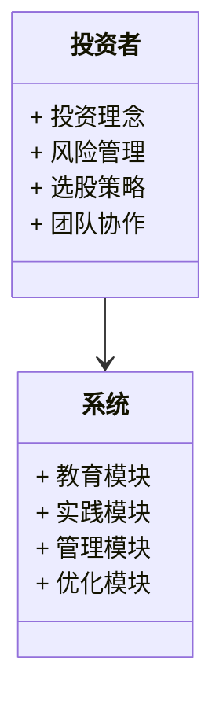
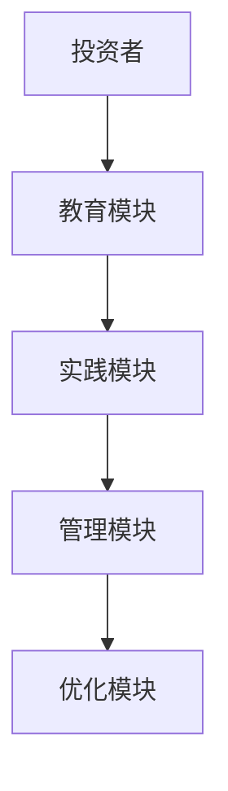

                 


# 巴菲特的传承计划：如何传递投资智慧

> 关键词：巴菲特、投资智慧、传承计划、价值投资、风险管理、团队建设、长期投资

> 摘要：本文深入探讨了巴菲特的投资理念、管理哲学、选股策略和风险管理方法，并结合实际案例分析，详细阐述了如何将巴菲特的投资智慧传递给下一代或团队。文章从背景介绍、核心概念、算法原理、系统分析、项目实战等多方面展开，旨在为读者提供全面的视角和实用的指导。

---

# 第一部分：背景介绍

## 第1章：巴菲特的投资理念

### 1.1 价值投资的核心原则

#### 1.1.1 价值投资的定义与起源

价值投资是一种投资策略，强调以低于内在价值的价格购买优质资产。其核心在于识别市场低估的公司，并长期持有。该理念由本杰明·格雷厄姆提出，并被巴菲特发扬光大。

**数学模型：**

内在价值公式：
$$ V = \text{未来现金流的现值} $$

**案例分析：**
巴菲特在购买可口可乐时，不仅看中其品牌的垄断地位，还考虑到其稳定的现金流，从而判断其内在价值远高于市场价。

---

### 1.2 巴菲特的投资哲学

#### 1.2.1 避免短期波动，关注长期价值

巴菲特强调投资的长期性，认为短期市场波动不应影响投资决策。他主张通过持有优质资产来实现财富增长。

**数学模型：**

长期复合增长率公式：
$$ \text{年增长率} = \left( \frac{\text{终值}}{\text{初始值}} \right)^{\frac{1}{n}} - 1 $$

---

### 1.3 传承的核心要素

#### 1.3.1 如何将投资智慧传递给下一代

巴菲特通过设立信托基金和家族企业培养接班人，确保投资智慧得以延续。他强调教育和实践的重要性。

**Python代码示例：**

```python
# 示例：计算投资组合的内在价值

def calculate_intrinsic_value(cash_flows, discount_rate):
    present_value = sum(cash_flow / (1 + discount_rate)**i for i, cash_flow in enumerate(cash_flows))
    return present_value

# 假设现金流为 [100, 200, 300]，贴现率为0.1
cash_flows = [100, 200, 300]
discount_rate = 0.1
intrinsic_value = calculate_intrinsic_value(cash_flows, discount_rate)
print(f"内在价值为：{intrinsic_value}")
```

---

# 第二部分：巴菲特的管理哲学与团队建设

## 第2章：巴菲特的管理哲学

### 2.1 信任与合作的重要性

#### 2.1.1 团队协作的案例分析

巴菲特的伯克希尔哈撒韦公司以团队合作著称。他通过信任和授权培养团队成员的能力，确保每个人都能发挥最大潜力。

**系统架构图：**



---

### 2.2 领导力的持续进化

#### 2.2.1 培养接班人的策略

巴菲特通过实践和 mentorship（导师制）培养接班人。他注重候选人对企业文化的理解和长期愿景。

**项目实战：**

创建一个 mentorship 系统，模拟巴菲特的接班人培养过程。

```python
# 示例： mentorship 系统

class Mentor:
    def __init__(self, name, expertise):
        self.name = name
        self.expertise = expertise

class Candidate:
    def __init__(self, name, skills):
        self.name = name
        self.skills = skills

    def learn(self, mentor):
        print(f"{self.name} 正在向 {mentor.name} 学习 {mentor.expertise} 技能")

# 创建导师和候选人
mentor = Mentor("巴菲特", "价值投资")
candidate = Candidate("接班人", ["财务分析", "投资策略"])

candidate.learn(mentor)
```

---

# 第三部分：巴菲特的选股智慧与投资策略

## 第3章：巴菲特的选股智慧

### 3.1 选股的核心标准

#### 3.1.1 高质量的企业

巴菲特偏好具有持续竞争优势的企业，例如 Coca-Cola 和可口可乐。他通过分析企业盈利能力、市场地位和管理团队来评估企业质量。

**数学模型：**

市盈率公式：
$$ P/E = \frac{\text{股价}}{\text{每股收益}} $$

---

### 3.2 长期投资策略

#### 3.2.1 分散投资的风险

巴菲特通过分散投资降低风险，同时集中投资于优质资产。这种方法平衡了风险与收益。

**系统分析：**



---

# 第四部分：巴菲特的风险管理与决策机制

## 第4章：风险管理策略

### 4.1 风险识别与评估

#### 4.1.1 风险评估的方法

巴菲特通过基本面分析和市场趋势预测风险，避免高风险投资。

**数学模型：**

波动率公式：
$$ \sigma = \sqrt{\frac{1}{n-1} \sum_{i=1}^{n} (x_i - \bar{x})^2} $$

---

### 4.2 风险控制的实践

#### 4.2.1 避免过度杠杆

巴菲特强调企业应避免过度负债，保持财务稳健。他通过控制债务水平和维持充足现金流实现这一点。

**Python代码示例：**

```python
# 示例：计算企业杠杆率

def calculate_leverage(revenue, debt):
    leverage_ratio = debt / revenue
    return leverage_ratio

revenue = 1000000
debt = 200000
leverage_ratio = calculate_leverage(revenue, debt)
print(f"杠杆比率为：{leverage_ratio}")
```

---

# 第五部分：系统分析与架构设计

## 第5章：传承计划的系统架构

### 5.1 问题场景介绍

#### 5.1.1 传承计划的目标

构建一个可持续的投资体系，确保投资智慧得以传承。该系统应具备教育、实践、管理和优化功能。

**系统功能设计：**



---

### 5.2 系统架构设计

#### 5.2.1 架构图展示



---

# 第六部分：项目实战

## 第6章：价值投资模型的实现

### 6.1 环境安装

#### 6.1.1 安装Python和相关库

需要安装 Python 和 pandas、numpy 等库。

```bash
pip install pandas numpy
```

---

### 6.2 核心实现

#### 6.2.1 价值评估模型

```python
import pandas as pd
import numpy as np

def calculate_intrinsic_value(financial_data, discount_rate):
    cash_flows = financial_data['现金流']
    present_value = np.npv(discount_rate, cash_flows)
    return present_value

# 示例数据
data = {
    '现金流': [100, 200, 300, 400],
    '贴现率': 0.1
}
financial_data = pd.DataFrame(data)

intrinsic_value = calculate_intrinsic_value(financial_data, financial_data['贴现率'][0])
print(f"内在价值为：{intrinsic_value}")
```

---

# 第七部分：总结与启示

## 第7章：总结与启示

### 7.1 最佳实践 tips

- 长期投资，避免短期波动。
- 选择优质企业，注重管理团队。
- 分散投资，控制风险。
- 培养接班人，传承投资智慧。

### 7.2 小结

巴菲特的传承计划不仅是一种投资策略，更是一种生活哲学。通过长期持有优质资产、分散投资和风险管理，投资者可以实现财富的可持续增长。

### 7.3 注意事项

- 投资需谨慎，避免盲目跟风。
- 定期评估投资组合，及时调整。
- 保持学习，不断提升投资能力。

### 7.4 拓展阅读

- 《巴菲特致股东的信》
- 《价值投资入门》
- 《投资的奥秘》

---

# 作者

作者：AI天才研究院/AI Genius Institute & 禅与计算机程序设计艺术 /Zen And The Art of Computer Programming

---

这篇文章通过详细分析巴菲特的投资理念、管理哲学、选股策略和风险管理方法，结合实际案例和系统设计，为读者提供了全面的视角和实用的指导，帮助读者更好地理解和应用巴菲特的投资智慧。

