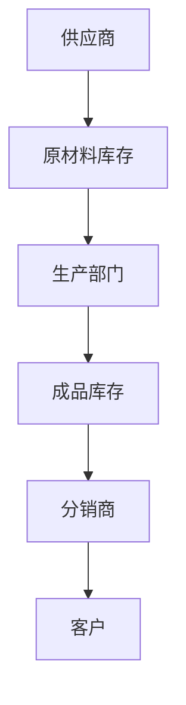
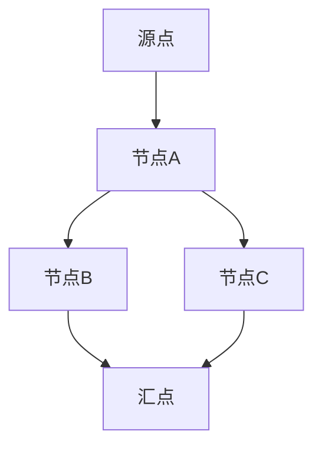
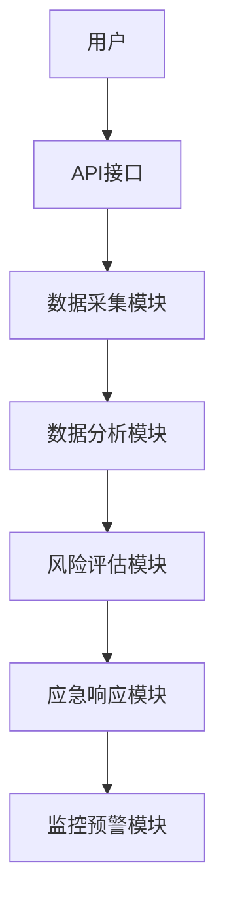

                 

# 巴菲特的供应链韧性分析：全球化挑战下的应对之策

## 关键词：供应链韧性，巴菲特，全球化挑战，应对策略，供应链管理

## 摘要：  
在全球化不断深化的今天，供应链的韧性成为了企业生存和发展的关键因素。本文从巴菲特的投资理念出发，分析了供应链韧性在应对全球化挑战中的重要性，并提出了具体的应对策略。通过详细的技术分析和案例研究，本文探讨了如何利用供应链韧性分析的方法来优化企业的供应链管理，确保企业在复杂多变的全球化环境中保持竞争力。

---

## 第一部分: 供应链韧性分析的背景与核心概念

### 第1章: 供应链韧性概述

#### 1.1 供应链韧性的定义与内涵  
供应链韧性是指在面对突发事件、市场波动或其他不确定性时，供应链维持稳定运营和快速恢复的能力。它不仅包括应对危机的能力，还包括在正常情况下优化供应链效率的能力。供应链韧性是企业在全球化市场中保持竞争力的关键因素之一。  

**核心要素：**  
1. **弹性**：供应链在需求波动或供应中断时的适应能力。  
2. **冗余**：供应链中备用资源和能力的储备。  
3. **可视性**：对供应链各环节的实时监控能力。  
4. **快速响应能力**：在出现问题时迅速采取行动的能力。  

#### 1.2 全球化挑战下的供应链问题  
全球化使得供应链更加复杂，但也带来了更多的风险。近年来，新冠疫情、地缘政治冲突和自然灾害等事件频发，导致供应链中断的问题日益突出。企业需要具备更强的供应链韧性，以应对这些挑战。  

**典型案例：**  
- 2020年新冠疫情导致全球供应链中断，许多企业面临原材料短缺和物流延迟的问题。  
- 地缘政治冲突（如俄乌战争）导致能源和原材料价格上涨，进一步影响了全球供应链的稳定性。  

#### 1.3 巴菲特投资理念与供应链分析的结合  
巴菲特以其独特的价值投资理念闻名，他注重企业的基本面分析和长期盈利能力。在供应链分析中，巴菲特关注企业的供应链效率、成本控制和风险抵御能力。他强调企业应具备强大的供应链韧性，以应对市场波动和不确定性。  

---

## 第二部分: 供应链韧性的核心概念与联系

### 第2章: 供应链韧性的核心要素

#### 2.1 供应链弹性与冗余  
供应链弹性是指在面对需求波动或供应中断时，供应链能够灵活调整的能力。冗余则是指供应链中备用资源的储备，以应对突发事件。  

**对比分析：**  
| **弹性**       | **冗余**       |  
|-----------------|----------------|  
| 优点           | 可以快速响应需求变化 | 可以在突发事件中提供备用资源 |  
| 缺点           | 可能导致资源浪费 | 增加成本 |  
| 应用场景       | 高需求波动的市场 | 突发事件频发的市场 |  

#### 2.2 供应链可视性与快速响应能力  
供应链可视性是指企业对供应链各环节的实时监控能力，包括供应商、生产过程、物流和库存等。快速响应能力则是指企业在发现问题时能够迅速采取行动的能力。  

**Mermaid 图：供应链实体关系图**  

---

## 第三部分: 供应链韧性分析的算法原理

### 第3章: 网络流算法在供应链韧性分析中的应用

#### 3.1 网络流算法概述  
网络流算法是一种用于优化供应链网络流量的算法，常用于解决供应链中的瓶颈问题。  

**Mermaid 图：网络流算法流程图**  

#### 3.2 线性规划模型  
线性规划是一种优化方法，常用于供应链网络的优化。以下是线性规划模型的数学表达式：  

$$  
\text{最大化/最小化} \quad \sum_{i=1}^{n} c_i x_i  
$$  
$$  
\text{满足} \quad \sum_{i=1}^{n} a_{ij} x_i = b_j \quad \forall j \in J  
$$  
$$  
x_i \geq 0 \quad \forall i \in I  
$$  

---

## 第四部分: 供应链韧性分析的系统架构设计

### 第4章: 供应链韧性分析系统的架构

#### 4.1 系统功能设计  
供应链韧性分析系统的主要功能包括：  
1. **风险评估**：识别供应链中的潜在风险。  
2. **应急响应**：制定应对突发事件的策略。  
3. **监控预警**：实时监控供应链状态并发出预警。  

#### 4.2 系统架构设计  
供应链韧性分析系统的架构设计如下：  

---

## 第五部分: 项目实战：供应链韧性分析的案例研究

### 第5章: 某制造企业的供应链韧性分析

#### 5.1 项目背景  
某制造企业在全球范围内采购原材料并进行生产。由于原材料供应商集中，企业面临供应链中断的风险。  

#### 5.2 项目实施  
1. **数据采集**：收集供应商、生产过程和物流数据。  
2. **风险评估**：识别关键供应商和潜在风险点。  
3. **优化方案**：引入备用供应商，优化库存管理。  

#### 5.3 实验结果  
通过优化供应链，企业的供应链韧性显著提高，生产中断的风险降低，成本也有所下降。  

---

## 结论与展望

### 第6章: 结论与展望

#### 6.1 结论  
供应链韧性是企业在全球化市场中保持竞争力的关键因素。本文从巴菲特的投资理念出发，分析了供应链韧性的核心要素和应对策略，并提出了具体的优化方法。  

#### 6.2 展望  
未来，随着技术的进步，供应链韧性分析将更加智能化和数据驱动。企业应充分利用大数据、人工智能等技术，进一步提升供应链的弹性和可视性。  

---

## 注意事项  
1. **数据隐私**：在供应链分析中，企业需要保护供应商和客户的隐私数据。  
2. **模型局限性**：供应链韧性分析模型可能存在一定的局限性，需结合实际情况进行调整。  

## 拓展阅读  
1. 《供应链风险管理》  
2. 《巴菲特投资策略解析》  
3. 《全球化与供应链管理》  

---

## 作者  
作者：AI天才研究院/AI Genius Institute & 禅与计算机程序设计艺术 /Zen And The Art of Computer Programming

