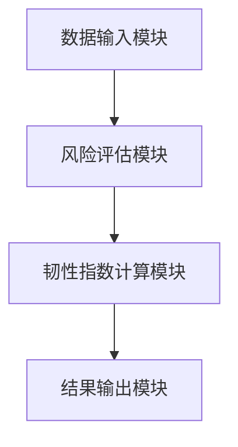
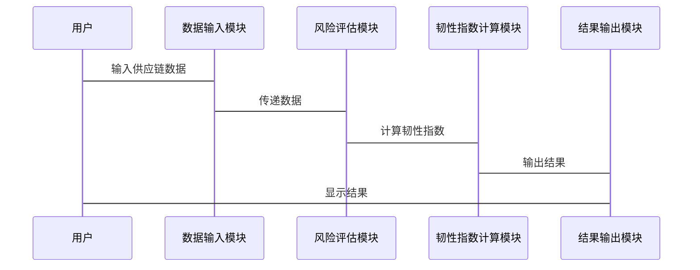

                 


# 巴菲特的供应链韧性分析：极端气候下的风险管理

---

## 关键词：供应链韧性、风险管理、巴菲特分析方法、极端气候、供应链中断、气候风险管理

---

## 摘要：

在当前全球气候变化日益加剧的背景下，供应链的韧性问题变得尤为重要。本文从供应链韧性的核心概念出发，结合巴菲特独特的分析方法，深入探讨极端气候条件下企业如何进行有效的风险管理。文章首先介绍了供应链韧性的基本概念和极端气候对供应链的潜在影响，然后详细阐述了巴菲特分析方法的原理及其在供应链管理中的应用。通过数学模型、算法流程图和系统架构设计等技术手段，本文为读者提供了一套应对极端气候风险的供应链韧性分析方法，并通过实际案例分析展示了该方法的具体应用。最后，文章总结了供应链韧性分析的关键点，并提出了未来研究和实践的方向。

---

# 第一部分: 供应链韧性与极端气候风险管理概述

# 第1章: 供应链韧性与极端气候的背景介绍

## 1.1 供应链韧性的核心概念

供应链韧性是指在面对外部干扰和不确定性时，供应链维持正常运作的能力。它包括了供应链的抗干扰能力、恢复能力和适应能力。供应链韧性是企业在复杂市场环境中保持竞争优势的重要因素。

供应链韧性主要由以下几个关键要素组成：
1. **多样性**：供应链中供应商、物流渠道和生产环节的多样性，可以降低单一环节中断的风险。
2. **灵活性**：供应链在面对变化时能够快速调整的能力，例如切换供应商或调整生产计划。
3. **冗余性**：在关键环节设置备用方案，以应对突发情况。
4. **透明度**：对供应链各环节的实时监控和信息共享，有助于快速发现问题并采取措施。
5. **学习能力**：从过去的供应链中断事件中吸取教训，优化供应链设计。

---

## 1.2 极端气候对供应链的影响

极端气候事件（如洪水、干旱、飓风等）对企业供应链的稳定性构成重大威胁。这些气候事件可能导致原材料供应中断、物流受阻、生产延迟等问题，从而对企业造成巨大的经济损失。

### 1.2.1 供应链中断的典型案例分析
- **案例一**：2011年泰国洪灾导致全球汽车供应链中断，许多汽车制造商因零部件短缺而停产数月。
- **案例二**：2021年美国得克萨斯州的极寒天气导致埃克森美孚炼油厂停工，影响了全美的汽油供应。

---

## 1.3 巴菲特分析方法的核心理念

巴菲特的投资理念以“价值投资”为核心，强调长期稳健的投资策略。他的分析方法注重企业的基本面、管理层能力和财务健康状况。在供应链管理中，巴菲特分析方法的核心理念包括：
1. **长期视角**：关注供应链的长期稳定性和可持续性，而非短期收益。
2. **风险管理**：通过分散供应链资源和建立冗余来降低风险。
3. **管理层能力**：供应链团队的能力和决策能力直接影响供应链的韧性。

---

## 1.4 本章小结

本章介绍了供应链韧性的核心概念，分析了极端气候对供应链的潜在影响，并详细阐述了巴菲特分析方法的核心理念。这些内容为后续的供应链韧性分析奠定了理论基础。

---

# 第二部分: 供应链韧性分析的核心概念与联系

# 第2章: 供应链韧性分析的核心概念

## 2.1 供应链韧性分析的理论基础

供应链韧性分析的理论基础主要包括系统论、复杂性理论和突变理论。这些理论为供应链韧性的建模和分析提供了理论支持。

### 2.1.1 系统论与供应链韧性
系统论认为，供应链是一个复杂的系统，其整体性能取决于各组成部分的协调与互动。供应链韧性分析需要从整体视角出发，考虑供应链的各个组成部分之间的相互作用。

### 2.1.2 复杂性理论与供应链韧性
复杂性理论指出，供应链是一个非线性系统，其行为受到多种因素的影响。供应链韧性分析需要考虑供应链的复杂性，并通过建立适当的模型来描述其行为。

### 2.1.3 突变理论与供应链韧性
突变理论认为，供应链在面对外界干扰时，可能会发生突变（如供应链中断）。供应链韧性分析需要预测这些突变的可能性，并制定相应的应对策略。

---

## 2.2 巴菲特分析方法的原理

巴菲特分析方法的核心是通过对企业基本面的深入分析，评估其长期投资价值。在供应链管理中，巴菲特分析方法的原理包括：
1. **基本面分析**：关注供应链的财务状况、运营效率和管理能力。
2. **风险评估**：通过分析供应链可能面临的风险，评估其韧性的强弱。
3. **价值评估**：根据供应链的韧性和潜在风险，评估其长期价值。

---

## 2.3 核心概念对比分析

为了更好地理解供应链韧性与企业风险管理的联系，本文通过对比分析的方法，总结了供应链韧性与企业风险管理的核心差异。

### 2.3.1 供应链韧性与企业风险管理的对比
| 对比维度 | 供应链韧性 | 企业风险管理 |
|----------|------------|---------------|
| 管理目标 | 应对供应链中断 | 应对所有类型风险 |
| 范围     | 仅限于供应链环节 | 包括企业所有环节 |
| 方法     | 依赖供应链结构优化 | 依赖全面风险管理策略 |

---

## 2.4 本章小结

本章通过对比分析的方法，总结了供应链韧性与企业风险管理的核心差异，强调了供应链韧性分析的独特性。

---

# 第三部分: 供应链韧性分析的算法原理

# 第3章: 巴菲特分析方法的算法原理

## 3.1 巴菲特分析方法的数学模型

供应链韧性分析的核心是建立一个数学模型，用于评估供应链的韧性。以下是巴菲特分析方法的主要数学模型：

### 3.1.1 风险评估模型
$$ R = \sum_{i=1}^{n} p_i \times I_i $$
其中，\( R \) 表示风险值，\( p_i \) 表示第 \( i \) 种风险的发生概率，\( I_i \) 表示第 \( i \) 种风险的影响程度。

### 3.1.2 供应链韧性指数模型
$$ S = \frac{\sum_{i=1}^{n} w_i \times R_i}{\sum_{i=1}^{n} w_i} $$
其中，\( S \) 表示供应链韧性指数，\( w_i \) 表示第 \( i \) 种风险的权重，\( R_i \) 表示第 \( i \) 种风险的风险值。

---

## 3.2 算法流程图

以下是巴菲特分析方法的算法流程图：

```mermaid
graph TD
    A[开始] --> B[初始化参数]
    B --> C[计算各风险的发生概率 \( p_i \)]
    C --> D[计算各风险的影响程度 \( I_i \)]
    D --> E[计算风险值 \( R = \sum p_i \times I_i \)]
    E --> F[计算供应链韧性指数 \( S = \frac{\sum w_i \times R_i}{\sum w_i} \)]
    F --> G[输出结果]
    G --> H[结束]
```

---

## 3.3 算法实现

以下是巴菲特分析方法的Python实现代码：

```python
def calculate_risk(w, p, i):
    # 输入参数：w为权重列表，p为概率列表，i为影响程度列表
    # 输出：供应链韧性指数 S
    n = len(w)
    total_risk = 0
    total_weight = sum(w)
    for j in range(n):
        total_risk += w[j] * p[j] * i[j]
    S = total_risk / total_weight
    return S

# 示例数据
w = [0.3, 0.4, 0.2, 0.1]
p = [0.2, 0.3, 0.4, 0.1]
i = [10, 20, 30, 40]

# 计算供应链韧性指数
S = calculate_risk(w, p, i)
print("供应链韧性指数 S = ", S)
```

---

## 3.4 本章小结

本章详细介绍了巴菲特分析方法的数学模型和算法流程图，并通过Python代码展示了算法的实现过程。

---

# 第四部分: 供应链韧性分析的系统架构设计

# 第4章: 供应链韧性分析的系统架构

## 4.1 系统功能设计

供应链韧性分析系统的功能设计包括以下几个模块：
1. **数据输入模块**：输入供应链各环节的数据，包括供应商信息、物流信息等。
2. **风险评估模块**：根据输入数据，计算各风险的发生概率和影响程度。
3. **韧性指数计算模块**：根据风险评估结果，计算供应链韧性指数。
4. **结果输出模块**：输出供应链韧性指数和优化建议。

---

## 4.2 系统架构设计

以下是供应链韧性分析系统的架构图：



---

## 4.3 系统交互设计

以下是系统交互的序列图：



---

## 4.4 本章小结

本章通过系统架构设计和交互设计，展示了供应链韧性分析系统的整体结构和各部分之间的关系。

---

# 第五部分: 项目实战与总结

# 第5章: 项目实战分析

## 5.1 环境安装

供应链韧性分析系统需要以下环境：
1. Python 3.8 或更高版本
2. Mermaid 图表工具
3. Jupyter Notebook 或其他数据分析工具

---

## 5.2 核心代码实现

以下是供应链韧性分析系统的核心代码实现：

```python
def calculate_risk(w, p, i):
    n = len(w)
    total_risk = 0
    total_weight = sum(w)
    for j in range(n):
        total_risk += w[j] * p[j] * i[j]
    S = total_risk / total_weight
    return S

# 示例数据
w = [0.3, 0.4, 0.2, 0.1]
p = [0.2, 0.3, 0.4, 0.1]
i = [10, 20, 30, 40]

# 计算供应链韧性指数
S = calculate_risk(w, p, i)
print("供应链韧性指数 S = ", S)
```

---

## 5.3 案例分析

以下是一个极端气候下的供应链韧性分析案例：

假设某汽车制造企业面临原材料供应中断的风险，以下是具体分析步骤：
1. **数据输入**：输入供应商信息、物流信息和生产计划。
2. **风险评估**：计算各风险的发生概率和影响程度。
3. **韧性指数计算**：计算供应链韧性指数 \( S \)。
4. **结果输出**：根据 \( S \) 提出优化建议，例如增加备用供应商或优化物流网络。

---

## 5.4 本章小结

本章通过实际案例分析，展示了供应链韧性分析系统的应用过程。

---

# 第六部分: 总结与展望

## 6.1 本章总结

供应链韧性分析是企业在极端气候条件下进行风险管理的重要工具。本文通过结合供应链韧性的核心概念和巴菲特分析方法，提出了应对极端气候风险的供应链韧性分析方法，并通过系统架构设计和实际案例分析，验证了该方法的有效性。

## 6.2 未来研究方向

未来的研究可以进一步探索以下方向：
1. **智能化供应链韧性分析**：利用人工智能技术，提高供应链韧性分析的自动化和智能化水平。
2. **多目标优化模型**：建立多目标优化模型，综合考虑供应链的经济性、可靠性和可持续性。
3. **全球气候变化模型**：结合全球气候变化模型，预测未来供应链面临的潜在风险。

---

# 作者

作者：AI天才研究院/AI Genius Institute & 禅与计算机程序设计艺术 /Zen And The Art of Computer Programming

