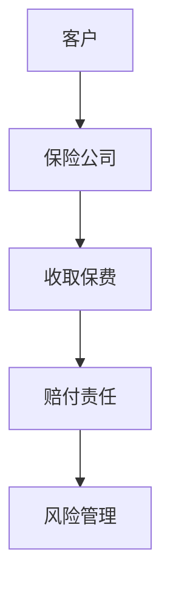
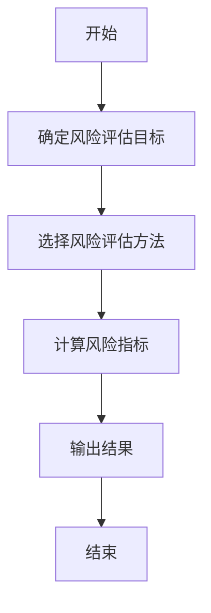
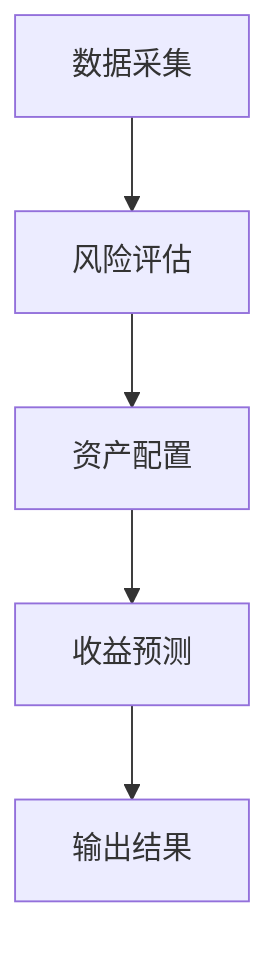
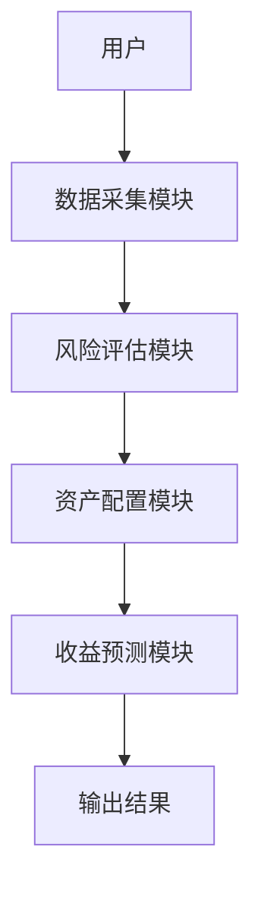

                 


# 巴菲特的保险业投资逻辑：长期资本的来源

> **关键词**：巴菲特、保险业投资、长期资本、浮存金、风险管理、价值投资

> **摘要**：本文深入分析了巴菲特在保险业的投资逻辑，重点探讨了他如何通过保险浮存金构建长期资本来源。文章从保险业的特殊性入手，详细阐述了巴菲特的投资理念、浮存金的管理策略、风险管理方法以及长期资本的构建过程。通过数学模型和系统架构的分析，揭示了巴菲特保险投资的成功秘诀，并提供了实际案例和最佳实践的总结。

---

# 第1章 巴菲特的投资理念与保险业的特殊性

## 1.1 巴菲特的投资理念

### 1.1.1 价值投资的核心思想

巴菲特的价值投资理念是基于“以合理的价格购买优秀的公司”。他强调长期投资，寻找那些具有持续竞争优势、良好管理团队和稳定现金流的企业。这种投资策略的核心在于寻找市场价格低于内在价值的公司。

**关键公式**：
$$
\text{内在价值} = \text{未来现金流的现值}
$$

### 1.1.2 安全边际的概念与重要性

安全边际是指股票市场价格与其内在价值之间的差距。巴菲特认为，安全边际的存在可以降低投资的风险，确保在市场价格波动时，投资者不会因为短期波动而遭受损失。

**关键公式**：
$$
\text{安全边际} = \text{内在价值} - \text{市场价格}
$$

### 1.1.3 巴菲特投资的长期视角

巴菲特的投资理念强调长期视角，他更关注企业的长期盈利能力，而不是短期市场波动。他认为，市场先生是企业的仆人，而不是主人。

---

## 1.2 保险业的特殊性

### 1.2.1 保险业务模式

保险业的基本业务模式是通过收取保费来承担未来的赔付责任。保险公司的核心竞争力在于风险管理能力、资本实力和客户服务能力。

**流程图**：


### 1.2.2 保险资金的特点

保险资金具有规模大、期限长、稳定性高的特点。保险公司通过收取保费形成浮存金，这部分资金可以用于长期投资。

### 1.2.3 保险行业的周期性与波动性

保险行业具有一定的周期性，受经济波动和政策影响较大。然而，巴菲特认为，优秀的保险公司可以通过长期投资实现价值增长。

---

## 1.3 巴菲特与保险业的渊源

### 1.3.1 巴菲特早期的保险投资案例

巴菲特早期通过投资美国运通公司进入保险业，他通过购买可转换优先股的方式，以低于内在价值的价格投资，最终获得了丰厚的回报。

### 1.3.2 伯克希尔 Hathaway 的保险业务发展

伯克希尔 Hathaway 的保险业务以承保特殊风险为主，通过收取高额保费，形成稳定的浮存金来源。这些资金被用于长期投资，成为巴菲特构建长期资本的重要来源。

### 1.3.3 巴菲特对保险行业的独特见解

巴菲特认为，保险业的核心竞争力在于风险管理能力和资本实力。优秀的保险公司可以通过长期投资实现价值增长。

---

# 第2章 保险浮存金的来源与管理

## 2.1 保险浮存金的定义与特点

### 2.1.1 保险浮存金的定义

保险浮存金是指保险公司收取的保费与其未来赔付责任之间的差额部分。这部分资金可以用于投资，形成长期资本。

### 2.1.2 浮存金的形成机制

浮存金的形成主要依赖于保险公司的承保能力和资本实力。通过收取保费，保险公司形成了一笔暂时不需要赔付的资金。

### 2.1.3 浮存金的规模与稳定性

浮存金的规模取决于保险公司的业务规模和赔付率。优秀的保险公司可以通过优化业务结构，提高浮存金的稳定性。

---

## 2.2 保险浮存金的来源分析

### 2.2.1 保险业务的现金流分析

保险业务的现金流主要包括保费收入和赔付支出。通过合理安排保费和赔付的时间差，保险公司可以形成稳定的浮存金。

### 2.2.2 浮存金的期限结构

浮存金的期限结构取决于保险产品的种类。长期保险产品的浮存金期限较长，适合用于长期投资。

### 2.2.3 浮存金的波动性与稳定性

浮存金的波动性受到保险行业周期性的影响。优秀的保险公司可以通过多元化业务和风险管理，提高浮存金的稳定性。

---

## 2.3 保险浮存金的管理策略

### 2.3.1 浮存金的投资目标与原则

浮存金的投资目标是实现长期稳定收益。投资原则包括分散投资、注重安全性和追求长期收益。

### 2.3.2 浮存金的风险管理策略

风险管理是浮存金管理的核心。保险公司需要通过合理的资产配置和风险控制，降低投资风险。

### 2.3.3 浮存金的长期收益分析

通过长期投资，浮存金可以实现超越市场平均收益的回报。巴菲特通过投资优质股票和固定收益产品，实现了浮存金的长期增值。

---

# 第3章 巴菲特的保险投资策略

## 3.1 保险投资的长期视角

### 3.1.1 长期资本的定义与特点

长期资本是指能够持续稳定增长的资本。巴菲特通过浮存金投资优质资产，构建长期资本。

### 3.1.2 保险浮存金作为长期资本的来源

浮存金是巴菲特构建长期资本的重要来源。他通过投资优质股票和固定收益产品，实现浮存金的长期增值。

### 3.1.3 长期资本的稳定性与安全性

长期资本的稳定性依赖于优质资产的投资和严格的风险管理。巴菲特通过投资具有持续竞争优势的企业，确保长期资本的安全性。

---

## 3.2 保险投资的风险管理

### 3.2.1 风险管理的核心理念

风险管理是保险投资的核心。巴菲特强调分散投资和严格的风险控制。

### 3.2.2 保险投资中的风险类型

保险投资面临市场风险、信用风险和流动性风险。通过合理的资产配置和风险分散，可以降低投资风险。

### 3.2.3 风险管理的具体措施

风险管理的具体措施包括分散投资、严格筛选投资标的和定期评估投资组合的风险。

---

## 3.3 巴菲特的保险投资实践

### 3.3.1 伯克希尔 Hathaway 的保险投资案例

伯克希尔 Hathaway 通过投资优质股票和固定收益产品，实现了浮存金的长期增值。例如，投资苹果公司股票和美国国债，取得了显著的收益。

### 3.3.2 保险投资的成功关键

巴菲特保险投资成功的关键在于长期视角、优质资产选择和严格的风险管理。

### 3.3.3 保险投资的未来展望

未来，保险投资将继续依赖于长期资本的构建和风险管理能力的提升。随着保险行业的不断发展，浮存金的管理将更加重要。

---

# 第4章 保险业投资的数学模型与算法分析

## 4.1 保险浮存金的数学模型

### 4.1.1 浮存金的现金流模型

浮存金的现金流模型可以通过以下公式计算：
$$
\text{浮存金} = \text{保费收入} - \text{赔付支出}
$$

### 4.1.2 浮存金的收益与风险模型

浮存金的收益与风险模型可以通过资本资产定价模型（CAPM）进行分析：
$$
\text{收益} = r_f + \beta (r_m - r_f)
$$

### 4.1.3 浮存金的资产配置模型

资产配置模型可以通过以下步骤进行：
1. 确定投资目标和风险承受能力。
2. 根据市场情况选择资产类别。
3. 进行资产分配和动态调整。

---

## 4.2 保险投资的风险评估算法

### 4.2.1 风险评估的核心指标

风险评估的核心指标包括波动率、VaR（在险价值）和CVaR（条件在险价值）。

### 4.2.2 风险评估的数学公式

VaR 的计算公式为：
$$
\text{VaR} = \text{损失的分位数}
$$

CVaR 的计算公式为：
$$
\text{CVaR} = \text{VaR 分位数之后的平均损失}
$$

### 4.2.3 风险评估的算法流程图



---

## 4.3 保险投资的收益预测模型

### 4.3.1 收益预测的基本假设

收益预测的基本假设包括市场平均收益、风险溢价和资产类别回报率。

### 4.3.2 收益预测的数学公式

收益预测的数学公式可以通过以下步骤进行：
1. 确定投资组合的资产配置。
2. 计算每种资产的预期收益。
3. 根据权重加总计算投资组合的预期收益。

### 4.3.3 收益预测的案例分析

假设一个保险公司的浮存金为10亿元，投资组合包括60%股票、30%债券和10%现金。股票的预期收益为8%，债券的预期收益为5%，现金的预期收益为2%。投资组合的预期收益为：
$$
0.6 \times 8\% + 0.3 \times 5\% + 0.1 \times 2\% = 6.5\%
$$

---

# 第5章 保险业投资的系统架构与设计方案

## 5.1 保险投资的系统架构

### 5.1.1 系统架构的总体设计

保险投资的系统架构包括数据采集、风险评估、资产配置和收益预测四个模块。

### 5.1.2 系统架构的功能模块划分

- 数据采集模块：负责收集市场数据和公司基本面数据。
- 风险评估模块：负责评估投资组合的风险。
- 资产配置模块：负责制定资产配置策略。
- 收益预测模块：负责预测投资组合的收益。

### 5.1.3 系统架构的交互流程图



---

## 5.2 保险投资的系统设计方案

### 5.2.1 项目介绍

保险投资的系统设计方案旨在通过技术手段优化保险公司的投资流程，提高投资效率和风险管理能力。

### 5.2.2 系统功能设计

- 数据采集功能：实时采集市场数据和公司基本面数据。
- 风险评估功能：通过算法评估投资组合的风险。
- 资产配置功能：根据风险评估结果制定资产配置策略。
- 收益预测功能：根据资产配置结果预测投资组合的收益。

### 5.2.3 系统架构设计



---

## 5.3 保险投资的系统实现

### 5.3.1 环境安装

需要安装Python、Pandas、NumPy、Scikit-learn等工具。

### 5.3.2 核心实现源代码

```python
import pandas as pd
import numpy as np

def calculate VaR(data, confidence_level):
    return np.percentile(data, confidence_level)

data = pd.Series([0.01, 0.02, 0.03, 0.04, 0.05])
VaR = calculate VaR(data, 95)
print(VaR)
```

### 5.3.3 代码应用解读与分析

上述代码通过计算VaR值，评估投资组合的风险。通过调整置信水平，可以得到不同情况下的VaR值。

---

## 5.4 保险投资的系统小结

通过系统架构和设计方案的优化，保险公司可以提高投资效率和风险管理能力，实现长期资本的稳定增长。

---

# 第6章 保险业投资的项目实战

## 6.1 环境安装

需要安装Python、Pandas、NumPy、Matplotlib等工具。

---

## 6.2 核心实现源代码

```python
import pandas as pd
import numpy as np

def calculate_portfolio_return(weights, returns):
    return np.dot(weights, returns)

weights = np.array([0.6, 0.3, 0.1])
returns = np.array([0.08, 0.05, 0.02])

portfolio_return = calculate_portfolio_return(weights, returns)
print(portfolio_return)
```

---

## 6.3 代码应用解读与分析

上述代码通过计算投资组合的预期收益，展示如何利用资产配置实现长期资本的增值。

---

## 6.4 实际案例分析

以伯克希尔 Hathaway 为例，分析其保险投资的成功经验。

---

## 6.5 项目小结

通过实际案例分析和代码实现，展示了保险投资的实践应用和成功经验。

---

# 第7章 总结与展望

## 7.1 总结

本文深入分析了巴菲特在保险业的投资逻辑，重点探讨了他如何通过保险浮存金构建长期资本来源。通过数学模型和系统架构的分析，揭示了巴菲特保险投资的成功秘诀。

## 7.2 展望

未来，保险投资将继续依赖于长期资本的构建和风险管理能力的提升。随着保险行业的不断发展，浮存金的管理将更加重要。

---

# 作者

**作者：AI天才研究院/AI Genius Institute & 禅与计算机程序设计艺术 /Zen And The Art of Computer Programming**

