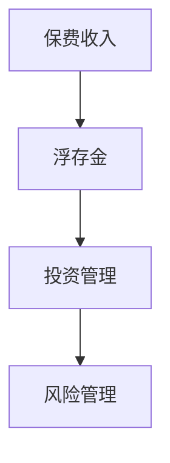

                 


```markdown
# 巴菲特的保险浮存金策略：利用他人的钱投资

## 关键词
保险浮存金，巴菲特，投资策略，低成本资金，长期投资，风险管理

## 摘要
巴菲特的保险浮存金策略是一种独特的投资方法，通过利用保险公司的浮存金作为低成本资金来源，进行长期投资。本文将详细解析这一策略的背景、核心概念、算法原理、系统架构，并通过实际案例展示其应用。文章还将探讨该策略的成功关键，包括风险管理、长期投资和低成本资金的利用。

---

# 第一部分: 巴菲特的保险浮存金策略概述

## 第1章: 保险浮存金的基本概念

### 1.1 保险浮存金的定义
保险浮存金是指保险公司收取的保费与赔付支出之间的差额部分。这部分资金暂时存放在保险公司账户中，用于投资。

#### 1.1.1 保险浮存金的来源
保险浮存金主要来源于保险客户的保费支付和保险公司的赔付支出。当保费收入大于赔付支出时，保险公司会积累一定规模的浮存金。

#### 1.1.2 保险浮存金的特点
1. **低成本**：保险浮存金的资金成本较低，保险公司通常收取较低的管理费用。
2. **稳定性**：由于保险合同的长期性，浮存金的稳定性较高。
3. **规模大**：保险公司通常管理着大量的客户资金，浮存金的规模可以非常庞大。

#### 1.1.3 保险浮存金的分类
1. **普通浮存金**：来源于寿险和非寿险业务的保费收入。
2. **再保险浮存金**：来源于再保险公司收取的再保险保费。

### 1.2 巴菲特与保险浮存金
#### 1.2.1 巴菲特的保险浮存金策略
巴菲特通过收购保险公司，利用浮存金进行长期投资。这种策略的核心在于利用他人的钱（Other People's Money, OPM）进行投资，同时保持较低的资金成本。

#### 1.2.2 巴菲特保险浮存金的运作机制
1. **保费收入**：保险公司通过收取保费获得浮存金。
2. **投资收益**：利用浮存金进行股票、债券等投资，获得投资收益。
3. **赔付支出**：当保险事故发生时，保险公司使用浮存金进行赔付。

#### 1.2.3 巴菲特保险浮存金的成功案例
巴菲特通过收购伯克希尔哈撒韦（Berkshire Hathaway）保险公司，成功实施了浮存金策略。伯克希尔哈撒韦利用浮存金进行长期投资，取得了显著的收益。

---

## 第2章: 保险浮存金在投资中的优势

### 2.1 保险浮存金的成本优势
#### 2.1.1 保险浮存金的低成本特性
保险浮存金的资金成本较低，通常远低于其他融资方式（如贷款或发行债券）的成本。

#### 2.1.2 保险浮存金与传统融资方式的对比
| 融资方式 | 资金成本 | 灵活性 | 风险 |
|----------|----------|--------|------|
| 贷款     | 高       | 低     | 高   |
| 发行债券 | 中       | 低     | 中   |
| 保险浮存金 | 低       | 高     | 低   |

#### 2.1.3 保险浮存金的成本优势对投资的影响
低成本资金使得保险公司能够在投资中获得更高的净收益。通过利用浮存金进行长期投资，保险公司可以实现资产的保值和增值。

### 2.2 保险浮存金的时间价值
#### 2.2.1 时间价值的概念
时间价值是指资金在不同时间点的价值差异。由于资金的时间价值，保险公司可以利用浮存金进行长期投资，获得复利收益。

#### 2.2.2 保险浮存金的时间价值表现
保险浮存金的时间价值表现主要体现在其长期投资的复利效应上。通过长期持有优质资产，保险公司可以获得稳定的收益。

#### 2.2.3 时间价值对投资决策的影响
时间价值是保险浮存金策略的核心要素之一。通过合理规划投资期限，保险公司可以最大化资金的时间价值，实现长期稳定的收益。

---

## 第3章: 巴菲特保险浮存金策略的核心要素

### 3.1 资金池的构建
#### 3.1.1 资金池的形成过程
保险公司的浮存金是通过收取保费和赔付支出的差额形成的。随着时间的推移，浮存金的规模会逐渐扩大。

#### 3.1.2 资金池的规模与稳定性
资金池的规模与保险公司的保费收入和赔付支出密切相关。稳定的保费收入和较低的赔付支出可以确保资金池的稳定性。

#### 3.1.3 资金池的管理
资金池的管理包括资金的投资、风险控制和流动性管理。保险公司需要确保资金池的流动性，以应对突发的赔付需求。

### 3.2 保险浮存金的投资策略
#### 3.2.1 长期投资策略
保险浮存金的长期投资策略是巴菲特策略的核心。通过长期持有优质资产，保险公司可以实现资产的保值和增值。

#### 3.2.2 优质资产的选择
优质资产包括股票、债券、房地产等。保险公司需要选择具有稳定收益和较低风险的资产进行投资。

#### 3.2.3 投资组合的优化
通过优化投资组合，保险公司可以实现风险和收益的最佳平衡。投资组合的优化需要考虑资产的流动性、收益性和风险性。

### 3.3 风险管理
#### 3.3.1 风险的来源
保险浮存金的风险主要来源于赔付支出和投资风险。保险公司需要通过合理的风险管理手段，降低风险对资金池的影响。

#### 3.3.2 风险控制措施
1. **分散投资**：通过分散投资降低投资风险。
2. **风险评估**：定期评估投资组合的风险，及时调整投资策略。
3. **流动性管理**：确保资金池的流动性，以应对突发的赔付需求。

---

## 第4章: 保险浮存金策略的算法原理

### 4.1 现金流的计算
#### 4.1.1 现金流的概念
现金流是指企业在一定时间内现金和现金等价物的流入和流出。

#### 4.1.2 现金流贴现模型
现金流贴现模型（DCF模型）是评估投资项目价值的重要工具。通过将未来现金流折现，可以评估项目的当前价值。

$$\text{DCF} = \sum_{t=1}^{n} \frac{\text{CF}_t}{(1 + r)^t}$$

其中，CF<sub>t</sub>为第t年的现金流，r为贴现率，n为项目期限。

#### 4.1.3 现金流贴现模型的应用
通过DCF模型，保险公司可以评估投资项目的价值，确定是否进行投资。

### 4.2 投资组合优化
#### 4.2.1 投资组合优化的目标
投资组合优化的目标是通过合理配置资产，实现风险和收益的最佳平衡。

#### 4.2.2 投资组合优化的数学模型
$$\text{Maximize } \mu - \lambda \sigma$$

其中，μ为投资组合的期望收益，σ为投资组合的风险，λ为风险厌恶系数。

#### 4.2.3 投资组合优化的实现
通过数学优化方法，保险公司可以实现投资组合的优化。常用的方法包括均值-方差优化和风险中性优化。

### 4.3 风险管理算法
#### 4.3.1 风险管理的目标
风险管理的目标是通过合理手段，降低投资组合的风险。

#### 4.3.2 风险管理的实现
1. **风险分散**：通过分散投资降低投资风险。
2. **风险对冲**：通过衍生品对冲投资风险。
3. **风险评估**：定期评估投资组合的风险，及时调整投资策略。

---

## 第5章: 保险浮存金策略的系统架构

### 5.1 系统功能设计
#### 5.1.1 系统模块划分
1. **保费收入模块**：负责收取保费，形成浮存金。
2. **投资管理模块**：负责浮存金的投资管理。
3. **风险管理模块**：负责投资组合的风险管理。

#### 5.1.2 系统功能流程
1. 保费收入模块接收保费，形成浮存金。
2. 投资管理模块将浮存金投资于优质资产。
3. 风险管理模块定期评估投资组合的风险，调整投资策略。

### 5.2 系统架构设计
#### 5.2.1 系统架构图


#### 5.2.2 系统接口设计
1. **保费收入接口**：负责接收保费数据，更新浮存金账户。
2. **投资管理接口**：负责接收投资数据，更新投资组合。
3. **风险管理接口**：负责接收风险评估数据，调整投资策略。

### 5.3 系统交互设计
#### 5.3.1 保费收入流程
1. 保费收入模块接收客户保费。
2. 系统将保费存入浮存金账户。
3. 浮存金账户用于投资管理。

#### 5.3.2 投资管理流程
1. 投资管理模块接收浮存金。
2. 系统将浮存金投资于优质资产。
3. 投资收益返回浮存金账户。

#### 5.3.3 风险管理流程
1. 风险管理模块定期评估投资组合风险。
2. 系统根据风险评估结果调整投资策略。
3. 调整后的投资策略应用于投资管理模块。

---

## 第6章: 保险浮存金策略的项目实战

### 6.1 环境安装
#### 6.1.1 系统环境
- 操作系统：Windows 10或更高版本
- 开发工具：PyCharm
- 依赖库：numpy, pandas, matplotlib

#### 6.1.2 代码安装
```bash
pip install numpy pandas matplotlib
```

### 6.2 核心实现
#### 6.2.1 现金流计算
```python
import numpy as np
import pandas as pd

def calculate_cash_flow(cash_flows, discount_rate):
    discounted_flows = []
    for cf, t in zip(cash_flows, range(1, len(cash_flows)+1)):
        discounted_flow = cf / (1 + discount_rate) ** t
        discounted_flows.append(discounted_flow)
    return sum(discounted_flows)

cash_flows = [100, 200, 300, 400]
discount_rate = 0.05

print("DCF Value:", calculate_cash_flow(cash_flows, discount_rate))
```

#### 6.2.2 投资组合优化
```python
import numpy as np
import pandas as pd

def optimize_portfolio(returns, covariance_matrix, risk_aversion):
    n = covariance_matrix.shape[0]
    mu = returns.mean()
    sigma = np.zeros(n)
    for i in range(n):
        sigma[i] = np.std(returns[i])
    return mu - risk_aversion * sigma

returns = pd.Series([0.1, 0.2, 0.15, 0.05])
covariance_matrix = pd.DataFrame({
    'A': [0.05, 0.02, 0.01, 0.03],
    'B': [0.02, 0.08, 0.01, 0.02],
    'C': [0.01, 0.01, 0.06, 0.01],
    'D': [0.03, 0.02, 0.01, 0.04]
})

risk_aversion = 5
print("Optimized Weights:", optimize_portfolio(returns, covariance_matrix, risk_aversion))
```

### 6.3 实际案例分析
#### 6.3.1 案例背景
假设某保险公司管理着10亿元的浮存金，计划进行投资。

#### 6.3.2 投资组合构建
1. 股票投资：60%
2. 债券投资：30%
3. 房地产投资：10%

#### 6.3.3 投资收益计算
通过DCF模型和投资组合优化，保险公司可以实现投资收益的最大化。

### 6.4 项目小结
通过项目实战，我们可以看到保险浮存金策略的具体实现过程。通过现金流计算和投资组合优化，保险公司可以实现资金的最优配置，获得稳定的收益。

---

## 第7章: 保险浮存金策略的最佳实践

### 7.1 最佳实践
1. **风险管理**：保险公司需要注重风险管理，确保资金池的稳定性。
2. **长期投资**：保险浮存金的长期投资策略是实现收益最大化的关键。
3. **低成本资金**：利用低成本资金进行投资，可以提高净收益。

### 7.2 小结
巴菲特的保险浮存金策略是一种独特的投资方法，通过利用保险公司的浮存金进行长期投资，实现资产的保值和增值。该策略的成功关键在于低成本资金、长期投资和有效的风险管理。

### 7.3 注意事项
1. **流动性管理**：保险公司需要确保资金池的流动性，以应对突发的赔付需求。
2. **风险控制**：定期评估投资组合的风险，及时调整投资策略。
3. **合规性**：保险公司需要遵守相关法律法规，确保投资行为的合规性。

### 7.4 拓展阅读
1. **《巴菲特传》**：了解巴菲特的投资哲学和成功经验。
2. **《证券分析》**：学习基本面分析的方法和技巧。
3. **《风险管理与保险》**：深入理解风险管理的核心概念和方法。

---

## 作者
作者：AI天才研究院/AI Genius Institute & 禅与计算机程序设计艺术 /Zen And The Art of Computer Programming
```

