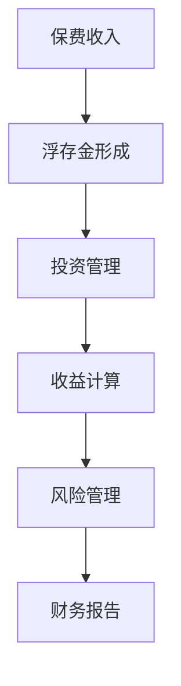

                 


# 巴菲特的保险浮存金运用之道

> 关键词：保险浮存金，巴菲特，投资策略，风险管理，伯克希尔哈撒韦

> 摘要：本文深入分析巴菲特如何利用保险浮存金进行投资，探讨其运作机制、数学模型、系统架构、实际案例及风险管理策略，揭示其成功背后的奥秘。

---

# 第一部分: 保险浮存金的基本概念

## 第1章: 保险浮存金的定义与特点

### 1.1 保险浮存金的定义

#### 1.1.1 保险浮存金的概念
保险浮存金是指保险公司收到的保费收入，在未发生赔付之前暂时存放在保险公司账上的资金。这些资金在会计上被视为负债，但在实际操作中，保险公司可以利用这些资金进行投资，从而创造额外收益。

#### 1.1.2 巴菲特保险浮存金的独特性
巴菲特通过旗下公司（如伯克希尔哈撒韦）控制的保险公司，利用浮存金进行长期投资，尤其在股票和债券市场中表现优异。这种模式的核心在于将浮存金视为一种低成本的资金来源，长期投资优质资产。

#### 1.1.3 保险浮存金的特点
- **低成本资金**：浮存金的使用成本低，保险公司可以以较低的资金成本进行投资。
- **期限错配**：浮存金的流入和流出时间错配，为长期投资提供了时间窗口。
- **高流动性**：部分浮存金可以随时用于赔付，但也有一部分可以长期锁定用于投资。

### 1.2 巴菲特的保险帝国

#### 1.2.1 巴菲特与保险行业的关联
巴菲特早期通过收购保险公司，逐步构建了庞大的保险帝国。他意识到保险业务不仅能提供稳定的现金流，还能通过浮存金进行投资，从而实现资产的长期增值。

#### 1.2.2 伯克希尔哈撒韦的保险业务布局
伯克希尔哈撒韦通过旗下多家保险公司（如GEICO、 Berkshire Hathaway Reinsurance）不断扩大保险业务规模，从而获取更多的浮存金。

#### 1.2.3 巴菲特保险浮存金的规模与增长
伯克希尔哈撒韦的浮存金规模随时间增长而不断扩大，成为巴菲特投资的重要资金来源。

### 1.3 保险浮存金的特点

#### 1.3.1 浮存金的会计处理方式
浮存金在会计上被视为负债，但由于其投资收益归公司所有，因此可以被视为一种特殊的资产。

#### 1.3.2 浮存金的流动性与稳定性
浮存金有一定的流动性，但也需要保持一定的稳定性以应对保险赔付的需求。

#### 1.3.3 浮存金的风险与收益平衡
浮存金的投资需要在风险和收益之间找到平衡点，确保投资收益能够覆盖潜在的风险。

---

## 第2章: 保险浮存金的运作机制

### 2.1 巴菲特保险浮存金的来源

#### 2.1.1 保险业务的保费收入
保险公司通过收取保费获得资金，这些资金的一部分用于赔付，另一部分则作为浮存金进行投资。

#### 2.1.2 浮存金的形成过程
保费收入扣除赔付支出后的剩余部分形成浮存金，这部分资金可以用于投资。

#### 2.1.3 浮存金的会计处理方式
浮存金在会计上被视为负债，但在实际操作中，保险公司可以将其用于投资，从而实现资金的保值增值。

### 2.2 保险浮存金的运作模式

#### 2.2.1 浮存金的投资策略
巴菲特将浮存金投资于长期优质资产，如股票和债券，以实现资产的长期增值。

#### 2.2.2 浮存金的资产配置
伯克希尔哈撒韦的投资组合以股票为主，辅以债券和其他资产，确保资产的多样性和稳定性。

#### 2.2.3 浮存金的风险控制
通过分散投资、长期持有优质资产等方式，控制浮存金投资的风险。

### 2.3 巴菲特对保险浮存金的独特管理

#### 2.3.1 浮存金的长期投资视角
巴菲特将浮存金视为长期资金，用于投资优质资产，而非短期投机。

#### 2.3.2 浮存金的收益与股东权益的关系
浮存金的投资收益最终归属于公司股东，因此巴菲特注重长期稳定的收益。

#### 2.3.3 浮存金的动态调整机制
根据市场变化和公司需求，动态调整浮存金的投资策略和资产配置。

---

## 第3章: 巴菲特保险浮存金的运作策略

### 3.1 巴菲特保险浮存金的运作原理

#### 3.1.1 浮存金的负债属性与资产属性
浮存金在会计上是负债，但在实际操作中，可以作为资产进行投资。

#### 3.1.2 浮存金的期限错配与收益机会
浮存金的流入和流出时间错配，为长期投资提供了时间窗口。

#### 3.1.3 巴菲特对浮存金的长期投资理念
巴菲特注重长期投资，将浮存金用于投资优质资产，实现资产的长期增值。

### 3.2 巴菲特保险浮存金的管理策略

#### 3.2.1 浮存金的流动性管理
确保浮存金的流动性，以应对保险赔付的需求。

#### 3.2.2 浮存金的风险管理
通过分散投资、长期持有优质资产等方式，控制浮存金投资的风险。

#### 3.2.3 浮存金的收益最大化
通过优化资产配置和投资策略，实现浮存金收益的最大化。

### 3.3 巴菲特保险浮存金的财务表现

#### 3.3.1 浮存金的收益与成本
浮存金的投资收益减去相关成本，最终形成净利润。

#### 3.3.2 浮存金的财务杠杆效应
通过浮存金的投资，伯克希尔哈撒韦实现了财务杠杆效应，进一步提升了资产收益。

#### 3.3.3 浮存金的未来展望
随着保险业务的扩展和投资收益的增长，浮存金将继续为伯克希尔哈撒韦提供稳定的资金来源。

---

## 第4章: 巴菲特保险浮存金的风险管理与挑战

### 4.1 巴菲特保险浮存金的风险管理

#### 4.1.1 浮存金的风险来源
市场风险、流动性风险、信用风险等。

#### 4.1.2 巴菲特的风险控制措施
分散投资、长期持有、严格筛选投资标的等。

#### 4.1.3 风险与收益的平衡
通过合理的风险控制，确保浮存金投资的收益稳定。

### 4.2 巴菲特保险浮存金的挑战

#### 4.2.1 市场波动的影响
市场波动可能影响浮存金的投资收益。

#### 4.2.2 利率变化的冲击
利率变化可能影响债券等固定收益类资产的收益。

#### 4.2.3 保险赔付的压力
浮存金的流动性需要与保险赔付的需求相匹配。

### 4.3 巴菲特保险浮存金的应对策略

#### 4.3.1 加强风险管理
通过严格的风险评估和控制，降低浮存金投资的风险。

#### 4.3.2 优化资产配置
根据市场变化，动态调整资产配置，确保收益稳定。

#### 4.3.3 提高流动性管理
确保浮存金的流动性，以应对保险赔付的需求。

---

## 第5章: 巴菲特保险浮存金的数学模型与算法

### 5.1 浮存金的收益计算

#### 5.1.1 浮存金的净收益公式
$$ \text{净收益} = \text{投资收益} - \text{赔付支出} $$

#### 5.1.2 浮存金的收益率计算
$$ \text{收益率} = \frac{\text{净收益}}{\text{平均浮存金规模}} \times 100\% $$

### 5.2 浮存金的风险评估

#### 5.2.1 风险价值（VaR）模型
$$ \text{VaR} = \text{置信水平} \times \text{标准差} $$

#### 5.2.2 信用风险评估
通过信用评级和历史数据，评估投资标的的信用风险。

### 5.3 浮存金的资产配置优化

#### 5.3.1 资产配置的马科维茨有效前沿
$$ \text{最小方差} = \sum_{i=1}^{n} w_i^2 \sigma_i^2 - 2 \sum_{i=1}^{n} \sum_{j=1}^{n} w_i w_j \sigma_{ij} $$

#### 5.3.2 动态资产配置策略
根据市场变化，动态调整资产配置比例，以实现收益最大化。

---

## 第6章: 巴菲特保险浮存金的系统架构与实现

### 6.1 系统架构设计

#### 6.1.1 系统模块划分
- 保费收入模块
- 赔付支出模块
- 投资管理模块
- 风险管理模块

#### 6.1.2 系统流程图


### 6.2 系统实现细节

#### 6.2.1 保费收入模块
- 收集保费收入数据
- 更新浮存金规模

#### 6.2.2 赔付支出模块
- 记录赔付支出
- 调整浮存金规模

#### 6.2.3 投资管理模块
- 选择投资标的
- 执行投资交易

#### 6.2.4 风险管理模块
- 监控市场风险
- 调整投资策略

---

## 第7章: 巴菲特保险浮存金的项目实战与案例分析

### 7.1 项目实战

#### 7.1.1 环境安装
- 安装Python和相关库（如pandas、numpy）
- 配置投资组合管理工具

#### 7.1.2 核心实现
```python
import pandas as pd
import numpy as np

# 示例代码：计算浮存金的收益率
def calculate_yield(assets, liabilities):
    float_cash = assets - liabilities
    yield = (float_cash * 0.1)  # 假设年化收益率为10%
    return yield

# 数据分析与可视化
data = pd.read_csv('insurance_float.csv')
data['yield'] = data.apply(lambda x: calculate_yield(x['资产'], x['负债']), axis=1)
data.plot('year', 'yield')
```

### 7.2 案例分析

#### 7.2.1 案例背景
伯克希尔哈撒韦通过浮存金投资，实现了资产的长期增值。

#### 7.2.2 投资策略
- 长期持有优质股票
- 投资债券以平衡风险

#### 7.2.3 实际收益
通过浮存金投资，伯克希尔哈撒韦的资产规模持续增长，股东价值显著提升。

---

## 第8章: 巴菲特保险浮存金的最佳实践与注意事项

### 8.1 最佳实践

#### 8.1.1 风险管理
- 定期评估投资风险
- 建立风险预警机制

#### 8.1.2 资产配置
- 分散投资以降低风险
- 根据市场变化动态调整资产配置

#### 8.1.3 长期投资
- 保持长期投资视角
- 避免短期投机

### 8.2 小结与展望

#### 8.2.1 小结
巴菲特通过保险浮存金实现了资产的长期增值，其成功经验值得投资者学习。

#### 8.2.2 展望
随着保险业务的扩展和技术的进步，浮存金的投资策略将进一步优化，为投资者带来更多的收益。

---

## 第9章: 结论与启示

### 9.1 结论

#### 9.1.1 巴菲特保险浮存金的成功经验
- 长期投资视角
- 优质资产配置
- 严格风险控制

#### 9.1.2 浮存金对投资策略的影响
浮存金为投资者提供了低成本、长期的资金来源，可以用于投资优质资产，实现资产的长期增值。

### 9.2 启示与建议

#### 9.2.1 对投资者的启示
- 建立长期投资视角
- 优化资产配置
- 加强风险管理

#### 9.2.2 对保险公司的建议
- 利用浮存金进行投资，提升公司价值
- 加强风险控制，确保资金安全

---

## 作者

作者：AI天才研究院/AI Genius Institute & 禅与计算机程序设计艺术 /Zen And The Art of Computer Programming

