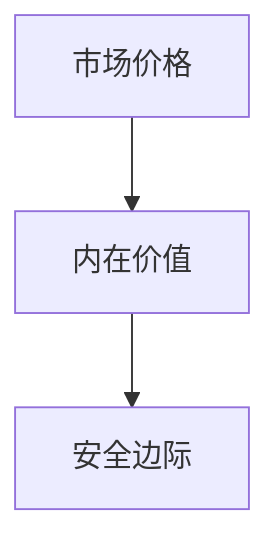
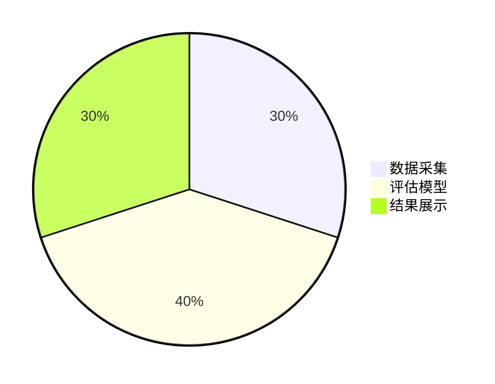

                 


# 巴菲特的公司收购策略分析

> **关键词**: 巴菲特, 公司收购, 价值投资, 内在价值, 安全边际

> **摘要**: 本文深入分析了巴菲特的公司收购策略，从其投资哲学、收购标准、价值评估方法、安全边际计算到系统架构设计，全面解析了巴菲特的收购逻辑。通过实际案例分析和代码实现，展示了如何将巴菲特的策略应用于实际投资中，帮助投资者更好地理解和应用这些策略。

---

## 第1章 巴菲特投资哲学概述

### 1.1 巴菲特的投资理念

#### 1.1.1 价值投资的核心思想
巴菲特的价值投资理念的核心是寻找具有持续竞争优势的企业，并以合理的价格买入。他强调企业内在价值的重要性，认为市场波动不应影响长期投资决策。

#### 1.1.2 巴菲特投资哲学的形成与演变
巴菲特的投资哲学起源于格雷厄姆的价值投资体系，但他在此基础上进行了扩展，提出了企业竞争优势和管理层质量的重要性。

#### 1.1.3 巴菲特投资哲学对企业收购的影响
巴菲特的投资哲学直接影响了他对收购目标的选择，他倾向于选择具有稳定财务状况、优秀管理层和强大竞争优势的企业。

---

### 1.2 公司收购的基本概念

#### 1.2.1 公司收购的定义与分类
公司收购是指一个企业通过购买另一个企业的股权或资产，以获得对目标公司的控制权。公司收购可以分为杠杆收购和非杠杆收购。

#### 1.2.2 公司收购的基本流程
公司收购的基本流程包括目标筛选、尽职调查、估值分析、谈判与交易完成。

#### 1.2.3 公司收购的动机与目标
公司收购的动机包括扩大市场份额、获取技术优势和实现多元化经营；目标是寻找具有高增长潜力和竞争优势的企业。

---

## 第2章 巴菲特收购策略的核心要素

### 2.1 巴菲特收购标准

#### 2.1.1 企业财务状况的评估标准
巴菲特重视企业的财务健康状况，包括低债务、稳定的现金流和合理的利润率。

#### 2.1.2 企业管理层的质量与稳定性
巴菲特认为优秀的管理层是企业成功的关键，因此在收购时会评估管理层的能力和诚信。

#### 2.1.3 企业的竞争优势与市场地位
巴菲特倾向于收购具有强大竞争优势和市场地位的企业，这些企业能够持续创造价值。

---

### 2.2 企业价值评估方法

#### 2.2.1 市盈率法
市盈率法通过比较企业的市盈率与行业平均水平，评估企业的估值是否合理。

#### 2.2.2 市净率法
市净率法通过比较企业的市净率与行业平均水平，评估企业的估值是否合理。

#### 2.2.3 内在价值计算公式
$$\text{内在价值} = \frac{\text{每股收益} \times (1 + g)}{r - g}$$
其中，$g$ 是增长率，$r$ 是折现率。

---

## 第3章 巴菲特定律与收购决策模型

### 3.1 巴菲特定律

#### 3.1.1 安全边际的概念
安全边际是指企业内在价值与市场价格之间的差值，确保在市场价格波动时，投资者仍能获得收益。

#### 3.1.2 安全边际的计算方法
$$\text{安全边际} = \text{市场价格} - \text{内在价值}$$

#### 3.1.3 安全边际在收购中的应用
安全边际为负数时，企业被高估；为正数时，企业被低估。

---

### 3.2 巴菲特定律的数学模型

#### 3.2.1 安全边际计算公式
$$\text{安全边际} = \text{市场价格} - \text{内在价值}$$

#### 3.2.2 内在价值与市场价格的关系图


---

## 第4章 巴菲特收购策略的系统分析

### 4.1 系统架构设计

#### 4.1.1 系统目标与范围
设计一个企业收购评估系统，用于计算企业的内在价值和安全边际。

#### 4.1.2 系统功能模块划分
- 数据采集模块
- 评估模型模块
- 结果展示模块

#### 4.1.3 系统架构图


---

### 4.2 系统功能设计

#### 4.2.1 数据采集模块
- 采集企业的财务数据
- 采集行业基准数据

#### 4.2.2 评估模型模块
- 计算内在价值
- 计算安全边际

#### 4.2.3 结果展示模块
- 显示评估结果
- 提供可视化图表

---

## 第5章 巴菲特收购策略的项目实战

### 5.1 环境安装与配置

#### 5.1.1 数据收集工具安装
安装Python和必要的数据处理库（如Pandas、NumPy）。

#### 5.1.2 数据分析工具配置
配置Jupyter Notebook作为开发环境。

#### 5.1.3 系统运行环境要求
Python 3.8及以上版本，安装必要的依赖库。

---

### 5.2 核心代码实现

#### 5.2.1 企业价值评估代码
```python
def calculate_intrinsic_value(eps, growth_rate, required_return):
    return eps * (1 + growth_rate) / (required_return - growth_rate)
```

#### 5.2.2 安全边际计算代码
```python
def calculate_margin_of_safety(price, intrinsic_value):
    return price - intrinsic_value
```

---

### 5.3 实际案例分析

#### 5.3.1 数据采集与预处理
收集目标企业的财务数据，包括每股收益、增长率等。

#### 5.3.2 模型训练与评估
使用Python代码计算企业的内在价值和安全边际。

#### 5.3.3 结果分析
根据计算结果，判断企业是否被低估或高估。

---

## 第6章 总结与展望

### 6.1 总结
巴菲特的收购策略强调内在价值和安全边际，帮助投资者做出明智的决策。

### 6.2 投资建议
投资者应结合市场环境和企业实际情况，灵活运用巴菲特的策略。

### 6.3 注意事项
避免盲目跟从，需结合市场变化和个人判断。

### 6.4 拓展阅读
推荐阅读巴菲特的著作和相关投资策略书籍。

---

## 作者：AI天才研究院/AI Genius Institute & 禅与计算机程序设计艺术 /Zen And The Art of Computer Programming

