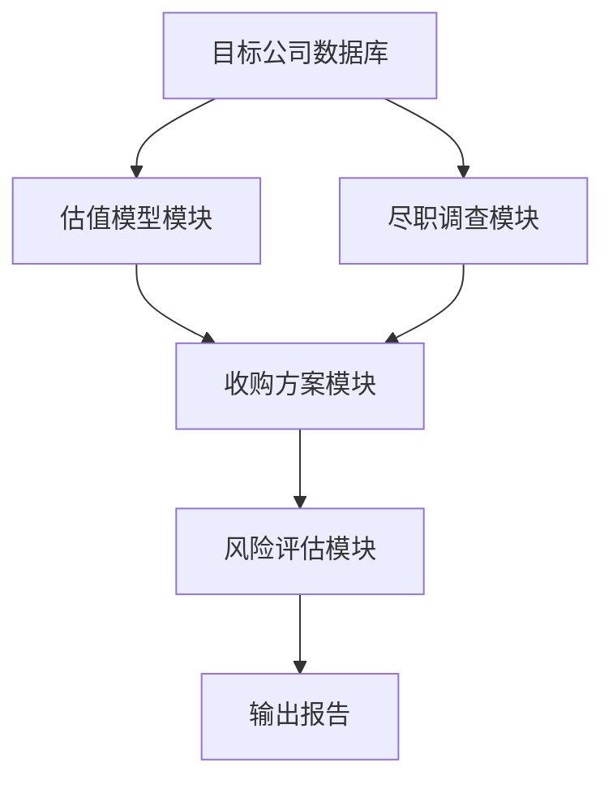
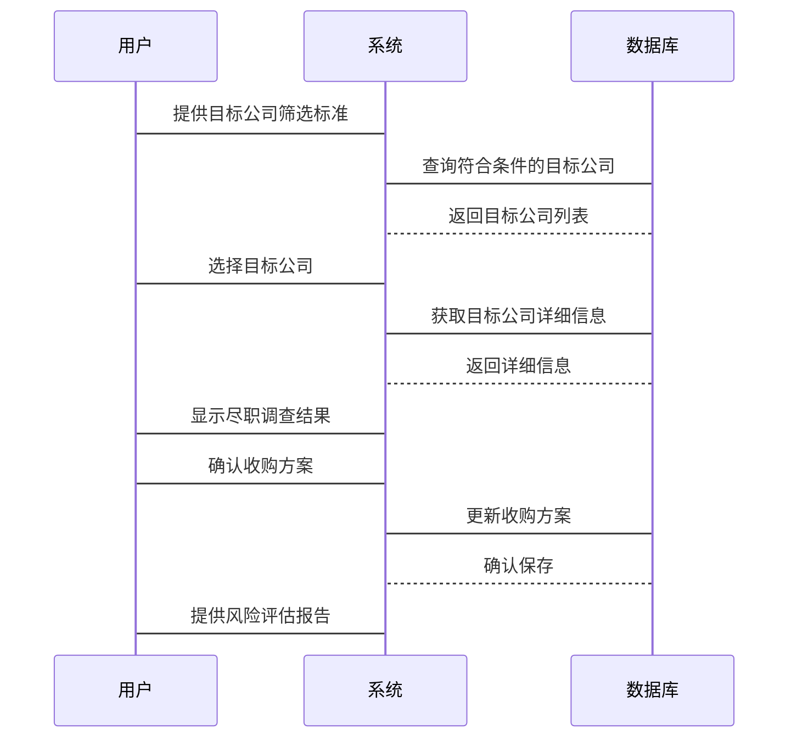

                 


# 第三章: 全资控股的优势与挑战

## 3.1 全资控股的核心优势

### 3.1.1 完全控制权的实现
全资控股意味着投资者对目标公司拥有100%的股权，这使得投资者能够完全控制公司的决策、战略和日常运营。这种控制权可以确保公司在收购后的运营方向与投资者的整体战略一致，避免因股权分散导致的决策冲突。

### 3.1.2 资产与负债的全面整合
全资控股使得投资者能够将目标公司的资产和负债完全整合到自己的资产负债表中。这种整合不仅可以优化资产配置，还可以通过杠杆效应提高资本回报率。例如，通过将高收益资产与低负债成本相结合，可以显著提升整体的资本效率。

### 3.1.3 收购后的管理优化
全资控股使得投资者能够对目标公司的管理层进行直接调整和优化。这有助于确保公司在收购后的运营效率和盈利能力得到提升。通过整合管理团队、优化组织结构和流程，可以进一步提升公司的整体竞争力。

## 3.2 全资控股的实施步骤

### 3.2.1 目标公司筛选
目标公司筛选是全资控股的第一步，需要综合考虑公司的财务状况、行业地位、管理团队和市场前景等因素。巴菲特通常会选择具有强大护城河、稳定的现金流和合理估值的公司。

### 3.2.2 尽职调查与评估
在确定目标公司后，投资者需要进行详细的尽职调查，包括财务、法律和运营等方面。这一步骤旨在评估目标公司的潜在风险和价值，确保收购决策的准确性。

### 3.2.3 收购方案的设计与实施
根据尽职调查的结果，投资者需要设计具体的收购方案，包括融资方式、支付方式和交易结构等。在实施过程中，需要确保合规性和透明性，避免法律风险。

## 3.3 全资控股的风险与挑战

### 3.3.1 财务风险的分析
全资控股通常需要较大的资金投入，可能导致财务杠杆过高，增加公司的财务风险。此外，目标公司的财务状况不佳可能会影响整体的资本结构和盈利能力。

### 3.3.2 经营整合的难点
收购后的整合过程是一个复杂的系统工程，包括组织结构、业务流程和文化融合等多个方面。如果整合不力，可能导致效率低下、成本增加甚至战略目标的偏离。

### 3.3.3 法律与税务风险
全资控股涉及到复杂的法律和税务问题，例如反垄断审查、税务规划和并购税等。这些问题需要专业的法律和税务团队进行评估和处理，以确保合规性和优化税务负担。

# 第四章: 巴菲特收购策略的数学模型

## 4.1 巴菲特的内在价值计算模型

### 4.1.1 内在价值的公式推导
内在价值是巴菲特评估公司价值的核心指标，其计算公式为：
$$ V = \frac{CF}{r - g} $$
其中，\( CF \) 是公司的自由现金流，\( r \) 是折现率，\( g \) 是现金流的永续增长率。

### 4.1.2 现金流折现法的数学模型
现金流折现法（DCF模型）用于评估公司的未来现金流的现值，公式为：
$$ PV = \sum_{t=1}^{n} \frac{CF_t}{(1 + r)^t} $$
其中，\( PV \) 是现值，\( CF_t \) 是第t年的现金流，\( r \) 是折现率，\( n \) 是预测期数。

## 4.2 巴菲特的选股标准与数学分析

### 4.2.1 财务指标的权重分配
巴菲特在选股时会综合考虑多个财务指标，包括市盈率、市净率、股息率和ROE等。这些指标在评估中的权重可以通过加权平均数进行计算：
$$ Weighted\ Average = \sum_{i=1}^{k} w_i \times metric_i $$
其中，\( w_i \) 是第i个指标的权重，\( metric_i \) 是第i个指标的值。

### 4.2.2 股价与内在价值的对比分析
通过对股价与内在价值的对比，可以判断公司的股票是被高估还是低估。如果股价低于内在价值，通常是一个好的买入机会。

### 4.2.3 数学模型在选股中的应用
通过数学模型，投资者可以量化公司的估值，并制定相应的投资策略。例如，使用DCF模型计算公司的内在价值，再与市场价格进行对比，做出投资决策。

## 4.3 巴菲特的收购风险评估模型

### 4.3.1 风险因子的量化
风险因子可以通过历史数据分析和市场研究进行量化，例如使用标准差和贝塔系数来衡量公司的风险水平。

### 4.3.2 风险评估的数学公式
$$ R = \sum_{i=1}^{n} w_i \times r_i $$
其中，\( R \) 是整体风险值，\( w_i \) 是第i个风险因子的权重，\( r_i \) 是第i个风险因子的风险值。

# 第五章: 巴菲特收购策略的系统架构

## 5.1 系统架构概述

### 5.1.1 系统目标
本系统旨在模拟巴菲特的收购策略，提供从目标筛选、尽职调查到收购实施的全过程管理。

### 5.1.2 系统功能模块
系统主要功能模块包括目标公司数据库、尽职调查模块、估值模型模块、收购方案模块和风险评估模块。

### 5.1.3 系统架构图（Mermaid）



## 5.2 系统功能设计

### 5.2.1 目标公司数据库
目标公司数据库存储了大量潜在目标公司的信息，包括财务数据、行业分析和市场数据等，支持快速筛选和分析。

### 5.2.2 尽职调查模块
尽职调查模块用于对目标公司进行详细调查，包括财务审查、法律评估和管理层访谈等，确保收购决策的准确性。

### 5.2.3 估值模型模块
估值模型模块基于DCF模型和其他估值方法，计算目标公司的内在价值，支持合理的收购价格决策。

### 5.2.4 收购方案模块
收购方案模块根据尽职调查和估值结果，制定具体的收购方案，包括融资方式、支付方式和交易结构等。

### 5.2.5 风险评估模块
风险评估模块对收购过程中的潜在风险进行量化分析，评估财务、法律和市场风险，并制定相应的风险控制措施。

## 5.3 系统接口设计

### 5.3.1 数据接口
系统需要与外部数据库和数据源接口连接，获取实时的市场数据和公司信息，确保系统的数据准确性。

### 5.3.2 用户接口
用户可以通过图形界面输入目标公司信息、查看分析结果和制定收购方案，提升用户体验。

## 5.4 系统交互流程（Mermaid序列图）



# 第六章: 项目实战

## 6.1 环境安装

### 6.1.1 系统需求
- 操作系统：Windows/Mac/Linux
- 开发工具：Python 3.8+
- 依赖库：pandas、numpy、scipy、matplotlib

### 6.1.2 安装步骤
1. 安装Python
2. 安装依赖库：
   ```bash
   pip install pandas numpy scipy matplotlib
   ```

## 6.2 核心实现源代码

### 6.2.1 DCF模型实现
```python
import numpy as np
import pandas as pd

def calculate_intrinsic_value(free_cash_flow, discount_rate, growth_rate, periods):
    cash_flows = []
    for t in range(periods):
        cash_flow = free_cash_flow * (1 + growth_rate) ** t
        cash_flows.append(cash_flow)
    present_value = np.npv(discount_rate, cash_flows)
    return present_value

# 示例数据
free_cash_flow = 100
discount_rate = 0.08
growth_rate = 0.05
periods = 10

intrinsic_value = calculate_intrinsic_value(free_cash_flow, discount_rate, growth_rate, periods)
print(f"内含价值：{intrinsic_value}")
```

### 6.2.2 风险评估实现
```python
import numpy as np

def calculate_beta(returns, market_returns, risk_free_rate):
    covariance = np.cov(returns, market_returns)[0,1]
    variance_market = np.var(market_returns)
    beta = covariance / variance_market
    return beta

# 示例数据
returns = [0.1, 0.05, -0.02, 0.08, 0.03]
market_returns = [0.08, 0.06, 0.04, 0.02, 0.05]
risk_free_rate = 0.02

beta = calculate_beta(returns, market_returns, risk_free_rate)
print(f"贝塔系数：{beta}")
```

## 6.3 案例分析

### 6.3.1 案例背景
假设我们想要评估一家公司的内含价值，已知其自由现金流为100万元，折现率为8%，增长率为5%，预测期为10年。

### 6.3.2 实现步骤
1. 计算每年的现金流：
   $$ CF_t = 100 \times (1 + 0.05)^t $$
2. 计算现值：
   $$ PV = \sum_{t=1}^{10} \frac{100 \times (1 + 0.05)^t}{(1 + 0.08)^t} $$
3. 计算内含价值并比较市场价格，判断是否低估。

### 6.3.3 结果分析
通过计算，我们发现该公司的内含价值为X元，如果市场价格低于X元，则具有投资价值。

## 6.4 项目小结

### 6.4.1 核心实现总结
本项目通过Python代码实现了DCF模型和风险评估模型，帮助投资者计算目标公司的内含价值和风险水平。

### 6.4.2 实际应用中的注意事项
- 数据的准确性和完整性直接影响模型结果，需要进行充分的市场调研和数据分析。
- 模型假设可能与实际情况存在偏差，需要结合实际进行调整和优化。
- 收购决策需要综合考虑多方面因素，模型只是提供辅助支持。

# 结论

巴菲特的公司收购策略以全资控股为核心，通过严格的选股标准、科学的估值模型和全面的风险管理，确保了投资的长期稳定收益。本文详细探讨了巴菲特收购策略的背景、优势、数学模型和系统架构，并通过项目实战展示了模型的应用。投资者在实际操作中，应结合市场环境和公司具体情况，灵活运用这些策略，以实现最优的投资回报。

# 注意事项

- **数据来源**：确保数据的准确性和可靠性，建议使用权威的财务报表和市场数据。
- **模型假设**：DCF模型假设了永续增长，实际应用中需根据公司实际情况进行调整。
- **风险管理**：收购过程中需关注法律、税务和市场风险，制定相应的应对措施。

# 拓展阅读

- 《The Intelligent Investor》 by Benjamin Graham
- 《 Warren Buffett and the Art of Stock Investing》 by Charles D. Ellis
- 《并购的艺术：巴菲特并购策略解析》

# 作者

作者：AI天才研究院/AI Genius Institute & 禅与计算机程序设计艺术 /Zen And The Art of Computer Programming

--- 

通过以上步骤，我们可以清晰地看到，巴菲特的公司收购策略不仅是一种投资方法，更是一种系统化的科学过程。从目标筛选到收购实施，每一步都需要严谨的分析和精确的计算，确保投资的长期性和稳定性。希望本文能为投资者提供有价值的参考，帮助他们在并购市场中做出明智的决策。

