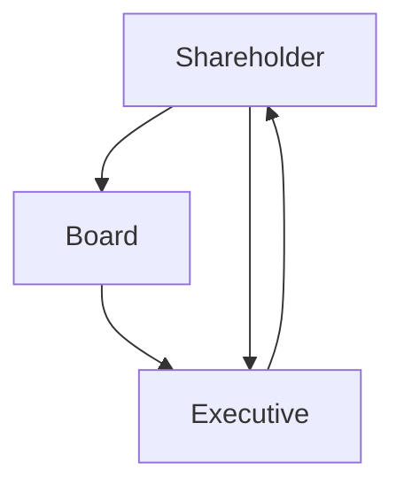
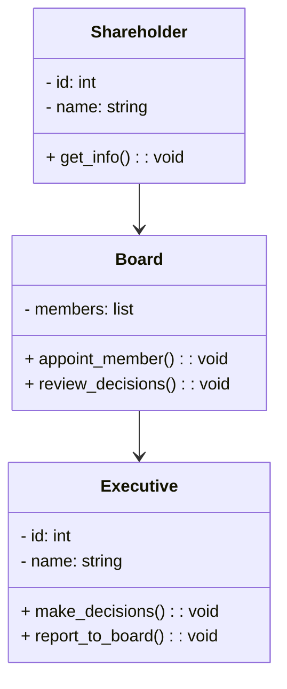

                 

# 巴菲特的公司治理观：股东利益至上

## 关键词：
巴菲特、公司治理、股东利益、长期投资、价值投资、管理层激励、企业架构

## 摘要：
本文深入探讨了巴菲特的公司治理观，特别是其核心理念——股东利益至上。通过分析巴菲特的价值投资哲学、董事会与管理层的治理原则，以及伯克希尔哈撒韦的实际案例，本文揭示了如何通过系统化的公司治理架构实现企业价值最大化。文章还结合了技术博客的特点，使用图表和数学模型，详细阐述了公司治理的系统架构与实践应用。

---

# 引言

## 1. 巴菲特的公司治理观概述

### 1.1 背景介绍

公司治理是企业管理的核心问题，涉及股东、董事会、管理层和利益相关者之间的权利与责任分配。巴菲特作为全球最具影响力的投资家之一，其公司治理观强调股东利益至上，主张通过长期投资和价值投资实现企业可持续发展。

### 1.2 核心概念

- **股东利益至上**：公司治理的终极目标是实现股东价值的最大化。
- **长期投资**：注重企业的长期价值，而非短期市场波动。
- **价值投资**：选择具有持续竞争优势和良好治理结构的企业。

### 1.3 问题描述

传统公司治理常忽视股东利益，导致管理层短期行为和利益输送。巴菲特提出股东至上的治理观，强调透明度、责任和长期投资。

### 1.4 问题解决

通过构建以股东利益为核心的治理架构，确保管理层行为与股东利益一致，实现企业长期价值。

### 1.5 边界与外延

公司治理不仅涉及股东，还包括董事会、管理层、员工和利益相关者。本文重点分析股东与管理层的治理关系。

### 1.6 概念结构与核心要素

- **股东**：权利、义务、利益。
- **董事会**：结构、职责、独立性。
- **管理层**：激励、约束、决策。

---

## 2. 巴菲特的价值观与投资哲学

### 2.1 背景介绍

巴菲特的价值投资理念强调企业内在价值和长期可持续发展，认为良好的公司治理是价值的基石。

### 2.2 核心概念

- **价值投资**：寻找具有持续竞争优势和良好治理的企业。
- **长期主义**：关注企业的长期价值而非短期收益。
- **管理层特质**：诚信、能力、以股东利益为重。

### 2.3 核心要素

- 企业内在价值：通过ROE、ROA等指标评估。
- 管理层素质：领导力、决策能力、道德标准。
- 公司治理结构：股权结构、董事会效率、透明度。

### 2.4 问题分析

许多企业忽视治理结构，导致管理混乱和股东利益受损。

### 2.5 解决方案

通过优化公司治理结构，提升企业内在价值，实现股东利益最大化。

---

## 3. 巴菲特的公司治理分析框架

### 3.1 股东权利保护

#### 3.1.1 股东知情权

股东有权了解企业的财务状况、管理层决策和重大事项。

#### 3.1.2 股东参与权

通过投票权参与重大决策，确保管理层行为符合股东利益。

#### 3.1.3 股东利益与管理层利益的平衡

通过股权激励和绩效考核，确保管理层行为与股东利益一致。

### 3.2 股权结构

#### 3.2.1 控股股东与中小股东的平衡

防止控股股东滥用权力，保护中小股东利益。

#### 3.2.2 股权激励机制

设计合理的股权激励计划，提升管理层积极性。

### 3.3 董事会治理

#### 3.3.1 董事会的独立性与专业性

董事会成员应具备独立判断能力和专业背景。

#### 3.3.2 董事会的监督职责

定期审查管理层决策，确保符合股东利益。

### 3.4 管理层激励与约束

#### 3.4.1 激励机制设计

使用股票期权、限制性股票等长期激励工具。

#### 3.4.2 绩效考核与问责

建立清晰的绩效考核体系，确保管理层 accountability。

### 3.5 系统架构设计

使用Mermaid绘制公司治理的系统架构图，展示股东、董事会、管理层之间的关系。

---

## 4. 巴菲特的公司治理实践

### 4.1 伯克希尔哈撒韦的治理实践

#### 4.1.1 股权结构

伯克希尔采用分散股权结构，避免单一控股股东。

#### 4.1.2 董事会构成

董事会成员包括独立董事和管理层，确保独立性和专业性。

#### 4.1.3 管理层激励

通过长期激励计划，如股票期权，激励管理层长期服务。

### 4.2 投资案例分析

#### 4.2.1 可口可乐的治理分析

可口可乐的治理结构和管理层激励机制如何符合巴菲特的价值观。

#### 4.2.2 苹果公司的治理启示

苹果的治理结构如何体现长期主义和股东利益。

---

## 5. 系统分析与架构设计

### 5.1 问题场景介绍

公司治理涉及多方利益，需要系统化的架构设计。

### 5.2 项目介绍

设计一个基于巴菲特治理观的公司治理系统。

### 5.3 系统功能设计

使用Mermaid绘制领域模型类图，展示股东、董事会、管理层的关系。

### 5.4 系统架构设计

使用Mermaid绘制系统架构图，展示各组件之间的关系。

---

## 6. 总结与展望

### 6.1 总结

巴菲特的公司治理观强调股东利益至上，通过优化治理结构实现企业长期价值。

### 6.2 展望

未来，公司治理将更加注重ESG因素，技术手段（如区块链）也将提升治理效率。

---

## 7. 附录

### 7.1 进一步阅读

- 巴菲特股东大会演讲集
- 《巴菲特投资哲学》
- 公司治理相关书籍

### 7.2 工具与资源

- 罗列公司治理分析工具和资源，如治理评分工具、股权结构分析软件。

---

## 作者

作者：AI天才研究院 & 禅与计算机程序设计艺术

---

通过以上分析，我们可以看到巴菲特的公司治理观不仅是一种投资理念，更是一种系统化的管理方法。它通过优化治理结构、保护股东利益、激励管理层，实现企业长期价值最大化。这种治理观在当今复杂的商业环境中具有重要的现实意义。

