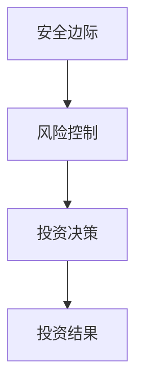
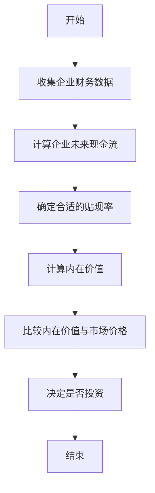
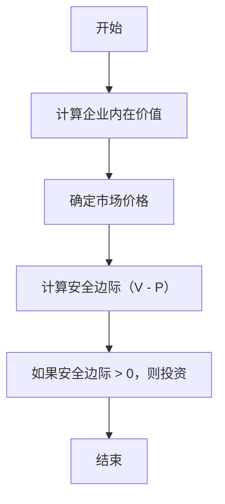
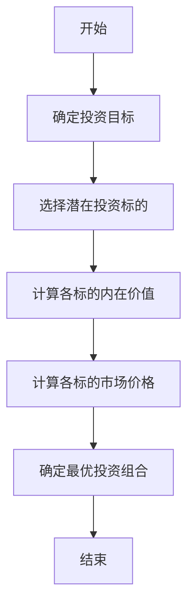
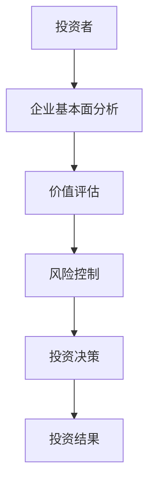

                 


# 巴菲特的公司管理哲学

> 关键词：巴菲特、公司管理哲学、价值投资、风险管理、股东价值、投资模型、数学公式、流程图、类图

> 摘要：本文深入分析了巴菲特的公司管理哲学，从其核心理念到具体的投资模型和风险管理策略，结合技术语言和专业分析，探讨其对现代企业管理的启示。

---

## 第一部分：巴菲特的管理哲学背景

### 第1章：巴菲特的生平与投资理念

#### 1.1 巴菲特的早年经历与投资起步
沃伦·巴菲特（Warren Buffett）于1934年出生在美国密苏里州，早年展现出对股票市场的浓厚兴趣。他在青少年时期就开始研究股票，甚至在高中时期就通过购买股票赚取了人生的第一桶金。巴菲特的早年经历奠定了他后来成功的基础，他开始关注企业的内在价值，并形成了独特的投资哲学。

#### 1.2 巴菲特的价值投资理念
巴菲特的价值投资理念的核心在于寻找那些具有持续竞争优势和良好管理团队的公司，并以合理的价格买入并长期持有。他强调企业内在价值的重要性，认为市场价格波动不会影响企业的真正价值。这种长期主义的投资理念使他成为全球最成功的投资者之一。

#### 1.3 巴菲特管理哲学的核心思想
巴菲特的管理哲学不仅仅局限于投资，还包括对企业治理、风险管理和社会责任的深刻理解。他强调管理层的责任感，认为管理层应该以股东利益为重，同时注重企业的长期发展和社会价值。

### 第2章：巴菲特管理哲学的背景与现状

#### 2.1 当代公司管理的挑战
现代企业面临着全球化竞争、经济波动和技术变革的多重挑战。传统的企业管理方法往往难以应对这些复杂问题，因此，寻找一种更具韧性和前瞻性的管理哲学显得尤为重要。

#### 2.2 巴菲特管理哲学的现实意义
巴菲特的管理哲学强调长期主义、价值创造和风险管理，这些理念在当今复杂的商业环境中具有重要的现实意义。它们不仅适用于投资领域，还可以为企业的日常管理提供宝贵的指导。

#### 2.3 巴菲特管理哲学与现代企业治理的结合
现代企业治理强调透明度、责任和效率。巴菲特的管理哲学与现代企业治理理念有许多共通之处，尤其是在注重股东价值和风险管理方面。这种结合为企业提供了更加全面的管理框架。

---

## 第二部分：巴菲特管理哲学的核心概念

### 第3章：巴菲特管理哲学的核心原理

#### 3.1 价值投资的数学模型
巴菲特的价值投资理念可以通过数学模型来表达。以下是两个关键公式：

- **内在价值公式**：$$ V = \frac{E}{P} $$
  其中，\( V \) 表示内在价值，\( E \) 表示企业未来现金流的现值，\( P \) 表示贴现率。

- **安全边际公式**：$$ M = V - P $$
  其中，\( M \) 表示安全边际，\( V \) 表示内在价值，\( P \) 表示市场价格。

#### 3.2 风险控制与安全边际
巴菲特非常重视风险控制，他认为安全边际是投资成功的关键。通过计算安全边际，投资者可以在市场价格低于内在价值时买入，从而降低投资风险。

#### 3.3 股东价值与公司治理
巴菲特强调股东价值的重要性，认为企业的终极目标是为股东创造价值。他主张通过有效的公司治理结构来实现这一目标，包括透明的财务报告、合理的激励机制和高效的管理团队。

### 第4章：巴菲特管理哲学的概念对比与ER图

#### 4.1 价值投资与短期投机的对比分析
以下是价值投资与短期投机的对比表格：

| 特性                | 价值投资             | 短期投机             |
|---------------------|----------------------|----------------------|
| 投资目标            | 长期价值最大化       | 短期价格波动          |
| 投资期限            | 长期                | 短期                |
| 投资策略            | 选择优质企业         | 投机市场趋势          |
| 风险承受能力        | 较低                | 较高                |

#### 4.2 安全边际与风险控制的ER图
以下是一个简单的ER图，展示了安全边际与风险控制的关系：



---

## 第三部分：巴菲特管理哲学的算法原理

### 第5章：巴菲特投资模型的算法流程

#### 5.1 价值评估算法
价值评估是巴菲特投资模型的核心算法之一。以下是价值评估算法的流程图：



#### 5.2 安全边际计算算法
安全边际计算算法用于评估投资的可行性。以下是安全边际计算算法的流程图：



#### 5.3 投资组合优化算法
投资组合优化算法用于确定最优的投资组合。以下是投资组合优化算法的流程图：



### 第6章：巴菲特投资模型的数学公式

#### 6.1 价值评估公式
$$ V = \frac{E}{P} $$
其中，\( V \) 表示内在价值，\( E \) 表示企业未来现金流的现值，\( P \) 表示贴现率。

#### 6.2 安全边际计算公式
$$ M = V - P $$
其中，\( M \) 表示安全边际，\( V \) 表示内在价值，\( P \) 表示市场价格。

#### 6.3 投资组合优化公式
$$ \text{最优组合} = \arg \min \sigma^2 \text{在有效前沿上的点} $$
其中，\( \sigma^2 \) 表示投资组合的方差，表示风险。

---

## 第四部分：巴菲特管理哲学的系统分析与架构设计

### 第7章：巴菲特管理哲学的系统架构

#### 7.1 系统目标
系统的最终目标是为投资者和企业提供一套科学的投资和管理方法，实现长期价值最大化。

#### 7.2 系统功能
- **价值评估**：通过数学模型计算企业的内在价值。
- **风险控制**：通过安全边际计算降低投资风险。
- **投资决策**：根据价值评估和风险控制结果做出投资决策。

#### 7.3 系统架构
以下是系统的架构图：



---

## 第五部分：项目实战

### 第8章：巴菲特投资模型的实际应用

#### 8.1 环境安装
为了应用巴菲特投资模型，我们需要以下工具：
- 数据分析工具（如Excel、Python）
- 财务数据源（如Yahoo Finance、Google Finance）

#### 8.2 核心实现源代码
以下是一个简单的Python代码示例，用于计算企业的内在价值和安全边际：

```python
import pandas as pd
import numpy as np

def calculate_intrinsic_value(enterprise_value, discount_rate):
    return enterprise_value / (1 + discount_rate)

def calculate_margin_of_safety(intrinsic_value, market_price):
    return intrinsic_value - market_price

# 示例数据
enterprise_value = 1000
discount_rate = 0.1
market_price = 800

# 计算内在价值
intrinsic_value = calculate_intrinsic_value(enterprise_value, discount_rate)
print(f"内在价值：{intrinsic_value}")

# 计算安全边际
margin_of_safety = calculate_margin_of_safety(intrinsic_value, market_price)
print(f"安全边际：{margin_of_safety}")
```

#### 8.3 代码应用解读与分析
在上述代码中，我们首先定义了计算内在价值和安全边际的函数。然后，我们使用示例数据进行计算，得出企业的内在价值和安全边际。通过这种方式，投资者可以快速评估企业的投资价值。

#### 8.4 实际案例分析
假设我们有一个企业，其企业价值为1000万元，贴现率为10%，市场价格为800万元。根据上述代码，我们可以计算出内在价值为约909.09万元，安全边际为109.09万元。由于安全边际为正，因此可以考虑投资。

---

## 第六部分：总结与展望

### 第9章：最佳实践与小结

#### 9.1 最佳实践
- 采用长期主义的投资策略。
- 重视企业的内在价值和安全边际。
- 注重企业的风险管理和社会责任。

#### 9.2 小结
巴菲特的管理哲学为企业提供了宝贵的指导，尤其是在价值创造、风险管理和社会责任方面。通过科学的数学模型和系统的架构设计，我们可以更好地理解和应用这些理念。

### 第10章：注意事项与拓展阅读

#### 10.1 注意事项
- 投资者需要根据实际情况调整模型参数。
- 风险管理是投资成功的关键。
- 长期主义需要耐心和坚持。

#### 10.2 拓展阅读
- 《巴菲特投资哲学》
- 《投资最重要的事情》
- 《价值投资入门》

---

## 作者：AI天才研究院/AI Genius Institute & 禅与计算机程序设计艺术/Zen And The Art of Computer Programming

---

**摘要**：本文系统地分析了巴菲特的公司管理哲学，从其核心理念到具体的投资模型和风险管理策略，结合技术语言和专业分析，探讨其对现代企业管理的启示。通过数学公式、流程图和类图等技术工具，我们深入理解了巴菲特的投资哲学，并展示了其在实际项目中的应用。

