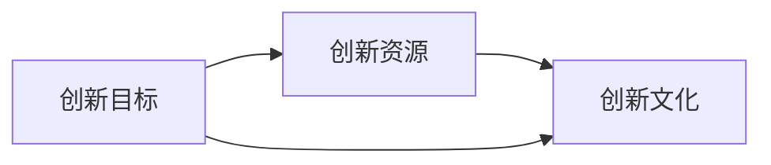
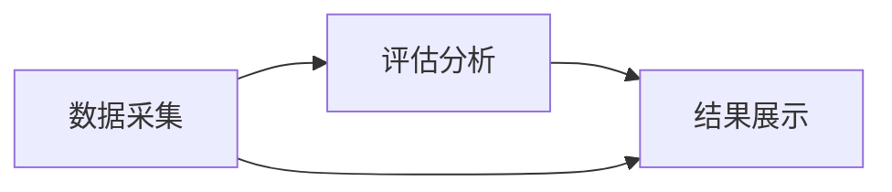

                 


```markdown
# 巴菲特的创新能力评估：开放式创新生态系统的价值

**关键词：** 创新能力评估、巴菲特、开放式创新、创新生态系统、创新模型

**摘要：** 本文探讨了巴菲特的创新能力评估方法，结合开放式创新生态系统，分析其价值。文章从背景、核心概念、算法原理、数学模型、系统架构、项目实战到最佳实践，全面解析创新能力评估的各个方面。

---

## 第一部分：创新能力评估的背景与意义

### 第1章：创新能力评估的背景介绍

#### 1.1 创新能力评估的核心概念
- **1.1.1 创新能力的定义与内涵**
  - 创新能力是指个体或组织在解决问题和创造新价值方面的能力。
- **1.1.2 创新能力评估的必要性**
  - 在快速变化的商业环境中，创新能力是企业生存和发展的关键。
- **1.1.3 创新能力评估的边界与外延**
  - 包括技术、管理、市场等多个方面，但需避免过度复杂化。

#### 1.2 巴菲特的创新理念与方法
- **1.2.1 巴菲特投资理念中的创新视角**
  - 巴菲特注重企业长期价值，关注管理团队的创新能力。
- **1.2.2 巴菲特对创新企业的评估标准**
  - 包括管理层能力、市场定位、竞争优势等。
- **1.2.3 巴菲特创新理念的案例分析**
  - 通过具体案例分析巴菲特如何评估创新企业。

### 第2章：开放式创新生态系统的概述

#### 2.1 开放式创新的定义与特点
- **2.1.1 开放式创新的定义**
  - 开放式创新强调企业与外部资源的协作，促进创新。
- **2.1.2 开放式创新的核心特征**
  - 跨界合作、资源共享、风险分担。
- **2.1.3 开放式创新与传统创新模式的区别**
  - 传统模式内部驱动，开放式创新外部协作。

#### 2.2 开放式创新生态系统
- **2.2.1 生态系统的定义**
  - 由企业、研究机构、政府等多方构成，共同推动创新。
- **2.2.2 生态系统的构成要素**
  - 包括资源、能力、文化等。
- **2.2.3 生态系统的价值**
  - 提高创新效率，降低风险，促进可持续发展。

---

## 第二部分：创新能力评估的核心概念与联系

### 第3章：创新能力评估的核心概念

#### 3.1 创新能力评估的模型与框架
- **3.1.1 创新能力评估模型**
  - 包括战略、执行、文化三个维度。
- **3.1.2 创新能力评估框架**
  - 结构化方法，包括目标设定、数据收集、分析评估。

#### 3.2 创新能力评估的核心要素
- **3.2.1 创新目标**
  - 明确的创新方向和目标。
- **3.2.2 创新资源**
  - 人力、资金、技术等资源的配置。
- **3.2.3 创新文化**
  - 组织内部鼓励创新的氛围。

#### 3.3 创新能力评估的工具与方法
- **3.3.1 问卷调查**
  - 收集员工对创新环境的反馈。
- **3.3.2 行为观察**
  - 观察员工在工作中的创新行为。
- **3.3.3 专家评估**
  - 由专家对企业的创新能力进行评分。

### 第4章：核心概念与联系

#### 4.1 创新能力评估的核心原理
- 创新能力是企业综合能力的体现，涉及多个维度的交互作用。

#### 4.2 创新能力评估的核心要素对比
```mermaid
| 要素 | 定义 | 属性 |
|---|---|---|
| 创新目标 | 明确的创新方向 | 战略性、可衡量性 |
| 创新资源 | 用于创新的资源 | 充足性、多样性 |
| 创新文化 | 组织文化 | 鼓励性、开放性 |
```

#### 4.3 创新能力评估的实体关系图


---

## 第三部分：创新能力评估的算法原理

### 第5章：创新能力评估的算法原理

#### 5.1 创新能力评估模型的算法
- 层次分析法（AHP）用于评估各维度的权重。
- 算法步骤：
  1. 构建判断矩阵。
  2. 计算权重向量。
  3. 计算一致性检验。

#### 5.2 算法实现
- 使用Python实现层次分析法，示例代码如下：

```python
import numpy as np

def calculate_weights(matrix):
    # 计算权重向量
    max_eigenvalue = np.linalg.eigvals(matrix).max()
    weights = (np.linalg.eig(matrix)[1].T * max_eigenvalue).real
    return weights / weights.sum()

matrix = np.array([
    [1, 2, 3],
    [0.5, 1, 2],
    [0.333, 0.5, 1]
])

weights = calculate_weights(matrix)
print(weights)
```

---

## 第四部分：创新能力评估的数学模型

### 第6章：创新能力评估的数学模型

#### 6.1 评估模型的数学公式
- 加权评分模型：
$$ \text{创新能力} = \sum_{i=1}^{n} w_i \cdot x_i $$
其中，\(w_i\) 是第i个因素的权重，\(x_i\) 是第i个因素的评分。

#### 6.2 数学模型的实现
- 示例：计算创新能力评分，权重为0.4、0.3、0.3，评分分别为80、70、90。
$$ \text{创新能力} = 0.4 \times 80 + 0.3 \times 70 + 0.3 \times 90 = 79 $$

---

## 第五部分：创新能力评估的系统架构

### 第7章：系统架构设计

#### 7.1 问题场景介绍
- 企业需要评估创新能力，选择构建一个基于开放式创新生态系统的评估平台。

#### 7.2 系统功能设计
- 数据采集模块：收集企业内外部数据。
- 评估分析模块：应用算法模型进行评估。
- 结果展示模块：生成可视化报告。

#### 7.3 系统架构图


---

## 第六部分：创新能力评估的项目实战

### 第8章：项目实战

#### 8.1 环境安装
- 安装Python和相关库（numpy, pandas）。

#### 8.2 核心代码实现
- 读取数据、计算权重、生成报告。

#### 8.3 案例分析
- 以某企业为例，详细说明评估过程和结果。

---

## 第七部分：创新能力评估的最佳实践

### 第9章：最佳实践

#### 9.1 小结
- 创新能力评估是企业持续改进的关键。

#### 9.2 注意事项
- 数据质量、模型选择、结果解释。

#### 9.3 拓展阅读
- 推荐书籍和论文，深入学习创新能力评估。

---

## 作者

**作者：AI天才研究院/AI Genius Institute & 禅与计算机程序设计艺术 /Zen And The Art of Computer Programming**

---

以上是文章的详细目录大纲结构。接下来，我将按照这个结构撰写完整的文章内容，确保每个部分都详细且有条理，帮助读者全面理解巴菲特的创新能力评估以及开放式创新生态系统的价值。
```

