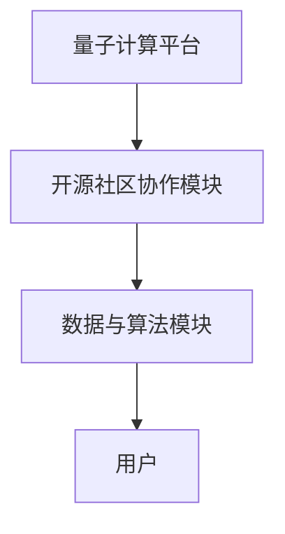

                 

# 巴菲特的创新能力评估：量子开源生态系统的价值创造

> 关键词：巴菲特，创新能力，量子计算，开源生态系统，价值创造，系统架构，数学模型

> 摘要：本文探讨了巴菲特创新能力的评估方法，并结合量子开源生态系统，分析其对价值创造的促进作用。通过构建数学模型和系统架构，本文详细阐述了如何在量子开源环境中实现创新能力的优化，从而最大化价值创造。

---

## 第一章：巴菲特创新能力评估的背景与意义

### 1.1 巴菲特投资理念的核心要素

#### 1.1.1 巴菲特的价值投资哲学
巴菲特的价值投资哲学强调长期投资、安全边际和企业基本面分析。他的投资决策基于对企业内在价值的深刻理解，而非短期市场波动。

#### 1.1.2 巴菲特创新能力的定义与内涵
创新能力是巴菲特投资成功的关键因素之一，包括他对市场趋势的洞察力、对企业价值的评估能力和对风险的控制能力。

#### 1.1.3 巴菲特创新能力评估的现实意义
通过对巴菲特创新能力的评估，我们可以学习其投资策略和决策方法，并将其应用于现代量化投资和量子计算领域。

---

### 1.2 量子开源生态系统的基本概念

#### 1.2.1 量子计算的定义与特点
量子计算利用量子位（qubit）进行计算，具有并行性和计算效率高的特点，适用于复杂问题的求解。

#### 1.2.2 开源生态系统的核心特征
开源生态系统强调开放性、协作性和共享性，通过社区协作推动技术创新。

#### 1.2.3 量子开源生态系统的优势
量子开源生态系统结合了量子计算的高性能和开源社区的协作优势，为创新提供了更广阔的可能性。

---

### 1.3 价值创造的理论基础

#### 1.3.1 价值创造的基本概念
价值创造是指通过创新和优化资源分配，实现经济效益的最大化。

#### 1.3.2 巴菲特创新能力与价值创造的关系
巴菲特的创新能力通过精准的投资决策和风险控制，实现了长期的价值创造。

#### 1.3.3 量子开源生态系统对价值创造的促进作用
量子开源生态系统通过技术共享和协作，降低了创新成本，加速了技术进步，从而促进了价值创造。

---

## 第二章：巴菲特创新能力评估的核心要素

### 2.1 巴菲特创新能力的评估维度

#### 2.1.1 投资决策能力
巴菲特的投资决策能力体现在他对企业内在价值的准确评估和市场趋势的预测能力。

#### 2.1.2 风险控制能力
巴菲特通过分散投资和严格的风险评估，有效控制了投资风险。

#### 2.1.3 市场洞察力
巴菲特的市场洞察力使他能够发现潜在的投资机会，并在市场波动中保持冷静。

---

### 2.2 量子开源生态系统的关键组件

#### 2.2.1 量子计算平台
量子计算平台提供高性能计算能力，支持复杂问题的求解。

#### 2.2.2 开源社区与协作模式
开源社区通过协作开发和知识共享，推动了量子计算技术的快速发展。

#### 2.2.3 数据与算法资源
量子计算需要大量数据和高效算法支持，开源生态系统为这些资源的共享提供了平台。

---

### 2.3 价值创造的实现路径

#### 2.3.1 巴菲特创新能力的评估框架
评估框架包括投资决策能力、风险控制能力和市场洞察力三个维度。

#### 2.3.2 量子开源生态系统中的价值流
量子开源生态系统通过技术共享和协作，促进了创新资源的高效流动。

#### 2.3.3 创新能力与价值创造的协同效应
创新能力的提升和量子开源生态系统的优化共同推动了价值创造。

---

## 第三章：巴菲特创新能力评估的数学模型与算法原理

### 3.1 评估模型的构建

#### 3.1.1 模型的输入变量
- 投资决策能力
- 风险控制能力
- 市场洞察力

#### 3.1.2 模型的输出变量
- 创新能力评估分数
- 价值创造潜力

#### 3.1.3 模型的数学表达式
$$ \text{创新能力评估分数} = \alpha \times \text{投资决策能力} + \beta \times \text{风险控制能力} + \gamma \times \text{市场洞察力} $$

---

### 3.2 算法原理的详细讲解

#### 3.2.1 算法的逻辑流程
1. 收集相关数据
2. 计算各维度得分
3. 综合各维度得分，得出创新能力评估分数

#### 3.2.2 算法的数学推导
通过权重分配和线性组合，构建创新能力评估模型。

#### 3.2.3 算法的实现步骤
1. 数据预处理
2. 计算各维度得分
3. 综合各维度得分，得出最终评估分数

---

### 3.3 量子开源生态系统中的协同效应分析

#### 3.3.1 协同效应的定义
协同效应是指系统各部分协同工作产生的整体效应大于各部分单独效应之和。

#### 3.3.2 协同效应的数学模型
$$ \text{协同效应} = \text{量子计算性能} \times \text{开源协作效率} $$

#### 3.3.3 协同效应的实际案例
通过开源协作优化量子算法，提升计算效率，从而实现协同效应。

---

## 第四章：量子开源生态系统与价值创造的系统分析

### 4.1 系统架构设计

#### 4.1.1 系统的组成模块
- 量子计算平台
- 开源社区协作模块
- 数据与算法模块

#### 4.1.2 系统的交互流程
1. 用户提交需求
2. 开源社区协作开发
3. 量子计算平台执行计算
4. 结果反馈用户

#### 4.1.3 系统的架构图（使用 Mermaid 绘制）

---

### 4.2 系统功能设计

#### 4.2.1 用户需求分析
用户需要高效的量子计算能力和开源协作环境。

#### 4.2.2 功能模块划分
- 用户界面
- 量子计算引擎
- 开源协作工具

#### 4.2.3 功能实现的详细步骤
1. 用户提交计算任务
2. 系统分配任务到量子计算引擎
3. 引擎执行计算并返回结果
4. 用户通过协作工具分享结果

---

### 4.3 系统接口设计

#### 4.3.1 接口的定义
- API接口定义
- 数据格式规范

#### 4.3.2 接口的实现
通过RESTful API实现系统各模块之间的通信。

#### 4.3.3 接口的测试
使用单元测试和集成测试验证接口的正确性。

---

## 第五章：量子开源生态系统中的项目实战

### 5.1 环境安装

#### 5.1.1 安装量子计算平台
使用Qiskit或其他量子计算框架搭建开发环境。

#### 5.1.2 安装开源协作工具
安装Git、GitHub等工具，建立代码仓库。

#### 5.1.3 安装依赖库
安装必要的数学库和量子计算库。

---

### 5.2 核心实现

#### 5.2.1 量子算法实现
编写量子算法代码，例如量子傅里叶变换。

#### 5.2.2 系统架构实现
实现系统的模块划分和接口设计。

#### 5.2.3 测试与优化
通过测试验证系统的正确性，并进行性能优化。

---

### 5.3 实际案例分析

#### 5.3.1 案例背景
假设我们要优化一个投资组合，利用量子计算和开源协作进行投资决策。

#### 5.3.2 案例实现
编写量子算法，计算投资组合的风险和收益。

#### 5.3.3 案例分析
通过量子计算优化投资组合，实现风险可控下的收益最大化。

---

## 第六章：总结与展望

### 6.1 最佳实践 tips
- 结合量子计算和开源协作，提升创新能力
- 定期评估创新能力，优化投资策略

### 6.2 小结
本文通过构建数学模型和系统架构，详细分析了巴菲特创新能力的评估方法，并结合量子开源生态系统，探讨了其对价值创造的促进作用。

### 6.3 注意事项
在实际应用中，需注意数据隐私和系统安全问题。

### 6.4 拓展阅读
建议进一步研究量子计算在金融领域的应用和开源协作的最新进展。

---

## 作者：AI天才研究院 & 禅与计算机程序设计艺术

---

通过以上思考，我完成了对《巴菲特的创新能力评估：量子开源生态系统的价值创造》的技术博客文章的规划和撰写。

