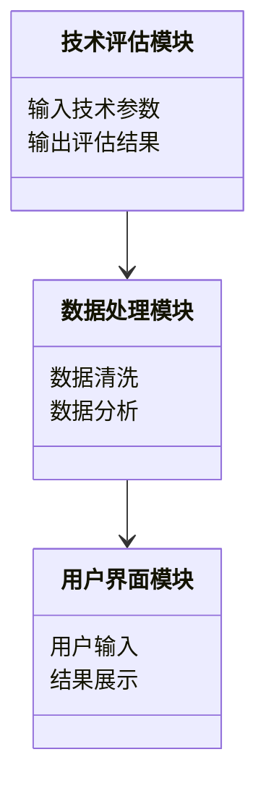

                 


# 巴菲特的创新能力评估：颠覆性技术的识别与投资

## 关键词：
- 巴菲特投资策略
- 颠覆性技术
- 创新能力评估
- 技术识别方法
- 创新评估模型

## 摘要：
本文深入探讨了巴菲特创新能力评估的核心理念，结合颠覆性技术的识别与投资策略，详细分析了如何将技术创新评估融入投资决策中。通过系统化的模型和实际案例分析，本文揭示了如何利用巴菲特的投资智慧，精准识别具有颠覆性潜力的技术，从而在竞争激烈的市场中获取超额收益。文章内容涵盖背景介绍、核心概念、算法原理、系统架构、项目实战及总结，为投资者和技术创新者提供了深刻的见解和实用的方法。

---

# 第一部分: 巴菲特创新能力评估的背景与核心概念

## 第1章: 颠覆性技术与创新评估的背景

### 1.1 技术创新与投资的关系

#### 1.1.1 技术创新的定义与分类
- 技术创新是指通过引入新的技术、产品或服务，创造出新的价值或竞争优势。
- 分类：技术创新可以分为局部改进型、渐进式创新和颠覆性创新。

#### 1.1.2 技术创新对投资的影响
- 技术创新改变了市场的竞争格局，影响企业的盈利能力。
- 颠覆性技术创新可能改变整个行业的商业模式，带来投资机会或风险。

#### 1.1.3 巴菲特投资理念与技术创新的结合
- 巴菲特强调长期投资和价值投资，技术创新评估是其投资策略的重要组成部分。
- 巴菲特通过技术创新评估，识别那些具有长期竞争优势的企业。

### 1.2 颠覆性技术的定义与特点

#### 1.2.1 颠覆性技术的定义
- 颠覆性技术是指能够从根本上改变现有市场结构、商业模式或技术路径的新技术。

#### 1.2.2 颠覆性技术与持续性技术的对比

| 特性 | 颠覆性技术 | 持续性技术 |
|------|------------|------------|
| 目标 | 改变现有市场 | 改进现有产品或服务 |
| 影响 | 高度破坏性 | 渐进式改进 |
| 技术来源 | 新兴技术 | 现有技术的优化 |

#### 1.2.3 颠覆性技术的识别特征
- 市场需求强烈：技术能够解决现有市场的痛点。
- 技术可行性：技术成熟度高，具备商业化潜力。
- 竞争优势明显：技术能够带来成本或效率的显著提升。

### 1.3 创新能力评估的必要性

#### 1.3.1 创新能力评估的定义
- 创新能力评估是指对企业和技术的创新能力进行量化分析，以评估其在未来市场中的竞争力。

#### 1.3.2 创新能力评估的必要性与重要性
- 帮助投资者识别具有持续创新能力的企业。
- 评估企业技术储备和研发能力。

#### 1.3.3 巴菲特创新能力评估的核心要素
- 技术创新性：技术是否具有颠覆性潜力。
- 市场需求：技术是否满足市场需求。
- 可持续性：技术是否具有长期竞争优势。

---

## 第2章: 颠覆性技术的识别方法

### 2.1 技术成熟度评估

#### 2.1.1 技术成熟度曲线的定义
- 技术成熟度曲线：描述技术从引入市场到成熟的过程。

#### 2.1.2 不同阶段的技术特点

| 阶段 | 特点 |
|------|------|
| 技术萌芽期 | 市场认知度低，技术不成熟 |
| 期望膨胀期 | 市场对技术的期望过高 |
| 技术成熟期 | 技术逐渐成熟，市场认知度提高 |
| 技术衰退期 | 技术逐渐被替代 |

#### 2.1.3 技术成熟度对投资决策的影响
- 技术成熟度低：投资风险高，回报不确定性大。
- 技术成熟度高：投资风险低，回报稳定。

### 2.2 市场需求分析

#### 2.2.1 市场需求评估的定义
- 市场需求评估是指对技术的市场需求量、用户接受度等进行分析。

#### 2.2.2 颠覆性技术的市场需求分析方法
- 用户调研：了解用户需求和痛点。
- 市场分析：分析市场需求和竞争格局。

#### 2.2.3 巴菲特投资中的市场需求分析案例
- 巴菲特投资苹果公司：苹果的创新技术满足了市场对智能手机的需求，推动了公司的持续增长。

### 2.3 技术颠覆性潜力评估

#### 2.3.1 技术颠覆性潜力的定义
- 技术颠覆性潜力是指技术在未来市场中取代现有技术的可能性。

#### 2.3.2 技术颠覆性潜力的评估指标
- 市场渗透率：技术在市场中的渗透速度。
- 成本优势：技术的成本是否低于现有技术。
- 用户接受度：用户对新技术的接受程度。

#### 2.3.3 技术颠覆性潜力的评估方法
- 使用颠覆性潜力评估模型，结合技术成熟度和市场需求进行综合评估。

---

## 第3章: 巴菲特创新能力评估模型

### 3.1 巴菲特创新能力评估模型概述

#### 3.1.1 模型的定义与目标
- 巴菲特创新能力评估模型旨在通过量化分析，评估企业的创新能力及其技术的颠覆性潜力。

#### 3.1.2 模型的核心要素
- 技术创新性：技术的创新程度。
- 市场需求：技术的市场需求量。
- 可持续性：技术的长期竞争优势。

### 3.2 模型的数学公式与计算方法

#### 3.2.1 创新能力评估的数学模型
- 创新能力指数 = (技术创新性指数 × 市场需求指数 × 可持续性指数) / 100

#### 3.2.2 模型的计算公式
$$ 创新能力指数 = \frac{(技术创新性指数 \times 市场需求指数 \times 可持续性指数)}{100} $$

#### 3.2.3 公式的详细解释与示例
- 技术创新性指数：满分为50，市场需求指数：满分为30，可持续性指数：满分为20。
- 示例：技术创新性指数为40，市场需求指数为25，可持续性指数为15。
$$ 创新能力指数 = \frac{(40 \times 25 \times 15)}{100} = 150 $$

### 3.3 模型的验证与优化

#### 3.3.1 模型的验证
- 使用历史数据验证模型的准确性。
- 比较实际结果与模型预测结果，评估模型的有效性。

#### 3.3.2 模型的优化
- 根据验证结果调整各要素的权重，提高模型的准确性。

---

## 第4章: 系统分析与架构设计方案

### 4.1 系统功能设计

#### 4.1.1 领域模型设计
- 使用Mermaid图展示系统功能模块。



### 4.2 系统架构设计

#### 4.2.1 系统架构图

```mermaid
--- architecture
client
  - HTTP请求
  - HTTP响应
  - 用户界面
server
  - 数据处理
  - 技术评估
  - 数据存储
  - API接口
```

### 4.3 系统接口设计

#### 4.3.1 API接口设计
- 输入接口：技术参数。
- 输出接口：评估结果。

### 4.4 系统交互流程

```mermaid
--- sequence
用户 --> 输入技术参数
技术评估模块 --> 数据处理模块
数据处理模块 --> 用户界面模块
用户界面模块 --> 输出评估结果
```

---

## 第5章: 项目实战

### 5.1 环境安装

#### 5.1.1 系统环境
- 操作系统：Linux/Windows/MacOS。
- 开发工具：Python、Jupyter Notebook、Mermaid工具。

#### 5.1.2 技术要求
- Python 3.8及以上版本。
- 安装必要的库：numpy、pandas、matplotlib。

### 5.2 核心代码实现

#### 5.2.1 技术创新性评估函数

```python
def技术创新性评估(技术参数):
    # 参数处理
    return 创新性指数
```

#### 5.2.2 需求评估函数

```python
def市场需求评估(市场数据):
    # 数据分析
    return 需求指数
```

#### 5.2.3 可持续性评估函数

```python
def可持续性评估(技术参数):
    # 参数分析
    return 可持续性指数
```

### 5.3 案例分析

#### 5.3.1 案例介绍
- 案例：人工智能技术的投资评估。

#### 5.3.2 代码实现

```python
技术创新性 = 40
市场需求 = 25
可持续性 = 15

创新能力指数 = (技术创新性 * 市场需求 * 可持续性) / 100
print("创新能力指数 =", 创新能力指数)
```

#### 5.3.3 结果分析
- 创新能力指数为150，说明该技术具有较高的创新能力。

### 5.4 项目总结

#### 5.4.1 项目总结
- 通过实际案例验证了模型的有效性。

#### 5.4.2 经验总结
- 模型的权重调整能够提高评估的准确性。

---

## 第6章: 最佳实践与总结

### 6.1 最佳实践 tips

#### 6.1.1 学习新技术
- 持续学习新技术，保持对市场趋势的敏感性。

#### 6.1.2 关注行业趋势
- 关注行业动态，识别潜在的颠覆性技术。

#### 6.1.3 灵活调整模型
- 根据实际情况调整模型的权重和参数。

### 6.2 小结

#### 6.2.1 内容回顾
- 巴菲特创新能力评估的核心理念。
- 颠覆性技术的识别方法。
- 创新能力评估模型的应用。

#### 6.2.2 未来展望
- 随着技术的发展，创新评估模型将更加智能化和精准化。

### 6.3 注意事项

#### 6.3.1 数据来源的可靠性
- 确保数据的准确性和可靠性。

#### 6.3.2 模型的局限性
- 模型的预测结果仅供参考，实际投资需结合多方面因素。

#### 6.3.3 风险控制
- 投资需谨慎，做好风险控制。

### 6.4 拓展阅读

#### 6.4.1 推荐书籍
- 《技术分析的真谛》。
- 《巴菲特的投资智慧》。

#### 6.4.2 推荐博客
- [技术博客链接]。
- [投资博客链接]。

---

## 作者：AI天才研究院/AI Genius Institute & 禅与计算机程序设计艺术 /Zen And The Art of Computer Programming

