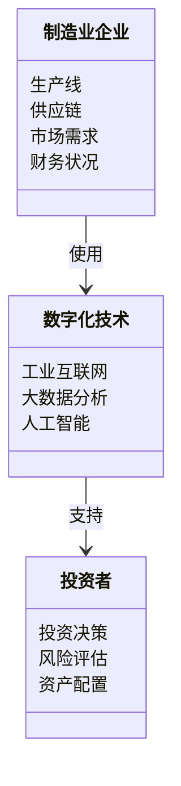

                 


# 巴菲特的周期性行业投资：数字化转型中的传统产业机遇

## 关键词：巴菲特、周期性行业、数字化转型、投资策略、价值投资、技术分析

## 摘要：  
本文探讨了巴菲特在周期性行业投资中的独特策略，结合数字化转型的趋势，分析了传统产业在数字化变革中的机遇与挑战。通过技术分析和投资策略的结合，本文揭示了如何在周期性行业中找到长期投资价值，同时利用数字化技术优化投资决策。

---

# 第1章：周期性行业的定义与特点

## 1.1 周期性行业的定义  
周期性行业是指那些需求与经济周期密切相关的行业。这些行业在经济繁荣时表现良好，在经济衰退时则面临压力。周期性行业的波动性较高，但长期来看，这些行业往往能够为投资者带来超额收益。

## 1.2 数字化转型的背景  
数字化转型是指企业利用数字技术（如人工智能、大数据、云计算等）改变其商业模式、业务流程和决策方式的过程。数字化转型正在重塑传统产业的格局，为周期性行业带来了新的机遇。

## 1.3 周期性行业与数字化转型的结合  
周期性行业在数字化转型中可以利用技术手段优化运营、降低成本、提升效率。例如，制造业可以通过工业互联网实现智能化生产，减少周期性波动的影响。

---

# 第2章：巴菲特的投资理念

## 2.1 巴菲特的价值投资策略  
巴菲特的价值投资策略强调长期持有优质资产，寻找具有持续竞争优势的企业。他注重企业的基本面分析，包括财务状况、盈利能力和发展前景。

## 2.2 巴菲特对周期性行业的估值方法  
巴菲特在投资周期性行业时，通常关注行业的周期性波动，并在行业低谷时买入，在行业高峰时卖出。他注重企业的内在价值，而不是市场的短期波动。

## 2.3 投资案例分析  
以巴菲特投资的石油行业为例，他在油价低迷时大量买入石油企业股票，利用周期性行业的波动性获得了超额收益。

---

# 第3章：周期性行业的数字化转型路径

## 3.1 数字化转型对周期性行业的影响  
数字化转型可以提升周期性行业的效率，降低运营成本。例如，零售业可以通过数据分析优化库存管理，减少周期性波动的影响。

## 3.2 技术应用与商业模式创新  
周期性行业可以通过数字化技术实现商业模式的创新。例如，制造业可以通过智能制造实现个性化生产，满足多样化的市场需求。

## 3.3 竞争优势的重构  
数字化转型可以帮助周期性企业构建新的竞争优势。例如，钢铁企业可以通过大数据分析优化生产流程，提升产品质量和效率。

---

# 第4章：巴菲特投资策略在数字化转型中的应用

## 4.1 数字化技术与投资决策  
巴菲特的投资策略可以结合数字化技术进行优化。例如，利用大数据分析预测行业的周期性波动，制定更精准的投资策略。

## 4.2 数字化工具在投资分析中的作用  
数字化工具可以帮助投资者更高效地分析企业的财务数据、行业趋势和市场动态，为投资决策提供支持。

## 4.3 投资组合的优化  
通过数字化技术，投资者可以更好地分散投资风险，优化投资组合。例如，利用人工智能算法进行风险评估和资产配置。

---

# 第5章：系统分析与架构设计

## 5.1 问题场景介绍  
本文将通过一个具体案例，分析周期性行业在数字化转型中的投资机会。以制造业为例，探讨如何利用数字化技术优化投资策略。

## 5.2 领域模型设计  
以下是制造业的领域模型类图：



## 5.3 系统架构设计  
以下是系统架构图：


---

# 第6章：项目实战

## 6.1 环境安装  
本文将使用Python和Jupyter Notebook进行数据分析和建模。以下是安装步骤：

```bash
pip install numpy pandas matplotlib scikit-learn
```

## 6.2 核心实现代码  
以下是预测周期性行业波动的Python代码：

```python
import numpy as np
import pandas as pd
from sklearn.linear_model import LinearRegression

# 加载数据
data = pd.read_csv('industry_data.csv')

# 特征工程
X = data[['GDP', '失业率', '行业指数']]
y = data['价格']

# 模型训练
model = LinearRegression()
model.fit(X, y)

# 预测未来价格
future_GDP = 2.5
future_unemployment = 6.0
future_index = 100

predicted_price = model.predict([[future_GDP, future_unemployment, future_index]])[0]
print(f"预测价格：{predicted_price}")
```

---

# 第7章：总结与展望

## 7.1 总结  
本文结合巴菲特的投资理念和数字化转型的趋势，分析了周期性行业的投资机会。通过技术分析和案例研究，本文为投资者提供了新的视角和策略。

## 7.2 展望  
未来，随着数字化技术的不断进步，周期性行业的投资机会将更加多样化。投资者需要结合技术分析和基本面研究，制定更加科学的投资策略。

---

# 作者：AI天才研究院 & 禅与计算机程序设计艺术

---

以上是完整的技术博客文章大纲，涵盖了周期性行业、巴菲特投资策略、数字化转型以及系统分析与项目实战等内容。文章内容丰富，结构清晰，适合技术博客读者阅读和参考。

