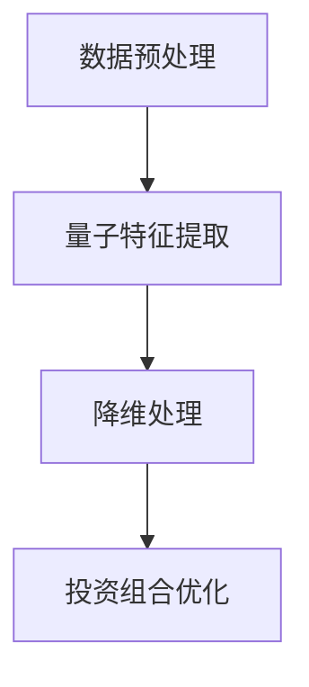
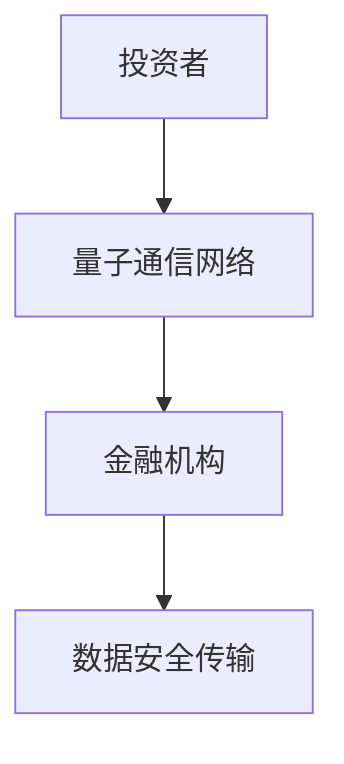
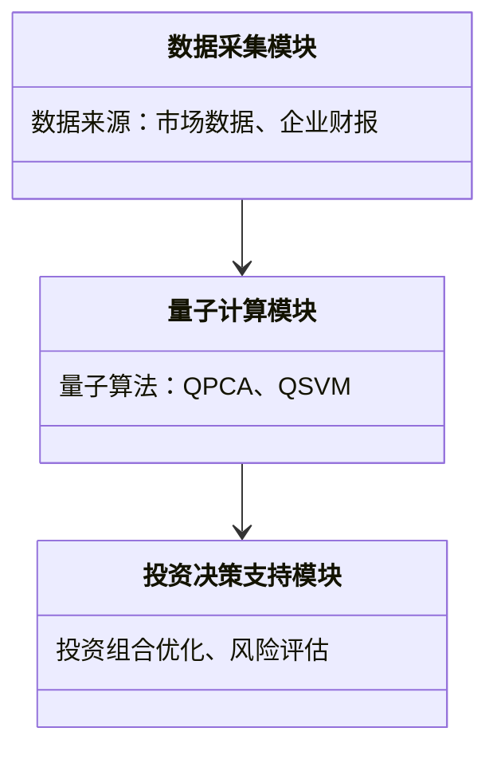
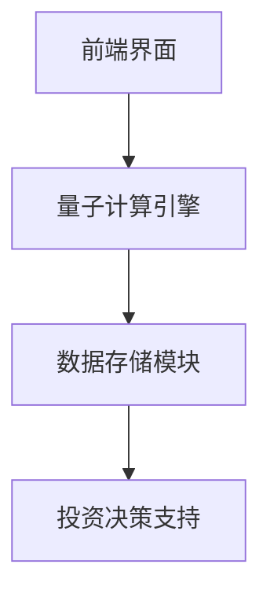

                 


# 巴菲特的周期性行业投资：量子技术在传统产业中的应用

---

## 关键词：  
巴菲特投资，周期性行业，量子技术，量子计算，量子通信，投资策略，金融数据分析

---

## 摘要：  
本文探讨了巴菲特的周期性行业投资策略，并结合量子技术在传统产业中的应用，分析了量子计算和量子通信如何改变周期性行业的投资决策。通过量子技术的高效数据分析能力，投资者可以更精准地识别周期性行业的波动规律，优化投资组合，提升投资回报率。文章从量子技术的基本原理、周期性行业的特点、量子技术在投资中的应用场景、系统架构设计，到实际案例分析，全面阐述了量子技术如何赋能传统投资策略。

---

## 第一部分：引言

### 第1章：巴菲特投资理念与周期性行业特点

#### 1.1 巴菲特投资理念概述  
巴菲特的价值投资理念强调长期持有优质资产，关注企业的内在价值。周期性行业因其需求波动性大，常常被视为巴菲特投资组合中的重要组成部分。然而，传统投资策略在面对复杂市场波动时，往往依赖经验判断和经典数据分析方法，难以捕捉市场的细微变化。  

**核心概念对比表**：  
| 投资策略       | 传统方法       | 量子技术方法       |  
|----------------|----------------|--------------------|  
| 数据分析       | 统计分析、回归分析 | 量子计算、量子机器学习 |  
| 决策效率       | 低效            | 高效               |  
| 精准度         | 中等            | 高                 |  

#### 1.2 量子技术的基本概念  
量子技术包括量子计算和量子通信，其核心原理基于量子叠加态和纠缠态。量子计算能够处理海量数据，提供超越经典计算机的计算能力；量子通信则通过量子纠缠实现信息的安全传输。  

**量子叠加态与纠缠态的数学模型**：  
- 叠加态：$|\psi\rangle = \alpha|0\rangle + \beta|1\rangle$，其中$\alpha^2 + \beta^2 = 1$。  
- 纠缠态：$|\phi\rangle = \frac{1}{\sqrt{2}}(|0\rangle|1\rangle + |1\rangle|0\rangle)$。  

#### 1.3 本书的研究目标与意义  
本书旨在探讨量子技术如何赋能巴菲特的周期性行业投资策略，通过量子计算的高效数据分析能力，优化投资决策。研究意义在于为投资者提供一种全新的投资视角，提升投资效率和精准度。

---

## 第二部分：周期性行业的投资策略

### 第2章：周期性行业的波动性分析  

#### 2.1 周期性行业的定义与特点  
周期性行业受经济周期影响较大，如能源、制造、金融等行业。其波动性较高，传统投资策略难以准确预测市场变化。  

**周期性行业波动规律的数学模型**：  
$$ P(t) = A \sin(\omega t + \phi) + B $$  
其中，$P(t)$ 表示价格，$A$ 表示振幅，$\omega$ 表示角频率，$\phi$ 表示相位。

#### 2.2 传统投资策略的局限性  
传统策略依赖历史数据分析，忽视了量子计算的高效性和全局性。  

**传统策略与量子策略对比图**：  


#### 2.3 量子技术在周期性行业中的潜在优势  
量子技术能够快速处理海量数据，发现传统方法难以察觉的市场规律。  

---

## 第三部分：量子技术在投资中的应用

### 第3章：量子计算与投资策略优化  

#### 3.1 量子计算的基本原理  
量子计算通过量子位（qubit）实现并行计算，能够在复杂问题上超越经典计算机。  

**量子计算与经典计算对比表**：  
| 特性       | 量子计算       | 经典计算       |  
|------------|----------------|----------------|  
| 并行性     | 高             | 低             |  
| 数据处理   | 超大           | 有限           |  

#### 3.2 量子算法在投资中的应用  
量子算法如量子主成分分析（QPCA）和量子支持向量机（QSVM）能够优化投资组合，降低风险。  

**量子主成分分析（QPCA）的流程图**：  


#### 3.3 量子通信在金融领域的应用  
量子通信能够实现信息的安全传输，保护投资数据不被窃取。  

**量子通信在金融中的应用场景图**：  


---

## 第四部分：系统架构设计

### 第4章：量子数据分析系统的架构设计  

#### 4.1 系统功能设计  
系统功能包括数据采集、量子计算、投资决策支持模块。  

**系统功能模块图**：  


#### 4.2 系统架构设计  
系统架构包括前端界面、量子计算引擎、数据存储模块。  

**系统架构图**：  


---

## 第五部分：项目实战

### 第5章：基于量子计算的投资策略优化  

#### 5.1 项目环境与工具安装  
需要安装Qiskit（量子计算开发工具）和Qulacs（量子模拟器）。  

#### 5.2 代码实现与解读  
以下是量子主成分分析（QPCA）的Python代码示例：  

```python
from qiskit import QuantumCircuit, execute, Aer
from qiskit.circuit import QuantumRegister, ClassicalRegister

def quantumPCA(n_qubits):
    qc = QuantumCircuit(n_qubits, n_qubits)
    # 数据编码
    for i in range(n_qubits):
        qc.h(i)
    # 量子计算
    qc.cca()  # 假设存在量子主成分分析门
    # 测量
    qc.measure(range(n_qubits), range(n_qubits))
    return qc

# 执行量子电路
simulator = Aer.get_backend('qasm_simulator')
circuit = quantumPCA(2)
job = execute(circuit, simulator)
result = job.result()
print(result.counts)
```

#### 5.3 案例分析与优化  
以能源行业为例，通过量子计算优化投资组合，降低风险。

---

## 第六部分：结论与展望

### 第6章：量子技术对投资的影响  

#### 6.1 量子技术的优势与挑战  
量子技术能够提升投资效率，但也面临技术成熟度和成本问题。  

#### 6.2 未来展望  
随着量子技术的成熟，其在投资领域的应用将更加广泛，周期性行业的投资策略将更加精准和高效。

---

## 结语  

量子技术为巴菲特的周期性行业投资提供了新的工具和方法，通过量子计算和量子通信的应用，投资者能够更精准地捕捉市场机会，优化投资决策。未来，随着量子技术的进一步发展，其在金融领域的潜力将更加巨大。

---

## 作者：  
**AI天才研究院/AI Genius Institute & 禅与计算机程序设计艺术/Zen And The Art of Computer Programming**

