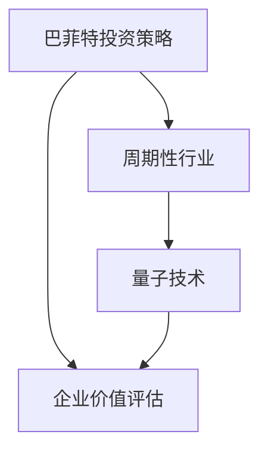

                 

# 巴菲特的周期性行业投资：量子技术在传统产业升级中的机遇

> 关键词：巴菲特，周期性行业投资，量子技术，产业升级，量子计算，量子通信

> 摘要：本文探讨了巴菲特在周期性行业的投资策略，并分析了量子技术如何推动传统产业的升级。通过详细的技术分析和实际案例，展示了量子技术在制造业、能源、金融等领域的应用潜力，为投资者提供了新的投资机会和策略。

---

## 第一章：背景介绍

### 1.1 核心概念与术语说明

#### 巴菲特的价值投资理论
巴菲特的价值投资理论强调长期投资和基本面分析，寻找具有持续竞争优势的企业，以合理的价格买入并长期持有。其核心理念包括：
- **安全边际**：以低于内在价值的价格买入股票。
- **企业护城河**：寻找具有竞争优势，能够长期保持高盈利能力的企业。

#### 周期性行业
周期性行业是指其业绩波动与经济周期高度相关的行业。在经济繁荣时期表现良好，衰退时期则可能亏损。典型周期性行业包括：
- 制造业
- 建筑业
- 信息技术
- 金融服务

#### 量子技术
量子技术利用量子力学原理进行计算和通信，主要包括量子计算和量子通信。其核心优势包括：
- **计算速度**：量子计算机在某些复杂问题上远超经典计算机。
- **安全性**：量子通信提供无条件安全的通信方式。

### 1.2 问题背景与问题描述

周期性行业在经济波动中具有高风险和高回报的特性。巴菲特通过分析行业周期和企业基本面，寻找在周期低谷时具有投资价值的企业。然而，传统行业在数字化转型中面临效率低下和创新能力不足的挑战。量子技术的出现为这些行业提供了新的发展机遇，同时也带来了新的投资机会和挑战。

### 1.3 问题解决与边界外延

量子技术的应用可以帮助周期性行业优化生产流程、提高效率和创新能力，从而增强企业的竞争力和抗风险能力。本文将分析量子技术在传统产业中的应用，探讨其对投资策略的影响。

### 1.4 核心要素与概念结构

| **要素**       | **描述**                                                                 |
|-----------------|--------------------------------------------------------------------------|
| 巴菲特投资策略 | 价值投资、安全边际、企业护城河                                           |
| 量子技术       | 量子计算、量子通信                                                     |
| 周期性行业     | 制造业、能源、金融等                                                   |

**概念结构图：**

---

## 第二章：量子技术的基本原理与应用

### 2.1 量子计算的原理

量子计算利用量子位（qubit）进行计算，通过叠加态和纠缠态实现并行计算。其基本原理如下：

1. **叠加态**：量子位可以同时处于多个状态。
2. **纠缠态**：多个量子位之间可以形成纠缠，信息传递速度快。
3. **量子门**：通过量子门操作改变量子态，完成计算。

量子计算的数学模型可以用矩阵表示，如：

$$ U = \begin{bmatrix} \cos\theta & -\sin\theta \\ \sin\theta & \cos\theta \end{bmatrix} $$

### 2.2 量子通信的技术优势

量子通信利用量子态进行信息传递，具有以下优势：

- **安全性**：基于量子力学的不可克隆性，提供无条件安全的通信方式。
- **高效性**：量子通信的传输速度接近光速，远超经典通信。

### 2.3 量子技术在传统行业的应用

#### 制造业
量子计算可以优化生产流程，降低生产成本。例如，使用量子算法优化供应链管理。

#### 能源
量子技术可以帮助优化能源分配和存储，提高能源利用效率。

#### 金融
量子计算可以用于风险评估和投资组合优化，提升金融分析效率。

---

## 第三章：量子技术对传统产业的升级作用

### 3.1 量子计算在制造业中的应用

制造业通过量子计算可以实现生产流程的优化，降低成本和提高效率。例如，使用量子算法优化生产调度问题。

### 3.2 量子通信在能源行业的应用

量子通信可以用于能源网络的安全监控，提高能源传输的安全性和效率。

### 3.3 量子技术对金融行业的优化

量子计算可以用于金融市场的预测和投资组合优化，帮助投资者做出更明智的投资决策。

---

## 第四章：产业升级中的投资机会

### 4.1 巴菲特投资策略的重构

量子技术的应用为周期性行业带来了新的投资机会。投资者需要重新评估企业的竞争优势，关注企业是否能够利用量子技术提升竞争力。

### 4.2 投资策略的调整

投资者应关注具有量子技术研发能力的企业，同时评估其在行业周期中的位置。例如，在经济衰退时期投资具有量子技术优势的企业，可能在经济复苏时获得超额收益。

---

## 第五章：结论与展望

### 5.1 量子技术的未来发展趋势

随着量子计算和量子通信技术的不断进步，其应用范围将更加广泛，对传统产业的升级作用也将更加显著。

### 5.2 投资建议与风险管理

投资者应密切关注量子技术的发展，合理配置投资组合，分散风险。同时，注重企业的长期竞争优势，避免短期波动影响投资决策。

---

## 参考文献

-巴菲特的《聪明的投资者》
-《量子计算入门》
-《量子通信技术与应用》

---

**作者：AI天才研究院/AI Genius Institute & 禅与计算机程序设计艺术/Zen And The Art of Computer Programming**

---

**Note**: 以上内容为基于用户要求的思考过程和文章框架，实际撰写时将根据具体需求进行调整和补充。

