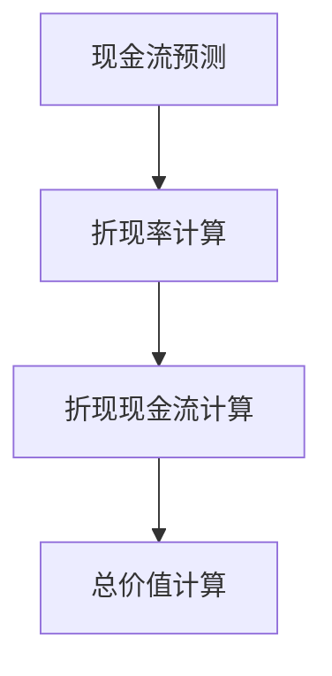
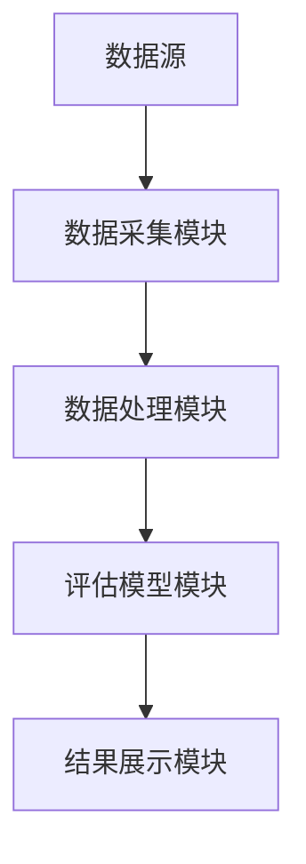

                 


# 巴菲特的品牌价值投资理念

## 关键词：巴菲特，品牌价值，价值投资，投资策略，财务分析

## 摘要：本文深入探讨了巴菲特的品牌价值投资理念，从其核心原理到实际应用，结合技术方法，分析如何将品牌价值评估融入投资决策，帮助投资者做出更明智的选择。

---

# 第一部分：背景介绍

## 第1章：价值投资的起源与发展

### 1.1 价值投资的定义与核心理念
- 价值投资的起源
- 巴菲特的价值投资方法论
- 品牌价值的定义与影响

### 1.2 巴菲特投资理念的演变
- 早期投资策略
- 后期成熟策略
- 品牌价值的重要性

## 第2章：品牌价值的核心概念与评估指标

### 2.1 品牌价值的定义与特征
- 品牌价值的定义
- 品牌价值的核心特征对比表
- 品牌价值的评估维度

### 2.2 品牌价值与投资的关系
- 品牌价值对投资决策的影响
- 品牌价值的长期投资价值
- 品牌价值与企业竞争优势的结合

---

# 第二部分：核心概念与联系

## 第3章：价值投资的核心原则

### 3.1 高质量企业的定义
- 市场地位与竞争优势
- 财务健康状况的评估

### 3.2 品牌价值评估的关键指标
- 净资产收益率（ROE）
- 营业利润率
- 财务杠杆与偿债能力

## 第4章：品牌价值的量化方法

### 4.1 品牌价值的评估模型
- 市场法
- 收益法
- 资产基础法

### 4.2 巴菲特品牌价值评估的数学模型
- 市场法公式
$$ V = P \times \text{品牌价值倍数} $$
- 收益法公式
$$ V = \sum_{t=1}^{n} \frac{CF_t}{(1 + r)^t} $$

---

# 第三部分：算法原理

## 第5章：品牌价值的量化方法

### 5.1 DCF模型的实现
- DCF模型的流程图


### 5.2 品牌价值评估的Python代码实现
```python
import pandas as pd
import numpy as np

# 示例数据
data = {
    '现金流': [100, 120, 150, 180],
    '贴现率': 0.1
}

df = pd.DataFrame(data)

# 计算DCF
DCF = []
for i in range(len(df['现金流'])):
    DCF.append(df['现金流'][i] / (1 + df['贴现率']) ** i)

total_value = sum(DCF)
print(f"DCF总价值：{total_value}")
```

---

# 第四部分：系统分析与架构设计

## 第6章：品牌价值评估系统的构建

### 6.1 系统功能设计
- 数据采集模块
- 评估模型模块
- 结果展示模块

### 6.2 系统架构设计


### 6.3 系统接口设计
- 数据接口
- 计算接口
- 展示接口

---

# 第五部分：项目实战

## 第7章：实战案例分析

### 7.1 环境安装与数据准备
- 安装Python和相关库
- 数据收集与整理

### 7.2 代码实现
```python
import pandas as pd
import numpy as np

# 示例数据
data = {
    '现金流': [100, 120, 150, 180],
    '贴现率': 0.1
}

df = pd.DataFrame(data)

# 计算DCF
DCF = []
for i in range(len(df['现金流'])):
    DCF.append(df['现金流'][i] / (1 + df['贴现率']) ** i)

total_value = sum(DCF)
print(f"DCF总价值：{total_value}")
```

### 7.3 案例分析与结果解读
- 分析可口可乐和苹果的DCF模型结果
- 结果对比与投资决策

---

# 第六部分：最佳实践

## 第8章：小结与注意事项

### 8.1 小结
- 总结品牌价值评估的关键点
- 投资策略的制定

### 8.2 注意事项
- 投资风险提示
- 长期价值投资的重要性

## 第9章：拓展阅读与资源

### 9.1 拓展阅读
- 推荐书籍
- 网络资源

### 9.2 工具推荐
- 数据分析工具
- 品牌价值评估工具

---

# 作者：AI天才研究院/AI Genius Institute & 禅与计算机程序设计艺术 /Zen And The Art of Computer Programming

---

### 本文为《巴菲特的品牌价值投资理念》的目录大纲，欢迎关注作者的后续文章，深入探讨每一个部分的内容。

