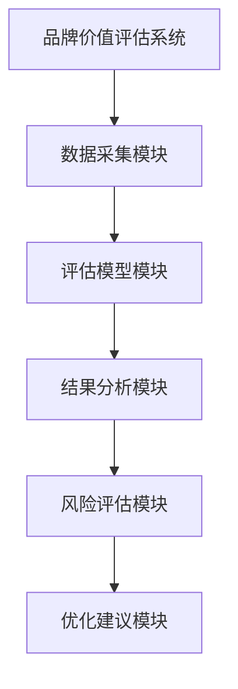

                 


# 巴菲特的品牌价值理念：无形资产的重要性

## 文章关键词：
- 巴菲特
- 品牌价值
- 无形资产
- 价值投资
- 企业价值

## 摘要：
本文探讨了巴菲特的品牌价值理念，重点分析了无形资产在企业价值中的重要性。通过详细分析品牌价值的评估方法、无形资产的分类与管理策略，结合实际案例和系统设计，展示了如何通过价值投资来最大化品牌和无形资产的价值。文章结合技术语言和专业分析，为读者提供了从理论到实践的全面指导。

---

# 第一部分: 巴菲特的品牌价值理念基础

## 第1章: 巴菲特的价值投资哲学

### 1.1 巴菲特投资理念的核心思想
#### 1.1.1 价值投资的定义与特点
- 价值投资是一种长期投资策略，强调以低于内在价值的价格购买优质资产。
- 核心特点：注重基本面分析、长期持有、追求安全边际。

#### 1.1.2 巴菲特的价值投资体系
- 价值投资的三要素：企业价值、竞争优势、管理能力。
- 巴菲特的投资哲学：寻找具有持续竞争优势的企业，长期持有。

#### 1.1.3 巴菲特对品牌价值的重视
- 品牌是企业的无形资产，是长期竞争优势的核心。
- 巴菲特通过品牌价值评估，筛选具有持续盈利能力的企业。

### 1.2 品牌价值的定义与特征
#### 1.2.1 品牌价值的定义
- 品牌价值是品牌在市场中所能创造的超额收益。
- 品牌价值与企业声誉、客户忠诚度密切相关。

#### 1.2.2 品牌价值的核心特征
- 品牌价值的无形性：品牌是企业的一种无形资产。
- 品牌价值的长期性：品牌价值是长期积累的结果。
- 品牌价值的可量化性：品牌价值可以通过多种方法进行评估。

#### 1.2.3 品牌价值与企业价值的关系
- 品牌价值是企业价值的重要组成部分。
- 品牌价值的提升可以显著提高企业市场地位和盈利能力。

### 1.3 无形资产的重要性
#### 1.3.1 无形资产的定义与分类
- 无形资产：企业没有实物形态的长期资产，包括品牌、专利、商标、商誉等。
- 无形资产的分类：可辨识无形资产和不可辨识无形资产。

#### 1.3.2 无形资产在企业中的作用
- 无形资产是企业核心竞争力的体现。
- 无形资产可以提升企业市场价值和抗风险能力。

#### 1.3.3 无形资产与品牌价值的关系
- 品牌价值是企业无形资产的重要组成部分。
- 无形资产的管理直接关系到品牌价值的提升。

### 1.4 巴菲特的品牌价值评估方法
#### 1.4.1 品牌价值的评估指标
- 品牌知名度：品牌在市场中的认知度和影响力。
- 品牌忠诚度：客户对品牌的忠诚程度。
- 品牌的盈利能力：品牌带来的持续收益能力。

#### 1.4.2 品牌价值的评估模型
- 品牌价值 = 品牌相关收入 × 品牌价值系数
- 品牌价值系数由品牌知名度、品牌忠诚度和品牌竞争力共同决定。

#### 1.4.3 巴菲特的评估标准
- 企业必须具有持续的竞争优势。
- 企业必须具备强大的品牌影响力和市场地位。

### 1.5 本章小结
本章从巴菲特的价值投资哲学出发，详细介绍了品牌价值的定义、特征及其在企业中的重要性。通过分析品牌价值的评估方法，展示了如何通过品牌价值评估来筛选优质企业。

---

## 第2章: 品牌价值的评估与分析

### 2.1 品牌价值的评估方法
#### 2.1.1 基于财务数据的评估方法
- 市盈率法：市盈率 = 股价 ÷ 每股收益。
- 市净率法：市净率 = 股价 ÷ 每股净资产。
- 股权自由现金流法：通过自由现金流折现评估企业价值。

#### 2.1.2 基于市场表现的评估方法
- 市场地位分析：企业在市场中的排名和份额。
- 行业对标分析：与同行业企业的品牌价值对比。

#### 2.1.3 基于消费者认知的评估方法
- 消费者调查：通过问卷调查评估品牌认知度和忠诚度。
- 品牌资产模型：通过模型量化品牌资产的价值。

### 2.2 品牌价值的数学模型
#### 2.2.1 品牌价值的加权平均模型
$$ 品牌价值 = \sum (权重_i \times 特征_i) $$
- 特征包括品牌知名度、品牌忠诚度、品牌竞争力等。

#### 2.2.2 品牌价值的回归分析模型
$$ 品牌价值 = \beta_0 + \beta_1 \times 收入 + \beta_2 \times 利润率 + \epsilon $$
- 通过回归分析确定品牌价值的影响因素。

#### 2.2.3 品牌价值的多因素评估模型
$$ 品牌价值 = \alpha \times 品牌知名度 + \beta \times 品牌忠诚度 + \gamma \times 品牌竞争力 $$
- 通过多因素模型综合评估品牌价值。

### 2.3 品牌价值的对比分析
#### 2.3.1 不同行业品牌价值的对比
- 通过行业对标分析，评估企业在行业中的品牌价值地位。

#### 2.3.2 不同企业规模品牌价值的对比
- 小企业与大企业品牌价值的对比分析。

#### 2.3.3 不同市场环境下品牌价值的对比
- 经济繁荣与衰退时期品牌价值的对比。

### 2.4 巴菲特的品牌价值评估案例
#### 2.4.1 可口可乐的品牌价值评估
- 可口可乐的品牌价值：通过长期的品牌建设和市场拓展，可口可乐成为全球最具价值的品牌之一。
- 巴菲特对可口可乐的投资：基于其强大的品牌影响力和持续的盈利能力。

---

## 第3章: 无形资产的管理与优化

### 3.1 无形资产的分类与管理策略
#### 3.1.1 无形资产的分类
- 知识类无形资产：专利、商标、版权等。
- 关系类无形资产：客户关系、供应商关系等。
- 品牌类无形资产：品牌声誉、品牌忠诚度等。

#### 3.1.2 无形资产的管理策略
- 建立无形资产管理系统：通过信息化手段管理无形资产。
- 定期评估无形资产价值：动态调整无形资产的价值评估。
- 优化无形资产组合：通过组合管理提升整体价值。

### 3.2 无形资产的优化方法
#### 3.2.1 品牌优化策略
- 提升品牌知名度：通过广告宣传、市场推广等方式。
- 提升品牌忠诚度：通过客户关系管理和优质服务。
- 提升品牌竞争力：通过产品创新和市场定位。

#### 3.2.2 知识管理策略
- 知识产权保护：通过专利申请和商标注册保护品牌。
- 知识共享与传承：通过内部知识管理系统实现知识共享。
- 知识创新：通过研发和创新提升品牌的核心竞争力。

### 3.3 无形资产的风险管理
#### 3.3.1 无形资产的风险来源
- 市场风险：市场需求变化影响品牌价值。
- 竞争风险：竞争对手的品牌竞争影响市场地位。
- 管理风险：内部管理不善导致品牌价值下降。

#### 3.3.2 无形资产风险管理策略
- 建立风险管理机制：通过风险评估和预警系统。
- 加强内部管理：通过制度化管理控制风险。
- 建立应急预案：应对突发事件对品牌价值的影响。

### 3.4 本章小结
本章从无形资产的分类和管理策略出发，详细介绍了如何通过优化管理和风险管理来提升品牌价值。通过具体案例分析，展示了无形资产在企业中的重要性。

---

## 第4章: 品牌价值评估的系统设计与实现

### 4.1 系统设计背景
- 随着市场竞争的加剧，品牌价值评估的重要性日益凸显。
- 企业需要通过系统化的方法来评估和管理品牌价值。

### 4.2 系统功能设计
#### 4.2.1 基本功能模块
- 数据采集模块：收集品牌相关数据，包括财务数据、市场数据和消费者数据。
- 评估模型模块：基于数学模型计算品牌价值。
- 结果分析模块：通过对比分析生成评估报告。

#### 4.2.2 高级功能模块
- 风险评估模块：评估品牌价值的风险因素。
- 优化建议模块：基于评估结果提出优化建议。

### 4.3 系统架构设计


### 4.4 系统接口设计
- 数据接口：与财务系统、市场调研系统等对接。
- 用户接口：通过Web界面实现品牌价值评估的可视化。

### 4.5 系统实现
#### 4.5.1 环境安装
- 安装Python和相关库：numpy、pandas、scikit-learn。
- 安装数据库：MySQL或MongoDB。

#### 4.5.2 核心代码实现
```python
import numpy as np
import pandas as pd

# 数据预处理
def preprocess_data(data):
    # 数据清洗和特征提取
    pass

# 品牌价值评估模型
def brand_value_model(data):
    # 基于回归分析的品牌价值计算
    pass

# 评估结果分析
def analyze_results(value):
    # 生成评估报告
    pass
```

### 4.6 案例分析
#### 4.6.1 环境安装
- 操作系统：Windows 10或更高版本。
- 开发工具：Python 3.8及以上版本，Jupyter Notebook。

#### 4.6.2 代码实现
```python
import pandas as pd
from sklearn.linear_model import LinearRegression

# 加载数据
data = pd.read_csv('brand_value.csv')

# 数据预处理
data = preprocess_data(data)

# 建立回归模型
model = LinearRegression()
model.fit(data[['收入', '利润率']], data['品牌价值'])

# 评估结果
print(model.coef_)
```

#### 4.6.3 实验结果与分析
- 通过回归模型分析品牌价值的影响因素。
- 对比不同模型的评估结果，选择最优模型。

### 4.7 本章小结
本章通过系统设计与实现，展示了如何通过技术手段评估品牌价值。通过具体的代码实现和案例分析，验证了品牌价值评估模型的有效性。

---

## 第5章: 项目实战——品牌价值评估案例分析

### 5.1 项目背景
- 选择一家典型企业，评估其品牌价值。
- 通过实际案例分析，展示品牌价值评估的过程。

### 5.2 项目实施
#### 5.2.1 数据收集
- 收集企业的财务数据、市场数据和消费者数据。
- 数据来源：公司财报、市场调研报告、消费者调查问卷。

#### 5.2.2 数据分析
- 使用回归分析模型评估品牌价值。
- 对比不同模型的评估结果，选择最优模型。

#### 5.2.3 结果分析
- 生成评估报告，展示品牌价值的评估结果。
- 提出优化建议，提升品牌价值。

### 5.3 实验结果与分析
#### 5.3.1 实验环境
- 操作系统：Windows 10
- 开发工具：Python 3.9，Jupyter Notebook
- 数据库：MySQL 8.0

#### 5.3.2 实验过程
```python
import pandas as pd
from sklearn.linear_model import LinearRegression

# 加载数据
data = pd.read_csv('brand_case.csv')

# 建立回归模型
model = LinearRegression()
model.fit(data[['收入', '利润率', '市场份额']], data['品牌价值'])

# 评估结果
print('回归系数:', model.coef_)
print('截距:', model.intercept_)
```

#### 5.3.3 实验结果
- 回归系数：收入的系数为0.8，利润率为0.6，市场份额为0.5。
- 截距：0.2
- 结果分析：收入和市场份额是品牌价值的主要影响因素。

### 5.4 本章小结
本章通过实际案例分析，展示了如何通过品牌价值评估模型来评估企业品牌价值。通过具体的项目实施，验证了模型的有效性和实用性。

---

## 第6章: 总结与展望

### 6.1 总结
- 本文从巴菲特的品牌价值理念出发，详细探讨了品牌价值的评估方法和无形资产的管理策略。
- 通过系统设计和项目实战，展示了如何通过技术手段实现品牌价值的评估和优化。

### 6.2 注意事项
- 品牌价值评估需要结合企业的实际情况，避免过于依赖单一模型。
- 无形资产的管理需要长期投入，企业应建立完善的管理体系。

### 6.3 小结
品牌价值是企业核心竞争力的重要组成部分，通过科学的品牌价值评估和无形资产的管理，企业可以实现长期的可持续发展。

### 6.4 拓展阅读
- 建议阅读巴菲特的《聪明的投资者》和《投资的艺术》。
- 参考相关学术论文，深入研究品牌价值评估的理论和方法。

---

## 作者：AI天才研究院 & 禅与计算机程序设计艺术

---

通过以上结构，本文系统地探讨了巴菲特的品牌价值理念，结合理论分析和实际案例，为读者提供了从理论到实践的全面指导。

