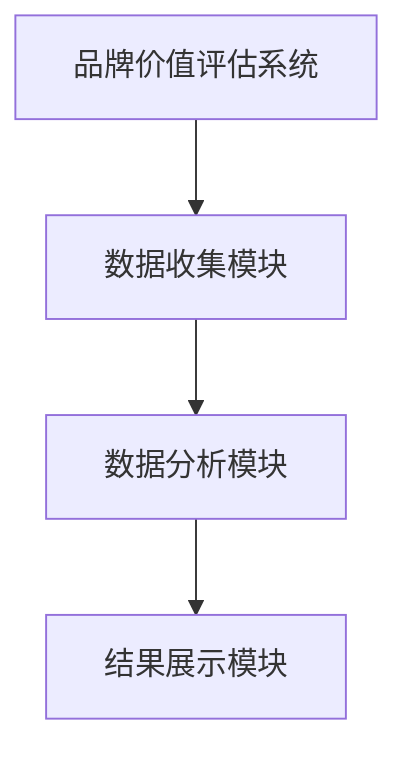
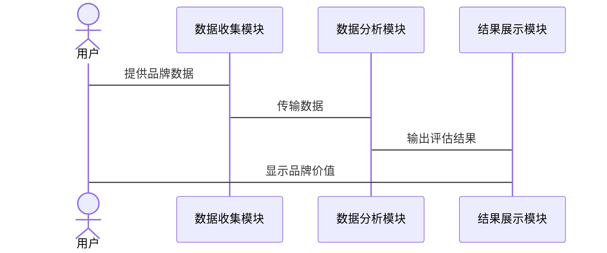

                 


# 巴菲特的品牌价值理论：无形资产的重要性

## 关键词：品牌价值，巴菲特，无形资产，投资理论，企业价值评估

## 摘要：  
本文深入探讨了巴菲特的品牌价值理论，重点分析了无形资产在企业价值中的重要性。通过结合巴菲特的投资理念，文章详细阐述了品牌资产、客户忠诚度、市场地位等核心概念，并通过实际案例分析和数学模型，展示了如何评估和管理无形资产。最后，文章总结了无形资产对企业长期价值的影响，并提出了未来的研究方向。

---

## 第一部分：引言

### 第1章：引言

#### 1.1 本书的目的与意义  
本书旨在通过分析巴菲特的品牌价值理论，揭示无形资产在企业价值中的重要性。通过结合理论与实际案例，本书帮助读者理解如何评估和管理品牌价值，从而在商业决策中做出更明智的选择。

#### 1.2 无形资产在品牌价值中的重要性  
无形资产是品牌价值的核心驱动力。巴菲特曾说过：“企业真正的价值来自于其持续创造超额收益的能力。”这种能力往往依赖于品牌、客户忠诚度和市场地位等无形资产。

#### 1.3 本书的结构安排  
本书分为七个部分：引言、品牌价值理论、分析框架、案例分析、方法论、系统架构设计和总结。每一部分都将从理论到实践，逐步展开，确保读者能够全面理解品牌价值的评估与管理。

---

## 第二部分：巴菲特的品牌价值理论

### 第2章：巴菲特的投资理念

#### 2.1 巴菲特的投资哲学  
巴菲特的投资哲学基于“价值投资”，即寻找那些具有持续竞争优势和良好治理结构的企业。他认为，企业的长期价值不仅仅取决于财务表现，还取决于其品牌和客户忠诚度。

#### 2.2 无形资产在巴菲特投资中的核心地位  
巴菲特非常重视无形资产，认为这些资产能够为企业创造长期的竞争优势。例如，可口可乐的品牌价值远超过其实体资产的价值。

#### 2.3 巴菲特对品牌价值的定义与理解  
品牌价值是企业在市场中获得超额收益的能力的体现。巴菲特通过分析企业的盈利能力、市场份额和品牌忠诚度，来评估其品牌价值。

---

## 第三部分：品牌价值的构成与分析框架

### 第3章：品牌价值的构成要素

#### 3.1 品牌资产的定义与特征  
品牌资产是指企业在市场中通过品牌名称、标识和声誉积累的价值。它包括品牌认知度、品牌忠诚度和品牌联想等。

#### 3.2 品牌忠诚度的衡量  
品牌忠诚度是客户对品牌产品或服务的偏好程度。通过客户满意度、重复购买率和推荐意愿等指标，可以衡量品牌忠诚度。

#### 3.3 市场地位与竞争优势  
市场地位反映了企业在市场中的影响力。竞争优势包括成本优势、技术优势和品牌优势等。

#### 3.4 财务表现与品牌价值的关系  
企业的财务表现是品牌价值的重要体现。通过分析净利润、ROE和现金流等财务指标，可以评估企业的盈利能力。

### 第4章：品牌价值分析框架

#### 4.1 分析框架的核心要素  
品牌价值分析框架包括品牌资产、客户忠诚度、市场地位和财务表现四大核心要素。

#### 4.2 品牌价值评估模型  
品牌价值 = 品牌资产 × 客户忠诚度 × 市场地位 × 财务表现

#### 4.3 品牌价值评估的数学模型  
$$ \text{Brand Value} = \text{Brand Equity} \times \text{Customer Loyalty} \times \text{Market Position} \times \text{Financial Performance} $$

---

## 第四部分：品牌价值的系统分析与架构设计

### 第5章：系统分析与架构设计

#### 5.1 问题场景介绍  
本文构建了一个品牌价值评估系统，用于帮助企业评估其品牌价值。系统包括数据收集、分析和结果展示三个模块。

#### 5.2 系统功能设计  
- 数据收集模块：收集品牌资产、客户忠诚度、市场地位和财务表现的数据。
- 数据分析模块：使用数学模型计算品牌价值。
- 结果展示模块：以可视化形式展示评估结果。

#### 5.3 系统架构设计  


#### 5.4 系统接口设计  
- 数据收集接口：接收品牌相关数据。
- 分析接口：计算品牌价值。
- 展示接口：输出评估结果。

#### 5.5 系统交互设计  


---

## 第五部分：案例分析与项目实战

### 第6章：案例分析

#### 6.1 可口可乐的品牌价值分析  
通过分析可口可乐的品牌资产、客户忠诚度和市场地位，计算其品牌价值。

#### 6.2 苹果的品牌价值分析  
苹果的品牌价值主要体现在其品牌忠诚度和技术创新能力上。

#### 6.3 谷歌的品牌价值分析  
谷歌的品牌价值得益于其强大的市场地位和技术优势。

### 第7章：项目实战

#### 7.1 项目环境安装  
安装Python和相关库（如Pandas、Matplotlib）。

#### 7.2 核心实现源代码  
```python
import pandas as pd
import matplotlib.pyplot as plt

# 数据收集
data = {
    '品牌': ['可口可乐', '苹果', '谷歌'],
    '品牌资产': [100, 90, 95],
    '客户忠诚度': [0.85, 0.8, 0.75],
    '市场地位': [0.9, 0.85, 0.8],
    '财务表现': [0.8, 0.75, 0.7]
}

df = pd.DataFrame(data)

# 品牌价值计算
df['品牌价值'] = df['品牌资产'] * df['客户忠诚度'] * df['市场地位'] * df['财务表现']

# 可视化
plt.bar(df['品牌'], df['品牌价值'])
plt.title('品牌价值对比')
plt.show()
```

#### 7.3 代码应用解读  
上述代码展示了如何通过Python计算品牌价值，并以图表形式展示结果。

---

## 第六部分：总结与展望

### 第8章：总结与展望

#### 8.1 本书的核心观点总结  
品牌价值是企业长期发展的关键因素。通过分析品牌资产、客户忠诚度、市场地位和财务表现，可以有效评估品牌价值。

#### 8.2 未来的研究方向  
未来可以进一步研究无形资产在数字化转型中的作用，以及如何利用人工智能技术优化品牌价值评估。

---

## 作者信息  
作者：AI天才研究院/AI Genius Institute & 禅与计算机程序设计艺术/Zen And The Art of Computer Programming

