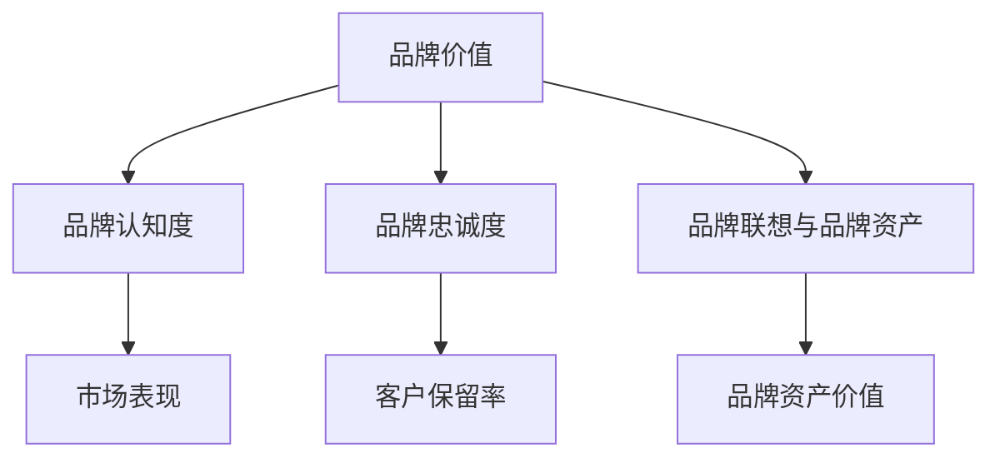

                 

# 巴菲特的品牌价值评估方法

## 关键词：
- 巴菲特
- 品牌价值
- 价值投资
- 企业评估
- 品牌管理

## 摘要：
本文深入探讨了巴菲特的品牌价值评估方法，从其投资理念出发，详细分析了品牌价值的核心概念、评估方法及其对投资决策的影响。通过实际案例和系统分析，本文为读者提供了实用的品牌价值评估框架，帮助投资者和企业管理者更好地理解和应用这些方法。

---

# 第1章：巴菲特的投资理念与品牌价值概述

## 1.1 投资理念的演变
- **1.1.1 价值投资的起源与发展**
  - 价值投资由本杰明·格雷厄姆提出，强调以低于内在价值的价格买入优质股票。
  - 巴菲特将价值投资理念发扬光大，特别关注企业的品牌价值和长期盈利能力。
- **1.1.2 巴菲特的价值投资策略**
  - 寻找具有强大护城河的企业，这些企业能在长期竞争中保持优势。
  - 重视企业的品牌价值，因为品牌是企业长期盈利能力的核心驱动因素。
- **1.1.3 品牌价值在投资中的重要性**
  - 品牌价值反映了企业的市场地位和客户忠诚度。
  - 强大的品牌价值能够为企业带来超额利润，从而提升企业的内在价值。

## 1.2 品牌价值的核心概念
- **1.2.1 品牌价值的定义与特征**
  - 品牌价值是消费者对企业品牌认知度、忠诚度和品牌联想的综合反映。
  - 品牌价值具有长期性、无形性和累积性。
- **1.2.2 品牌价值与企业长期竞争力的关系**
  - 品牌价值是企业核心竞争力的重要组成部分。
  - 强大的品牌价值能够为企业在市场中提供溢价能力。
- **1.2.3 品牌价值的多维度评估维度**
  - 市场地位：企业在市场中的份额和影响力。
  - 客户忠诚度：客户对企业品牌的依赖程度。
  - 品牌认知度：消费者对品牌的认知和记忆程度。

## 1.3 品牌价值评估的必要性
- **1.3.1 品牌价值对企业财务表现的影响**
  - 品牌价值高的企业通常具有更高的利润率和市场份额。
  - 品牌价值能够影响企业的估值和股价表现。
- **1.3.2 投资者如何通过品牌价值评估做出决策**
  - 投资者需要评估企业的品牌价值，以判断其长期盈利能力。
  - 通过品牌价值评估，投资者可以识别具有持续竞争优势的企业。
- **1.3.3 品牌价值评估的边界与外延**
  - 品牌价值评估需要考虑企业的行业特点和市场环境。
  - 品牌价值评估需要结合定量和定性分析，避免片面性。

## 1.4 本章小结
- **1.4.1 核心概念回顾**
  - 巴菲特的投资理念强调品牌价值的重要性。
  - 品牌价值是企业长期竞争力的核心驱动因素。
- **1.4.2 下一章的展望**
  - 接下来将深入探讨品牌价值的核心要素与评估框架。

---

# 第2章：品牌价值的核心要素与评估框架

## 2.1 品牌价值的核心要素
- **2.1.1 品牌认知度**
  - 品牌认知度是消费者对品牌存在的感知程度。
  - 高品牌认知度意味着品牌在市场中具有较高的知名度和辨识度。
- **2.1.2 品牌忠诚度**
  - 品牌忠诚度是消费者对品牌偏好和重复购买的程度。
  - 高品牌忠诚度意味着消费者更愿意为品牌支付溢价。
- **2.1.3 品牌联想与品牌资产**
  - 品牌联想是消费者对品牌产生的各种联想和记忆。
  - 品牌资产是品牌在市场中创造的经济价值。

## 2.2 品牌价值与企业财务指标的关系
- **2.2.1 品牌价值对收入的影响**
  - 强大的品牌价值能够提高企业的销售能力和市场份额。
  - 品牌价值高的企业通常能够以更高的价格出售产品或服务。
- **2.2.2 品牌价值对利润的影响**
  - 品牌价值高的企业具有更强的议价能力和成本控制能力。
  - 品牌价值能够提升企业的利润率和盈利能力。
- **2.2.3 品牌价值对市场估值的影响**
  - 品牌价值高的企业在市场中通常具有更高的估值。
  - 投资者愿意为具有强大品牌价值的企业支付更高的股价溢价。

## 2.3 品牌价值的驱动因素分析
- **2.3.1 产品差异化**
  - 产品差异化是品牌价值的重要来源。
  - 独特的产品设计和创新能够提升品牌的市场竞争力。
- **2.3.2 市场领导地位**
  - 市场领导地位是品牌价值的重要体现。
  - 领导品牌通常具有更强的市场影响力和定价能力。
- **2.3.3 客户关系与品牌忠诚度**
  - 强大的客户关系和品牌忠诚度能够为企业创造持续的利润。
  - 通过客户关系管理，企业可以提升品牌忠诚度和客户满意度。

## 2.4 品牌价值的实体关系图（Mermaid流程图）

## 2.5 本章小结
- **2.5.1 核心概念总结**
  - 品牌价值的核心要素包括品牌认知度、品牌忠诚度和品牌联想。
  - 这些要素相互作用，共同影响企业的市场表现和客户关系。
- **2.5.2 评估框架的初步构建**
  - 通过分析品牌价值的核心要素，构建初步的评估框架。

---

# 第3章：品牌价值的定性评估方法

## 3.1 品牌强度分析
- **3.1.1 品牌强度的定义**
  - 品牌强度是指品牌在市场中的竞争力和影响力。
  - 强大的品牌强度能够为企业带来持续的市场份额和利润。
- **3.1.2 品牌强度的评估维度**
  - 市场占有率：企业在市场中的份额占比。
  - 品牌知名度：消费者对品牌的认知和记忆程度。
  - 品牌忠诚度：消费者对品牌的偏好和重复购买程度。

## 3.2 品牌竞争力分析
- **3.2.1 品牌竞争力的定义**
  - 品牌竞争力是指品牌在市场中与竞争对手相比的优势。
  - 强大的品牌竞争力能够为企业带来竞争优势。
- **3.2.2 品牌竞争力的评估方法**
  - 竞争对手分析：分析竞争对手的品牌优势和劣势。
  - 市场地位分析：评估企业在市场中的地位和影响力。
  - 品牌差异化分析：评估品牌在产品、服务、形象等方面的差异化程度。

## 3.3 品牌资产分析
- **3.3.1 品牌资产的定义**
  - 品牌资产是指品牌在市场中创造的经济价值。
  - 品牌资产包括品牌知名度、品牌忠诚度、品牌联想等无形资产。
- **3.3.2 品牌资产的评估方法**
  - 品牌资产可以通过市场调研、消费者调查等方式进行评估。
  - 品牌资产的评估需要结合定量和定性分析，确保评估的全面性。

## 3.4 本章小结
- **3.4.1 定性评估方法总结**
  - 品牌强度分析、品牌竞争力分析和品牌资产分析是品牌价值定性评估的重要方法。
  - 这些方法能够帮助投资者和企业管理者更好地理解品牌的价值和潜力。
- **3.4.2 下一章的展望**
  - 接下来将介绍品牌价值的定量评估方法，包括ROE、ROA等财务指标的使用。

---

# 第4章：品牌价值的定量评估方法

## 4.1 常用财务指标在品牌价值评估中的应用
- **4.1.1 净资产收益率（ROE）**
  - ROE = 净利润 / 平均股东权益
  - ROE反映了企业利用股东权益创造利润的能力。
  - 品牌价值高的企业通常具有较高的ROE。
- **4.1.2 资产收益率（ROA）**
  - ROA = 净利润 / 平均总资产
  - ROA反映了企业利用资产创造利润的能力。
  - 品牌价值高的企业通常具有较高的ROA。
- **4.1.3 销售利润率**
  - 销售利润率 = 净利润 / 销售收入
  - 销售利润率反映了企业销售活动的盈利能力。
  - 品牌价值高的企业通常具有较高的销售利润率。

## 4.2 品牌价值的数学模型
- **4.2.1 品牌价值评估公式**
  - 品牌价值 = 企业价值 - 有形资产价值
  - 企业价值 = 市场价值 + 未来现金流的现值
  - 有形资产价值 = 净资产价值 - 无形资产价值
- **4.2.2 实例分析**
  - 假设某企业市场价值为100亿元，净资产价值为50亿元，无形资产价值为20亿元。
  - 品牌价值 = 100亿元 - (50亿元 - 20亿元) = 70亿元。

## 4.3 本章小结
- **4.3.1 定量评估方法总结**
  - 通过ROE、ROA等财务指标，可以定量评估企业的品牌价值。
  - 品牌价值的数学模型能够帮助投资者准确估算企业的品牌价值。
- **4.3.2 综合评估方法的展望**
  - 结合定性和定量评估方法，可以更全面地评估品牌价值。

---

# 第5章：品牌价值的综合评估与案例分析

## 5.1 综合评估框架
- **5.1.1 综合评估框架的构建**
  - 结合定性和定量评估方法，构建全面的品牌价值评估框架。
  - 评估框架包括品牌认知度、品牌忠诚度、财务指标等多个维度。
- **5.1.2 评估框架的实施步骤**
  - 确定评估目标和范围。
  - 收集相关数据和信息。
  - 进行定性和定量分析。
  - 综合分析结果，得出品牌价值评估结论。

## 5.2 案例分析：可口可乐的品牌价值评估
- **5.2.1 可口可乐的品牌认知度**
  - 可口可乐是全球知名的饮料品牌，具有极高的品牌认知度。
- **5.2.2 可口可乐的品牌忠诚度**
  - 可口可乐在全球范围内拥有大量的忠实消费者。
- **5.2.3 可口可乐的财务表现**
  - 可口可乐的ROE和ROA均高于行业平均水平。
  - 可口可乐的品牌价值估计为数百亿美元。

## 5.3 案例分析：苹果的品牌价值评估
- **5.3.1 苹果的品牌认知度**
  - 苹果是全球知名的科技品牌，具有极高的品牌认知度。
- **5.3.2 苹果的品牌忠诚度**
  - 苹果拥有大量的忠实消费者，品牌忠诚度较高。
- **5.3.3 苹果的财务表现**
  - 苹果的ROE和ROA均远高于行业平均水平。
  - 苹果的品牌价值估计为数千亿美元。

## 5.4 本章小结
- **5.4.1 综合评估方法的应用**
  - 通过综合评估框架，可以全面评估企业的品牌价值。
  - 案例分析表明，可口可乐和苹果的品牌价值均远高于行业平均水平。
- **5.4.2 案例分析的启示**
  - 强大的品牌价值能够为企业带来持续的市场份额和利润。
  - 投资者应该关注企业的品牌价值，以识别具有持续竞争优势的企业。

---

# 第6章：品牌价值的管理与提升

## 6.1 品牌价值的管理策略
- **6.1.1 品牌战略的制定**
  - 制定清晰的品牌战略，明确品牌定位和目标。
  - 通过品牌战略，提升品牌认知度和忠诚度。
- **6.1.2 品牌资产的维护**
  - 定期评估品牌资产，确保品牌资产的保值和增值。
  - 通过品牌营销和推广，提升品牌资产的价值。
- **6.1.3 品牌风险管理**
  - 建立品牌风险管理机制，防范品牌危机。
  - 通过有效的危机公关，维护品牌价值。

## 6.2 品牌价值的提升策略
- **6.2.1 创新驱动品牌价值提升**
  - 通过产品和服务的创新，提升品牌的市场竞争力。
  - 创新能够增强品牌的差异化优势。
- **6.2.2 客户关系管理**
  - 通过客户关系管理，提升客户忠诚度和品牌忠诚度。
  - 定期与客户互动，增强品牌与客户的情感联系。
- **6.2.3 品牌国际化与全球化**
  - 通过品牌的国际化和全球化，提升品牌的市场影响力。
  - 扩大品牌的全球市场份额，提升品牌的整体价值。

## 6.3 本章小结
- **6.3.1 品牌价值的管理策略总结**
  - 品牌价值的管理需要制定清晰的战略，维护品牌资产，并防范品牌风险。
- **6.3.2 品牌价值的提升策略总结**
  - 创新、客户关系管理和国际化是提升品牌价值的重要策略。
  - 通过这些策略，企业可以不断提升品牌价值，增强市场竞争力。

---

# 第7章：总结与建议

## 7.1 全文总结
- 巴菲特的品牌价值评估方法为投资者和企业管理者提供了重要的启示。
- 品牌价值是企业长期竞争力的核心驱动因素。
- 通过定性和定量分析，可以全面评估品牌价值，识别具有持续竞争优势的企业。

## 7.2 投资建议
- **长期投资**：投资者应该关注企业的品牌价值，寻找具有强大品牌价值的企业进行长期投资。
- **价值投资**：通过品牌价值评估，识别具有低估潜力的企业，进行价值投资。
- **风险管理**：投资者需要关注品牌风险，防范品牌危机对投资的影响。

## 7.3 未来展望
- 随着市场的变化，品牌价值评估的方法和工具将不断创新。
- 未来，投资者需要更加关注品牌价值的动态变化，及时调整投资策略。

## 7.4 拓展阅读
- 建议读者进一步阅读巴菲特的经典著作《聪明的投资者》，深入理解价值投资的精髓。
- 读者还可以参考《品牌的奥秘》等书籍，了解更多关于品牌管理的知识。

---

# 作者简介

作者：AI天才研究院/AI Genius Institute & 禅与计算机程序设计艺术 /Zen And The Art of Computer Programming

---

感谢您的耐心阅读！希望这篇文章能为您提供有价值的品牌价值评估方法，帮助您在投资和管理中做出更明智的决策。

