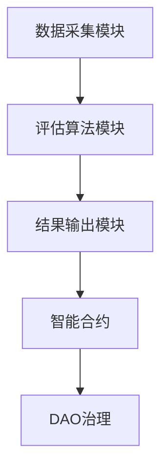

                 


# 巴菲特的品牌价值评估：去中心化自治组织(DAO)的影响力

> **关键词：** 巴菲特、品牌价值、DAO、去中心化、智能合约、区块链、价值评估

> **摘要：**  
本文探讨了巴菲特品牌价值评估方法在去中心化自治组织（DAO）中的应用与影响力。通过分析DAO的治理机制、品牌价值的去中心化评估方法以及实际应用场景，本文展示了如何结合传统投资理念与新兴技术手段，实现更加透明、高效的品牌价值评估体系。

---

## 第一部分：巴菲特的品牌价值评估基础

### 第1章：巴菲特的价值投资理念

#### 1.1 投资的基本原则

##### 1.1.1 投资的定义与核心要素

投资是一种通过配置资源（如资金、技术、管理等）以获取未来收益的行为。其核心要素包括：

- **资金投入**：资本的投入是投资的基础。
- **时间价值**：资金的时间价值是投资回报的重要考量因素。
- **风险与收益**：投资的本质是在风险可控的前提下追求收益最大化。

##### 1.1.2 巴菲特的价值投资理念

巴菲特的价值投资理念可以概括为“以合理的价格买入优质的资产并长期持有”。其核心思想包括：

- **长期主义**：关注企业的长期价值，而非短期市场波动。
- **安全边际**：以低于内在价值的价格买入资产，以降低投资风险。
- **竞争优势**：投资具有强大护城河的企业，确保长期盈利能力。

##### 1.1.3 投资者心态与决策框架

巴菲特强调投资者的心态和决策框架对投资结果的影响。他提出的“三圈投资法”（即能力圈、市场先生和安全边际）为投资者提供了科学的决策框架。

#### 1.2 股票分析的核心要素

##### 1.2.1 财务报表分析基础

财务报表是评估企业价值的重要工具。巴菲特常用以下指标进行分析：

- **盈利能力**：如净利润率、ROE（净资产收益率）。
- **财务健康度**：如资产负债率、现金流情况。
- **成长性**：如收入增长率、利润增长率。

##### 1.2.2 企业竞争优势分析

竞争优势是决定企业长期价值的关键因素。巴菲特重点关注企业的：

- **市场地位**：如是否为行业龙头。
- **品牌影响力**：强大的品牌能够带来持续的客户忠诚度和溢价能力。
- **成本优势**：企业是否具备行业领先的成本控制能力。

##### 1.2.3 企业价值评估模型

巴菲特常用的企业价值评估模型包括：

- **DCF模型**：通过现金流折现法评估企业价值。
- **相对估值法**：通过比较市盈率、市净率等指标进行估值。

---

### 第2章：品牌价值的评估方法

#### 2.1 品牌价值的定义与特征

##### 2.1.1 品牌价值的定义

品牌价值是指品牌为企业带来的超额收益能力。它不仅包括品牌带来的收入溢价，还包括品牌资产的市场价值。

##### 2.1.2 品牌价值的核心要素

品牌价值的核心要素包括：

- **品牌认知度**：品牌在目标市场中的知名度。
- **品牌忠诚度**：客户对品牌的偏好程度。
- **品牌声誉**：品牌的市场信誉和形象。

##### 2.1.3 品牌价值与企业价值的关系

品牌价值是企业价值的重要组成部分。强大的品牌能够为企业带来更高的市场份额和利润率，从而提升整体企业价值。

#### 2.2 品牌价值的传统评估方法

##### 2.2.1 市场法

市场法通过比较类似企业的交易价格，评估目标企业的价值。其公式为：

$$
\text{目标企业价值} = \text{可比企业平均市盈率} \times \text{目标企业净利润}
$$

##### 2.2.2 收益法

收益法通过预测企业未来现金流，折现后评估企业价值。其公式为：

$$
\text{企业价值} = \sum_{t=1}^{n} \frac{\text{现金流}}{(1 + r)^t}
$$

其中，\( r \) 为折现率，\( n \) 为预测年限。

##### 2.2.3 成本法

成本法通过估算企业重建成本，评估其市场价值。其公式为：

$$
\text{企业价值} = \text{重置成本} - \text{折旧与损耗}
$$

#### 2.3 巴菲特视角下的品牌价值评估

##### 2.3.1 巴菲特对品牌价值的关注点

巴菲特关注品牌价值的核心在于其持续创造超额收益的能力。他倾向于投资那些具有强大品牌优势的企业。

##### 2.3.2 巴菲特品牌价值评估的独特视角

巴菲特认为，品牌价值不仅仅是市场行为的结果，更是企业长期竞争优势的体现。他通过分析企业的财务表现和行业地位，评估其品牌价值。

---

## 第二部分：去中心化自治组织（DAO）的核心概念

### 第3章：DAO的基本原理

#### 3.1 DAO的定义与特点

##### 3.1.1 DAO的定义

DAO是基于区块链技术的去中心化自治组织。它通过智能合约自动执行组织的治理规则，实现无需信任的自治管理。

##### 3.1.2 DAO的核心特征

- **去中心化**：决策权分散在多个参与者手中，无单一中心控制点。
- **透明性**：所有交易和决策过程公开透明，可追溯。
- **自动化**：通过智能合约自动执行治理规则和资金分配。

##### 3.1.3 DAO与传统组织的区别

| 特性       | DAO                         | 传统组织                     |
|------------|------------------------------|------------------------------|
| 组织结构   | 去中心化                     | 中心化                       |
| 决策机制   | 智能合约自动执行             | 依赖管理层决策               |
| 透明度     | 高                          | 低                          |

#### 3.2 DAO的治理机制

##### 3.2.1 治理规则的设计

DAO的治理规则通过智能合约实现。参与者通过投票机制决定组织的重大决策。

##### 3.2.2 智能合约的作用

智能合约是DAO的核心技术。它不仅执行治理规则，还自动分配收益和处理事务。

##### 3.2.3 参与者的权利与义务

DAO参与者通常享有以下权利：

- **投票权**：参与重大决策的投票。
- **收益分配权**：按贡献分配收益。
- **监督权**：监督组织的运行。

---

### 第4章：DAO的影响力与应用场景

#### 4.1 DAO在品牌价值评估中的作用

##### 4.1.1 DAO如何提升品牌价值

通过DAO的去中心化治理，品牌决策更加透明和公正，能够提升消费者和投资者的信任度。

##### 4.1.2 DAO在品牌治理中的应用

DAO可以用于品牌的决策过程，如产品定价、市场推广等，确保决策的公平性和透明性。

##### 4.1.3 DAO如何实现品牌价值的去中心化管理

通过智能合约，DAO可以实现品牌价值的自动评估和分配，确保价值的公平分配。

#### 4.2 DAO的其他应用场景

##### 4.2.1 去中心化金融（DeFi）

DAO在DeFi中的应用广泛，如自动化的借贷平台和去中心化交易所。

##### 4.2.2 去中心化社交网络

通过DAO，社交网络可以实现去中心化治理，提升用户的数据控制权和平台透明度。

##### 4.2.3 DAO在供应链管理中的应用

DAO可以通过智能合约实现供应链的自动管理，确保各环节的透明和高效。

---

## 第三部分：品牌价值评估的DAO方法论

### 第5章：基于DAO的品牌价值评估模型

#### 5.1 模型的设计思路

##### 5.1.1 模型的设计目标

通过DAO技术实现品牌价值的自动化评估和透明分配。

##### 5.1.2 模型的功能模块

- **数据采集模块**：采集品牌相关的财务和市场数据。
- **评估算法模块**：基于DAO规则进行品牌价值评估。
- **结果输出模块**：生成评估结果并分配收益。

##### 5.1.3 模型的实现框架

以下为模型的实现框架：



#### 5.2 模型的实现细节

##### 5.2.1 评估算法

评估算法基于DAO的智能合约实现，公式如下：

$$
\text{品牌价值} = \sum_{i=1}^{n} \text{指标权重}_i \times \text{指标得分}_i
$$

其中，\( n \) 为评估指标的数量，\( \text{指标权重}_i \) 和 \( \text{指标得分}_i \) 分别为第 \( i \) 个指标的权重和得分。

##### 5.2.2 智能合约实现

以下是品牌价值评估的智能合约示例（Solidity代码）：

```solidity
contract BrandValueAssessment {
    function assessBrandValue(address[] memory addresses) public returns (uint) {
        uint total = 0;
        for (uint i = 0; i < addresses.length; i++) {
            total += getBrandValue(addresses[i]);
        }
        return total;
    }

    function getBrandValue(address brand) internal returns (uint) {
        // 实现品牌价值评估逻辑
        return 100; // 示例返回值
    }
}
```

---

### 第6章：DAO的未来发展趋势

#### 6.1 当前的技术挑战

##### 6.1.1 治理效率

随着参与者增多，DAO的治理效率可能下降。

##### 6.1.2 安全性

智能合约的安全性是DAO发展的关键问题。

##### 6.1.3 监管与合规

DAO的监管框架尚未完善，合规性问题亟待解决。

#### 6.2 优化建议

##### 6.2.1 提升治理效率

通过优化智能合约和治理规则，提升决策效率。

##### 6.2.2 加强安全性

通过代码审计和漏洞修复，提升智能合约的安全性。

##### 6.2.3 完善监管框架

积极参与监管框架的制定，确保合规性。

#### 6.3 未来展望

随着技术进步和应用拓展，DAO在品牌价值评估中的作用将更加重要。未来，DAO将与人工智能、大数据等技术深度融合，推动品牌价值评估的智能化和自动化。

---

## 作者信息

作者：AI天才研究院（AI Genius Institute） & 禅与计算机程序设计艺术（Zen And The Art of Computer Programming）

---

以上是《巴菲特的品牌价值评估：去中心化自治组织(DAO)的影响力》的技术博客文章的完整内容。希望这篇文章能够为您提供有价值的见解和启发！

