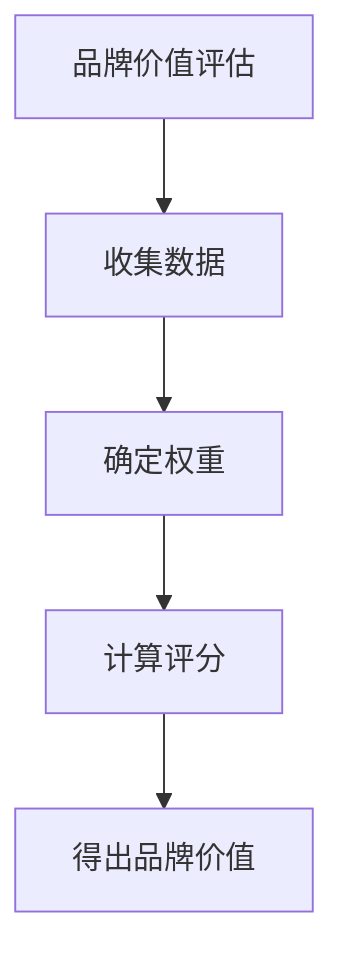
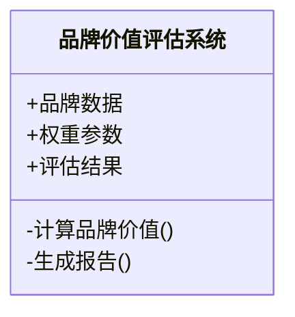
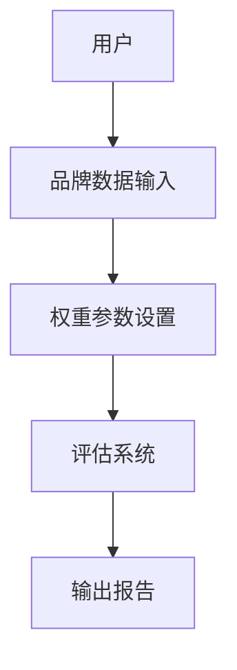

                 


# 巴菲特的品牌价值评估：无形资产如何创造超额回报

---

## 关键词：
品牌价值评估、无形资产、超额回报、巴菲特、品牌资产评估、投资回报

---

## 摘要：
本文深入探讨巴菲特如何通过品牌价值评估来创造超额回报。通过分析品牌价值的核心要素，如品牌知名度、忠诚度和认知度，结合数学模型和系统架构设计，展示品牌价值如何转化为企业的竞争优势。文章还通过具体案例分析，展示如何利用品牌价值评估方法实现投资回报最大化。

---

## 第一部分：品牌价值评估的背景与核心概念

### 第1章：品牌价值评估的背景与问题描述

#### 1.1 品牌价值评估的核心概念
品牌价值是企业核心竞争力的重要组成部分，尤其是在市场竞争日益激烈的今天，品牌的无形价值往往决定了企业的超额回报能力。品牌价值不仅体现在企业形象上，更反映在消费者的认知、忠诚度和市场影响力等方面。

#### 1.2 问题背景与问题描述
传统的财务评估方法往往忽视了品牌作为无形资产的重要性。许多企业在计算自身价值时，仅关注有形资产如设备、厂房等，而忽略了品牌、客户关系等无形资产的价值。这种评估方式导致企业低估了自身的核心竞争力，也错失了通过品牌价值创造超额回报的机会。

#### 1.3 问题解决与边界
通过品牌价值评估，企业可以更全面地了解自身的市场地位和竞争优势。品牌价值评估不仅帮助企业发现潜在的超额回报机会，还能为投资决策提供有力支持。本文将从品牌知名度、忠诚度和认知度三个维度，构建品牌价值评估模型，并通过实例分析展示其应用。

### 第2章：品牌价值评估的核心要素与联系

#### 2.1 核心要素分析
品牌价值评估的核心要素包括品牌知名度、品牌忠诚度和品牌认知度。以下是各要素的定义与重要性对比：

| 要素 | 定义 | 重要性 |
|------|------|--------|
| 知名度 | 品牌在市场中的普及程度 | 高知名度意味着更广泛的市场影响力 |
| 忠诚度 | 消费者对品牌的忠诚程度 | 高忠诚度意味着更高的客户保留率和回购率 |
| 认知度 | 消费者对品牌的认知深度 | 高认知度意味着更强的市场竞争力 |

#### 2.2 核心概念的联系与对比
品牌价值与其他关键商业指标如市场竞争力和客户生命周期价值密切相关。以下是品牌价值与这些指标的对比分析：

| 指标 | 定义 | 与品牌价值的关系 |
|------|------|------------------|
| 市场竞争力 | 企业在市场中的竞争能力 | 品牌价值是市场竞争力的核心驱动力 |
| 客户生命周期价值 | 客户在企业生命周期中为企业带来的总价值 | 品牌价值直接影响客户生命周期价值 |

---

## 第二部分：品牌价值评估的算法与数学模型

### 第3章：品牌价值评估的算法原理

#### 3.1 品牌价值评估的数学模型
品牌价值评估的核心公式为加权平均法：

$$ V = \sum_{i=1}^{n} w_i \times f_i $$

其中，$V$ 表示品牌价值，$w_i$ 表示各因素的权重，$f_i$ 表示各因素的评分。例如，假设品牌知名度的权重为0.4，品牌忠诚度的权重为0.3，品牌认知度的权重为0.3，评分分别为8、7、9，则品牌价值为：

$$ V = 0.4 \times 8 + 0.3 \times 7 + 0.3 \times 9 = 3.2 + 2.1 + 2.7 = 8.0 $$

#### 3.2 品牌价值评估的流程图
以下是品牌价值评估的流程图：



### 第4章：品牌价值评估的系统架构与设计

#### 4.1 系统分析与设计
以下是品牌价值评估系统的领域模型图：



#### 4.2 系统架构设计
以下是品牌价值评估系统的架构图：



---

## 第三部分：品牌价值评估的实战与应用

### 第5章：品牌价值评估的项目实战

#### 5.1 环境安装
为了实现品牌价值评估，我们需要以下工具和库：
- Python 3.8+
- NumPy 和 Pandas 库
- Mermaid 和 PlantUML 插件

#### 5.2 核心代码实现
以下是品牌价值评估的Python代码实现：

```python
def calculate_brand_value(factors, weights):
    brand_value = sum(w * f for w, f in zip(weights, factors))
    return brand_value

# 示例数据
factors = [8, 7, 9]
weights = [0.4, 0.3, 0.3]

print("品牌价值 =", calculate_brand_value(factors, weights))
```

#### 5.3 案例分析
以某品牌为例，假设其品牌知名度、忠诚度和认知度的评分分别为8、7、9，权重分别为0.4、0.3、0.3。根据上述公式，其品牌价值为8.0。通过对比行业平均水平，可以发现该品牌具有较高的市场竞争力。

---

## 第四部分：总结与展望

### 6.1 小结
本文通过分析品牌价值的核心要素，构建了品牌价值评估模型，并通过实例展示了其应用。品牌价值评估不仅是企业制定战略的重要依据，也是投资者创造超额回报的关键工具。

### 6.2 注意事项
在实际应用中，品牌价值评估需要结合企业的实际情况，合理调整各因素的权重。同时，应定期更新数据，确保评估结果的准确性。

### 6.3 拓展阅读
- 巴菲特的《投资的艺术》
- 《品牌管理》

---

## 作者：AI天才研究院/AI Genius Institute & 禅与计算机程序设计艺术 /Zen And The Art of Computer Programming

---

本文通过详细的分析和实例，展示了品牌价值评估的核心要素和算法，为企业和投资者提供了创造超额回报的有效方法。

