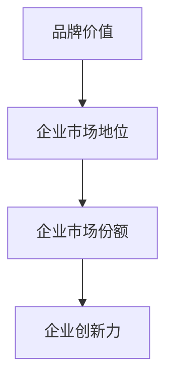
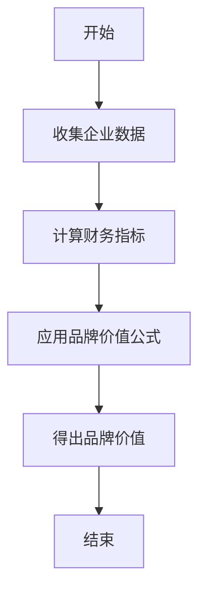

                 


# 巴菲特的品牌价值评估：无形资产的重要性

> 关键词：巴菲特，品牌价值，无形资产，价值投资，企业评估

> 摘要：本文深入探讨了巴菲特在品牌价值评估中的独特视角，分析了无形资产在企业价值中的重要性。通过结合理论与实践，本文为投资者提供了评估品牌价值的方法和策略，帮助他们在投资决策中更好地识别和利用无形资产的优势。

---

# 第一部分: 巴菲特的价值投资理念

## 第1章: 巴菲特的投资哲学与品牌价值

### 1.1 巴菲特的价值投资理念

#### 1.1.1 价值投资的定义与核心理念
价值投资是一种以基本面分析为基础的投资策略，强调以低于内在价值的价格购买优质资产。巴菲特是这一理念的代表人物，他主张长期投资，注重企业的内在价值而非市场波动。

#### 1.1.2 巴菲特的投资策略与成功案例
巴菲特的成功离不开他对企业的深入研究和对管理层的信任。他倾向于投资那些具有强大护城河、持续盈利能力且管理层诚信的企业。例如，他投资可口可乐和苹果公司，正是因为这些企业拥有强大的品牌价值和市场地位。

#### 1.1.3 品牌价值在巴菲特投资中的重要性
品牌价值是企业长期竞争优势的核心。巴菲特认为，品牌价值不仅体现在产品和服务上，还体现在企业的声誉和客户忠诚度上。强大的品牌可以为企业带来超额利润，从而提升企业的整体价值。

### 1.2 品牌价值与企业价值的关系

#### 1.2.1 品牌价值的定义与特征
品牌价值是指品牌为企业带来的超额收益能力。它不仅包括品牌知名度和美誉度，还包括品牌忠诚度和市场影响力。品牌价值具有长期性、稳定性、累积性和不可模仿性。

#### 1.2.2 品牌价值对企业整体价值的影响
品牌价值直接影响企业的市场份额、定价能力和客户忠诚度。强大的品牌可以降低企业的营销成本，提高利润率，并在竞争中占据优势地位。因此，品牌价值是企业整体价值的重要组成部分。

#### 1.2.3 品牌价值的长期性和稳定性
品牌价值的积累需要时间和持续的努力。一旦建立起来，强大的品牌价值能够在经济波动中为企业提供稳定性，帮助企业在逆境中依然保持竞争力。

### 1.3 无形资产的核心地位

#### 1.3.1 无形资产的定义与分类
无形资产是指企业没有实物形态的资产，主要包括品牌、专利、商标、商誉、客户关系等。这些资产虽然看不到，但对企业的发展至关重要。

#### 1.3.2 无形资产与品牌价值的关系
品牌价值是企业无形资产的核心组成部分。品牌价值的高低直接反映了企业无形资产的优劣。强大的品牌价值能够为企业带来长期的收益和竞争优势。

#### 1.3.3 无形资产对企业竞争力的影响
无形资产是企业核心竞争力的重要来源。强大的品牌价值可以提升企业的市场地位，吸引优质客户和人才，从而推动企业的持续发展。

### 1.4 巴菲特对无形资产的重视

#### 1.4.1 巴菲特对品牌价值的评价标准
巴菲特在评估企业时，特别关注企业的品牌价值和市场地位。他认为，强大的品牌价值能够为企业提供长期的收益保障，并降低市场竞争的风险。

#### 1.4.2 巴菲特如何识别高价值无形资产
巴菲特通过分析企业的市场份额、客户忠诚度、品牌知名度和管理层的诚信度来识别高价值的无形资产。他倾向于投资那些具有强大品牌价值和良好管理的企业。

#### 1.4.3 巴菲特对无形资产的长期投资策略
巴菲特注重长期投资，他认为无形资产的价值会在长期内逐渐显现。通过投资具有强大品牌价值的企业，巴菲特能够在市场波动中保持稳定的收益。

### 1.5 本章小结
本章主要介绍了巴菲特的价值投资理念，特别是他对品牌价值和无形资产的重视。品牌价值作为企业无形资产的核心部分，对企业的整体价值和长期发展具有重要意义。巴菲特通过识别和投资具有强大品牌价值的企业，实现了长期稳定的收益。

---

# 第二部分: 品牌价值评估的核心概念

## 第2章: 品牌价值评估的核心概念

### 2.1 品牌价值评估的背景与问题

#### 2.1.1 品牌价值评估的背景介绍
随着市场竞争的加剧，品牌价值在企业整体价值中的地位日益重要。特别是在当前全球化和数字化的背景下，品牌价值的评估变得越来越复杂和关键。

#### 2.1.2 品牌价值评估的核心问题
品牌价值评估的核心问题是如何量化品牌为企业带来的超额收益。这需要综合考虑企业的市场地位、品牌知名度、客户忠诚度、创新能力和财务表现等多个因素。

#### 2.1.3 品牌价值评估的边界与外延
品牌价值评估的边界包括企业的核心业务和相关市场。其外延则涉及企业的社会责任、品牌形象和品牌延伸等多个方面。

### 2.2 核心概念与联系

#### 2.2.1 品牌价值评估的核心概念
品牌价值评估需要关注品牌的核心竞争力，包括品牌认知度、品牌忠诚度、品牌联想和品牌承诺等。

#### 2.2.2 品牌价值与财务指标的关系
品牌价值可以通过企业的财务指标进行评估，如净利润率、ROE（净资产收益率）、市场份额等。这些指标能够反映品牌对企业财务表现的影响。

#### 2.2.3 品牌价值与企业市场地位的关系
品牌价值与企业市场地位密切相关。强大的品牌价值能够提升企业的市场地位，扩大市场份额，并增强企业的竞争力。

### 2.3 核心概念的属性特征对比

#### 2.3.1 品牌价值与企业盈利能力的对比
品牌价值能够影响企业的盈利能力，但并非所有高利润的企业都有强大的品牌价值。品牌价值是企业长期盈利能力的重要保障。

#### 2.3.2 品牌价值与企业市场份额的对比
品牌价值与市场份额呈正相关关系。强大的品牌价值能够帮助企业扩大市场份额，并在竞争中占据优势地位。

#### 2.3.3 品牌价值与企业创新力的对比
品牌价值与企业创新力密切相关。创新能力强的企业能够不断提升品牌价值，而强大的品牌价值又能为企业创新提供更多的资源和支持。

### 2.4 实体关系图

#### 2.4.1 实体关系图


### 2.5 本章小结
本章主要介绍了品牌价值评估的核心概念，包括品牌价值的定义、特征以及与企业市场地位、创新力的关系。通过实体关系图，我们可以清晰地看到品牌价值在企业整体价值中的重要地位。

---

# 第三部分: 品牌价值评估的数学模型与方法

## 第3章: 品牌价值评估的数学模型与方法

### 3.1 品牌价值评估的数学模型

#### 3.1.1 品牌价值评估的公式
品牌价值（BV）可以通过以下公式进行估算：
$$ BV = \frac{E}{ROE} \times (ROE - WACC) $$
其中，E是企业的市场价值，ROE是净资产收益率，WACC是加权平均资本成本。

#### 3.1.2 品牌价值评估的步骤
1. 确定企业的市场价值和财务指标。
2. 计算企业的ROE和WACC。
3. 应用上述公式估算品牌价值。

#### 3.1.3 品牌价值评估的注意事项
品牌价值评估需要结合企业的实际业务和市场环境，公式只是一个参考工具。投资者应综合考虑多种因素，避免过于依赖单一指标。

### 3.2 品牌价值评估的算法原理

#### 3.2.1 算法流程图


#### 3.2.2 算法实现
以下是品牌价值评估的Python代码实现：
```python
def brand_value_estimation(equity_value, roe, wacc):
    bv = equity_value * (roe - wacc) / roe
    return bv

# 示例数据
equity_value = 100  # 企业市场价值（百万美元）
roe = 0.15  # 净资产收益率
wacc = 0.10  # 加权平均资本成本

bv = brand_value_estimation(equity_value, roe, wacc)
print(f"品牌价值为：{bv:.2f}百万美元")
```

#### 3.2.3 算法解读
上述代码通过输入企业的市场价值、净资产收益率和加权平均资本成本，计算出品牌价值。公式中的关键在于将ROE与WACC进行对比，从而估算品牌价值对企业整体价值的贡献。

### 3.3 品牌价值评估的案例分析

#### 3.3.1 案例背景
以苹果公司为例，假设其市场价值为1.5万亿美元，ROE为25%，WACC为10%。

#### 3.3.2 应用公式
$$ BV = \frac{15000}{0.25} \times (0.25 - 0.10) = 60000 \times 0.15 = 9000 \text{亿美元} $$

#### 3.3.3 结果分析
苹果的品牌价值估计为9000亿美元，远高于其实际市场价值的一部分，这表明品牌价值在其整体价值中占据重要地位。

### 3.4 本章小结
本章通过数学模型和算法，详细介绍了品牌价值的评估方法。通过公式和案例分析，读者可以更好地理解品牌价值的计算过程及其在实际投资中的应用。

---

# 第四部分: 结论与展望

## 第4章: 结论与展望

### 4.1 结论
品牌价值是企业无形资产的核心组成部分，对企业的整体价值和长期发展具有重要意义。巴菲特通过重视品牌价值和无形资产，实现了一系列成功的投资。投资者在评估企业时，应将品牌价值作为重要指标之一。

### 4.2 展望
随着市场竞争的加剧和数字化的推进，品牌价值评估将变得更加复杂和重要。未来，投资者需要更加注重品牌价值的动态变化，并结合新兴技术和市场趋势，不断提升品牌价值评估的能力。

### 4.3 本章小结
本文通过分析巴菲特的品牌价值评估方法，探讨了无形资产在企业价值中的重要性。未来，品牌价值评估将为企业投资决策提供更有力的支持。

---

# 作者：AI天才研究院 & 禅与计算机程序设计艺术

---

这篇文章通过结合巴菲特的价值投资理念和品牌价值评估方法，深入分析了无形资产在企业价值中的重要性。希望对投资者和企业管理者在品牌价值评估和投资决策中提供有益的参考和启示。

