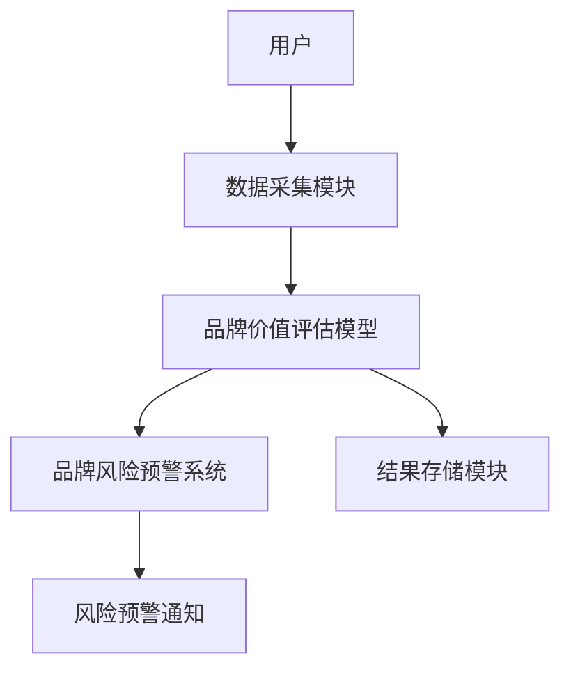
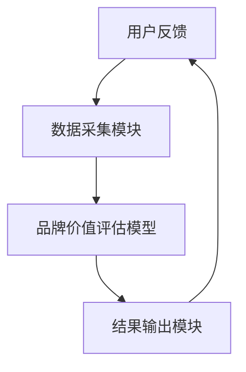

                 


# 巴菲特的品牌投资策略：社交媒体时代的品牌价值评估

## 关键词：
- 巴菲特
- 品牌价值
- 投资策略
- 社交媒体
- 价值评估
- 价值投资
- 品牌管理

## 摘要：
本文探讨了巴菲特品牌投资策略在社交媒体时代下的演变，特别是品牌价值评估的方法和挑战。通过分析品牌价值的核心构成、社交媒体对品牌认知的影响，以及如何结合数学模型进行品牌价值预测，本文为投资者提供了在数字化时代中评估和管理品牌价值的深度见解。

---

# 第一部分: 巴菲特的品牌投资策略概述

## 第1章: 巴菲特投资理念与品牌价值的核心概念

### 1.1 品牌价值在投资中的重要性

#### 1.1.1 品牌价值的定义与构成
品牌价值是企业在市场上的无形资产，反映了消费者对品牌的认知、信任和忠诚度。品牌价值的构成包括品牌知名度、品牌美誉度、品牌忠诚度和品牌创新能力。

$$\text{品牌价值} = \text{知名度} \times \text{美誉度} \times \text{忠诚度}$$

#### 1.1.2 品牌价值与企业长期盈利能力的关系
品牌价值高的企业通常具有更强的市场地位和定价能力，从而实现更高的利润率和长期盈利能力。

#### 1.1.3 巴菲特投资理念中的品牌价值观
巴菲特认为，品牌价值是企业长期盈利能力的关键因素。他倾向于投资那些具有强大品牌优势、稳定管理层和可持续竞争优势的企业。

### 1.2 社交媒体时代的品牌价值评估

#### 1.2.1 社交媒体对品牌价值的影响
社交媒体通过用户生成内容（UGC）和互动性，显著影响品牌价值。品牌在社交媒体上的表现，包括用户评论、点赞和分享量，成为品牌价值的重要指标。

#### 1.2.2 品牌价值评估新维度
社交媒体时代，品牌价值评估需要考虑以下新维度：
- 用户互动率
- 网络口碑传播
- 品牌舆情分析

#### 1.2.3 巴菲特投资策略在社交媒体时代的演变
尽管巴菲特的投资策略核心不变，但社交媒体为企业提供了更多的数据和洞察，帮助投资者更全面地评估品牌价值。

---

## 第2章: 巴菲特品牌投资策略的核心要素

### 2.1 品牌价值评估的五项标准

#### 2.1.1 高质量的管理层
管理层的决策能力和企业治理是品牌价值的重要保障。

#### 2.1.2 可持续的盈利能力
企业的财务健康和盈利能力是品牌价值的物质基础。

#### 2.1.3 强大的竞争优势
独特的竞争优势和市场地位是品牌长期价值的核心。

#### 2.1.4 合理的估值
合理的市场价格是实现投资收益的关键。

#### 2.1.5 财务健康状况
健康的财务状况是品牌价值的基石。

### 2.2 品牌价值评估的数学模型

#### 2.2.1 品牌价值加权评分法
$$\text{品牌价值评分} = \sum (\text{权重}_i \times \text{评分}_i)$$

#### 2.2.2 品牌价值指数计算公式
$$\text{品牌价值指数} = \frac{\text{品牌价值}}{\text{行业基准值}} \times 100$$

#### 2.2.3 品牌价值与股价关系的数学模型
$$\text{股价预测} = a \times \text{品牌价值} + b \times \text{财务指标} + c$$

---

## 第3章: 社交媒体时代的品牌价值评估新特征

### 3.1 社交媒体对品牌认知的影响

#### 3.1.1 用户生成内容（UGC）对品牌价值的影响
用户生成内容通过口碑传播影响品牌认知和购买决策。

#### 3.1.2 品牌舆情分析与品牌价值的关系
$$\text{品牌舆情指数} = \frac{\text{正面评论数} - \text{负面评论数}}{\text{总评论数}} \times 100$$

#### 3.1.3 网络口碑对品牌价值的即时影响
社交媒体上的即时评论可以迅速影响品牌价值和市场表现。

### 3.2 品牌价值评估维度的扩展

#### 3.2.1 品牌关注度与传播广度
品牌关注度越高，传播广度越广，品牌价值越大。

#### 3.2.2 品牌互动率与用户粘性
$$\text{品牌互动率} = \frac{\text{互动行为数}}{\text{关注用户数}} \times 100$$

#### 3.2.3 品牌舆情分析与风险评估
通过舆情分析，投资者可以识别品牌潜在风险并及时调整投资策略。

---

## 第4章: 巴菲特品牌投资策略的系统分析与架构设计

### 4.1 问题场景与项目介绍

#### 4.1.1 品牌价值评估的典型问题场景
- 数据来源多样且复杂
- 品牌价值受社交媒体影响显著
- 风险预警和实时监控需求

#### 4.1.2 项目目标与范围
开发一个基于社交媒体数据的品牌价值评估系统，提供实时品牌价值预测和风险预警功能。

### 4.2 系统功能设计

#### 4.2.1 数据采集模块
- 数据来源：社交媒体API接口（如Twitter、Facebook）
- 数据类型：文本评论、点赞、分享、关注数

#### 4.2.2 品牌价值评估模型
- 情感分析模型：使用自然语言处理技术分析评论情感
- 品牌价值指数计算：综合情感分析结果和品牌互动率

#### 4.2.3 品牌风险预警系统
- 实时监控品牌舆情
- 自动触发风险预警

### 4.3 系统架构设计

#### 4.3.1 系统架构图（Mermaid）


#### 4.3.2 模块交互流程图（Mermaid）


---

## 第5章: 巴菲特品牌投资策略的算法原理与实战

### 5.1 品牌价值评估的算法原理

#### 5.1.1 基于文本挖掘的品牌舆情分析
- 使用自然语言处理技术（如TF-IDF）提取关键词
- 分析评论情感（正面、负面、中性）

#### 5.1.2 基于情感分析的品牌价值预测
- 使用机器学习模型（如SVM、LSTM）进行情感分类
- 结合情感分析结果和品牌互动率预测品牌价值

#### 5.1.3 基于机器学习的品牌风险评估
- 使用时间序列分析预测品牌舆情变化
- 设定风险阈值触发预警机制

### 5.2 算法实现与代码解读

#### 5.2.1 品牌舆情分析的Python代码
```python
from textblob import TextBlob
import pandas as pd

def sentiment_analysis(text):
    blob = TextBlob(text)
    return blob.sentiment.polarity

data = pd.DataFrame({'comment': ['I love this brand!', 'Terrible service!', 'Good product']})
data['sentiment'] = data['comment'].apply(sentiment_analysis)
print(data)
```

#### 5.2.2 品牌价值指数计算的Python代码
```python
import numpy as np

comments = ['Excellent service!', 'Not satisfied with the product', 'Great quality!']
sentiments = [1, -1, 1]
weights = [0.5, 0.3, 0.2]

brand_value = np.dot(sentiments, weights)
print(f"Brand Value Index: {brand_value}")
```

---

## 第6章: 项目实战与案例分析

### 6.1 环境安装与配置

#### 6.1.1 安装必要的库
```bash
pip install numpy pandas textblob
```

#### 6.1.2 数据采集工具
- 使用Twitter API接口获取品牌评论数据
- 数据预处理和清洗

### 6.2 核心实现与代码解读

#### 6.2.1 品牌舆情分析模块
```python
from textblob import TextBlob
import tweepy

# API连接
auth = tweepy.OAuthHandler(consumer_key, consumer_secret)
api = tweepy.API(auth)

# 获取评论数据
comments = []
for tweet in tweepy.Cursor(api.search, q="BrandName", lang="en").items(100):
    comments.append(tweet.text)

# 情感分析
sentiments = []
for comment in comments:
    blob = TextBlob(comment)
    sentiments.append(blob.sentiment.polarity)

print(f"Average Sentiment: {np.mean(sentiments)}")
```

#### 6.2.2 品牌价值指数计算
```python
import numpy as np

positive_comments = sum(1 for s in sentiments if s > 0)
negative_comments = sum(1 for s in sentiments if s < 0)
neutral_comments = len(sentiments) - positive_comments - negative_comments

brand_value_index = (positive_comments - negative_comments) / (positive_comments + negative_comments + neutral_comments) * 100
print(f"Brand Value Index: {brand_value_index}")
```

### 6.3 案例分析

#### 6.3.1 实际案例
以某品牌为例，分析其在社交媒体上的评论数据，计算品牌价值指数，并根据模型预测未来走势。

#### 6.3.2 模型优化与结果解读
根据实际结果调整模型参数，优化情感分析准确率，提高品牌价值预测的精度。

### 6.4 项目小结

#### 6.4.1 成功经验总结
- 数据清洗和特征提取的重要性
- 情感分析模型的选择与优化

#### 6.4.2 问题与改进方向
- 数据量不足对模型准确率的影响
- 实时监控和风险预警的系统设计优化

---

## 第7章: 最佳实践与总结

### 7.1 总结
本文系统地探讨了巴菲特品牌投资策略在社交媒体时代的演变，重点分析了品牌价值评估的新特征和挑战。通过数学模型和算法实现，为投资者提供了科学的品牌价值评估方法。

### 7.2 小结
- 投资者应关注品牌在社交媒体上的表现，尤其是用户互动率和舆情分析
- 结合传统品牌价值评估方法和社交媒体数据，实现更全面的品牌价值评估

### 7.3 注意事项
- 数据来源的多样性和准确性对评估结果影响重大
- 情感分析模型的准确率直接影响品牌价值预测的可靠性
- 风险预警机制的有效性取决于数据的实时性和系统反应速度

### 7.4 拓展阅读
- 建议读者进一步学习自然语言处理和机器学习技术，提升品牌价值评估的准确性
- 探索更多品牌价值评估的数学模型和算法优化方法

---

## 作者：AI天才研究院 & 禅与计算机程序设计艺术

通过本文的系统分析和实战指导，读者可以深入理解巴菲特的品牌投资策略，并在社交媒体时代灵活运用这些策略进行品牌价值评估和投资决策。

