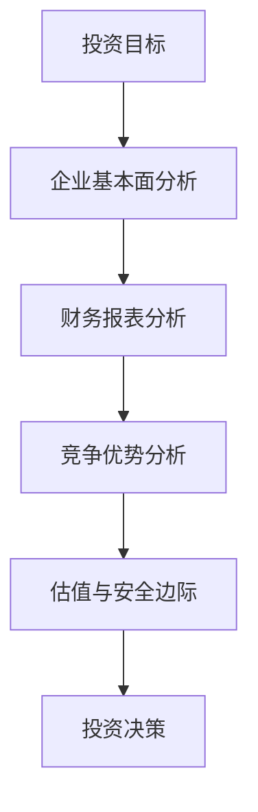

                 

# 巴菲特的商业分析方法论

> 关键词：巴菲特, 价值投资, 财务分析, 企业估值, 竞争优势, 投资策略, 风险管理

> 摘要：本文系统地阐述了巴菲特的商业分析方法论，从其投资哲学、财务分析、企业估值到竞争优势分析，再到风险管理，结合实际案例，深入剖析了巴菲特的方法论及其在现代投资中的应用。通过本文，读者将全面理解巴菲特的投资理念，并能够将其应用于实际投资决策中。

---

# 第一部分：巴菲特的商业分析方法论概述

## 第1章：巴菲特投资哲学与方法论

### 1.1 巴菲特的投资哲学

#### 1.1.1 价值投资的核心理念
价值投资是一种长期投资策略，强调以低于公允价值的价格购买优质资产。巴菲特的哲学基于以下核心理念：
- **市场先生理论**：市场波动反映短期情绪，而非理性决策。
- **安全边际**：以低于内在价值的价格买入，确保投资的安全性。
- **长期复利效应**：通过长期持有优质资产，实现财富的指数级增长。

#### 1.1.2 投资的长期主义与复利效应
巴菲特强调长期投资的重要性。复利效应的核心公式为：
$$
\text{最终价值} = \text{初始本金} \times (1 + \text{年化收益率})^{\text{年数}}
$$
例如，以10%的年化收益率投资30年，最终价值将是初始本金的 \(10 \times (1 + 0.10)^{30} \approx 10 \times 19.56 = 195.6\) 倍。

#### 1.1.3 巴菲特投资成功案例分析
巴菲特的长期投资案例（如可口可乐和伯克希尔哈撒韦）展示了其方法的成功。以下是可口可乐的分析框架：

---

## 第2章：巴菲特的财务报表分析方法

### 2.1 财务报表分析的核心要素

#### 2.1.1 收入与利润分析
- **收入分析**：关注主营业务收入的增长率和稳定性。
- **利润分析**：通过利润表分析企业的盈利能力和成本控制能力。

#### 2.1.2 资产负债表的关键指标
- **资产结构**：流动资产与非流动资产的比例。
- **负债结构**：流动负债与非流动负债的比例。
- **股东权益**：企业的净资产价值。

#### 2.1.3 现金流量表的重要性
- **经营活动现金流**：企业核心业务的现金流入流出。
- **投资活动现金流**：企业投资活动的现金流量。
- **筹资活动现金流**：企业融资活动的现金流量。

### 2.2 财务指标的计算与解读

#### 2.2.1 市盈率（P/E）的计算与应用
$$
\text{市盈率} = \frac{\text{股价}}{\text{每股净利润}}
$$
例如，某公司股价为 $50，每股净利润为 $5，则市盈率为 $10$。

#### 2.2.2 市净率（P/B）的计算与应用
$$
\text{市净率} = \frac{\text{股价}}{\text{每股净资产}}
$$
例如，某公司股价为 $30，每股净资产为 $10，则市净率为 $3$。

#### 2.2.3 净资产收益率（ROE）的计算与解读
$$
\text{ROE} = \frac{\text{净利润}}{\text{股东权益}}
$$
ROE越高，说明企业利用股东资金的效率越高。

### 2.3 巴菲特的财务分析框架

#### 2.3.1 企业财务健康度的评估标准
- **流动性**：流动比率、速动比率。
- **偿债能力**：资产负债率、利息覆盖倍数。
- **盈利能力**：ROE、净利率。

#### 2.3.2 财务数据与企业价值的关系
通过财务数据评估企业的内在价值，结合市场估值进行投资决策。

#### 2.3.3 财务分析的误区与注意事项
- 避免仅关注表面数据。
- 结合行业特点进行分析。

---

## 第3章：巴菲特的企业估值方法

### 3.1 企业估值的基本原理

#### 3.1.1 估值的核心概念与原则
- **内在价值**：企业未来现金流的现值。
- **市场价值**：市场交易价格，可能高于或低于内在价值。

#### 3.1.2 企业价值的构成要素
- **现金流**：企业未来产生的现金流。
- **折现率**：反映风险的贴现率。

#### 3.1.3 估值方法的选择与应用
根据企业的具体情况选择合适的估值方法，如DCF模型或相对估值法。

### 3.2 巴菲特的估值模型

#### 3.2.1 现金流折现模型（DCF）的应用
$$
\text{企业价值} = \sum_{t=1}^{n} \frac{\text{现金流}_t}{(1 + r)^t} + \frac{\text{终值}}{(1 + r)^n}
$$
其中，$r$ 为折现率，$n$ 为预测期数。

#### 3.2.2 市盈率与市净率的估值方法
- 市盈率：比较企业与行业平均水平的市盈率。
- 市净率：比较企业与行业平均水平的市净率。

#### 3.2.3 股东权益收益率（ROE）的估值应用
通过ROE评估企业的盈利能力，结合行业平均水平判断其估值是否合理。

### 3.3 估值中的关键因素

#### 3.3.1 行业周期的影响
行业周期波动会影响企业的现金流和估值。

#### 3.3.2 企业竞争优势的评估
竞争优势强的企业具有更高的内在价值。

#### 3.3.3 宏观经济环境的考量
宏观经济环境影响企业的现金流和折现率。

---

## 第4章：巴菲特的企业竞争优势分析

### 4.1 企业竞争优势的定义与分类

#### 4.1.1 竞争优势的核心要素
- **成本优势**：低于竞争对手的成本结构。
- **品牌优势**：强大的品牌影响力。
- **技术优势**：领先的技术或专利。

#### 4.1.2 可持续竞争优势的特征
- **难以复制性**：竞争对手难以模仿的核心优势。
- **长期可持续性**：竞争优势能够持续较长时间。

#### 4.1.3 企业竞争优势的评估维度
- **行业地位**：企业在行业中的地位。
- **市场份额**：企业的市场份额占比。

### 4.2 巴菲特的护城河分析框架

#### 4.2.1 成本优势的分析
通过分析企业的成本结构，判断其是否具有成本优势。

#### 4.2.2 品牌优势的分析
通过分析企业的品牌影响力，判断其是否具有品牌优势。

#### 4.2.3 技术优势的分析
通过分析企业的技术专利和研发能力，判断其是否具有技术优势。

---

## 第5章：巴菲特的风险管理与投资策略

### 5.1 风险管理的核心原则

#### 5.1.1 分散投资策略
通过分散投资降低非系统性风险。

#### 5.1.2 安全边际的设置
在估值的基础上设定安全边际，确保投资的安全性。

#### 5.1.3 长期投资策略
通过长期持有优质资产，降低短期市场波动的影响。

### 5.2 巴菲特的分散投资策略

#### 5.2.1 投资组合的构建
根据企业的基本面和竞争优势，构建多元化投资组合。

#### 5.2.2 风险分散的方法
通过投资不同行业、不同规模的企业，分散投资风险。

### 5.3 巴菲特的长期投资策略

#### 5.3.1 长期复利效应的重要性
长期投资能够最大化复利效应。

#### 5.3.2 长期投资的风险管理
通过长期投资，降低短期市场波动的影响。

---

## 第6章：案例分析与现代应用

### 6.1 巴菲特方法的案例分析

#### 6.1.1 可口可乐的案例分析
通过分析可口可乐的财务报表、竞争优势和估值，说明巴菲特的投资逻辑。

#### 6.1.2 伯克希尔哈撒韦的案例分析
分析伯克希尔哈撒韦的投资决策和管理策略，说明巴菲特的长期投资理念。

### 6.2 巴菲特方法的现代应用

#### 6.2.1 现代市场环境下的巴菲特方法
结合现代市场环境，调整巴菲特的方法，适应新的市场变化。

#### 6.2.2 数据驱动的巴菲特方法
通过大数据分析和量化投资，提升巴菲特方法的科学性和精确性。

---

# 第四部分：小结与展望

## 第7章：总结与展望

### 7.1 总结
本文系统地阐述了巴菲特的商业分析方法论，从其投资哲学、财务分析、企业估值到竞争优势分析，再到风险管理，结合实际案例，深入剖析了巴菲特的方法论及其在现代投资中的应用。

### 7.2 展望
随着市场的变化和技术的进步，巴菲特的方法论需要不断优化和创新，以适应新的市场环境。

---

# 作者信息

作者：AI天才研究院/AI Genius Institute & 禅与计算机程序设计艺术 /Zen And The Art of Computer Programming

