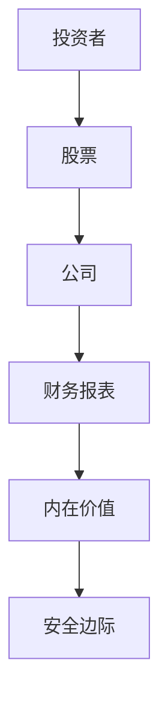
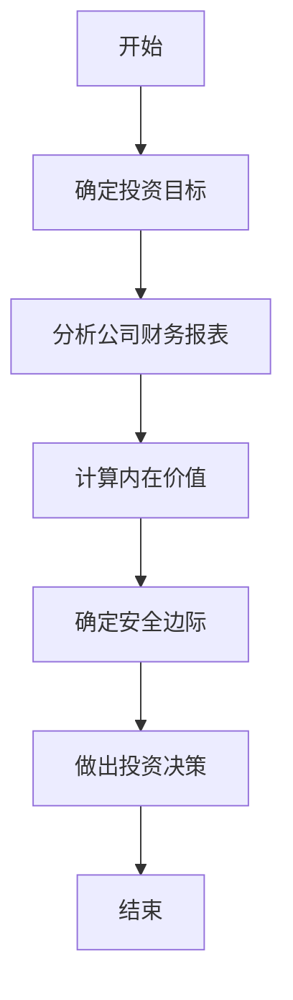
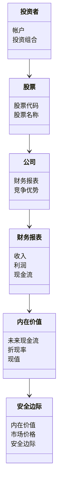
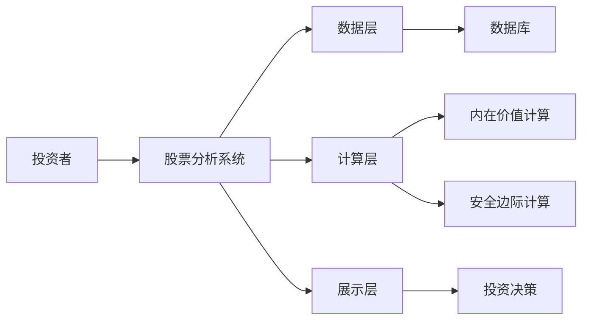
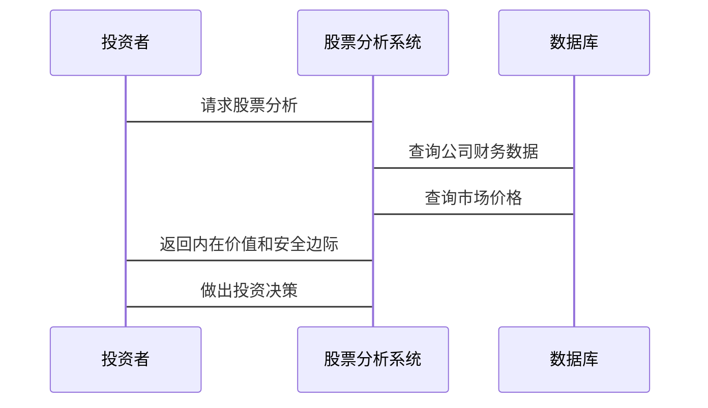

                 


# 巴菲特的商业模式分析

## 关键词：巴菲特，商业模式，价值投资，安全边际，内在价值，投资策略

## 摘要：巴菲特的商业模式以价值投资为核心，强调长期持有和基本面分析。本文将详细分析其核心概念、算法原理、系统架构及实际案例，帮助读者理解并应用这一投资策略。

---

## 第1章：巴菲特的商业模式概述

### 1.1 巴菲特商业模式的背景介绍

#### 1.1.1 价值投资的起源与发展
价值投资是一种长期投资策略，起源于20世纪初。本杰明·格雷厄姆是该理论的奠基人，巴菲特师承于他，并将价值投资发扬光大。价值投资的核心是寻找市场低估的股票，通过分析公司的基本面，找到具有长期竞争优势的企业进行投资。

#### 1.1.2 巴菲特投资理念的核心思想
巴菲特的投资理念可以总结为“以合理的价格买入优秀的公司”。他强调长期投资、分散风险和关注企业的内在价值，而不是短期市场波动。

#### 1.1.3 巴菲特商业模式的独特性
与传统投资策略不同，巴菲特的模式注重企业的财务健康、竞争优势和管理团队。他不仅关注公司的财务数据，还关注公司的商业模式和管理能力。

---

### 1.2 巴菲特商业模式的核心概念

#### 1.2.1 价值投资的定义与特点
价值投资是一种以低于内在价值的价格买入优质股票的投资策略。其特点包括：
- 长期持有：避免频繁交易，减少成本。
- 基本面分析：关注公司的财务报表和行业地位。
- 安全边际：买入价格低于内在价值，以降低风险。

#### 1.2.2 安全边际的内涵与作用
安全边际是指买入价格与内在价值之间的差距。它为投资提供了缓冲区，能够在市场波动时减少损失。例如，如果一只股票的内在价值为100元，而买入价格为80元，安全边际为20元。

#### 1.2.3 内在价值的计算与评估
内在价值是未来现金流的现值。计算公式如下：
$$\text{内在价值} = \sum_{t=1}^{\infty} \frac{\text{现金流}_t}{(1 + r)^t}$$
其中，r为折现率，现金流为公司未来每期的现金流。

---

## 第2章：巴菲特商业模式的核心概念与联系

### 2.1 核心概念原理

#### 2.1.1 价值投资的数学模型
价值投资的数学模型主要基于现金流折现法。公式如下：
$$\text{内在价值} = \frac{\text{自由现金流}}{\text{加权平均资本成本}}$$

#### 2.1.2 安全边际的计算方法
安全边际的计算公式为：
$$\text{安全边际} = \text{内在价值} - \text{市场价格}$$

#### 2.1.3 内在价值的评估公式
内在价值的评估公式如前所述，基于未来现金流的现值计算。

---

### 2.2 核心概念属性特征对比表格

| 概念      | 属性                | 特征                              |
|-----------|---------------------|-----------------------------------|
| 价值投资  | 投资策略            | 长期持有，注重基本面分析          |
| 安全边际  | 风险控制            | 购买价格低于内在价值，降低风险    |
| 内在价值  | 评估标准            | 考虑未来现金流的现值，评估企业价值 |

---

### 2.3 ER实体关系图（Mermaid流程图）



---

## 第3章：巴菲特商业模式的算法原理讲解

### 3.1 算法原理

#### 3.1.1 内在价值计算的算法流程
1. 收集公司的财务数据，包括收入、利润、现金流等。
2. 预测未来现金流。
3. 确定合适的折现率。
4. 计算未来现金流的现值，得出内在价值。

#### 3.1.2 安全边际的计算方法
1. 计算公司的内在价值。
2. 比较内在价值与市场价格。
3. 计算安全边际：内在价值 - 市场价格。

#### 3.1.3 股票估值的数学模型
股票估值公式：
$$\text{合理价格} = \text{内在价值} \times (1 - \text{安全边际})$$

---

### 3.2 算法流程图（Mermaid）



---

### 3.3 核心算法的数学模型

#### 3.3.1 内在价值公式
$$\text{内在价值} = \sum_{t=1}^{\infty} \frac{\text{现金流}_t}{(1 + r)^t}$$

#### 3.3.2 安全边际公式
$$\text{安全边际} = \text{内在价值} - \text{市场价格}$$

---

### 3.4 举例说明

#### 3.4.1 案例一：可口可乐的内在价值计算
假设可口可乐的自由现金流为10亿元，折现率为8%。计算内在价值：
$$\text{内在价值} = \frac{10}{0.08} = 125 \text{亿元}$$

#### 3.4.2 案例二：安全边际的应用
如果可口可乐的市场价格为100亿元，内在价值为125亿元，安全边际为25亿元。

---

## 第4章：巴菲特商业模式的系统分析与架构设计

### 4.1 问题场景介绍

#### 4.1.1 投资者面临的挑战
投资者在股票市场上面临信息不对称、市场波动和情绪化决策等问题。

#### 4.1.2 股票分析的复杂性
股票分析需要考虑财务数据、行业趋势、竞争优势等多方面因素。

#### 4.1.3 风险管理的重要性
投资风险包括市场风险、流动性风险和公司特有风险。

---

### 4.2 项目介绍

#### 4.2.1 项目目标
构建一个基于巴菲特商业模式的投资分析系统，帮助投资者进行股票分析和投资决策。

#### 4.2.2 项目范围
包括数据收集、财务分析、内在价值计算、安全边际分析等功能模块。

---

### 4.3 系统功能设计（领域模型Mermaid类图）



---

### 4.4 系统架构设计（Mermaid架构图）



---

### 4.5 系统交互设计（Mermaid序列图）



---

## 第5章：项目实战

### 5.1 环境安装

#### 5.1.1 安装Python
安装Python 3.x版本，并配置环境变量。

#### 5.1.2 安装依赖库
安装Pandas、NumPy、Matplotlib等数据分析库。

---

### 5.2 系统核心实现源代码

#### 5.2.1 数据收集与处理
```python
import pandas as pd

# 读取财务数据
df = pd.read_csv('财务报表.csv')
# 计算现金流
cash_flow = df['现金流'].values
```

#### 5.2.2 内在价值计算
```python
def calculate_intrinsic_value(cash_flow, discount_rate):
    return sum(cash_flow / (1 + discount_rate) ** t for t in range(len(cash_flow)))

# 示例
cash_flow = [10, 12, 15]  # 简单假设
discount_rate = 0.08
iv = calculate_intrinsic_value(cash_flow, discount_rate)
print(f"内在价值：{iv}")
```

#### 5.2.3 安全边际计算
```python
def calculate_margin_of_safety(iv, market_price):
    return iv - market_price

# 示例
market_price = 100
print(f"安全边际：{calculate_margin_of_safety(iv, market_price)}")
```

---

### 5.3 代码应用解读与分析

#### 5.3.1 数据收集
从数据库或CSV文件中读取公司的财务数据，包括收入、利润和现金流。

#### 5.3.2 内在价值计算
使用现金流折现法计算公司股票的内在价值。

#### 5.3.3 安全边际计算
比较股票的市场价格与内在价值，计算安全边际，判断是否值得投资。

---

### 5.4 实际案例分析

#### 5.4.1 案例分析：可口可乐

1. **数据收集**：获取可口可乐的财务数据，包括现金流。
2. **内在价值计算**：
   ```python
   cash_flow = [10, 12, 15]  # 简单假设
   discount_rate = 0.08
   iv = sum(cash_flow / (1 + discount_rate) ** t for t in range(len(cash_flow)))
   print(f"内在价值：{iv}")
   ```
3. **安全边际计算**：
   ```python
   market_price = 100
   margin = iv - market_price
   print(f"安全边际：{margin}")
   ```

---

## 第6章：总结与小结

### 6.1 最佳实践 tips

- **长期持有**：避免频繁交易，减少成本。
- **基本面分析**：关注公司的财务健康和竞争优势。
- **安全边际**：买入价格低于内在价值，降低风险。

### 6.2 小结

通过本文的分析，我们了解了巴菲特商业模式的核心概念、算法原理和系统架构。投资者可以利用这些方法进行股票分析和投资决策，提高投资成功率。

### 6.3 注意事项

- **数据准确性**：确保财务数据的准确性和完整性。
- **市场变化**：及时关注市场变化，调整投资策略。
- **风险管理**：合理分散投资，降低风险。

### 6.4 拓展阅读

- 《巴菲特致股东的信》
- 《价值投资入门》
- 《投资学原理》

---

## 作者：AI天才研究院 & 禅与计算机程序设计艺术

---

希望这篇文章能为您提供有价值的信息，帮助您更好地理解巴菲特的商业模式，并将其应用于实际投资中。如果需要进一步探讨或有其他问题，请随时联系。

