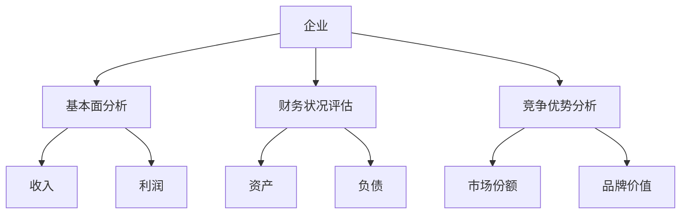
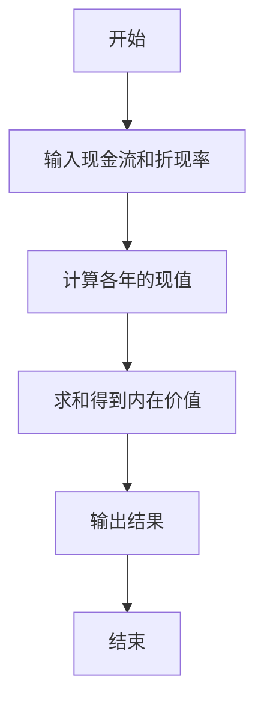
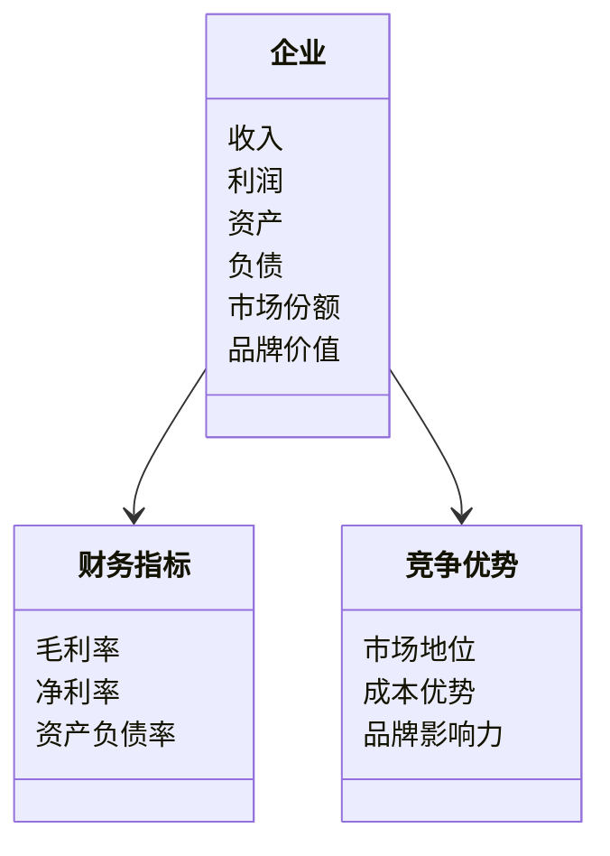
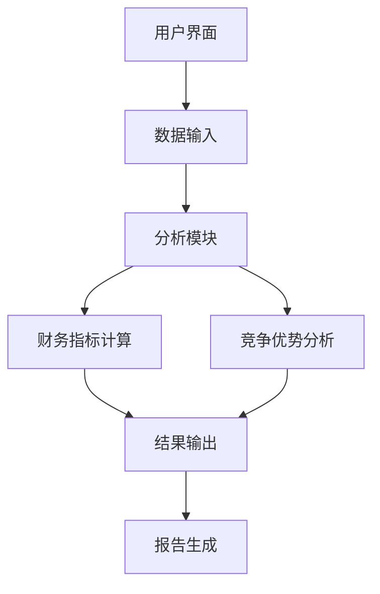

                 


# 巴菲特的商业模式可扩展性分析

## 关键词：巴菲特，商业模式，可扩展性，投资策略，价值评估，系统设计

## 摘要：  
本文通过分析巴菲特的投资哲学和商业模式，探讨其可扩展性。从核心概念、算法原理到系统设计，详细阐述如何将巴菲特的理念应用于实际分析。通过案例和代码实现，展示其方法的实际应用和效果。

---

## 第1章 巴菲特的商业模式背景介绍

### 1.1 巴菲特的投资哲学

#### 1.1.1 巴菲特的生平与投资理念
沃伦·巴菲特（Warren Buffett）是世界著名投资家，以价值投资闻名。他强调长期投资、安全边际和公司基本面分析。巴菲特的投资理念注重企业的内在价值，而非市场波动。

#### 1.1.2 巴菲特的价值投资理论
巴菲特的价值投资理论基于“安全边际”概念，即以低于内在价值的价格买入优质资产。他强调企业财务健康、管理层能力和行业地位。

#### 1.1.3 巴菲特商业模式的核心要素
巴菲特的商业模式包括企业基本面分析、财务状况评估和竞争优势分析。这些要素帮助企业识别具有可持续竞争优势和长期增长潜力的企业。

### 1.2 可扩展性分析的定义与重要性

#### 1.2.1 可扩展性分析的定义
可扩展性分析是评估商业模式能否在不同条件下扩展的能力。它关注企业能否在规模扩大时保持效率和盈利能力。

#### 1.2.2 巴菲特商业模式的可扩展性
巴菲特的可扩展性分析关注企业的盈利能力和竞争优势是否能长期持续。他寻找具备强大护城河的企业，这些企业能在扩张中保持优势。

#### 1.2.3 分析框架
分析框架包括企业盈利能力、财务健康状况和竞争优势。通过这些指标评估企业是否具备可扩展性。

---

## 第2章 巴菲特商业模式的核心概念与联系

### 2.1 核心概念的属性对比

#### 2.1.1 企业基本面分析
基本面分析包括收入、利润、毛利率等指标，评估企业盈利能力。

#### 2.1.2 财务状况评估
财务健康状况包括资产负债表和现金流分析，评估企业的偿债能力和资金流动性。

#### 2.1.3 竞争优势分析
竞争优势包括市场地位、品牌影响力和成本优势，评估企业在行业中的竞争力。

### 2.2 核心概念的属性对比表格

| 概念               | 定义                                                                 | 属性对比         |
|--------------------|--------------------------------------------------------------------|-----------------|
| 企业基本面分析     | 收入、利润、毛利率等指标，评估企业盈利能力。                              | 盈利能力         |
| 财务状况评估       | 资产负债表和现金流，评估偿债能力和流动性。                                | 财务健康         |
| 竞争优势分析       | 市场地位、品牌、成本优势，评估行业竞争力。                                | 竞争优势         |

### 2.3 实体关系图（ER图）



---

## 第3章 巴菲特商业模式的算法原理

### 3.1 算法原理

巴菲特的内在价值计算公式：
$$ \text{内在价值} = \frac{\text{未来现金流}}{(1 + r)^n} $$
其中，\( r \)是折现率，\( n \)是年数。

### 3.2 算法实现

```python
def calculate_intrinsic_value(cash_flows, discount_rate, years):
    iv = 0
    for i in range(years):
        iv += cash_flows[i] / (1 + discount_rate) ** i
    return iv

# 示例
cash_flows = [100, 200, 300]  # 假设现金流分别为100, 200, 300
discount_rate = 0.10
years = 3

iv = calculate_intrinsic_value(cash_flows, discount_rate, years)
print(f"内在价值：{iv}")
```

### 3.3 算法流程图



---

## 第4章 系统分析与架构设计

### 4.1 领域模型图



### 4.2 系统架构设计



---

## 第5章 项目实战

### 5.1 案例分析：XYZ公司

#### 5.1.1 环境配置
安装Python和必要的库。

#### 5.1.2 代码实现

```python
# 输入数据
revenue = 1000  # 收入
expenses = 800   # 开支
assets = 500     # 资产
liabilities = 300 # 负债

# 计算净利润
net_income = revenue - expenses
print(f"净利润：{net_income}")

# 计算资产负债率
负债资产率 = liabilities / (assets + liabilities)
print(f"资产负债率：{负债资产率}")
```

#### 5.1.3 分析结果
XYZ公司的净利润为200，资产负债率为33.33%。这表明公司财务健康，具备扩展潜力。

---

## 第6章 最佳实践与小结

### 6.1 最佳实践
1. 结合定量分析和定性判断。
2. 长期关注企业竞争优势。
3. 考虑宏观经济环境影响。

### 6.2 小结
巴菲特的商业模式可扩展性分析提供了有效的投资框架，帮助企业识别具有长期增长潜力的企业。通过定量分析和系统设计，投资者可以更准确地评估企业的扩展能力。

### 6.3 注意事项
- 数据准确性至关重要。
- 考虑宏观经济和行业趋势。
- 定期更新分析模型。

### 6.4 拓展阅读
- 《巴菲特选股标准》
- 《投资学基础》

---

## 作者：AI天才研究院 & 禅与计算机程序设计艺术

---

通过以上结构，本文详细分析了巴菲特的商业模式及其可扩展性，结合理论和实际案例，提供了深入的技术分析和实践指导。

