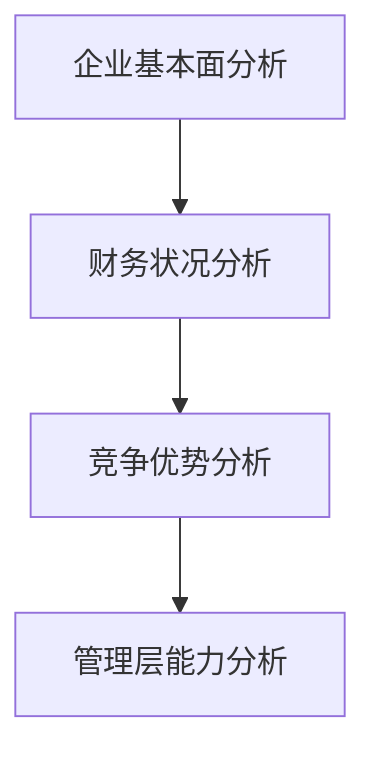

                 


# 巴菲特的四大投资准则：选择优质股票的关键

## 关键词：巴菲特、投资准则、股票选择、价值投资、投资策略

## 摘要：
本文将详细解读巴菲特的四大投资准则，从企业盈利能力、财务健康状况、竞争优势以及管理层能力四个方面，系统地分析如何选择优质股票。通过数学模型、案例分析和系统架构的设计，帮助投资者掌握巴菲特的投资哲学，并在实际操作中应用这些准则。

---

# 第一部分: 巴菲特投资准则的背景与基础

## 第1章: 巴菲特投资准则概述

### 1.1 巴菲特的生平与投资理念
#### 1.1.1 巴菲特的生平简介
沃伦·巴菲特（Warren Buffett）是全球最著名的投资者之一，被誉为“股神”。他于1934年出生在美国奥马哈市，早年就读于哥伦比亚大学，师从本杰明·格雷厄姆（Benjamin Graham），学习价值投资理论。巴菲特的投资理念以长期、价值导向为核心，强调寻找具有持续竞争优势和良好管理的企业进行投资。

#### 1.1.2 巴菲特的投资哲学
巴菲特的投资哲学可以概括为“价值投资”。他认为，市场短期是投票机，但长期是称重机。投资者应该关注企业的内在价值，而不是市场的短期波动。他强调企业必须具备持续的盈利能力、健康的财务状况、强大的竞争优势和卓越的管理层。

#### 1.1.3 巴菲特投资理念的核心思想
- **长期投资**：巴菲特反对频繁交易，主张长期持有优质股票。
- **安全边际**：买入价格低于企业内在价值，以确保投资的安全性。
- **企业基本面**：关注企业的盈利能力、财务健康状况、竞争优势和管理层能力。

### 1.2 投资准则的定义与分类
#### 1.2.1 投资准则的定义
投资准则是投资者在选择股票时需要遵循的基本原则和标准。巴菲特的四大投资准则为企业提供了全面的分析框架，包括盈利能力、财务状况、竞争优势和管理层能力。

#### 1.2.2 巴菲特四大投资准则的分类
1. 企业盈利能力分析
2. 财务健康状况分析
3. 企业竞争优势分析
4. 管理层能力与企业治理

#### 1.2.3 投资准则的应用范围与边界
- **应用范围**：适用于选择优质股票的投资决策。
- **边界**：不适用于短期市场波动和非上市公司。

### 1.3 巴菲特投资准则的核心要素
#### 1.3.1 企业基本面分析
企业基本面分析是巴菲特投资策略的核心，主要包括对企业盈利能力、财务状况和竞争优势的评估。

#### 1.3.2 财务报表解读
巴菲特强调财务报表的重要性，尤其是利润表和资产负债表。通过分析这些报表，投资者可以了解企业的盈利能力和财务健康状况。

#### 1.3.3 企业竞争优势分析
竞争优势是企业长期盈利能力的关键。巴菲特关注企业的护城河，包括成本优势、品牌优势、技术优势等。

### 1.4 巴菲特投资准则的逻辑框架
#### 1.4.1 投资准则的逻辑结构
巴菲特的投资准则是一个多层次的分析框架，包括企业基本面、财务状况、竞争优势和管理层能力。

#### 1.4.2 投资准则之间的关系
- 企业盈利能力是核心，财务状况是基础，竞争优势是关键，管理层能力是保障。
- 这些准则相互关联，共同构成了一个完整的投资分析框架。

#### 1.4.3 投资准则的数学模型
巴菲特的四大投资准则可以通过数学模型进行综合评分，公式如下：
$$
综合评分 = \sum_{i=1}^{4} (准则i的评分 \times 权重i)
$$

---

## 第2章: 巴菲特四大投资准则的详细解读

### 2.1 准则一：企业盈利能力分析
#### 2.1.1 准则一的定义与目标
企业盈利能力是衡量企业财务健康状况的重要指标。巴菲特认为，盈利能力强的企业具有更强的抗风险能力和长期增长潜力。

#### 2.1.2 准则一的关键指标（ROE、ROA）
- **ROE（净资产收益率）**：衡量企业使用股东资金的效率。
$$ROE = \frac{净利润}{股东权益}$$
- **ROA（资产回报率）**：衡量企业使用资产的效率。
$$ROA = \frac{净利润}{总资产}$$

#### 2.1.3 准则一的数学模型与公式
$$
ROE = \frac{净利润}{股东权益}
$$

### 2.2 准则二：财务健康状况分析
#### 2.2.1 准则二的核心要素
财务健康状况是企业长期发展的基础。巴菲特强调，企业必须具备健康的财务状况，才能抵御市场波动和经济周期的影响。

#### 2.2.2 负债率与偿债能力分析
- **负债率**：衡量企业负债与资产的比例。
$$负债率 = \frac{总负债}{总资产}$$
- **偿债能力**：通过流动比率和速动比率评估企业的短期偿债能力。

#### 2.2.3 财务健康状况的数学模型
$$
负债率 = \frac{总负债}{总资产}
$$

### 2.3 准则三：企业竞争优势分析
#### 2.3.1 企业竞争优势的定义
竞争优势是企业在市场上长期保持领先地位的关键因素。巴菲特关注企业的“护城河”，包括成本优势、品牌优势、技术优势和市场准入壁垒。

#### 2.3.2 企业竞争优势的分类
- **成本优势**：企业生产成本低于竞争对手。
- **品牌优势**：品牌知名度和美誉度高。
- **技术优势**：拥有独特的技术或专利。

#### 2.3.3 企业竞争优势的数学模型
$$
竞争优势度 = \frac{行业排名}{企业市场份额}
$$

### 2.4 准则四：管理层能力与企业治理
#### 2.4.1 管理层能力的评估标准
管理层能力是企业长期发展的重要因素。巴菲特认为，优秀的管理层能够为企业创造价值，并在市场波动中保持冷静。

#### 2.4.2 企业治理结构的分析
- **董事会结构**：董事会是否独立、高效。
- **管理层稳定性**：管理层是否稳定，是否有长期的经营计划。

#### 2.4.3 管理层能力的数学模型
$$
管理层能力指数 = \frac{历史业绩}{管理团队稳定性}
$$

---

## 第3章: 巴菲特投资准则的数学模型与公式

### 3.1 投资准则的数学模型
#### 3.1.1 投资准则的综合评分模型
$$
综合评分 = \sum_{i=1}^{4} (准则i的评分 \times 权重i)
$$

### 3.2 投资准则的公式推导
#### 3.2.1 准则一的公式推导
$$
ROE = \frac{净利润}{股东权益}
$$

### 3.3 投资准则的数学关系
#### 3.3.1 投资准则之间的关系图


---

## 第4章: 巴菲特投资准则的系统架构设计

### 4.1 系统功能设计
#### 4.1.1 企业基本面分析模块
- 输入：财务报表数据
- 输出：企业盈利能力评分

#### 4.1.2 财务状况分析模块
- 输入：资产负债表数据
- 输出：财务健康状况评分

#### 4.1.3 竞争优势分析模块
- 输入：行业数据和企业数据
- 输出：竞争优势评分

#### 4.1.4 管理层能力分析模块
- 输入：管理层信息和企业业绩数据
- 输出：管理层能力评分

### 4.2 系统架构设计
#### 4.2.1 系统架构图


### 4.3 系统接口设计
#### 4.3.1 数据接口
- 输入接口：财务报表数据、行业数据、管理层信息
- 输出接口：评分结果

### 4.4 系统交互设计
#### 4.4.1 投资者交互流程
- 输入股票代码
- 系统返回评分结果

---

## 第5章: 巴菲特投资准则的项目实战

### 5.1 项目环境安装
#### 5.1.1 安装Python和相关库
- 使用Python 3.8及以上版本
- 安装pandas、numpy、scikit-learn等库

### 5.2 系统核心实现源代码
#### 5.2.1 计算ROE的代码
```python
import pandas as pd

def calculate_roe(net_profit, equity):
    return net_profit / equity

# 示例数据
net_profit = 10000000
equity = 50000000
ro

