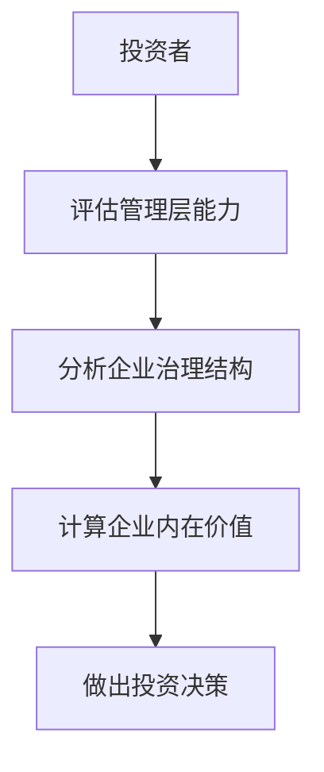

                 


# 巴菲特的圈子理论

> 关键词：巴菲特，圈子理论，投资哲学，管理层能力，企业治理，价值投资

> 摘要：本文深入探讨巴菲特的圈子理论，从其投资哲学到实际应用，分析如何通过评估管理层能力和企业治理结构来实现价值投资。结合实际案例，总结其在投资决策中的重要性。

---

## 引言

在投资领域，巴菲特的智慧备受推崇。本文将介绍巴菲特的圈子理论，分析其核心概念，并通过案例展示其应用。

---

## 第一部分：巴菲特的背景与投资哲学

### 第1章：巴菲特的生平与投资理念

#### 1.1 巴菲特的生平简介

沃伦·巴菲特，生于1930年，美国著名投资者。他的投资哲学强调长期价值，而非短期波动。早年通过合伙公司积累财富，后来转向购买有稳定现金流的公司。

#### 1.2 巴菲特的投资哲学

- **投资定义**：购买企业的一部分，关注其长期盈利能力。
- **价值投资**：寻找市场价低于内在价值的股票。
- **长期投资**：耐心持有优质资产，避免频繁交易。

---

## 第二部分：圈子理论的背景与核心概念

### 第2章：圈子理论的背景与问题背景

#### 2.1 问题背景

投资者在决策时面临信息不对称，难以评估企业的真实价值。巴菲特提出通过评估管理层能力和企业治理结构来解决这一问题。

#### 2.2 核心概念

- **管理层能力**：管理层的决策能力和诚信直接影响企业价值。
- **企业治理结构**：合理的治理结构确保管理层与股东利益一致。

#### 2.3 理论的边界

- 适用于分析企业基本面，不适用于短期市场波动。

---

## 第三部分：圈子理论的核心概念与联系

### 第3章：圈子理论的核心原理

#### 3.1 管理层能力的影响

管理层能力是企业成功的关键因素。巴菲特通过分析管理层的历史表现和决策能力，判断其能否创造持续价值。

#### 3.2 企业治理结构的重要性

良好的治理结构确保管理层行为符合股东利益，防止滥用职权。

#### 3.3 实体关系图

```mermaid
er
  actor 投资者
  actor 管理层
  actor 企业
  actor 股东
  relation 拥有
  relation 管理
  relation 影响
  relation 依赖
```

---

## 第四部分：圈子理论的算法原理与数学模型

### 第4章：算法原理与数学模型

#### 4.1 算法原理



#### 4.2 数学模型

- 内在价值公式：
  $$ 内在价值 = \frac{每股收益 \times (1 + g)}{r - g} $$
  其中，$g$ 为增长率，$r$ 为折现率。

例如，假设每股收益为10，增长率5%，折现率10%：
$$ 内在价值 = \frac{10 \times 1.05}{0.10 - 0.05} = 210 $$

---

## 第五部分：项目实战与案例分析

### 第5章：实际案例分析

#### 5.1 可口可乐案例

- **管理层**：长期稳定的管理层，注重股东价值。
- **治理结构**：分散股权，管理层与股东利益一致。
- **内在价值**：通过公式计算，确认其内在价值高于市场价格。

#### 5.2 苹果公司案例

- **管理层**：乔布斯回归后，苹果创新能力强。
- **治理结构**：注重研发投入，股东回报丰厚。

---

## 第六部分：总结与展望

### 第6章：总结与展望

巴菲特的圈子理论强调管理层能力和企业治理结构的重要性。通过评估这些因素，投资者可以做出更明智的决策。未来，随着企业环境的变化，这一理论仍将是价值投资的重要工具。

---

## 作者信息

作者：AI天才研究院/AI Genius Institute & 禅与计算机程序设计艺术 /Zen And The Art of Computer Programming

