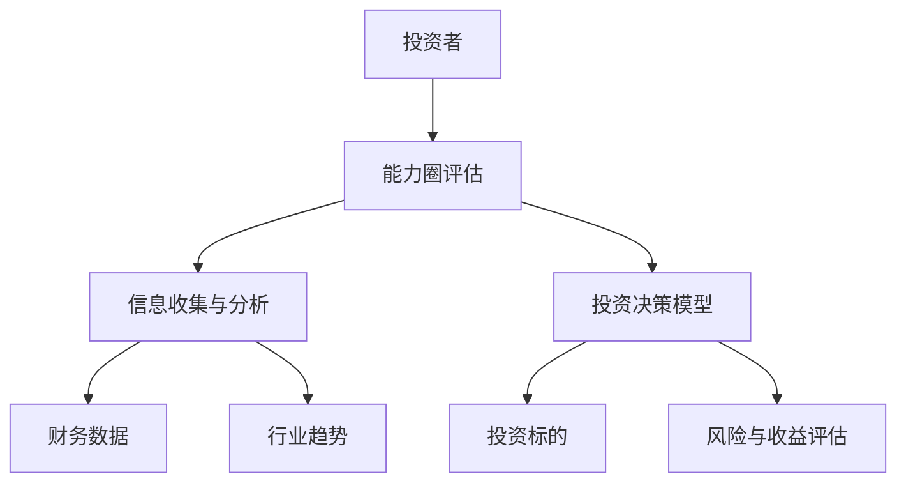

                 


# 巴菲特的圈子理论：如何在自己的能力范围内投资

## 关键词：
- 巴菲特，能力圈，投资策略，价值投资，风险管理，长期投资

## 摘要：
本文通过分析巴菲特的“能力圈”理论，探讨如何在自己的能力范围内进行投资。文章从巴菲特的生平和投资理念出发，详细阐述能力圈的定义、特征、核心要素及其与投资策略的关系。接着，分析巴菲特如何通过能力圈理论进行投资决策，并结合实际案例，探讨如何在投资中应用该理论。最后，构建系统化的投资方法论，并提供一个实战案例，帮助读者理解如何在自己的能力范围内制定有效的投资策略。

---

## 引言

### 第1章：巴菲特的生平与投资理念

#### 1.1 巴菲特的早年经历
沃伦·巴菲特（Warren Buffett）于1934年8月30日出生在美国内布拉斯州的奥马哈市。他从小就展现出了对数字和投资的浓厚兴趣。巴菲特的童年并不富裕，但他的父亲是一位成功的律师，也是一位投资者，这使他从小便接触到了投资的概念。

巴菲特在高中时期就开始研究股票市场，他在《纽约时报》上发表了一篇关于棒球队员薪资与球队表现关系的文章，这显示了他对数据分析和投资逻辑的理解能力。

#### 1.2 巴菲特的投资成就
巴菲特在投资领域取得了举世瞩目的成就。他创立的伯克希尔·哈撒韦公司（Berkshire Hathaway）从一家濒临破产的纺织公司，发展成为一家市值数千亿美元的跨国企业。巴菲特的投资策略和哲学使其成为全球最著名的投资者之一。

#### 1.3 巴菲特的投资哲学
巴菲特的投资哲学可以概括为“价值投资”。他认为，投资者应该寻找那些具有持续竞争优势、良好治理结构和优秀管理团队的公司，并以合理的价格买入并长期持有。他的投资理念强调安全边际和长期价值，而不是短期市场波动。

---

## 第二部分：圈子理论的核心概念

### 第2章：能力圈的定义与特征

#### 2.1 能力圈的定义
能力圈（Circle of Competence）是指投资者对自己所了解和擅长的领域内的知识和经验范围。巴菲特认为，投资者应该只在自己能力圈内进行投资，以降低风险并提高投资成功的概率。

#### 2.2 能力圈的核心要素
能力圈的核心要素包括：
- **信息优势**：对投资标的有深入的理解和研究。
- **行业知识**：对所投资的行业有丰富的知识和经验。
- **财务分析能力**：能够准确评估公司的财务状况和盈利能力。

#### 2.3 能力圈与投资策略的关系
能力圈与投资策略密切相关。投资者应该在自己能力圈内的领域寻找投资机会，避免超出自己能力范围的投资，以降低风险。

---

## 第三部分：巴菲特的圈子理论与投资策略

### 第3章：巴菲特的投资策略解析

#### 3.1 价值投资的核心原则
巴菲特的价值投资原则包括：
- **寻找具有持续竞争优势的公司**：选择那些在行业中具有竞争优势的公司。
- **注重安全边际**：以低于内在价值的价格买入股票。
- **长期持有**：避免频繁交易，长期持有优质股票。

#### 3.2 安全边际的重要性
安全边际是指买入价格与公司内在价值之间的差距。巴菲特认为，安全边际能够降低投资风险，确保在市场波动中依然能够获得收益。

#### 3.3 投资决策中的心理因素
巴菲特认为，投资者的心理因素对投资决策至关重要。他强调避免情绪化决策，保持理性思考。

---

## 第四部分：圈子理论在实际投资中的应用

### 第4章：如何在能力圈内进行投资

#### 4.1 确定自己的能力圈
确定能力圈的方法包括：
- **自我评估**：评估自己的知识、经验和能力。
- **研究市场**：了解市场中的各个行业和公司。
- **寻找竞争优势**：选择那些具有持续竞争优势的公司。

#### 4.2 制定投资计划
制定投资计划的步骤包括：
- **设定目标**：明确投资目标和预期收益。
- **选择投资标的**：根据能力圈选择合适的投资标的。
- **制定投资策略**：制定具体的买入和卖出策略。

#### 4.3 风险管理
风险管理是投资过程中不可忽视的一部分。巴菲特强调，投资者应该在能力圈内进行投资，并分散投资以降低风险。

---

## 第五部分：系统化投资方法论

### 第5章：能力圈评估框架

#### 5.1 信息收集与分析
信息收集与分析是能力圈评估的重要步骤。投资者需要收集公司财务数据、行业趋势和市场动态等信息，并进行深入分析。

#### 5.2 投资决策模型
投资决策模型是基于能力圈评估的系统化方法。模型包括以下几个步骤：
1. **确定能力圈**：评估自己的知识和经验。
2. **选择投资标的**：根据能力圈选择合适的投资标的。
3. **评估风险与收益**：分析投资标的的风险和收益。

#### 5.3 系统架构设计
系统架构设计是实现能力圈评估的关键。以下是系统架构的Mermaid图：



---

## 第六部分：项目实战

### 第6章：能力圈实战案例

#### 6.1 环境安装
环境安装步骤如下：
1. 安装Python和相关库（如Pandas、NumPy）。
2. 下载巴菲特投资的相关数据。

#### 6.2 核心代码实现
以下是核心代码实现的Python示例：

```python
import pandas as pd

# 假设我们有一个股票数据的DataFrame df
df = pd.DataFrame({
    '公司': ['苹果', '谷歌', '亚马逊', '微软'],
    '股价': [100, 150, 120, 90],
    'PE': [15, 20, 25, 18],
    'ROE': [15%, 20%, 25%, 18%]
})

# 计算内在价值
def calculate_intrinsic_value(stock):
    # 假设PE为15，ROE为15%
    return stock['股价'] * (1 + stock['ROE']) / (1 + 0.05)

# 应用计算内在价值的函数
df['内在价值'] = df.apply(lambda x: calculate_intrinsic_value(x), axis=1)
```

#### 6.3 案例分析与总结
以苹果公司为例，分析其投资价值。通过对苹果公司的财务数据和行业趋势进行分析，评估其是否在自己的能力圈内，并制定相应的投资策略。

---

## 第七部分：总结与展望

### 第7章：巴菲特的圈子理论总结

#### 7.1 理论优缺点分析
- **优点**：能够帮助投资者降低风险，提高投资成功的概率。
- **缺点**：能力圈的范围有限，可能错失一些高增长领域的投资机会。

#### 7.2 未来展望
随着市场的变化和投资者能力的提升，能力圈理论将不断完善。未来，投资者需要更加注重跨领域知识的学习和应用，以扩大自己的能力圈。

---

## 作者信息

作者：AI天才研究院/AI Genius Institute & 禅与计算机程序设计艺术 /Zen And The Art of Computer Programming

---

以上是文章的详细大纲和内容，涵盖了从理论到实践的各个方面，确保读者能够全面理解巴菲特的圈子理论，并能够在自己的能力范围内进行投资。

