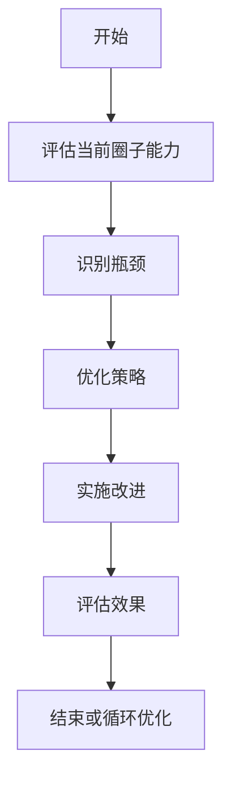
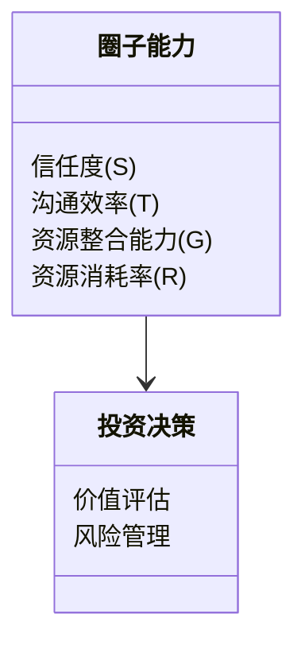

                 


# 巴菲特的圈子能力理论：知道自己的局限

> 关键词：巴菲特，圈子能力，价值投资，能力边界，风险管理

> 摘要：本文深入探讨了巴菲特的圈子能力理论，分析了其核心思想、数学模型、系统架构，并通过案例分析展示了其在实际投资中的应用。文章还总结了最佳实践，帮助读者更好地理解和应用这一理论。

---

## 第一部分：背景介绍

### 第1章：巴菲特的生平与投资理念

#### 1.1 巴菲特的早年经历
沃伦·巴菲特（Warren Buffett）出生于1930年，美国著名投资者、企业家和慈善家。他从小就展现出对投资的浓厚兴趣，12岁时开始购买股票。巴菲特的父亲是律师，母亲是家庭主妇，这使他从小接受了良好的教育和价值观培养。

#### 1.2 巴菲特的投资哲学
巴菲特的投资哲学以价值投资为核心，强调长期投资、安全边际和内在价值。他坚信市场短期波动无法预测，但长期趋势可以通过基本面分析来把握。巴菲特的价值观还包括节俭、耐心和对能力圈的坚持。

#### 1.3 巴菲特的价值观与人生信条
巴菲特的价值观包括诚实、正直、节俭和对家庭的重视。他的名言“我只想知道我将死的地方，这样我就可以确定我该去的地方”体现了他对长期目标的执着追求。

---

### 第2章：圈子能力理论的背景

#### 2.1 巴菲特圈子的构成
巴菲特的圈子主要由亲密的朋友、合作伙伴和长期信任的同事构成，包括芒格、彼得·林奇等。这些人在巴菲特的投资决策中扮演着重要角色，他们的信任和合作能力构成了巴菲特圈子能力的核心。

#### 2.2 圈子能力的形成过程
巴菲特的圈子能力是通过长期的信任积累、合作经验和共同的价值观形成的。他注重选择那些具有相似投资理念和价值观的人作为合作伙伴，从而形成一个高效且可靠的圈子。

#### 2.3 圈子能力的外延与边界
巴菲特的圈子能力不仅限于投资领域，还包括他对芒格等人的信任和依赖，以及在伯克希尔哈撒韦公司中的决策支持。圈子能力的边界在于避免过度依赖圈子，保持独立思考的能力。

---

## 第二部分：核心概念与联系

### 第3章：圈子能力的核心要素

#### 3.1 信任与合作
信任是圈子能力的基础，巴菲特通过长期合作建立信任，确保合作伙伴的可靠性和稳定性。

#### 3.2 沟通与协调
高效的沟通能力是圈子能力的关键，巴菲特通过定期的沟通和协调，确保团队目标一致，避免冲突。

#### 3.3 资源整合与共享
资源整合与共享是圈子能力的重要表现，巴菲特通过合作伙伴的资源整合，增强投资决策的准确性。

---

### 第4章：圈子能力与个人能力的对比分析

#### 4.1 圈子能力与个人能力的对比
| 特性             | 圈子能力              | 个人能力              |
|------------------|----------------------|-----------------------|
| 主体             | 多个人               | 单个个体              |
| 目标             | 共同目标             | 个人目标              |
| 优势             | 集体智慧             | 个体优势              |
| 限制             | 受圈子成员影响       | 个体决策独立           |

---

## 第三部分：数学模型与算法

### 第5章：圈子能力的数学模型

#### 5.1 圈子能力的评估公式
$$ C = \frac{S \cdot T \cdot G}{R} $$
其中：
- \( C \)：圈子能力
- \( S \)：信任度
- \( T \)：沟通效率
- \( G \)：资源整合能力
- \( R \)：资源消耗率

#### 5.2 圈子能力优化的流程图


---

## 第四部分：系统分析与架构设计

### 第6章：系统分析与架构设计

#### 6.1 领域模型


---

## 第五部分：项目实战

### 第7章：项目实战

#### 7.1 环境安装
需要安装Python和相关库（如numpy、pandas）。

#### 7.2 核心代码实现
```python
def calculate_circle_capability(S, T, G, R):
    return (S * T * G) / R

# 示例
S = 0.8
T = 0.9
G = 0.7
R = 0.6
capability = calculate_circle_capability(S, T, G, R)
print(f"圈子能力为：{capability}")
```

#### 7.3 案例分析
假设我们有三个合作伙伴，信任度分别为0.8，沟通效率0.9，资源整合能力0.7，资源消耗率0.6。计算他们的圈子能力：
$$ capability = (0.8 \times 0.9 \times 0.7) / 0.6 = 0.84 $$

---

## 第六部分：最佳实践

### 第8章：最佳实践

#### 8.1 小结
巴菲特的圈子能力理论强调信任、沟通和资源整合，帮助投资者在复杂市场中做出更明智的决策。

#### 8.2 注意事项
- 避免过度依赖圈子
- 定期评估和优化圈子能力
- 保持独立思考

#### 8.3 拓展阅读
推荐书籍：《巴菲特传》、《投资的智慧》。

---

## 结语

通过本文的分析，我们可以看到巴菲特的圈子能力理论在投资中的重要性。掌握这一理论，可以帮助投资者更好地构建和优化自己的圈子，做出更明智的投资决策。

---

作者：AI天才研究院/AI Genius Institute & 禅与计算机程序设计艺术 /Zen And The Art of Computer Programming

