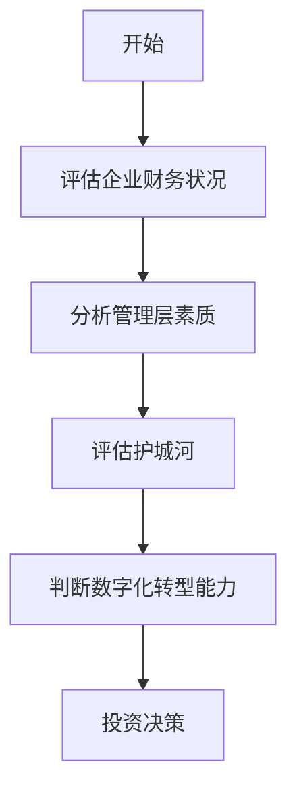
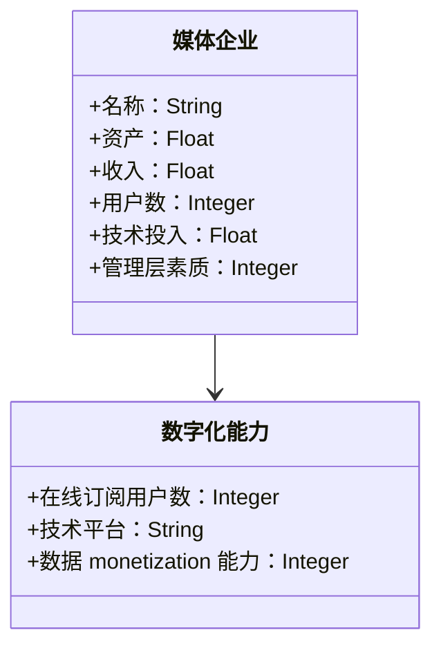
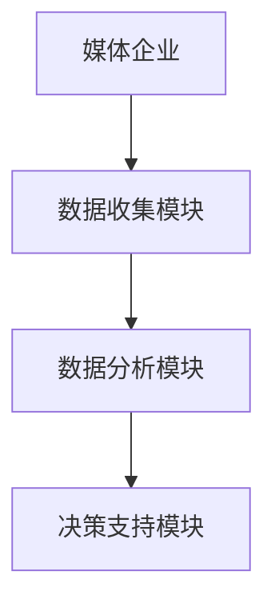

                 


# 巴菲特的媒体投资策略：数字化转型时代的调整

> 关键词：巴菲特，媒体投资，数字化转型，价值投资，护城河理论

> 摘要：本文探讨了巴菲特在媒体行业的投资策略，特别是在数字化转型时代的调整。分析了他的价值投资理念、护城河理论，并结合实际案例，详细讲解了如何在数字化背景下调整投资策略，确保投资的长期稳健回报。

---

## 第一部分: 巴菲特投资策略的背景与核心理念

### 1.1 巴菲特投资策略概述

#### 1.1.1 巴菲特的价值投资理念

巴菲特的价值投资理念强调长期稳健的回报，而非短期的市场波动。他寻找那些具有持续竞争优势、稳定的收益能力和良好管理团队的企业。这种理念在媒体行业中尤为重要，因为媒体行业的核心竞争力在于内容和用户关系。

#### 1.1.2 巴菲特的投资哲学

巴菲特的投资哲学可以概括为“以合理的价格买入优质企业”。他注重企业的财务健康、管理层素质和行业地位。这种哲学在媒体行业的数字化转型中，需要调整以适应新的竞争环境。

#### 1.1.3 巴菲特对媒体行业的关注点

巴菲特关注媒体行业的稳定性、受众基础和长期盈利能力。他倾向于投资那些能够抵御短期市场波动，具备强大护城河的企业。这些护城河可以是品牌影响力、内容资源或用户忠诚度。

---

## 第二部分: 媒体行业的数字化转型与挑战

### 2.1 媒体行业的现状与发展趋势

#### 2.1.1 传统媒体的困境

传统媒体面临广告收入下降、读者流失和成本上升的问题。数字化转型迫在眉睫，否则难以在激烈竞争中生存。

#### 2.1.2 数字化转型的必要性

数字化转型使媒体能够通过在线订阅、数据分析和多平台发布实现收入增长。同时，数字技术提高了内容分发效率和用户互动。

#### 2.1.3 数字化转型对媒体行业的影响

数字化转型带来了内容形式多样化、用户行为变化和新的商业模式。但也加剧了竞争，技术投入和创新能力成为关键。

---

## 第三部分: 巴菲特媒体投资策略的核心概念

### 3.1 巴菲特的护城河理论

#### 3.1.1 护城河的定义与分类

护城河是企业竞争优势的来源，包括成本优势、网络效应、品牌优势等。媒体行业的护城河可以是内容资源、用户忠诚度或技术平台。

#### 3.1.2 媒体行业的护城河特征

媒体行业的护城河可能来自独特的新闻资源、强大的品牌影响力或技术创新。这些因素帮助企业在数字化转型中保持竞争力。

#### 3.1.3 护城河在数字化转型中的演变

随着数字化转型，护城河可能从内容扩展到技术平台。例如，建立在线订阅系统或数据分析能力，增强企业的数字化能力。

---

## 第四部分: 巴菲特媒体投资策略的数字化调整

### 4.1 数字化转型对巴菲特投资策略的影响

#### 4.1.1 数字化转型带来的新机会

数字化转型为媒体行业带来新的收入来源，如在线订阅和数据 monetization。这些机会为巴菲特提供了新的投资方向。

#### 4.1.2 数字化转型带来的新挑战

技术投入增加、竞争加剧和用户行为变化是主要挑战。企业需要适应新技术，同时应对更快的市场变化。

#### 4.1.3 投资策略的调整方向

巴菲特需要关注企业的数字化转型能力，包括技术投入、数字化战略和管理层的适应性。同时，寻找那些在数字化时代具备持续竞争优势的企业。

---

## 第五部分: 巴菲特媒体投资策略的算法与数学模型

### 5.1 巴菲特投资决策的逻辑模型

#### 5.1.1 投资决策的流程图



#### 5.1.2 投资决策的关键指标分析

- **ROE（净资产收益率）**：衡量企业盈利能力。
- **ROA（资产回报率）**：评估资产使用效率。
- **用户增长率**：反映用户基础的扩展能力。
- **技术投入比例**：衡量企业在数字化转型中的投入。

### 5.2 数学模型与公式

#### 5.2.1 投资价值评估公式

$$
\text{投资价值} = \frac{\text{未来现金流}}{\text{折现率}}
$$

#### 5.2.2 投资回报率计算模

$$
\text{回报率} = \frac{\text{净收益}}{\text{投资成本}}
$$

---

## 第六部分: 系统分析与架构设计方案

### 6.1 问题场景介绍

在数字化转型时代，媒体企业需要构建一个能够快速响应市场变化、利用技术优势的系统。

### 6.2 系统功能设计

#### 6.2.1 领域模型



#### 6.2.2 系统架构设计



---

## 第七部分: 项目实战

### 7.1 环境安装

安装必要的工具和软件，如数据分析工具、项目管理软件等。

### 7.2 核心实现源代码

```python
def calculate_investment_value(future_cash_flows, discount_rate):
    return sum(flow / (1 + discount_rate) ** i for i, flow in enumerate(future_cash_flows))

def assess_management_quality(team_experience, track_record):
    return (team_experience + track_record) / 2
```

### 7.3 代码应用解读

通过代码分析未来现金流和管理层素质，评估企业的投资价值和管理能力。

### 7.4 案例分析

以《华盛顿邮报》为例，分析巴菲特的投资决策过程，评估其在数字化转型中的表现。

### 7.5 项目小结

总结案例中的成功经验，强调数字化转型对投资策略的重要性。

---

## 第八部分: 最佳实践与小结

### 8.1 小结

在数字化转型时代，巴菲特的投资策略需要适应新的市场环境，关注企业的数字化能力和技术投入。

### 8.2 注意事项

投资者需注意技术风险、市场变化和管理层适应性，避免盲目跟风。

### 8.3 拓展阅读

推荐相关书籍和文章，深入理解数字化转型对投资策略的影响。

---

## 作者：AI天才研究院/AI Genius Institute & 禅与计算机程序设计艺术 /Zen And The Art of Computer Programming

