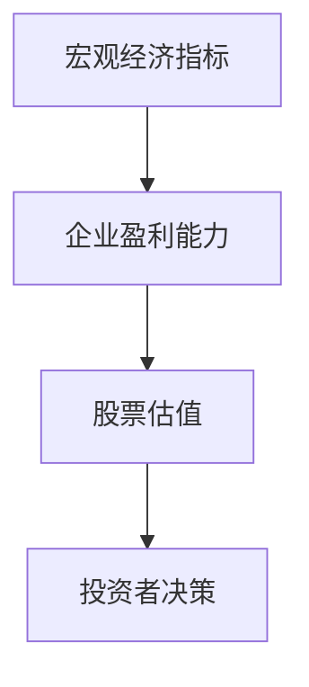
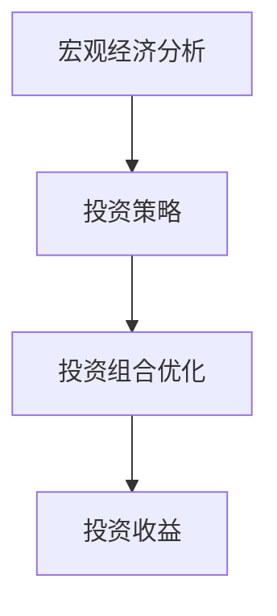

                 


# 巴菲特的宏观经济分析：去全球化趋势下的投资机会

**关键词**：巴菲特、宏观经济分析、去全球化、投资机会、价值投资、宏观经济指标

**摘要**：本文从巴菲特的宏观经济分析视角出发，探讨去全球化趋势下的投资机会。通过分析宏观经济的基本概念、巴菲特的投资理念、去全球化的经济影响，以及结合数学模型和算法原理，为投资者提供在去全球化背景下寻找投资机会的方法和策略。文章内容涵盖背景介绍、核心概念、算法原理、系统分析、项目实战等多个方面，结合实际案例分析和详细讲解，为读者提供全面而深入的分析。

---

# 第1章 巴菲特的宏观经济分析概述

## 1.1 巴菲特宏观经济分析的背景

### 1.1.1 宏观经济分析的基本概念
- 宏观经济分析是研究整体经济运行的规律和趋势，包括GDP、通货膨胀率、失业率、利率等核心指标。
- 通过分析宏观经济指标，投资者可以更好地理解经济周期、行业趋势和市场波动。

### 1.1.2 巴菲特投资理念的核心思想
- 巴菲特的价值投资理念强调长期投资、安全边际和内在价值。
- 宏观经济分析是巴菲特投资决策的重要组成部分，帮助他识别经济周期和行业机会。

### 1.1.3 宏观经济与投资机会的关联性
- 经济周期的变化直接影响企业的盈利能力和股票估值。
- 宏观经济分析帮助投资者在不同经济环境下做出明智的投资决策。

## 1.2 去全球化趋势的定义与特征

### 1.2.1 去全球化的概念
- 去全球化是指全球化的逆转趋势，表现为贸易保护主义、供应链本地化和国际合作减少。
- 这种趋势对全球经济格局、贸易政策和企业运营模式产生了深远影响。

### 1.2.2 去全球化的主要表现
- 贸易壁垒增加，例如关税政策的变化。
- 企业供应链的本地化和区域化，减少对全球化的依赖。
- 各国政策的分化，导致全球经济的不确定性增加。

### 1.2.3 去全球化对全球经济的影响
- 贸易成本上升，企业利润减少。
- 全球化企业面临更大的政策风险和供应链中断的风险。
- 区域化经济的崛起，导致投资机会的分散化。

## 1.3 巴菲特投资策略与宏观经济的关系

### 1.3.1 巴菲特的价值投资理念
- 投资的本质是寻找具有持续竞争优势的企业，关注企业的内在价值。
- 宏观经济分析帮助巴菲特识别经济周期中的投资机会。

### 1.3.2 宏观经济分析在投资中的作用
- 通过分析宏观经济指标，巴菲特可以判断经济周期的变化。
- 宏观经济分析帮助投资者规避系统性风险，抓住结构性机会。

### 1.3.3 去全球化趋势下的投资机会
- 去全球化推动了区域化经济的发展，为本地化企业提供了增长空间。
- 投资者应关注具有强大供应链管理和本地化生产能力的企业。

## 1.4 本章小结
- 巴菲特的宏观经济分析为投资者提供了理解经济周期和行业趋势的工具。
- 去全球化趋势对全球经济和投资机会产生了深远影响。
- 投资者需要结合宏观经济分析和巴菲特的投资理念，抓住去全球化背景下的投资机会。

---

# 第2章 巴菲特宏观经济分析的核心概念

## 2.1 宏观经济分析的基本原理

### 2.1.1 宏观经济的核心指标
- **GDP（国内生产总值）**：衡量一个国家或地区的经济规模。
- **通货膨胀率**：衡量物价水平的变化。
- **失业率**：衡量劳动力市场的健康状况。
- **利率**：影响企业和个人的借贷成本。

### 2.1.2 宏观经济分析的框架
- 宏观经济分析通常包括需求分析、供给分析和政策分析。
- 需求分析关注消费者行为和市场趋势，供给分析关注生产成本和企业竞争。

### 2.1.3 宏观经济与投资决策的关系
- 宏观经济分析帮助投资者识别经济周期中的投资机会。
- 宏观经济指标的变化直接影响企业的盈利能力和股票估值。

## 2.2 巴菲特投资理念的数学模型

### 2.2.1 价值投资的数学模型
- 价值投资的核心是寻找价格低于内在价值的企业。
- 内在价值的计算公式：
  $$ V = \frac{CF}{r - g} $$
  其中，\( CF \) 是未来现金流，\( r \) 是折现率，\( g \) 是增长率。

### 2.2.2 宏观经济指标的量化分析
- 通过时间序列分析，预测宏观经济指标的变化趋势。
- 使用统计学习模型（如线性回归）分析宏观经济指标与股票价格的关系。

### 2.2.3 投资组合优化的数学公式
- Markowitz的有效前沿理论用于优化投资组合。
- 投资组合的最优配置可以通过以下公式计算：
  $$ w_i = \frac{1}{N} $$
  其中，\( w_i \) 是第\( i \)个资产的权重，\( N \) 是资产数量。

## 2.3 宏观经济与投资的实体关系图

### 2.3.1 宏观经济实体关系图（Mermaid流程图）


### 2.3.2 投资策略与宏观经济的关联图


## 2.4 本章小结
- 宏观经济分析的核心指标和框架为投资者提供了理解经济运行的基本工具。
- 巴菲特的投资理念可以通过数学模型进行量化分析，帮助投资者做出更科学的投资决策。
- 宏观经济与投资策略之间的关系可以通过实体关系图和流程图清晰展示。

---

# 第3章 去全球化趋势下的宏观经济分析

## 3.1 去全球化的经济影响

### 3.1.1 去全球化对贸易的影响
- 贸易壁垒的增加导致全球贸易增速放缓。
- 企业需要重新调整供应链，导致成本上升。

### 3.1.2 去全球化对供应链的影响
- 企业倾向于本地化生产，减少对全球供应链的依赖。
- 本地化供应链提高了企业的抗风险能力。

### 3.1.3 去全球化对就业的影响
- 本地化生产增加了区域就业机会。
- 高技能人才的需求增加，推动了人才竞争。

## 3.2 宏观经济指标的变动分析

### 3.2.1 GDP的变化趋势
- 去全球化可能导致全球经济增速放缓，但区域经济可能出现结构性增长。

### 3.2.2 通货膨胀率的变化
- 供应链本地化可能导致生产成本上升，推动通货膨胀。
- 货币政策的变化对通货膨胀率有重要影响。

### 3.2.3 利率的变化
- 中央银行的货币政策调整会影响利率水平。
- 利率变化直接影响企业的融资成本和投资决策。

## 3.3 巴菲特投资策略的调整

### 3.3.1 投资理念的演变
- 巴菲特的投资理念在去全球化背景下更加注重本地化企业和区域市场的投资机会。

### 3.3.2 宏观经济分析的优化
- 更加关注区域经济指标和本地化企业的竞争优势。

### 3.3.3 投资组合的再平衡
- 调整投资组合，增加本地化企业的权重，减少对全球化企业的依赖。

## 3.4 本章小结
- 去全球化趋势对全球经济和供应链产生了深远影响。
- 宏观经济指标的变化需要投资者重新评估投资策略。
- 巴菲特的投资理念在去全球化背景下需要进行相应的调整和优化。

---

# 第4章 宏观经济分析的算法原理

## 4.1 宏观经济预测的算法框架

### 4.1.1 时间序列分析
- 时间序列分析用于预测宏观经济指标的变化趋势。
- 常用的模型包括ARIMA和GARCH。

### 4.1.2 统计学习模型
- 线性回归模型用于分析宏观经济指标之间的关系。
- 非参数回归模型用于处理复杂的数据关系。

### 4.1.3 机器学习算法
- 支持向量回归（SVR）和随机森林（Random Forest）用于宏观经济预测。

## 4.2 宏观经济预测的数学模型

### 4.2.1 ARIMA模型
- ARIMA模型用于时间序列预测。
- 模型公式：
  $$ ARIMA(p, d, q) $$
  其中，\( p \) 是自回归阶数，\( d \) 是差分阶数，\( q \) 是移动平均阶数。

### 4.2.2 线性回归模型
- 线性回归模型用于分析宏观经济指标之间的关系。
- 模型公式：
  $$ y = \beta_0 + \beta_1x + \epsilon $$
  其中，\( \beta_0 \) 是截距，\( \beta_1 \) 是回归系数，\( \epsilon \) 是误差项。

### 4.2.3 随机森林模型
- 随机森林模型用于处理复杂的宏观经济预测问题。
- 模型通过集成学习提高预测精度。

## 4.3 算法实现的Python代码

### 4.3.1 时间序列预测代码
```python
from statsmodels.tsa.arima_model import ARIMA
import pandas as pd

# 加载数据
data = pd.read_csv('macroeconomic.csv')

# 训练ARIMA模型
model = ARIMA(data['GDP'], order=(1, 1, 1))
model_fit = model.fit()

# 预测未来值
forecast = model_fit.forecast(steps=5)
print(forecast)
```

### 4.3.2 统计学习模型代码
```python
from sklearn.linear_model import LinearRegression
import numpy as np

# 加载数据
X = np.array(data[[' unemployment rate', ' inflation rate']])
y = np.array(data['GDP growth'])

# 训练线性回归模型
model = LinearRegression()
model.fit(X, y)

# 预测值
predicted = model.predict(X)
print(predicted)
```

### 4.3.3 机器学习模型代码
```python
from sklearn.ensemble import RandomForestRegressor
import pandas as pd

# 加载数据
X = pd.DataFrame(data[['GDP', 'unemployment rate', ' inflation rate']])
y = data['GDP growth']

# 训练随机森林模型
model = RandomForestRegressor(n_estimators=100)
model.fit(X, y)

# 预测值
predicted = model.predict(X)
print(predicted)
```

## 4.4 本章小结
- 宏观经济预测的算法框架包括时间序列分析、统计学习模型和机器学习算法。
- 不同的模型适用于不同的宏观经济指标预测。
- 通过Python代码实现这些算法，可以为投资者提供科学的宏观经济分析工具。

---

# 第5章 去全球化趋势下的投资机会分析

## 5.1 投资机会的识别

### 5.1.1 行业分析
- 本地化生产能力强的行业更具投资价值。
- 政策支持的行业（如绿色能源、科技产业）值得重点关注。

### 5.1.2 公司分析
- 具有强大供应链管理能力的企业更具竞争优势。
- 本地化市场占有率高的企业更具投资价值。

### 5.1.3 区域市场分析
- 区域经济崛起提供了新的投资机会。
- 投资者应关注区域市场的政策变化和经济发展趋势。

## 5.2 投资策略的优化

### 5.2.1 投资组合的再平衡
- 调整投资组合，增加本地化企业的权重。
- 减少对全球化企业的依赖，降低系统性风险。

### 5.2.2 风险管理的优化
- 通过分散投资降低风险。
- 定期评估投资组合的抗风险能力。

### 5.2.3 长期投资策略的调整
- 长期投资策略应更加关注企业的长期竞争优势。
- 通过宏观经济分析识别长期投资机会。

## 5.3 实际案例分析

### 5.3.1 某行业的投资机会分析
- 以绿色能源行业为例，分析去全球化背景下的投资机会。
- 绿色能源行业的本地化生产能力和政策支持是其投资价值的重要因素。

### 5.3.2 某公司的投资价值分析
- 以特斯拉为例，分析其在全球化和本地化生产中的竞争优势。
- 特斯拉的本地化生产策略和技术创新能力是其投资价值的重要因素。

## 5.4 本章小结
- 投资机会的识别需要结合行业分析、公司分析和区域市场分析。
- 去全球化背景下，本地化生产和政策支持的行业更具投资价值。
- 投资者应通过宏观经济分析和巴菲特的投资理念，优化投资策略，抓住去全球化背景下的投资机会。

---

# 第6章 总结与展望

## 6.1 本章总结
- 巴菲特的宏观经济分析为投资者提供了理解经济周期和行业趋势的工具。
- 去全球化趋势对全球经济和投资机会产生了深远影响。
- 投资者需要结合宏观经济分析和巴菲特的投资理念，抓住去全球化背景下的投资机会。

## 6.2 未来展望
- 随着去全球化趋势的加剧，区域化经济的崛起将为投资者提供新的机会。
- 技术创新和政策变化将继续影响全球经济格局。
- 投资者需要不断优化投资策略，适应经济环境的变化。

---

# 作者：AI天才研究院 & 禅与计算机程序设计艺术

---

**温馨提示**：如果您觉得这篇文章对您有所帮助，请点赞、收藏、评论、转发，您的支持是我们持续创作的最大动力！

