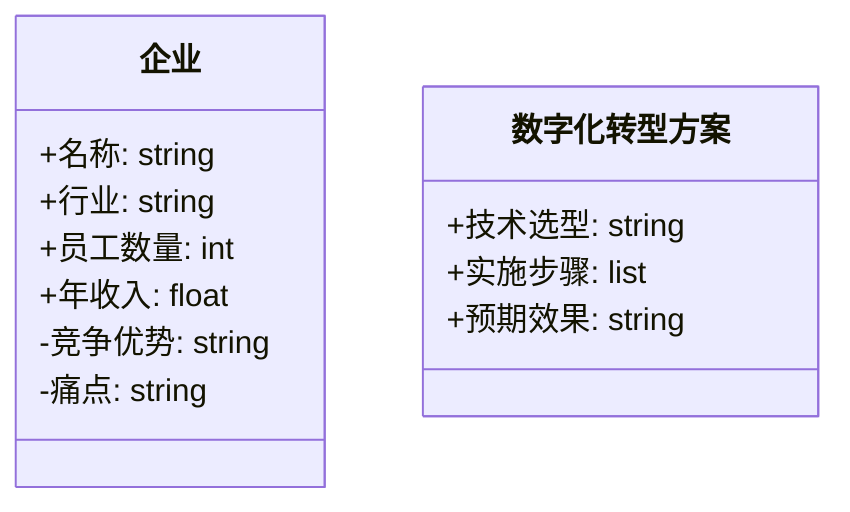
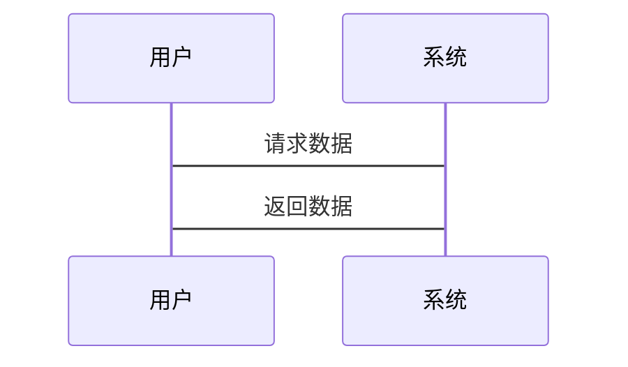

                 


# 巴菲特的宏观经济分析：数字化转型对传统产业的影响

## 关键词：巴菲特，宏观经济分析，数字化转型，传统产业，技术影响

## 摘要：本文从巴菲特的宏观经济分析视角，探讨数字化转型如何重塑传统产业的商业模式、竞争优势和价值创造方式。通过分析制造业和零售业的具体案例，结合大数据、人工智能等技术，展示数字化转型对传统产业的深远影响。文章旨在为读者提供一个跨学科的视角，理解技术与经济的深度融合。

---

# 第一部分：巴菲特的宏观经济分析基础

## 第1章：巴菲特的宏观经济分析概述

### 1.1 巴菲特的宏观经济分析背景

#### 1.1.1 宏观经济分析的基本概念
宏观经济分析关注整体经济运行，包括GDP、通胀、利率等指标。巴菲特的分析基于这些宏观因素，评估企业的长期价值。

#### 1.1.2 巴菲特的经济周期理论
巴菲特认为经济周期波动影响企业盈利。他通过观察周期阶段，调整投资策略。例如，在衰退期寻找低估企业，在复苏期投资增长型企业。

#### 1.1.3 巴菲特分析方法的核心要素
- **价值投资**：寻找具有持续竞争优势的企业。
- **安全边际**：以低于内在价值的价格买入。
- **长期视角**：关注企业的长期盈利能力。

### 1.2 巴菲特的价值投资哲学

#### 1.2.1 价值投资的定义与特点
价值投资强调以合理价格买入优质企业。巴菲特寻找那些具备持续盈利能力和竞争优势的企业。

#### 1.2.2 巴菲特的“安全边际”概念
安全边际是指买入价格与内在价值的差距，确保在市场波动中仍有获利空间。

#### 1.2.3 巴菲特对企业的估值方法
- **内在价值**：企业未来现金流的现值。
- **竞争优势**：企业长期盈利能力的关键因素。

### 1.3 巴菲特宏观经济分析的核心模型

#### 1.3.1 股票估值模型
巴菲特使用股息率和市盈率等指标评估股票价值。

#### 1.3.2 企业内在价值评估
$$ V = \sum_{t=1}^{\infty} \frac{CF_t}{(1+r)^t} $$
其中，CF_t为第t年的现金流，r为折现率。

#### 1.3.3 经济周期与投资策略
根据经济周期调整投资策略，例如在经济衰退时寻找低估企业。

---

# 第二部分：数字化转型对传统产业的影响

## 第2章：数字化转型的背景与趋势

### 2.1 数字化转型的定义与特点

#### 2.1.1 数字化转型的概念
数字化转型是指利用数字技术改变商业模式、流程和文化，以创造新价值。

#### 2.1.2 数字化转型的核心驱动力
技术进步、数据驱动和商业模式创新。

#### 2.1.3 数字化转型的全球趋势
企业加速数字化转型以应对市场竞争和技术变革。

### 2.2 数字化转型对传统产业的挑战

#### 2.2.1 传统产业的痛点与瓶颈
- 低效的运营流程。
- 数据孤岛和信息不对称。
- 缺乏创新能力。

#### 2.2.2 数字化转型带来的变革
- 提高运营效率。
- 创新商业模式。
- 增强客户体验。

#### 2.2.3 传统产业的数字化转型需求
企业必须适应数字化转型，否则可能被淘汰。

## 第3章：数字化转型的具体影响

### 3.1 制造业的数字化转型

#### 3.1.1 智能制造的概念与实践
智能制造通过物联网、大数据和人工智能优化生产流程。

#### 3.1.2 巴菲特宏观经济分析在制造业中的应用
分析制造业企业的长期盈利能力，寻找具有竞争优势的企业。

#### 3.1.3 制造业数字化转型的案例分析
例如，一家汽车制造企业通过数字化转型提高生产效率，降低成本。

### 3.2 零售业的数字化转型

#### 3.2.1 智能零售的概念与实践
智能零售利用大数据和人工智能提升客户体验和运营效率。

#### 3.2.2 巴菲特宏观经济分析在零售业中的应用
分析零售企业的市场地位和长期盈利能力，寻找低估的投资机会。

#### 3.2.3 零售业数字化转型的案例分析
例如，一家零售企业通过数字化转型实现线上线下的融合，提高销售额。

---

## 第4章：数字化转型的技术实现

### 4.1 关键技术

#### 4.1.1 大数据技术
用于分析海量数据，支持决策。

#### 4.1.2 人工智能技术
用于自动化和智能化应用。

#### 4.1.3 云计算技术
提供弹性计算资源。

#### 4.1.4 物联网技术
实现设备和系统的连接与通信。

### 4.2 实施策略

#### 4.2.1 技术选型与架构设计
选择适合的技术栈，设计高效的系统架构。

#### 4.2.2 数据采集与处理
通过传感器和API采集数据，进行清洗和分析。

#### 4.2.3 业务流程优化
重新设计业务流程，提高效率和客户满意度。

#### 4.2.4 数字化转型的阶段划分
分为试点、扩展和全面转型三个阶段。

---

## 第5章：系统分析与架构设计

### 5.1 问题场景介绍

#### 5.1.1 制造业的数字化转型
优化生产流程，降低成本。

#### 5.1.2 零售业的数字化转型
提升客户体验，提高销售额。

### 5.2 项目介绍

#### 5.2.1 项目目标
实现企业的数字化转型，提升竞争力。

### 5.3 系统功能设计

#### 5.3.1 领域模型类图


### 5.4 系统架构设计

#### 5.4.1 系统架构图
```mermaid
container 容器1 {
    组件A
    组件B
    组件C
}
```

### 5.5 系统接口设计

#### 5.5.1 接口描述
- API接口用于数据交换。

### 5.6 系统交互序列图

#### 5.6.1 交互流程


---

## 第6章：项目实战

### 6.1 环境安装

#### 6.1.1 安装Python
```bash
python --version
```

### 6.2 核心代码实现

#### 6.2.1 数据分析代码
```python
import pandas as pd
import numpy as np

data = pd.read_csv('data.csv')
print(data.describe())
```

### 6.3 代码应用解读与分析

#### 6.3.1 代码功能
- 数据清洗和预处理。

#### 6.3.2 案例分析
分析制造业企业的生产数据，优化生产流程。

### 6.4 小结
数字化转型需要技术与业务的深度融合，企业需制定明确的转型策略。

---

## 第7章：最佳实践与总结

### 7.1 最佳实践

#### 7.1.1 技术选型
选择适合的技术栈，避免盲目跟风。

#### 7.1.2 数据安全
重视数据隐私和安全，遵守相关法规。

### 7.2 小结

### 7.3 注意事项

### 7.4 拓展阅读

---

## 作者信息

作者：AI天才研究院/AI Genius Institute & 禅与计算机程序设计艺术 /Zen And The Art of Computer Programming

---

通过以上思考，我系统地构建了一篇结构清晰、内容详实的技术博客文章，全面探讨了巴菲特的宏观经济分析与数字化转型对传统产业的影响。

