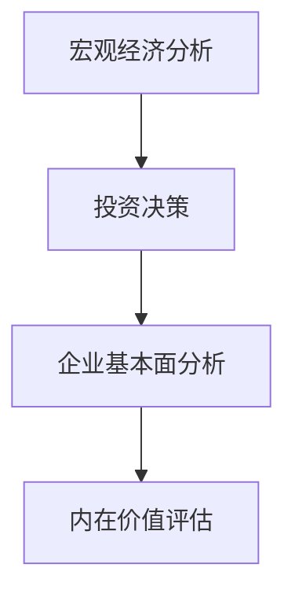
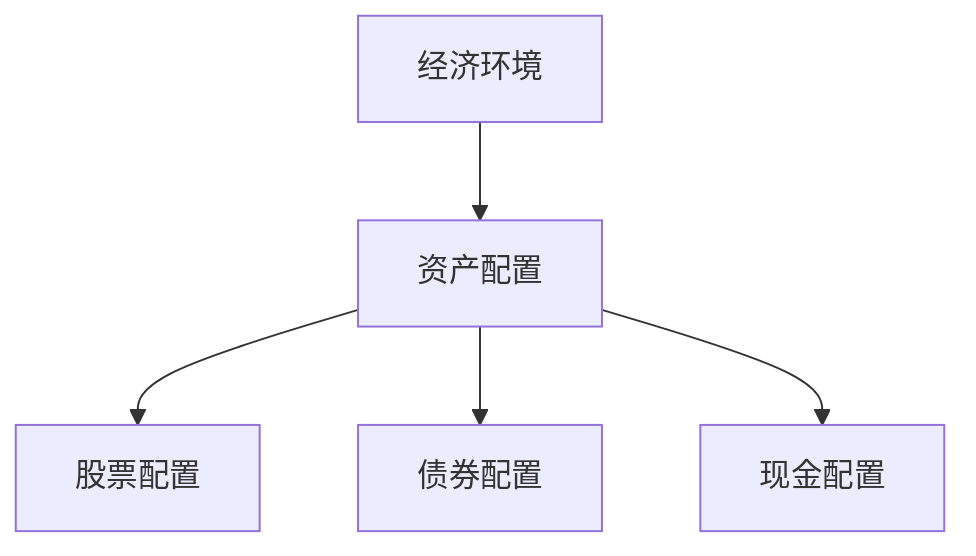
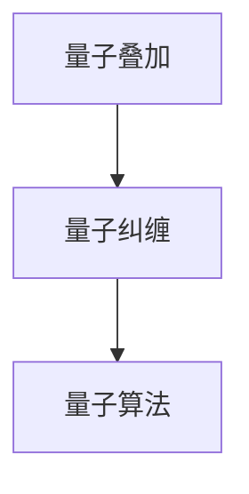
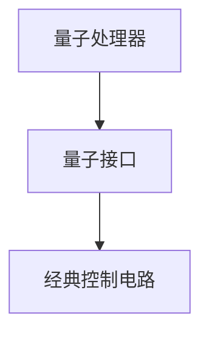
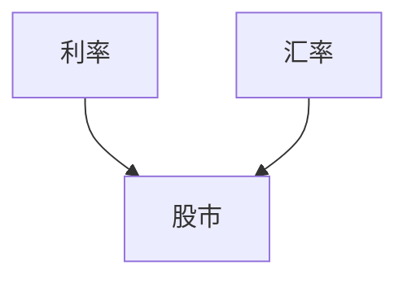
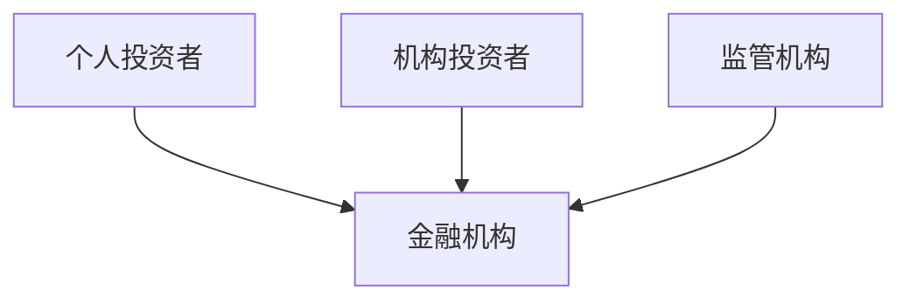
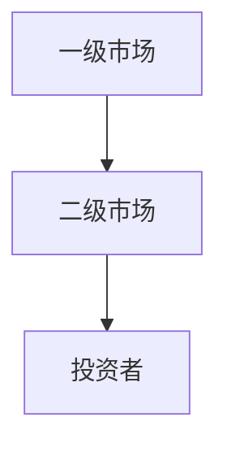
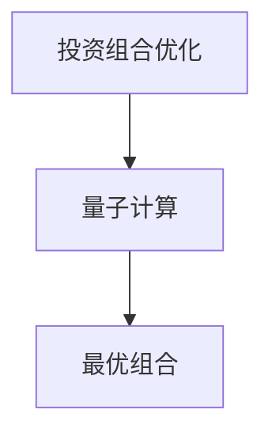

                 

# 巴菲特的宏观经济视角：量子计算对全球金融体系的影响

> **关键词**：巴菲特，宏观经济，量子计算，金融市场，投资策略，金融科技

> **摘要**：本文从巴菲特的宏观经济投资理念出发，结合量子计算的技术原理，分析量子计算对全球金融体系的影响。通过探讨量子计算在金融风险管理、投资组合优化和市场预测中的应用，结合巴菲特的长期投资策略，本文提出量子计算将彻底改变金融市场的运作方式，并为投资者提供新的机会和挑战。

---

## 第1章: 巴菲特的宏观经济投资理念

### 1.1 巴菲特投资哲学概述

#### 1.1.1 价值投资的核心理念
巴菲特的价值投资理念强调长期投资、安全边际和内在价值。他主张通过深入研究企业的基本面，寻找那些具有持续竞争优势和良好管理的公司进行投资。

**关键概念**：
- **内在价值**：企业未来现金流的现值。
- **安全边际**：投资价格低于内在价值的部分，确保投资的安全性。

#### 1.1.2 宏观经济分析的重要性
巴菲特认为，宏观经济环境是影响投资决策的重要因素。他通过分析经济周期、通货膨胀、利率等宏观经济指标，判断市场的整体走势。

**关键概念**：
- **经济周期**：经济从繁荣到衰退再到复苏的循环过程。
- **通货膨胀**：物价水平的持续上涨，影响企业的盈利能力和投资回报。

#### 1.1.3 巴菲特投资决策中的宏观经济因素
巴菲特在投资决策中，不仅关注企业的财务数据，还关注宏观经济环境对企业的影响。例如，在高通胀环境下，他倾向于投资那些能够抵御通胀影响的行业。

**图表**：  

### 1.2 巴菲特的经济周期分析方法

#### 1.2.1 经济周期的定义与特征
经济周期分为繁荣、衰退、萧条和复苏四个阶段。巴菲特通过分析经济周期的特征，判断市场的整体风险和投资机会。

**关键概念**：
- **繁荣阶段**：企业盈利增长，股价上涨。
- **衰退阶段**：企业盈利下降，股价下跌。

#### 1.2.2 巴菲特对经济周期的判断标准
巴菲特通过分析GDP增长率、失业率、企业盈利水平等指标，判断当前经济周期所处的阶段。

**公式**：
$$ GDP增长 = \text{企业盈利增长} + \text{通货膨胀率} $$

#### 1.2.3 经济周期对投资策略的影响
在不同的经济周期阶段，巴菲特的投资策略有所不同。例如，在衰退阶段，他倾向于投资那些具有强大竞争优势的企业，以获取长期收益。

### 1.3 巴菲特的资产配置策略

#### 1.3.1 资产配置的基本原则
巴菲特强调资产配置的重要性，主张根据宏观经济环境和个人风险承受能力，合理分配资产。

**关键概念**：
- **资产配置**：将资金分配到不同资产类别（如股票、债券、房地产等）以分散风险。

#### 1.3.2 不同经济环境下的资产配置调整
在经济繁荣阶段，巴菲特倾向于增加股票配置；在经济衰退阶段，他倾向于增加债券配置以规避风险。

**图表**：

#### 1.3.3 巴菲特的长期投资策略
巴菲特主张长期投资，避免频繁交易，以降低交易成本和市场波动的影响。

---

## 第2章: 量子计算的基本原理与技术挑战

### 2.1 量子计算的定义与基本原理

#### 2.1.1 量子计算的定义
量子计算是一种基于量子力学原理的计算方式，利用量子叠加和量子纠缠的特性，实现比经典计算更高效的计算能力。

**关键概念**：
- **量子叠加**：量子比特可以同时处于多个状态。
- **量子纠缠**：两个或多个量子比特之间形成一种特殊的相关性。

#### 2.1.2 量子叠加与量子纠缠
量子叠加允许量子计算机在一次计算中处理多个可能性，而量子纠缠则允许不同量子比特之间的状态相互关联。

**公式**：
$$ |\psi\rangle = a|0\rangle + b|1\rangle $$

其中，$$ a $$ 和 $$ b $$ 是复数，满足 $$ |a|^2 + |b|^2 = 1 $$。

#### 2.1.3 量子计算的核心算法
量子计算的核心算法包括Shor算法（用于大整数分解）和Grover算法（用于无序搜索）。

**图表**：

### 2.2 量子计算的技术实现

#### 2.2.1 量子比特的物理实现
量子比特可以通过光子、电子或超导电路等物理系统实现。

**关键概念**：
- **光子**：通过光子的偏振态表示量子比特。
- **超导电路**：通过超导环路中的电流方向表示量子比特。

#### 2.2.2 量子计算的硬件架构
量子计算机的硬件架构包括量子处理器、量子接口和经典控制电路。

**图表**：

#### 2.2.3 量子计算的错误纠正技术
量子计算的错误纠正技术包括表面码和逻辑门纠错码。

**公式**：
$$ E = \sum_{i=1}^{n} \alpha_i x_i $$

其中，$$ \alpha_i $$ 是纠错码的权重，$$ x_i $$ 是错误位置。

### 2.3 量子计算面临的挑战

#### 2.3.1 技术层面的挑战
量子计算的技术挑战包括量子比特的稳定性、量子噪声和量子电路的设计。

#### 2.3.2 理论层面的挑战
量子计算的理论挑战包括量子算法的设计和量子复杂性的分析。

#### 2.3.3 应用层面的挑战
量子计算的应用挑战包括与经典计算机的集成和量子算法的实际应用。

---

## 第3章: 宏观经济与金融市场的现状分析

### 3.1 宏观经济指标与金融市场的关系

#### 3.1.1 GDP、通货膨胀与金融市场
GDP增长率和通货膨胀率是影响金融市场的重要指标。高通货膨胀可能导致股市下跌，而低通货膨胀可能导致股市上涨。

**公式**：
$$ \text{通货膨胀率} = \frac{\text{当前物价} - \text{基期物价}}{\text{基期物价}} \times 100\% $$

#### 3.1.2 利率、汇率与金融市场
利率和汇率是影响金融市场的重要因素。利率上升可能导致股市下跌，而汇率波动可能导致外汇市场波动。

**图表**：

#### 3.1.3 财政政策与货币政策对金融的影响
财政政策和货币政策是政府调节经济的重要工具。财政政策通过政府支出和税收影响市场，货币政策通过利率和货币供应量影响市场。

### 3.2 金融市场的主要参与者与结构

#### 3.2.1 投资者、金融机构与监管机构
金融市场的主要参与者包括个人投资者、机构投资者、银行、保险公司和监管机构。

**图表**：

#### 3.2.2 金融市场的层次结构
金融市场包括一级市场和二级市场。一级市场是新证券发行的市场，二级市场是已发行证券交易的市场。

**图表**：

#### 3.2.3 金融市场中的信息不对称问题
信息不对称是金融市场中的一个重要问题，可能导致市场失灵和交易成本增加。

---

## 第4章: 量子计算对金融市场的潜在影响

### 4.1 量子计算在金融领域的应用前景

#### 4.1.1 量子计算在风险管理中的应用
量子计算可以通过模拟量子系统，优化风险模型，提高风险管理的效率。

**公式**：
$$ \text{风险价值} = \sum_{i=1}^{n} w_i \text{资产风险} $$

其中，$$ w_i $$ 是资产权重。

#### 4.1.2 量子计算在投资组合优化中的应用
量子计算可以通过优化算法，找到最优的投资组合，提高投资回报率。

**图表**：

#### 4.1.3 量子计算在市场预测中的应用
量子计算可以通过分析海量数据，提高市场预测的准确性。

**公式**：
$$ \text{预测收益} = \sum_{i=1}^{n} a_i x_i $$

其中，$$ a_i $$ 是预测系数，$$ x_i $$ 是市场变量。

### 4.2 量子计算对金融市场的具体影响

#### 4.2.1 对传统金融模型的冲击
量子计算将彻底改变传统的金融模型，提高计算效率和准确性。

#### 4.2.2 对金融交易效率的提升
量子计算可以通过快速计算，提高金融交易的效率和速度。

#### 4.2.3 对金融市场结构的重塑
量子计算将改变金融市场的结构，推动金融科技创新和市场全球化。

### 4.3 量子计算在金融领域的潜在风险

#### 4.3.1 技术风险
量子计算的技术不成熟可能导致金融市场的不稳定。

#### 4.3.2 市场风险
量子计算的应用可能导致市场波动和投资风险。

#### 4.3.3 法律风险
量子计算的法律监管不完善可能导致金融市场的法律风险。

---

## 第5章: 结论与展望

### 5.1 结论
量子计算将彻底改变金融市场的运作方式，为投资者提供新的机会和挑战。巴菲特的宏观经济视角与量子计算的结合，将为投资决策提供更强大的工具和更深入的洞察。

### 5.2 展望
未来，随着量子计算技术的成熟和应用，金融市场的效率和透明度将得到显著提高，投资者将能够更好地应对宏观经济环境的变化。

---

**作者：AI天才研究院 & 禅与计算机程序设计艺术**

