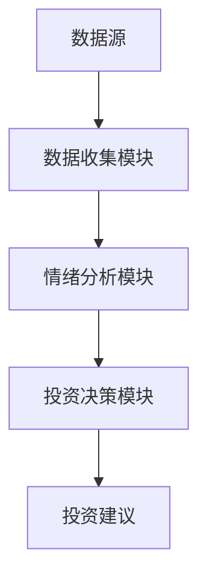

                 


# 巴菲特的市场情绪利用：在恐慌中寻找机会

## 关键词：巴菲特，市场情绪，投资策略，恐慌指数，价值投资，投资组合

## 摘要：本文深入探讨了巴菲特如何利用市场情绪，特别是在市场恐慌时期寻找投资机会的策略。通过分析巴菲特的投资哲学、市场情绪的量化指标以及恐慌中的投资机会，本文为读者提供了在市场恐慌中做出明智投资决策的实用指南。结合理论与实际案例，文章揭示了巴菲特如何通过市场情绪分析构建稳健的投资组合。

---

## 第1章：巴菲特的投资哲学

### 1.1 巴菲特的投资理念

#### 1.1.1 价值投资的定义与核心要素

价值投资是一种以内在价值为导向的投资策略，强调购买那些市场价格低于其内在价值的资产。巴菲特的价值投资哲学基于以下几个核心要素：

- **安全边际**：确保买入价格远低于资产的内在价值，以降低投资风险。
- **长期视角**：关注企业的长期盈利能力，而非短期市场波动。
- **企业质量**：投资于具有强大竞争优势、良好管理和稳健财务状况的企业。

#### 1.1.2 巴菲特的投资策略与长期主义

巴菲特强调长期投资的重要性，认为市场的短期波动不应影响投资者的决策。他主张通过持有优质资产，获得长期稳定的收益，而不是频繁交易以追求短期利润。

#### 1.1.3 巴菲特对市场的看法：市场的三个角色

巴菲特指出，市场在大多数时候是理性的，但在某些时候会表现出非理性，尤其是在恐慌或狂热时期。他将市场视为：

1. **定价工具**：市场为资产定价，但并非总是准确。
2. **反射板**：市场反映投资者的情绪，而非经济现实。
3. **投票机**：市场的短期波动反映了投资者的集体决策，但这并不总是理性的。

### 1.2 市场情绪的基本概念

#### 1.2.1 市场情绪的定义与分类

市场情绪是指投资者在市场中的情感状态，通常由贪婪和恐惧两种情绪驱动。市场情绪可以分为以下几个类别：

- **乐观情绪**：投资者对市场前景持积极态度，倾向于买入资产。
- **悲观情绪**：投资者对市场前景持消极态度，倾向于卖出资产。
- **恐慌情绪**：市场参与者因极度担忧而大量抛售资产，导致市场大幅下跌。

#### 1.2.2 恐慌情绪的形成机制

恐慌情绪通常由以下几个因素引发：

1. **信息不对称**：投资者获取的信息不完整或不准确，导致决策失误。
2. **羊群效应**：投资者跟随市场趋势，而非基于理性分析做出决策。
3. **杠杆效应**：过度使用杠杆可能导致资产价格快速下跌，加剧市场恐慌。

#### 1.2.3 市场情绪与投资机会的关系

市场情绪与投资机会密切相关。当市场情绪过度悲观时，许多优质资产的价格被低估，为投资者提供了买入机会。相反，当市场情绪过度乐观时，资产价格可能被高估，投资者应警惕潜在风险。

---

## 第2章：市场情绪分析的理论基础

### 2.1 市场情绪的量化指标

#### 2.1.1 恐慌指数（VIX指数）的定义与作用

VIX指数是衡量市场波动性的指标，被称为“恐慌指数”。它反映了投资者对市场的担忧程度。VIX指数越高，市场恐慌情绪越强。

$$ VIX = \sqrt{\frac{1}{n} \sum_{i=1}^{n} (R_i - \mu)^2} $$

其中，$R_i$ 是某资产的收益率，$\mu$ 是平均收益率，$n$ 是样本数量。

#### 2.1.2 投资者情绪指数（IEMX）的分析

投资者情绪指数（IEMX）是通过分析投资者的买卖行为来衡量市场情绪的指标。当IEMX指数较高时，表明市场情绪乐观；当指数较低时，表明市场情绪悲观。

#### 2.1.3 市场情绪周期的特征与规律

市场情绪通常呈现周期性波动，经历以下几个阶段：

1. **乐观阶段**：投资者情绪高涨，资产价格上升。
2. **狂热阶段**：资产价格远高于其内在价值，市场出现泡沫。
3. **恐慌阶段**：市场情绪突然转向悲观，资产价格大幅下跌。
4. **超跌阶段**：资产价格远低于其内在价值，为投资者提供买入机会。

### 2.2 巴菲特视角下的市场情绪分析

#### 2.2.1 巴菲特对市场恐慌的定义

巴菲特认为，市场恐慌是指投资者因过度担忧市场前景而做出非理性决策。这种恐慌情绪通常导致资产价格被低估，为长期投资者提供了买入机会。

#### 2.2.2 巴菲特对市场恐慌的分类

巴菲特将市场恐慌分为以下几种类型：

1. **投资者恐慌**：市场参与者因短期亏损而恐慌，急于抛售资产。
2. **结构性恐慌**：市场因某种结构性问题（如经济危机）而引发恐慌。
3. **市场周期性恐慌**：市场因周期性波动而引发恐慌情绪。

#### 2.2.3 巴菲特对市场恐慌的应对策略

在市场恐慌时，巴菲特通常采取以下策略：

1. **买入优质资产**：利用市场恐慌，买入那些具有强大竞争优势和良好财务状况的企业。
2. **忽视短期波动**：关注企业的长期价值，而非短期市场波动。
3. **分散投资**：通过分散投资降低风险，避免过度集中在某一资产。

---

## 第3章：巴菲特的市场情绪利用策略

### 3.1 巴菲特的恐慌投资策略

#### 3.1.1 在恐慌中寻找投资机会的原则

巴菲特在市场恐慌时，通常遵循以下原则：

1. **买入优质资产**：选择那些具有强大竞争优势和良好财务状况的企业。
2. **关注安全边际**：确保买入价格远低于资产的内在价值。
3. **长期持有**：避免频繁交易，专注于长期价值。

#### 3.1.2 巴菲特的恐慌投资组合构建

巴菲特的投资组合通常包括以下几类资产：

1. **优质股票**：具有强大竞争优势和良好财务状况的企业。
2. **债券**：在市场恐慌时，债券通常表现稳定，为投资组合提供安全性。
3. **现金储备**：保持一定的现金储备，以应对市场波动。

#### 3.1.3 巴菲特恐慌投资的案例分析

案例：2008年金融危机期间，巴菲特利用市场恐慌，大量买入高盛和摩根士丹利的股票。他认为这些企业的内在价值被市场低估，具备长期投资价值。

---

## 第4章：市场情绪与投资决策的数学模型

### 4.1 市场情绪的量化模型

#### 4.1.1 恐慌指数的数学公式

$$ VIX = \sqrt{\frac{1}{n} \sum_{i=1}^{n} (R_i - \mu)^2} $$

其中，$R_i$ 是某资产的收益率，$\mu$ 是平均收益率，$n$ 是样本数量。

#### 4.1.2 投资者情绪的回归分析模型

通过回归分析，可以将市场情绪与资产价格的关系量化。例如：

$$ R_i = \beta \times VIX + \epsilon $$

其中，$\beta$ 是回归系数，$\epsilon$ 是误差项。

#### 4.1.3 市场情绪与资产价格的关系模型

$$ P_i = \alpha + \beta \times VIX + \gamma \times IEMX + \epsilon $$

其中，$P_i$ 是资产价格，$\alpha$ 是截距，$\beta$ 和 $\gamma$ 是回归系数，$\epsilon$ 是误差项。

### 4.2 巴菲特投资策略的数学模型

#### 4.2.1 巴菲特价值投资的数学公式

$$ V = \frac{E}{k} $$

其中，$V$ 是资产的内在价值，$E$ 是企业的预期现金流，$k$ 是折现率。

#### 4.2.2 巴菲特恐慌投资的数学模型

在市场恐慌时，巴菲特的买入决策可以表示为：

$$ \text{买入} = \begin{cases}
\text{是}, & \text{如果 } P_i < V \\
\text{否}, & \text{其他情况}
\end{cases} $$

其中，$P_i$ 是资产的市场价格，$V$ 是资产的内在价值。

---

## 第5章：系统分析与架构设计

### 5.1 问题场景介绍

#### 5.1.1 市场情绪分析的背景与目标

市场情绪分析的目的是通过量化市场情绪，帮助投资者做出更明智的投资决策。特别是在市场恐慌时，市场情绪分析可以帮助投资者识别投资机会。

#### 5.1.2 巴菲特投资策略的应用场景

巴菲特的投资策略适用于市场恐慌时的资产配置和投资组合管理。通过市场情绪分析，投资者可以更好地把握市场波动，制定合理的投资策略。

#### 5.1.3 系统设计的总体目标

系统设计的目标是构建一个能够量化市场情绪，并基于市场情绪分析提供投资建议的系统。

### 5.2 系统功能设计

#### 5.2.1 数据收集模块的设计

数据收集模块需要获取以下数据：

1. 市场价格数据（如股票价格、指数价格）。
2. 市场情绪数据（如VIX指数、IEMX指数）。
3. 公司基本面数据（如收入、利润、资产负债表）。

#### 5.2.2 情绪分析模块的设计

情绪分析模块需要将市场情绪量化为具体的指标，如VIX指数和IEMX指数。

#### 5.2.3 投资决策模块的设计

投资决策模块根据市场情绪和资产的内在价值，制定投资策略。

### 5.3 系统架构设计

#### 5.3.1 系统架构的总体设计

系统的总体架构包括数据收集、情绪分析和投资决策三个模块。

#### 5.3.2 数据流的系统架构图



#### 5.3.3 模块间的交互设计

数据收集模块将数据传递给情绪分析模块，情绪分析模块将市场情绪指标传递给投资决策模块，投资决策模块根据市场情绪和资产的内在价值制定投资策略。

---

## 第6章：项目实战与案例分析

### 6.1 环境安装与配置

#### 6.1.1 开发环境的搭建

需要安装Python、Pandas、Matplotlib、Scikit-learn等工具。

#### 6.1.2 数据源的获取与处理

从Yahoo Finance获取股票数据，从东方财富网获取市场情绪数据。

#### 6.1.3 工具链的安装与配置

安装必要的Python包，如：

```bash
pip install pandas matplotlib scikit-learn
```

### 6.2 核心代码实现

#### 6.2.1 市场情绪分析的Python代码实现

```python
import pandas as pd
import numpy as np

# 计算VIX指数
def calculate_vix(returns):
    mu = np.mean(returns)
    variance = np.var(returns)
    vix = np.sqrt(variance)
    return vix

# 示例数据
returns = [0.02, 0.01, -0.03, 0.00, -0.02]
vix = calculate_vix(returns)
print(f"VIX指数：{vix}")
```

#### 6.2.2 巴菲特投资策略的Python代码实现

```python
import pandas as pd

# 计算内在价值
def calculate_intrinsic_value(enterprise_value, expected_cash_flow, discount_rate):
    intrinsic_value = enterprise_value / (discount_rate / (1 + discount_rate))
    return intrinsic_value

# 示例数据
enterprise_value = 1000000
expected_cash_flow = 100000
discount_rate = 0.08
intrinsic_value = calculate_intrinsic_value(enterprise_value, expected_cash_flow, discount_rate)
print(f"内在价值：{intrinsic_value}")
```

#### 6.2.3 案例分析：2008年金融危机期间的巴菲特投资策略

案例分析：2008年金融危机期间，巴菲特利用市场恐慌，大量买入高盛和摩根士丹利的股票。他认为这些企业的内在价值被市场低估，具备长期投资价值。

---

## 第7章：总结与展望

### 7.1 总结

本文深入探讨了巴菲特如何利用市场情绪，特别是在市场恐慌时期寻找投资机会的策略。通过分析巴菲特的投资哲学、市场情绪的量化指标以及恐慌中的投资机会，本文为读者提供了在市场恐慌中做出明智投资决策的实用指南。

### 7.2 展望

未来的研究可以进一步探讨市场情绪的其他方面，如投资者行为分析、市场情绪对不同类型资产的影响等。此外，可以研究如何将市场情绪分析与人工智能技术结合，提高投资决策的科学性和准确性。

---

## 作者：AI天才研究院/AI Genius Institute & 禅与计算机程序设计艺术 /Zen And The Art of Computer Programming

