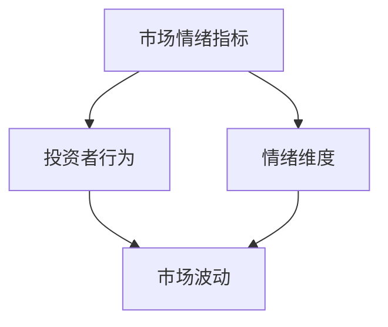
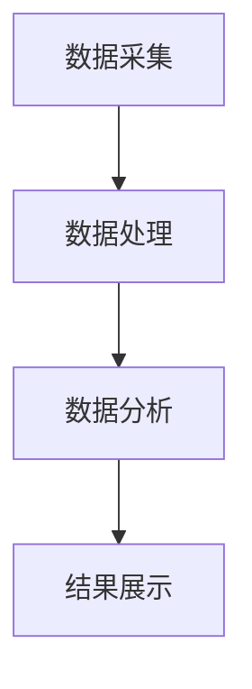
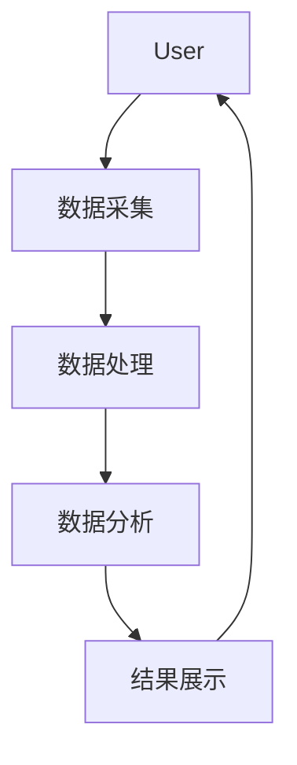

                 

# 巴菲特的市场情绪指标：如何利用大众心理

## 关键词：市场情绪指标，巴菲特，大众心理，投资策略，情绪分析，市场波动

## 摘要：本文探讨了巴菲特提出的市场情绪指标及其在投资中的应用。通过分析市场情绪与大众心理的关系，本文揭示了如何利用情绪指标进行投资决策，并结合技术手段，如自然语言处理和统计学方法，详细阐述了市场情绪指标的计算和应用。

---

## 第一部分: 市场情绪指标的背景与基础

### 第1章: 市场情绪指标概述

#### 1.1 市场情绪指标的定义与背景
- **1.1.1 什么是市场情绪指标**
  市场情绪指标是衡量市场参与者情绪状态的量化工具，通常基于投资者的心理波动和市场行为数据。

- **1.1.2 市场情绪指标的起源与发展**
  市场情绪指标起源于心理学和行为金融学，巴菲特等投资者最早将其应用于实际投资决策中。

- **1.1.3 市场情绪指标在投资中的作用**
  市场情绪指标帮助投资者识别市场的过度乐观或悲观情绪，从而做出更理性的投资决策。

#### 1.2 市场情绪与大众心理的关系
- **1.2.1 心理学基础：人类行为与市场情绪**
  人类行为中的贪婪和恐惧影响市场情绪，进而影响资产价格波动。

- **1.2.2 市场情绪的周期性特征**
  市场情绪呈现周期性波动，通常与市场周期密切相关。

- **1.2.3 大众心理对市场波动的影响**
  大众心理通过影响市场情绪，进而影响资产价格的波动。

#### 1.3 市场情绪指标的核心概念
- **1.3.1 市场情绪指标的分类**
  常见的市场情绪指标包括恐慌指数、贪婪指数和投资者情绪指数。

- **1.3.2 市场情绪指标的量化方法**
  通过分析新闻、社交媒体和投资者行为数据，量化市场情绪。

- **1.3.3 市场情绪指标的应用场景**
  用于投资决策、风险管理和市场预测。

## 第二部分: 市场情绪指标的核心概念与联系

### 第2章: 市场情绪指标的核心原理

#### 2.1 市场情绪指标的理论基础
- **2.1.1 基于心理学的市场情绪模型**
  市场情绪模型结合心理学理论，分析投资者行为对市场情绪的影响。

- **2.1.2 市场情绪指标的数学模型**
  使用统计学和数学方法量化市场情绪。

#### 2.2 市场情绪指标的核心要素
- **2.2.1 情绪的量化维度**
  包括贪婪、恐惧、乐观和悲观等情绪维度。

- **2.2.2 情绪指标的权重分配**
  根据市场环境调整不同情绪维度的权重。

- **2.2.3 情绪指标的动态调整**
  随市场变化实时更新情绪指标的权重和计算方法。

#### 2.3 市场情绪指标的属性特征对比
- **2.3.1 不同市场情绪指标的对比分析**
  比较不同指标的优缺点和适用场景。

- **2.3.2 情绪指标的优缺点分析**
  优：能够捕捉市场情绪变化；缺：受主观因素影响较大。

- **2.3.3 情绪指标的适用范围**
  适用于股票、债券等金融市场。

#### 2.4 市场情绪指标的ER实体关系图

## 第三部分: 市场情绪指标的算法原理

### 第3章: 市场情绪指标的算法原理

#### 3.1 市场情绪指标的计算方法
- **3.1.1 情绪指标的计算公式**
  $$情绪指数 = \sum (权重_i \times 情绪维度_i)$$

- **3.1.2 情绪指标的计算步骤**
  1. 收集市场数据；
  2. 分析情绪维度；
  3. 计算情绪指数。

#### 3.2 市场情绪指标的算法实现
- **3.2.1 基于自然语言处理的情绪分析**
  使用NLP技术分析新闻和社交媒体，提取情绪关键词。

- **3.2.2 基于统计学的情绪指标计算**
  使用均值、方差等统计方法量化市场情绪。

- **3.2.3 基于机器学习的情绪预测模型**
  构建机器学习模型，预测市场情绪变化。

#### 3.3 市场情绪指标的数学模型
- **3.3.1 情绪指数的数学表达式**
  $$情绪指数 = \sum_{i=1}^{n} (w_i \times s_i)$$
  其中，\(w_i\) 是第i个情绪维度的权重，\(s_i\) 是第i个情绪维度的得分。

- **3.3.2 情绪指数的权重分配模型**
  $$w_i = \frac{s_i}{\sum_{j=1}^{n} s_j}$$

- **3.3.3 情绪指数的动态调整公式**
  $$w_i(t) = w_i(t-1) \times (1 + \alpha \times \Delta t)$$
  其中，\(\alpha\) 是调整系数，\(\Delta t\) 是时间间隔。

#### 3.4 本章小结
---

## 第四部分: 市场情绪指标的系统架构与设计

### 第4章: 市场情绪指标的系统架构设计

#### 4.1 系统功能设计
- **4.1.1 数据采集模块**
  采集市场数据、新闻、社交媒体等。

- **4.1.2 数据处理模块**
  清洗和预处理数据，提取情绪关键词。

- **4.1.3 数据分析模块**
  计算情绪指数，生成分析报告。

- **4.1.4 结果展示模块**
  可视化展示情绪指数和市场波动。

#### 4.2 系统架构设计

#### 4.3 系统接口设计
- **4.3.1 数据接口**
  提供API接口，供其他系统调用情绪指数数据。

- **4.3.2 用户接口**
  提供用户界面，方便用户查看和分析情绪指数。

#### 4.4 系统交互设计

## 结语
市场情绪指标是投资者分析市场波动和做出决策的重要工具。通过结合心理学和统计学方法，投资者可以更好地利用市场情绪指标进行投资。

## 作者
作者：AI天才研究院 & 禅与计算机程序设计艺术

