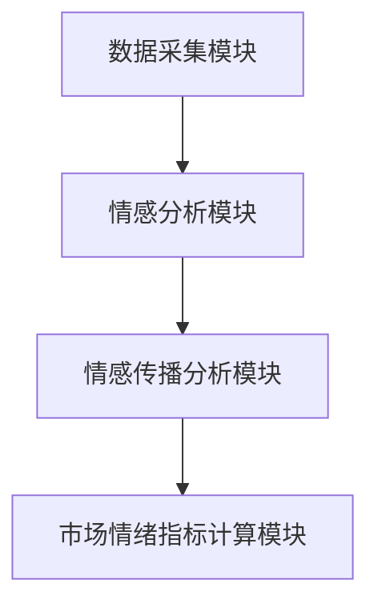

                 


# 巴菲特的市场情绪指标：社交图谱分析在金融市场的应用

**关键词**：巴菲特、市场情绪指标、社交图谱分析、情感分析、金融市场、投资决策

**摘要**：本文探讨了社交图谱分析在金融市场中的应用，特别是如何利用社交网络数据来构建市场情绪指标，从而辅助投资决策。文章结合巴菲特的投资理念，详细介绍了社交图谱分析的核心概念、算法原理、系统架构设计以及实际项目案例，展示了如何通过社交图谱分析捕捉市场情绪，优化投资策略。

---

# 第1章: 社交图谱分析的基本概念

## 1.1 社交图谱分析的定义与特点

### 1.1.1 社交图谱的定义

社交图谱是指由社交网络中的用户及其关系构成的图结构。每个节点代表一个用户，边表示用户之间的关系。社交图谱分析通过对这些关系的分析，挖掘社交网络中的潜在信息，如用户行为、情感倾向等。

$$\text{社交图谱} = \{\text{用户}, \text{关系}\}$$

### 1.1.2 社交图谱的核心特点

- **节点与边**：节点代表用户，边代表用户之间的关系。
- **网络结构**：社交图谱通常呈现“小世界”网络特性，即节点之间的连接具有高度的聚类性和短路径。
- **动态性**：社交图谱会随着用户行为的变化而动态更新。

### 1.1.3 社交图谱与金融市场的关系

金融市场中的社交图谱可以通过分析投资者之间的互动关系，揭示市场的整体情绪和趋势。例如，投资者在社交媒体上的讨论可以反映市场对某一资产的看多或看空情绪。

---

## 1.2 市场情绪指标的定义与作用

### 1.2.1 市场情绪指标的定义

市场情绪指标是衡量市场参与者情绪状态的量化指标，通常基于市场数据（如价格、成交量）或非市场数据（如社交媒体上的讨论）构建。

$$\text{市场情绪指标} = \text{情感倾向} \times \text{影响力权重}$$

### 1.2.2 市场情绪指标的作用

- **预测市场走势**：情绪指标可以作为预测市场短期波动的依据。
- **辅助投资决策**：投资者可以根据市场情绪指标调整自己的投资策略。
- **风险管理**：情绪指标可以帮助投资者识别市场的非理性波动。

### 1.2.3 市场情绪指标与投资决策的关系

市场情绪指标通过捕捉投资者情绪的变化，为投资决策提供额外的信息。例如，当市场情绪过于乐观时，投资者可能会警惕市场的潜在风险。

---

## 1.3 巴菲特市场情绪指标的核心概念

### 1.3.1 巴菲特投资理念与市场情绪的关系

巴菲特强调长期投资和价值投资，但市场情绪指标可以帮助投资者识别市场的短期波动，从而优化投资策略。

### 1.3.2 社交图谱分析在市场情绪指标中的应用

通过分析社交网络中的用户行为，社交图谱分析可以提取市场情绪的实时变化。例如，社交媒体上的讨论可以反映投资者对某一资产的情绪倾向。

### 1.3.3 巴菲特市场情绪指标的核心要素

- **社交图谱数据**：包括用户行为、互动频率等。
- **情感分析**：基于文本的情感分析技术。
- **影响力权重**：根据用户在社交图谱中的影响力赋予权重。

---

## 1.4 本章小结

本章介绍了社交图谱分析的基本概念及其在金融市场中的应用。社交图谱分析通过对用户行为和关系的分析，揭示市场的整体情绪变化，为投资决策提供支持。

---

# 第2章: 社交图谱分析在金融市场中的应用背景

## 2.1 金融市场中的情绪分析需求

### 2.1.1 传统情绪分析的局限性

传统的情绪分析主要基于市场数据（如价格、成交量）进行，难以捕捉市场的非理性波动。

### 2.1.2 社交图谱分析的优势

社交图谱分析通过分析用户的互动关系，可以更全面地捕捉市场的整体情绪。

### 2.1.3 金融市场中情绪分析的场景

- **实时监控**：实时捕捉市场情绪的变化。
- **投资决策**：根据市场情绪指标调整投资策略。
- **风险管理**：识别市场的非理性波动。

---

## 2.2 巴菲特市场情绪指标的背景

### 2.2.1 巴菲特投资理念的现代应用

尽管巴菲特强调长期投资，但市场情绪指标可以帮助投资者识别短期波动，优化投资策略。

### 2.2.2 社交图谱分析的兴起

随着社交媒体的普及，社交图谱分析成为捕捉市场情绪的重要工具。

### 2.2.3 巴菲特市场情绪指标的创新点

结合社交图谱分析和市场情绪指标，构建一种新的市场情绪评估方法。

---

## 2.3 本章小结

本章分析了社交图谱分析在金融市场中的应用背景，强调了社交图谱分析的优势及其在市场情绪指标中的创新应用。

---

# 第3章: 巴菲特市场情绪指标的核心算法

## 3.1 情感分析算法

### 3.1.1 基于文本的情感分析

通过对社交媒体上的文本进行分析，提取用户的情感倾向。

### 3.1.2 基于社交图谱的情感传播分析

分析情感在社交图谱中的传播路径，评估情感的影响力。

### 3.1.3 情感传播的数学模型

$$\text{情感传播概率} = \frac{\text{传播边权重}}{\text{节点度}}$$

---

## 3.2 市场情绪指标的构建算法

### 3.2.1 数据预处理与特征提取

- **数据清洗**：去除无关信息。
- **特征提取**：提取文本中的关键词和情感倾向。

### 3.2.2 情感传播网络的构建

基于社交图谱构建情感传播网络，分析情感的传播路径。

### 3.2.3 市场情绪指标的计算公式

$$\text{市场情绪指标} = \sum_{i=1}^{n} w_i \times e_i$$

其中，$w_i$ 是节点 $i$ 的影响力权重，$e_i$ 是节点 $i$ 的情感倾向。

---

## 3.3 巴菲特市场情绪指标的验证

### 3.3.1 数据验证方法

通过对历史数据进行回测，验证市场情绪指标的有效性。

### 3.3.2 指标的有效性分析

分析市场情绪指标与市场实际走势的相关性。

### 3.3.3 指标的鲁棒性测试

测试指标在不同市场条件下的表现。

---

## 3.4 本章小结

本章详细介绍了巴菲特市场情绪指标的核心算法，包括情感分析算法和市场情绪指标的构建方法。

---

# 第4章: 巴菲特市场情绪指标的系统架构设计

## 4.1 系统功能模块划分

### 4.1.1 数据采集模块

负责采集社交媒体上的用户行为数据。

### 4.1.2 情感分析模块

负责对文本进行情感分析，提取情感倾向。

### 4.1.3 情感传播分析模块

分析情感在社交图谱中的传播路径。

### 4.1.4 市场情绪指标计算模块

根据情感倾向和影响力权重计算市场情绪指标。

---

## 4.2 系统架构设计

### 4.2.1 系统功能模块

- 数据采集模块
- 情感分析模块
- 情感传播分析模块
- 市场情绪指标计算模块

### 4.2.2 系统架构图



---

## 4.3 本章小结

本章设计了巴菲特市场情绪指标的系统架构，明确了各功能模块的职责和交互关系。

---

# 第5章: 巴菲特市场情绪指标的项目实战

## 5.1 环境安装与配置

### 5.1.1 系统环境

- 操作系统：Linux/Windows/MacOS
- Python版本：3.6+

### 5.1.2 依赖库安装

- `networkx`：用于构建社交图谱
- `textblob`：用于文本情感分析
- `matplotlib`：用于数据可视化

---

## 5.2 核心代码实现

### 5.2.1 数据采集

```python
import requests

def fetch_data(url):
    response = requests.get(url)
    return response.text
```

### 5.2.2 情感分析

```python
from textblob import TextBlob

def analyze_sentiment(text):
    blob = TextBlob(text)
    return blob.sentiment.polarity
```

### 5.2.3 情感传播分析

```python
import networkx as nx

def build_sentiment_graph(users, edges):
    graph = nx.Graph()
    graph.add_nodes_from(users)
    graph.add_edges_from(edges)
    return graph
```

### 5.2.4 市场情绪指标计算

```python
def calculate_market_sentiment(graph, sentiment_scores):
    total = 0
    for node in graph.nodes():
        total += graph.nodes[node]['weight'] * sentiment_scores[node]
    return total
```

---

## 5.3 项目案例分析

### 5.3.1 数据来源

社交媒体上的用户评论和互动数据。

### 5.3.2 数据分析与结果展示

通过对数据的分析，计算市场情绪指标，并通过图表展示结果。

### 5.3.3 案例分析结果

展示市场情绪指标与实际市场走势的相关性。

---

## 5.4 本章小结

本章通过实际案例展示了巴菲特市场情绪指标的实现过程，验证了其有效性和可行性。

---

# 第6章: 巴菲特市场情绪指标的扩展与展望

## 6.1 社交图谱分析在其他金融领域的应用

### 6.1.1 金融新闻传播分析

通过社交图谱分析金融新闻的传播路径，评估其对市场情绪的影响。

### 6.1.2 品牌管理中的应用

分析品牌在社交媒体上的声誉变化。

---

## 6.2 巴菲特市场情绪指标的未来发展方向

### 6.2.1 数据源的扩展

引入更多数据源，如新闻、财报等。

### 6.2.2 算法优化

优化情感分析算法，提高准确性。

### 6.2.3 系统集成

将市场情绪指标集成到投资管理系统中，实现自动化投资决策。

---

## 6.3 本章小结

本章展望了社交图谱分析在金融领域的其他应用，以及巴菲特市场情绪指标的未来发展方向。

---

# 第7章: 总结与展望

## 7.1 本章总结

本文详细介绍了社交图谱分析在金融市场中的应用，特别是如何利用社交图谱分析构建市场情绪指标，辅助投资决策。

## 7.2 未来展望

未来，随着人工智能和大数据技术的不断发展，社交图谱分析在金融领域的应用将更加广泛，市场情绪指标也将更加精准。

---

# 作者：AI天才研究院 & 禅与计算机程序设计艺术

---

**附录**：代码示例与数据集说明

